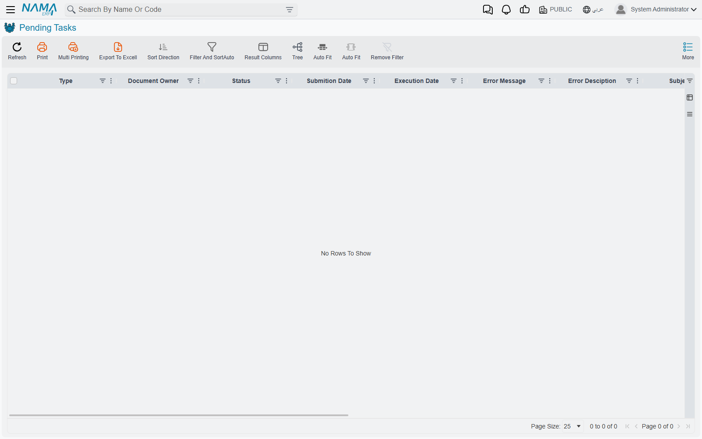

# Pending Tasks

Despite the general-sounding name, this screen is one specific thing: **the outbox**. Every message
Nama sends to the outside world — email, SMS, WhatsApp, and push notifications to the mobile app —
is queued here first and sent by a background worker a moment later.

That makes it the first place to look whenever somebody says a message did not arrive. The
question the screen answers is not "did the system try" but "how far did it get, and what did the
other end say".

::: info Where to find it
**Basic → Administration → Settings → Pending Tasks.**
:::

## What puts things here

Almost everything that notifies anyone. Approval requests waiting on a manager, notification
definitions firing on a document, scheduled reports mailed out on a timer, password resets,
messages sent from a script or an entity flow, replication warnings. They all arrive here as rows
and leave as sent messages.

The **Type** column separates them, and it is worth knowing that one of the values behaves
differently from the rest: a task of type **Create Notification** is not an outbound message at
all and is not dispatched anywhere. Only email, SMS, WhatsApp and push notifications are actually
sent.

The **Owner** column points back at whatever raised the message, and the screen offers a quick
filter across owner types — which is the fastest way to separate, say, approval traffic from
scheduled-report traffic.

## Reading a row

The columns that matter when something has gone wrong are **Status**, **Trials**, **Error
Message** and, for text messages, **SMS Response** — the reply from the SMS gateway itself, which
is usually far more specific than anything Nama can say on its own.

| Status | What it means |
|---|---|
| **Initial** | Queued, not yet attempted. |
| **Retry** | Attempted, failed, and waiting for another go. |
| **Executed** | Sent. |
| **Blocked** | Given up on. Nothing will retry it. |
| **Postponed** | Held back because the current time is outside the window the message is allowed to be sent in. |

**Postponed** is the one that most often looks broken and is not. A message with a sending window
is parked until the window opens, and the queue revisits parked messages periodically rather than
constantly — so a postponed message can sit for a few minutes after its window opens before it
moves. That is normal.

::: warning Trials is not a count of attempts
The **Trials** column looks like an attempt counter and is not. It is a running cost, and different
failures cost different amounts: a message rejected for a business reason adds five, and one that
breaks unexpectedly adds ten. When the total passes the ceiling set in Global Config — **Max Retray
Number For Pending Tasks**, spelled that way on screen, under Notifications And Messaging →
Sending Settings — the task is **Blocked**.

With the default ceiling that works out at about fifty attempts for a message that keeps being
rejected, and about twenty-five for one that keeps breaking. So a task showing Trials of 40 has not
been tried forty times, and a jump of ten between two glances is one failure, not ten.
:::

## What you can do about it

Three actions sit in the **More** menu, and they are less alike than their names suggest.

**Retry Selected Tasks** re-queues the rows you have ticked *and resets their cost to zero*. That
reset is the important part: it is the only way to revive a **Blocked** task. Once the underlying
problem is fixed — the mail server reachable again, the credentials corrected, the phone number
repaired — this is the action that gets the backlog moving.

**Delete Selected Tasks** removes the ticked rows. It asks nothing and checks nothing, so a
message that has not been sent yet can be deleted along with the ones that have.

::: warning Delete Executed Tasks ignores your filter and your selection
The third action does not delete the executed rows you are looking at. It deletes **every** row in
the database whose status is Executed, whatever the screen is currently showing and whatever you
have ticked.

That is usually what you want — it is a housekeeping tool, and sent messages are the safe thing to
clear. But it is not "tidy up this view", and on a system that has never been cleaned it will
remove a great deal more than the page in front of you.
:::

Sent messages are not removed automatically, so the screen accumulates. Clearing executed tasks
periodically, or letting the archiving tools take them, is ordinary maintenance.

::: info The whole More menu can be hidden
All three actions live behind a single permission covering the More menu on this screen. A user
without it sees the queue perfectly well and can do nothing to it — which is a reasonable way to
give support staff visibility without the ability to delete a backlog.
:::

## When nothing is being sent at all

If the queue is filling and nothing is leaving, the cause is usually not on this screen.

Two settings decide whether this server is allowed to send anything. Under Global Config →
**Notifications And Messaging** → **Sending Settings**, the option naming which servers may send
mail and SMS is a deliberate safety catch: on installations with a test copy of the live database,
it stops the copy from mailing real customers. A server whose id is not on that list will queue
messages forever and dispatch none of them.

The same is true of a system running in development mode, which sends nothing unless it has been
explicitly told to.

::: tip Set up a notification for failures
Also under Sending Settings is a field naming a notification to fire when a task fails. Pointing it
at somebody who will actually read it turns this screen from something you have to remember to
check into something that tells you when it needs checking.
:::

## See also

- [Business Requests](/platform/background-processing/business-requests) — the queue for a
  document's accounting and inventory effects
- [Notifications](/platform/notifications/) — what raises most of these messages in the first place
- [Scheduled Tasks](/platform/scheduled-tasks) — the task scheduler, including emailed reports
