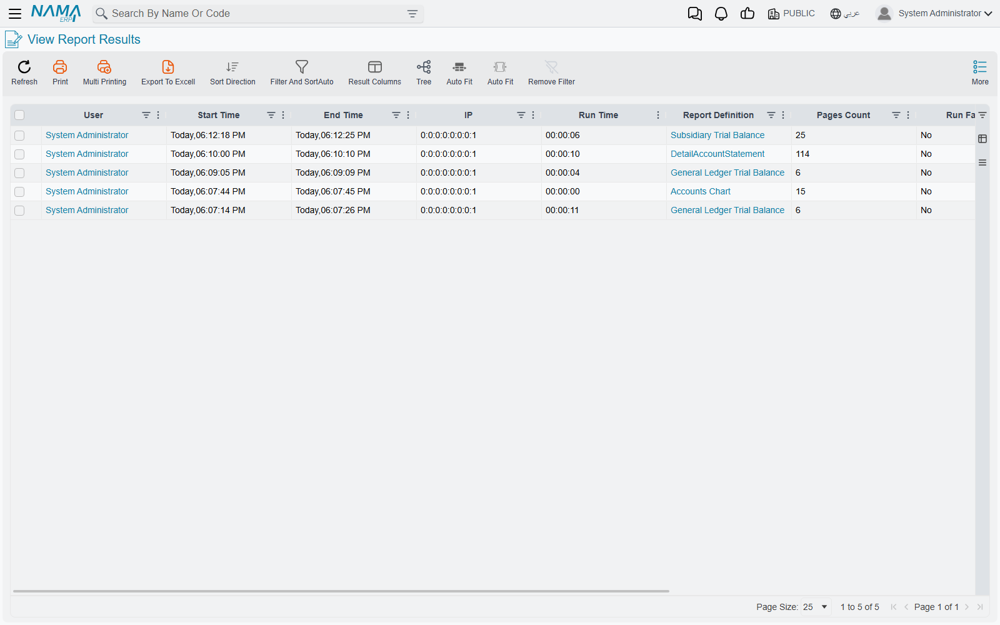
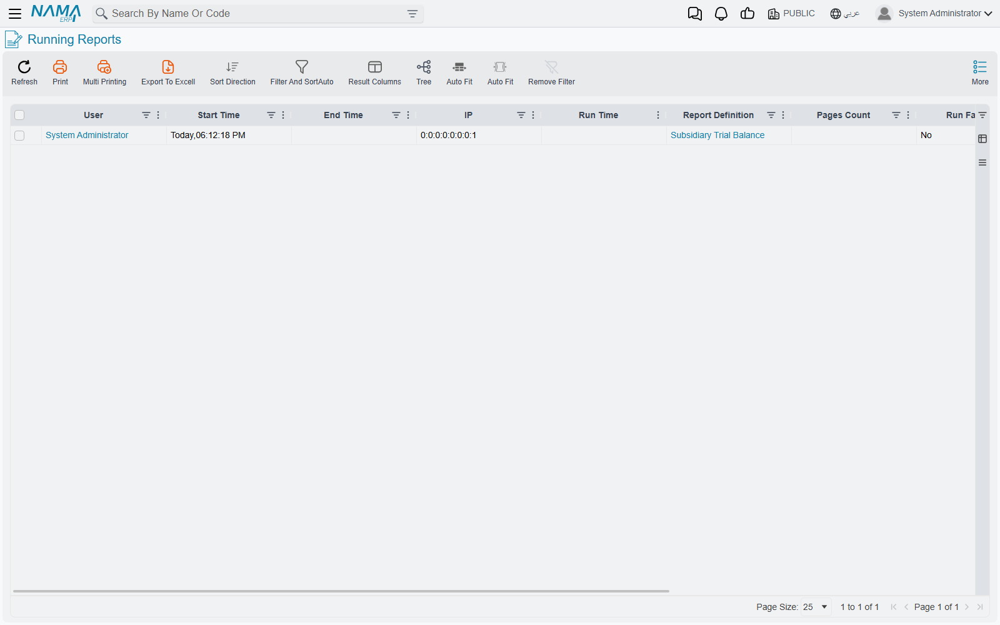

# Report Monitoring

A report that takes thirty seconds and a report that has hung look identical from the outside — a
spinner, and a user asking whether to keep waiting. These screens are how you tell the difference,
and how you end a run that is never going to finish.

::: info Where to find them
**Basic → Reports → Reports Monitoring**, which holds two entries: **Running Reports** and **View
Report Results**.
:::

## The two screens, and how they differ

They look the same because they are the same, built from the same list with the same columns, the
same filters and the same actions. The only difference is what each one shows you:

- **Running Reports** shows only runs that are still going.
- **View Report Results** shows those *and* the ones that have finished.

So Running Reports answers "what is the server busy with right now", and View Report Results
answers "what has been run recently". If a run appears on the second and not the first, it has
finished.

Each row tells you which report, who started it, when, how long it has been going, and — once it
finishes — how long it took.

::: warning These two screens remember only the last couple of days, and forget everything on restart
The list behind them is held in memory rather than stored, and it is trimmed on a timer: runs older
than about two days are dropped, and everything disappears when the server restarts.

That makes them a live monitor, not a history. For "what did this user run last month" you want the
report log described below, which is a different thing kept in a different place.
:::

## Ending a run that will not finish

Each row carries a **Kill Report** link. Following it asks the database to stop the query the report
is waiting on; a small page confirms it and closes itself after a few seconds.

This is a real interruption, not a polite request — the run stops, the user sees it fail, and
nothing is left half-written, because a report only ever reads. The usual reason to reach for it is
a report someone ran across a far wider date range than they meant to, which is holding the
database busy for everyone else.

::: tip A killed or failed run disappears rather than lingering
The list keeps completed runs but drops the ones that failed or were killed at its next trim. So a
report that crashed is visible here only briefly, and the trim runs every couple of minutes.

If you need to see the error a user hit, catch it while it is on screen, or ask them to run it
again — there is nowhere else it is written down.
:::

## The report log

Separately from the live view, Nama can record every completed run in the database, where it stays
until somebody removes it. That log is what answers questions about the past: which reports are
slow, who is running what, how often a form gets reprinted.

It is off until you turn it on, in Global Config → **Reports And Printing** → **Reports Logging** →
**Log Report Performance To DB**. Logging begins immediately once saved.

::: info The Report Log tab needs a screen regeneration before it appears
The log itself starts filling as soon as the option is on, but the tab that displays it is part of
the Report Definition screen's layout, and layouts are built once and stored. Until the screens are
regenerated the rows are being written and there is nowhere to look at them.

If you have turned the option on and the tab has not appeared, that is the missing step — not a
sign that nothing is being recorded.
:::

Each entry records the report, the user, the source address, the parameters the report was run
with, when it started, how long it took, the output format, and — for a form printed from a
document — which record it was printed for and how many times.

### What gets logged, and what does not

Three switches sit in that same **Reports Logging** group, and they work independently of one
another rather than as a master and two dependants:

| Activity | Logged when |
|---|---|
| A report run from the reports menu | **Log Report Performance To DB** is on |
| Exporting a result to PDF, Excel or Word | its own export switch is on |
| Printing a form from a document | its own forms switch is on |

An export is written as a second entry alongside the run it came from, so exporting the same result
three times gives you the run plus three export rows.

Two consequences are worth knowing. Because the switches are independent, turning on only the first
gives you interactive report runs and nothing else — no exports, no printed forms. And because
printing a form does not count as running a report, printed forms never appear on the two
monitoring screens at all; they show up only in the log.

::: warning Scheduled and emailed reports are not logged
A report sent out by the task scheduler does not write a log entry, whatever these switches say.
The scheduler keeps its own execution log instead — see
[Scheduled Tasks](/platform/scheduled-tasks) — and that is where you check whether last night's
report went out.
:::

The log records runs that completed. A run that failed is not written, which is the other half of
the reason a broken report leaves so little behind it: while it is running you can see it on the
monitoring screens, and after it fails there is nothing to find.

## See also

- [Reports](/platform/reports/) — building and running reports
- [Scheduled Tasks](/platform/scheduled-tasks) — emailed and printed reports on a timer, with their
  own execution log
- [Business Requests](/platform/background-processing/business-requests) — the queue for a
  document's accounting and inventory effects
