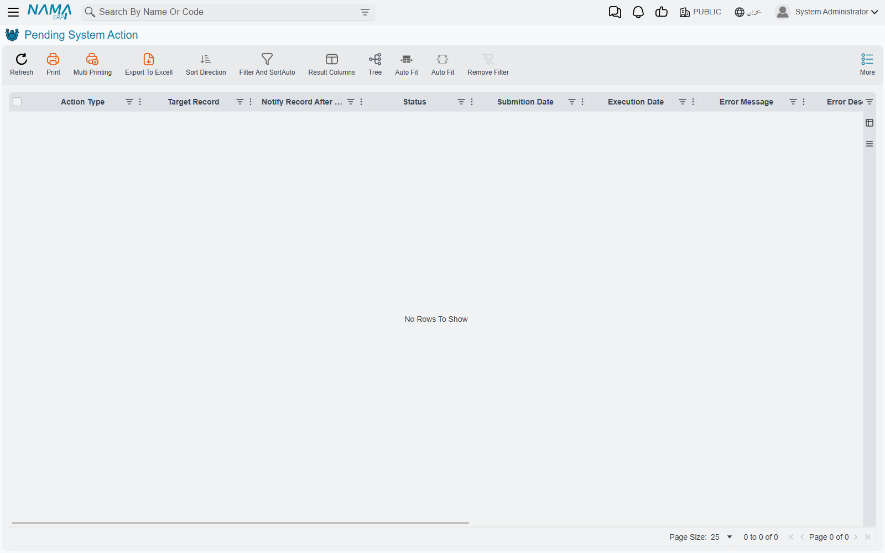

# System Actions

Two screens sit next to each other in the menu with almost the same name, and they have nothing to
do with one another. **Pending System Action** is a queue of work the system still has to do.
**Auto System Action** is a journal of something the system already did. One is a to-do list, the
other is a diary.

::: info Where to find them
**Basic → Administration → Settings**, immediately after Pending Tasks — **Pending System Action**
first, then **Auto System Action**.
:::

## Pending System Action

Some operations are too slow to make a user wait for, and some cannot run at the moment they are
asked for because something else has to happen first. Those get written down here and carried out
in the background a moment later.

You will see a handful of kinds and no more:

| Action Type | What it is |
|---|---|
| **Regen Salary Document** / **Regen Salary Sheet** | Rebuilding a payroll document or sheet after something it depends on changed. |
| **Create Contracting Cost Entries** | Turning a salary document's labour into cost entries against contracting work. |
| **Send HTTP Request** | Calling an outside system — raised by an entity flow or an integration. |
| **Send Impl File** | Copying a configuration record to the implementation backup server. |

The **Target Record** column points at whatever the action is about, **Requester** names who caused
it, and **Extra Info** and **Request Response** carry the detail — for an outgoing call, the
response text is the reply from the far end.

::: tip A healthy screen is an empty one
An action that succeeds is deleted, not marked done. So on a working system this screen is empty
almost all the time, and rows on it are either in flight right now or stuck.

There is one exception: an action can be marked to survive its own success, and those rows stay at
**Executed** deliberately.
:::

Actions run one at a time across the whole system, never two at once — which is why a queue can
take a little while to clear even though each item is quick.

::: warning A failed system action is a dead end
There are no buttons on this screen. No retry, no reprocess, no delete. And the worker only ever
picks up actions that are waiting or have been queued for retry — a state nothing puts a failed
action back into.

So an action that fails is finished. It stays on the screen with its error text, it will never run
again on its own, and there is no supported way to ask it to. The work has to be triggered again at
its source: re-save the payroll document, re-run the entity flow, repeat whatever asked for it.
:::

Because failed rows are never cleaned up either, this screen is worth glancing at occasionally even
when nobody has complained. A slowly growing list of failures is a real backlog of work that never
happened.

## Auto System Action

This one is a log with a single author. When the system repairs stock costs and quantities that
have drifted out of step, it writes down that it did so — and that is the only thing that ever
appears here.

Every row therefore has the same **Action Name**, `UpdateCurrentNetCostAndCurrentNetQty`, which is
the internal name of that repair. What varies is **Action Description**, which lists the specific
stock movements that were corrected, and **Submission Date**, which tells you when. The **Target
Record** column is always blank.

There is nothing to do on this screen and nothing that reads it. It answers one question, and
answers it well: *did the system quietly correct stock costs, and if so, when and for what?* When
an inventory valuation has moved and nobody can account for it, that is the question you want
answered.

## See also

- [Business Requests](/platform/background-processing/business-requests) — the queue for a
  document's accounting and inventory effects
- [Pending Tasks](/platform/background-processing/pending-tasks) — the outbound message queue
- [Entity Flows](/platform/entity-flows/) — one of the things that raises outgoing calls
