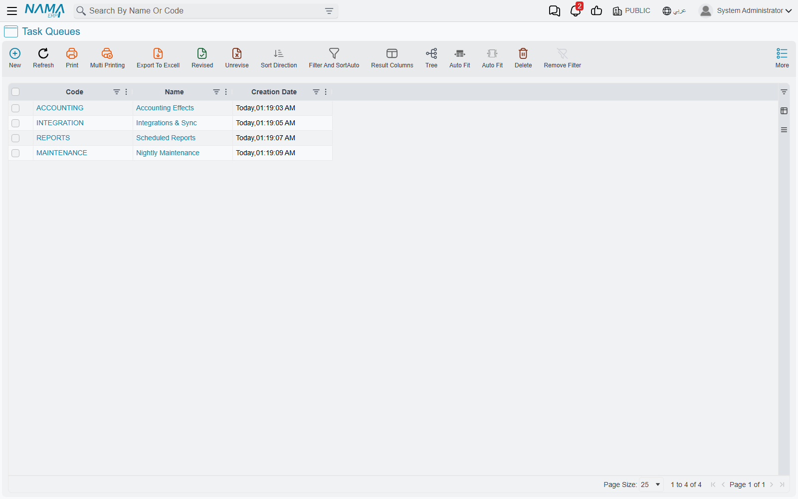
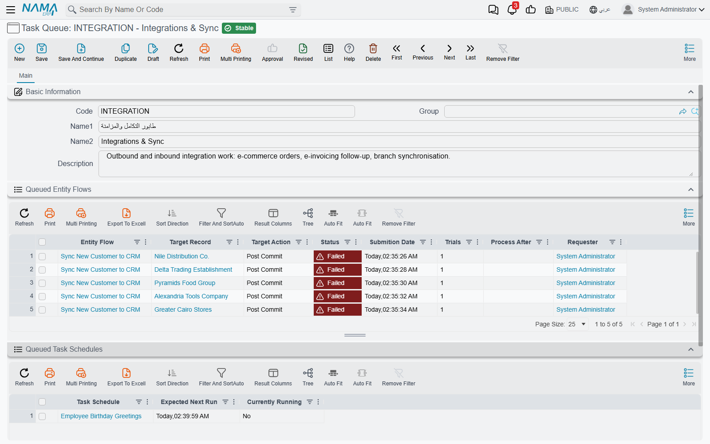
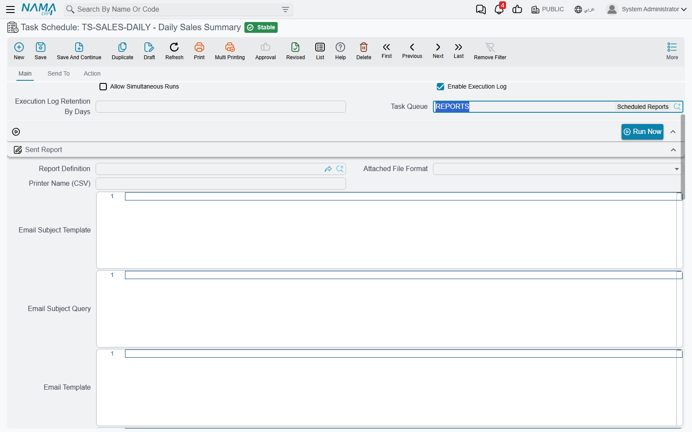
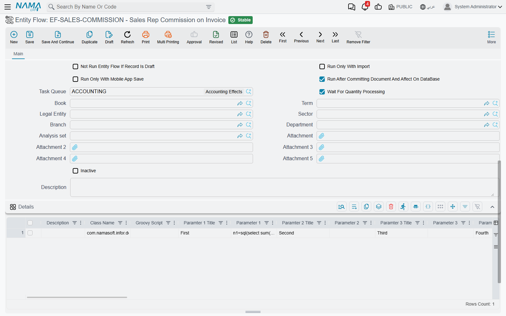
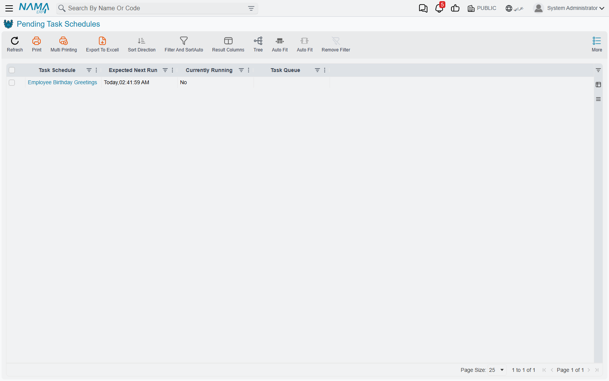

# Task Queues

Nama has always done its slow work behind you rather than while you wait. A scheduled report goes
out at seven in the morning without anyone being there; an entity flow that stamps a commission
onto an invoice runs a moment after the invoice is saved, not during the save.

The catch, until now, was that all of it ran in single file. One thread ran every scheduled task,
one after another. One worker picked up every deferred entity flow, one after another. That is
safe — two jobs can never trip over each other if only one of them is ever moving — but it means
a nightly report that takes forty minutes holds up the order sync that was supposed to run every
five, and a heavy costing flow on a stock issue makes every other flow in the system wait its
turn.

A **Task Queue** breaks that single file into as many lanes as you need. It is a named lane, and
almost nothing else: a code, a name, a description. What gives it meaning is what you point at
it. Two task schedules on two different queues genuinely run at the same time. Two entity flows
on two different queues are processed by two different workers. Work inside one queue still runs
strictly one at a time, in order, exactly as before.

::: info Where to find it
**Basic → Settings → Task Queue.**
:::

## Nothing changes until you ask for it

This is the reassuring part. Every task schedule and every entity flow that you leave alone keeps
its **Task Queue** field empty, and everything with an empty Task Queue keeps sharing one built-in
lane — the same single file it has always run in. An installation that never creates a Task Queue
behaves precisely as it did before.

So the question is never "should I turn this on?" It is "which two jobs are getting in each
other's way?" You create a queue for the answer, and leave everything else where it is.

## Creating a queue

There is very little to fill in, because a queue has no behaviour of its own.

| Field | What to put in it |
|---|---|
| **Code** | A short, stable identifier — `INTEGRATION`, `REPORTS`, `MAINTENANCE`. You will pick queues by code all over the system. |
| **Name** | What the lane is for, in plain words: *Integrations & Sync*, *Nightly Maintenance*. |
| **Description** | Worth writing. Six months from now, "why does this queue exist?" is the question, and this field is the only place with an answer. |

Below the basic information sit two collapsed grids — **Queued Entity Flows** and **Queued Task
Schedules**. They are the whole monitoring story for this queue, and they are covered further
down.

## Putting scheduled tasks on a queue

Open a task schedule and set its **Task Queue** field. That is the entire configuration.

The rule that follows from it is simple, and worth saying out loud because everything else depends
on it:

> Schedules on **different** queues can run at the same time. Schedules on the **same** queue never
> do — each waits for the one before it to finish.

Take a realistic set of eight scheduled jobs. Three of them mail reports out in the early morning,
two are heavy housekeeping queries that run at two in the morning, two poll an outside system
every ten or fifteen minutes, and one greets employees on their birthday. Left in one lane, the
housekeeping job that overruns at 02:00 delays the report that was due at 06:30, and the
ten-minute sync waits behind both. Split across three queues — *Scheduled Reports*, *Nightly
Maintenance* and *Integrations & Sync* — the reports, the housekeeping and the sync all get out of
each other's way, while the three reports still run in an orderly line between themselves, which
is what you wanted anyway.

The birthday greeting is left with no queue at all, and runs in the default lane. Not everything
needs a queue.

::: warning A queue is a promise of parallelism, not a promise of safety
Before queues, two scheduled tasks could not overlap, so two jobs touching the same records were
safe by accident. Put them on different queues and they really will run at the same time. If two
jobs write to the same data, keep them on the **same** queue — that is the queue's other job, and
it is just as useful as the splitting.
:::

## Putting entity flows on a queue

Entity flows need one step of background first, because a flow only reaches a queue if it was
deferred in the first place.

Most entity flows run inline: you save the customer, the flow runs, the save finishes. But a flow
can be marked **Run After Committing Document And Affect On DataBase**, and that changes it completely. The
document is saved and committed, its accounting and inventory effects are raised, you get the
screen back — and only then, separately, is the flow picked up and run. Nothing about the flow is
allowed to slow down or fail the save.

Those deferred flows are the ones that queue up, and they are the ones with a **Task Queue** field
worth setting.

The same rule applies as for schedules: flows on different queues are processed by different
workers and run at the same time; flows on one queue are processed one at a time, in the order
they were raised. A flow left with no queue is handled by the default worker along with every
other unassigned flow.

Three other fields on the flow are worth setting at the same time, because they only matter once
the flow is running in the background with nobody watching it:

| Field | What it does |
|---|---|
| **Max Retry Count** | How many times a failed run is attempted again before the system gives up and leaves it failed. Left empty, a failure is final at the first attempt. |
| **Retry Every Seconds** | How long to wait before each retry. Useful when the flow depends on something outside Nama that is briefly unavailable. |
| **Wait For Quantity Processing** | Holds the flow back while the system still has inventory work outstanding. Set it when the flow reads stock quantities or costs — otherwise it can read figures that are about to change. |

## Two rules that keep queues out of trouble

Running work in parallel raises an obvious worry: two lanes reaching for the same record at the
same moment. Two rules handle it, and neither needs configuring.

**One record at a time, across every queue.** If a flow on one queue is running against a record,
and a flow on another queue reaches the same record, the second one does not wait and does not
fail. It steps aside — it is postponed by a couple of seconds and put back in its queue, and the
lane it was in carries on with the next entry. A moment later it comes round again, finds the
record free, and runs. In the **Queued Entity Flows** grid this shows up as an entry with a
**Process After** time a few seconds in the future; if you catch one, it is doing exactly what it
should.

**Order is preserved inside a queue.** Because a queue is worked by a single worker, entries in it
are processed in the order they were raised. If flow A must happen before flow B, putting both on
the same queue is the guarantee you are looking for.

## Watching a queue work

Two grids on the queue's own screen, and one list for the whole system.

**Queued Entity Flows** — on the queue screen — shows the flow entries waiting in this queue, each
with its **Status**, **Submition Date**, **Trials** and **Process After**, plus the record it is
going to run against. An empty grid is the healthy state: it means the worker is keeping up. Rows
that sit there with a rising **Trials** count are the ones to look at. The grid's **More** menu can
delete selected entries outright, which is the way to abandon work that will never succeed.

**Queued Task Schedules** — also on the queue screen — shows the schedules assigned to this queue
with their **Expected Next Run** and whether each is **Currently Running**. This is the quickest
way to see that a queue is doing what you set it up to do.

**Pending Task Schedules** — at **Basic → Administration → Settings → Pending Task Schedules** — is
the same information for every queue at once, with a **Task Queue** column so you can see how the
work is spread. It is the screen to open when someone asks why a task has not fired: if it is not
in this list, it is not scheduled at all, and the reason is on the task itself — inactive, or never
committed, or restricted to another site.

::: tip Expected Next Run and Currently Running are live
These two are not stored on the task schedule; they are read from the running scheduler at the
moment you open the screen. That is why they are blank on a server that is not running scheduled
tasks at all, and why they are not available as columns on the task's own list view.
:::

## When workers appear and disappear

You do not start or stop a queue, and there is no "active" switch on it. The system works out
which lanes it needs and keeps that set up to date:

- The **default lane always exists**, for everything with no queue.
- A queue gets a worker of its own when a deferred entity flow names it, **or** when it still has
  unprocessed entries left over from before. A queue nothing points at gets no worker, and costs
  nothing.
- Saving a Task Queue, an Entity Flow or a Task Schedule makes the system re-read the picture and
  re-register the lanes. A brand new queue gets its own lane as soon as a task schedule points at
  it, so you do not need to restart the server to add a queue.

One consequence worth knowing: emptying a queue of its flows does not orphan the work already in
it. The queue keeps its worker until the last unprocessed entry is gone.

## How many queues should I create?

Fewer than you might think. The right question is not "how much work is there?" but "what must not
be allowed to block what?" Each answer is one queue. In practice most installations end up with a
handful:

- one for **integrations**, because they run often and must not be held up;
- one for **reports**, because they are slow and it does not matter that they are slow;
- one for **maintenance**, because it runs out of hours and can take as long as it likes;
- and everything else left in the default lane.

Creating a queue per task is not an optimisation. Each queue is a worker of its own, and thirty
lanes doing nothing is thirty threads doing nothing — while the real problem, two jobs fighting
over the same rows, gets worse rather than better.

## Related

- [Scheduled Tasks](/platform/scheduled-tasks) — everything else about task schedules: types,
  cron, recipients, execution logs.
- [Introduction to Entity Flows](/platform/entity-flows/introduction-to-entity-flows) — what a flow
  is, and the execution points it can attach to.
- [Business Requests](/platform/background-processing/business-requests) — the separate queue that
  carries a document's accounting and inventory effects.
