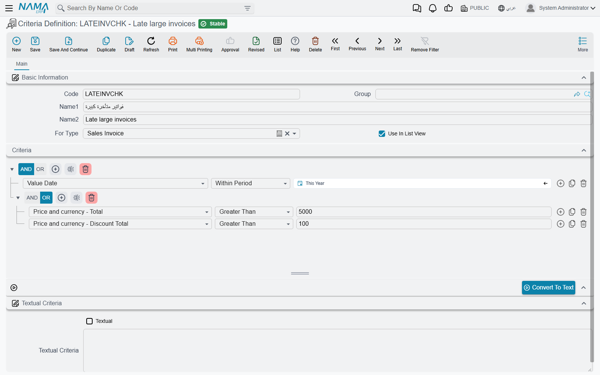
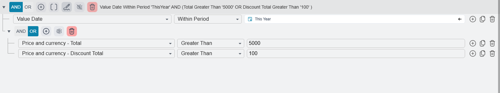
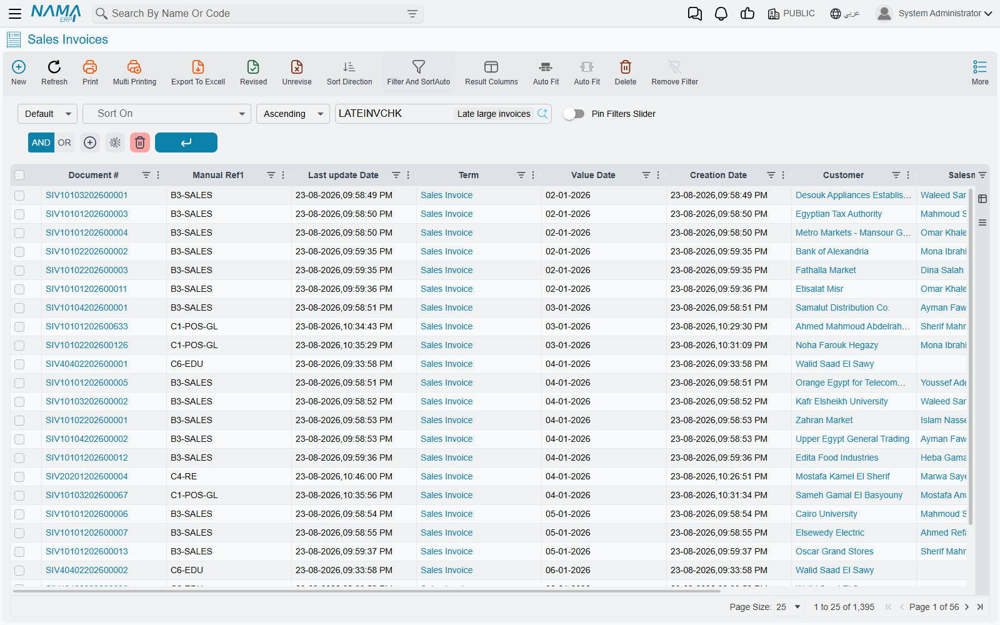

# Criteria Definitions

A dozen pages on this site tell you to "pick a criteria": the approval that should only run for
credit sales, the lookup that must offer non-service items, the field that becomes mandatory only in
one branch, the entity flow that should fire on overdue orders and nothing else. They all mean the
same screen — **Administration → Display Customization → Criteria Definition** — and they all mean
the same thing by it: a filter, saved under a code and a name, that the rest of the system can point
at by name.

It is worth seeing it as a saved search that other settings borrow. You write down once, in one
place, what "an overdue order" is; the approval, the notification, the required field and the lookup
filter then all agree on that definition, and the day the definition changes, every one of them
changes with it.

The same record is used in two ways, depending on who borrowed it. Most settings use it as a
**test**: here is a record being saved, does it match? Lists and lookups use it as a **filter**: show
me the records that match. You build it the same way for both.

## The screen

A criteria record carries a code and a name like any master file, and then four things that matter.

| Field | What it does |
|---|---|
| **For Type** | The screen the filter is written against — Sales Invoice, Employee, Item. Fill this in **first**. The condition builder reads the field list of this type, so while For Type is empty it has nothing to offer and stays blank. |
| **Criteria** | The conditions themselves — the builder described below. |
| **Use In List View** | Offers this criteria as a ready-made filter on the list screen of that type, and in the search dialog of any field that picks that type. |
| **Textual** and **Textual Criteria** | The same conditions written out as text instead of assembled in the builder. |

### Building the conditions

Each condition is one line, read left to right: a **field**, an **operator**, a **value**.

The **field** is chosen from a searchable list of everything the type stores — its own header fields
and its grid columns alike, so a condition can just as easily be *Customer is Nile Trading* as *one
of the invoice lines carries item 1001*. A field that has no label in the system does not appear in
the list at all.

The **operator** offered depends on the field: equal and not equal, greater and less than, starts
with, contains, **In** and **Not In** against a list of accepted values, and **Within Period** /
**Outside Period** for dates. The period operators do not take a single date — they take a period,
either a preset such as *This Month* or *Last 7 days*, or an explicit from-and-to. The full operator
list, and what each one does to text, numbers and dates, is on
[Criteria from Text Parser](/platform/text-criteria-guide).

The **value** is entered with the field's own widget: a date picker for a date, the record selector
for a reference field, a multi-value list for In and Not In.

The three buttons at the right of every line add a line (**F7**), copy the current line (**F8**) and
remove it (**Ctrl+Delete**). The buttons on the grey header above the conditions work on the group as
a whole: **Add Filter** starts a new condition, **Clear Filters** empties the builder, and **Show
Advanced Criteria Mode** reveals two more, described next.

::: tip The fastest way to create one
Filter a list screen by hand until it shows exactly the records you mean, then pick **Create List
View Criteria** from the list's **More** menu. A new criteria record opens in a pop-up already
carrying that filter, already set to the right For Type and already ticked as usable in list views —
all that is left is a code, a name and Save. With no filter on the list it answers *"Please Specify
Criteria"* and does nothing. See [Buttons on every screen](/platform/screen-buttons).
:::

### AND, OR and brackets

Conditions are grouped, and **the AND / OR choice belongs to the group, not to the line**: the pair
of buttons on the group's header applies to every condition inside it, so a group is either all-AND
or all-OR. Mixed logic is expressed by putting a group inside a group.

Sub-groups are hidden until you ask for them. Press **Show Advanced Criteria Mode** on the header and
two more buttons appear: **Add Filter Group**, which nests a group with its own AND / OR inside the
current one, and **View Description**, which writes the whole thing out in words beside the header —
the quickest way to check that a criteria says what you meant.

The criteria above reads *Value Date Within Period 'ThisYear' AND (Total Greater Than '5000' OR
Discount Total Greater Than '100')* — one condition every invoice has to satisfy, and a pair of
alternatives of which one is enough.

### A condition on a grid column

A condition on a grid column is satisfied when **any one line** satisfies it — the record as a whole
matches if a single line does.

Two such conditions joined by **AND** are stricter than they look: they have to be satisfied by the
**same line**. *Item is 1001 AND quantity is greater than 10* matches a document that has one line of
item 1001 with 12 pieces; it does not match a document with a line of item 1001 and a separate line
of 12 pieces of something else. Joined by **OR** they widen as expected — any line answering either
condition is enough.

Which lines matched is not thrown away. It is what lets an approval be raised for particular lines of
a document rather than the whole of it, and what the *Lines Should Match* switch on
[Required Fields](/platform/required-fields) acts on.

## Values that follow the user

A value does not have to be fixed. Write one of these tokens in the value and it is resolved afresh
every time the criteria is evaluated, against the session that triggered it:

| Token | Resolves to |
|---|---|
| `{loginUserId}`, `{loginUserCode}`, `{loginUserName1}`, `{loginUserName2}` | The user who is logged in |
| `{loginEmployeeId}` | The employee linked to that user |
| `{loginLegalEntityId}`, `{loginBranchId}`, `{loginSectorId}`, `{loginDepartmentId}`, `{loginAnalysisSetId}` | The dimensions the user is logged in with — each also has a `…Code`, `…Name1` and `…Name2` form |
| `{loginLanguage}` | The language of the session |

So *Created By equals `{loginUserId}`* is a criteria that means "mine" for whoever it is evaluated
for, and *Branch equals `{loginBranchId}`* means "this branch" without naming one. Dates have tokens
of their own — `$today()`, `$monthStart()`, `$todayMinusDays(30)` and the rest — listed in full on
[Criteria from Text Parser](/platform/text-criteria-guide).

## Testing a criteria before you rely on it

Tick **Use In List View**, save, then open the list screen of the type the criteria is written
against. The **Extra Criteria** box in the list's filter bar offers every saved criteria for that
type that carries the tick, and picking one filters the list by it. What comes back is exactly what
the criteria matches, which is the cheapest way to discover that a condition is comparing against the
wrong value or that a bracket is grouping the wrong way.

The same box sits in the search dialog behind a reference field, so a criteria can be tried out from
there as well.

::: warning Two things have to be true for a criteria to be offered
The Extra Criteria box lists only criteria whose **For Type** is the type of the screen you are on
**and** whose **Use In List View** is ticked. A criteria that does not appear in it is nearly always
written against a different type, or never had the tick set.
:::

## The text form

Press **Convert To Text** and the conditions you built are written out as text into **Textual
Criteria**, with **Textual** ticked for you. The text form is one condition per line —
`field,operator,value,AND` — and it is what integrations, Tempo templates and report parameters
expect, so this button is the usual way of producing one. The syntax is documented on
[Criteria from Text Parser](/platform/text-criteria-guide).

::: warning While Textual is ticked, the text is the record
Saving with **Textual** ticked re-reads the conditions **from the text**: whatever the text says
replaces whatever the builder shows. That is what makes freehand editing possible, and it also means
a stale text box quietly overwrites careful work in the builder. Untick **Textual** to go back to
building in the grid.
:::

## Where a saved criteria is used

Each of these screens has a field that expects a criteria record. The list is not exhaustive — the
pattern repeats through the modules — but it covers what support is asked about:

| Screen | The field that takes a criteria |
|---|---|
| [Approvals](/platform/approvals/approvals-system) | The definition's own criteria, each step's **Step Criteria**, and the criteria on a step's responsible |
| [Notifications](/platform/notifications/notifications-system) | The definition's criteria — which records trigger the notification |
| [Entity Flows](/platform/entity-flows/) | **Criteria** and **Reversed Criteria Definition** — run the flow only when the record matches, or only when it does not |
| [Required Fields](/platform/required-fields) | The **When** column of the criteria-based rules |
| [Criteria-Based Validation](/platform/criteria-based-validation) | The **When** and **Then** halves of a rule, when you would rather not write a query |
| [Field Filter with Criteria](/platform/field-filter-with-criteria) | The condition the offered records have to satisfy |
| [Fields and Entities Settings](/platform/fields-and-entities-settings/) | A **Criteria** column on most of its grids — automatic coding, input validation, reference lookups |
| [Quick Filters](/platform/list-views/quick-filters) | **Quick Filter Values Criteria**, filtering which values become buttons |
| [Screen Modifier](/platform/screen-modifier/) | **List View Default Criteria** and **Search View Default Criteria** — the filter a screen opens with |
| [Scheduled Tasks](/platform/scheduled-tasks) | **Criteria** — the records the task runs over |
| [Reports and printed forms](/platform/reports/) | The form criteria that decides which printed form a document gets |
| [Salary documents](/modules/hr/payroll/salary-documents) | The employee criteria that decides who is collected into a sheet |

## What the screen does not check

The conditions are not validated on save. A line left half-filled, a bracket that was never closed, a
value that cannot apply to the field — all of it saves without complaint, and the only symptom is a
criteria that matches nothing, or everything. So when a criteria misbehaves, read its lines one by
one before looking anywhere else, and use **Use In List View** to see what it really returns.

## See also

- [Criteria from Text Parser](/platform/text-criteria-guide) — the operator list, the text syntax and the date tokens
- [Entity Type Lists](/platform/entity-type-lists) — the companion building block: one named list of screens that a setting can be applied to
- [Criteria-Based Validation](/platform/criteria-based-validation) — for the rules a filter cannot express and a query has to
