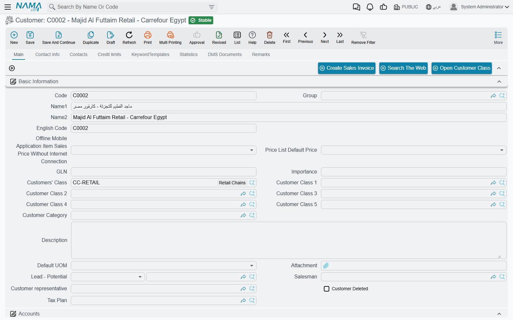
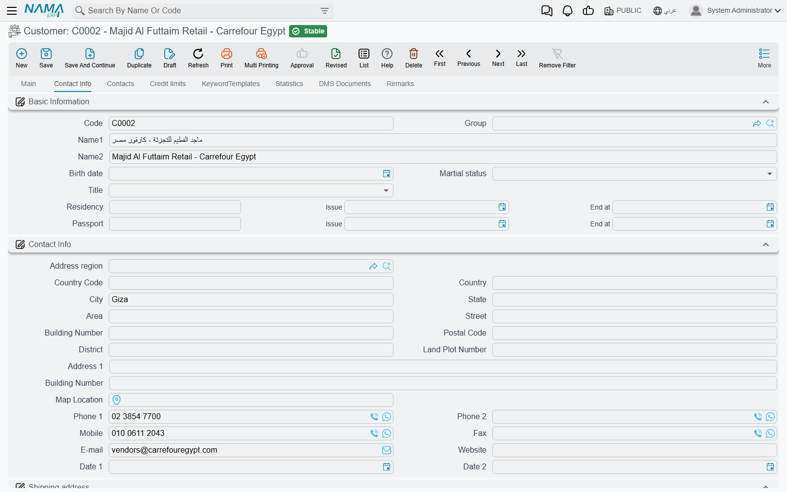
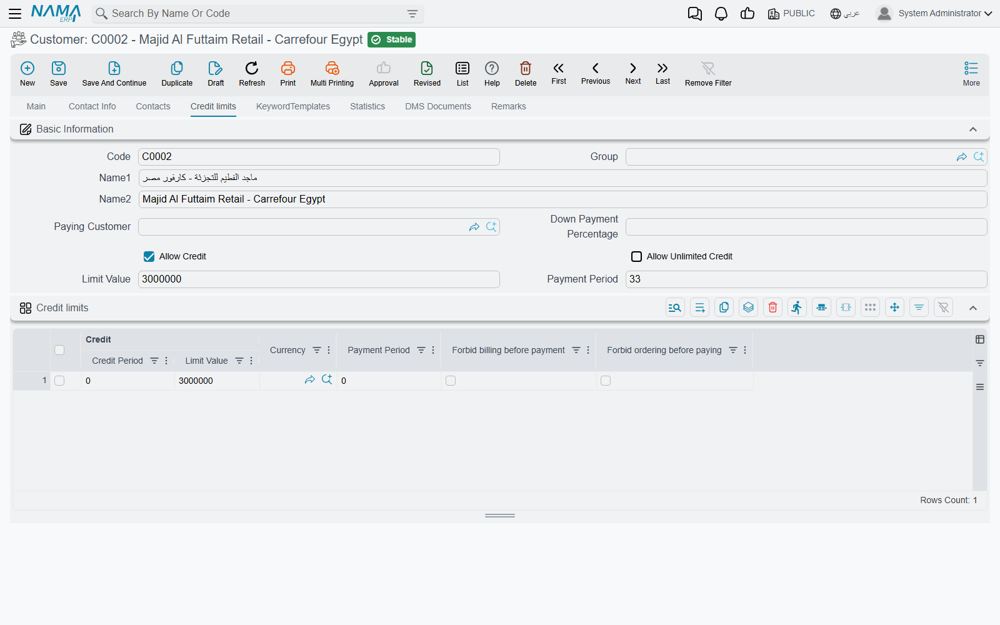
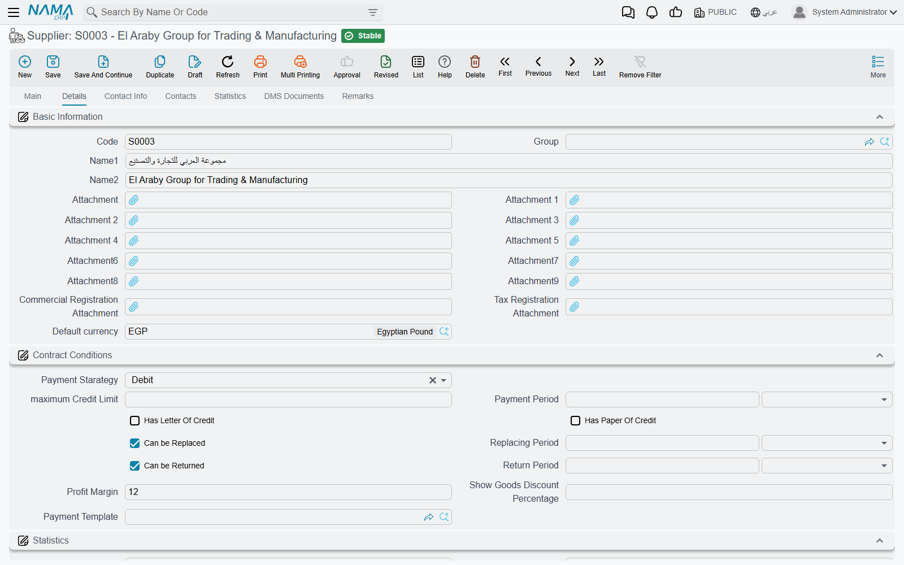
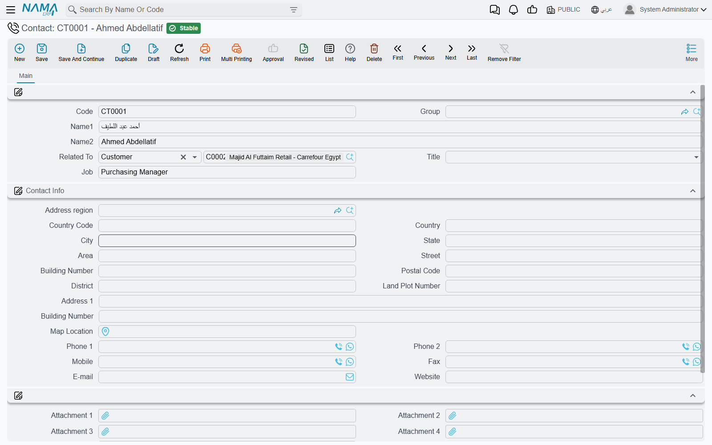
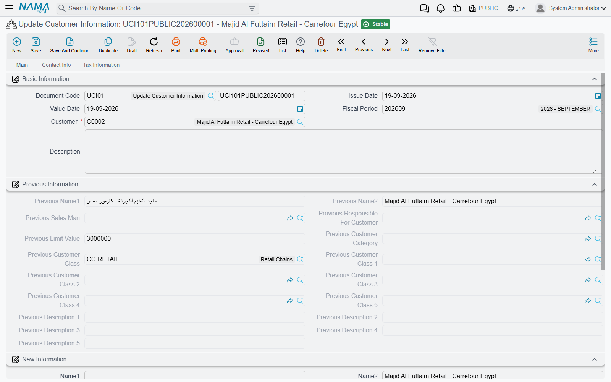

# Customers, Suppliers and Other Parties

Almost every document in the system points at somebody. A sales invoice points at a customer, a
purchase order at a supplier, a freight operation at a shipping line, a payment voucher at whoever is
being paid. Those "somebodies" are kept in a small family of master files, and because every document
inherits their settings — the account its entries land on, the price list it prices from, the tax
plan it calculates with — a mistake made once on a customer file quietly repeats itself on a thousand
invoices.

This page is about that family: **Customer**, **Supplier**, **Contact** and **Third Party**, the
**Update Customer Information** document that changes a customer after the fact, and the requests a
customer can raise from the portal.

## The customer file

You reach it from **Sales → Master Files → Customer**. It also appears in the Basic, Service Centre,
Projects and Car menus — the same screen and the same records each time, listed where those teams
expect to find it, so it does not matter which one you open.

Like every master file the customer has a **Code**, an Arabic name and an English name, and a
**Group** that decides how the code is built. Beyond that it has eight tabs — six of its own, plus
the [DMS Documents](/platform/dms/) and [Remarks](/platform/remarks-and-agenda) tabs that every
master file carries.

### Main

The **Basic Information** group is the customer's identity and classification: the alternative code
(labelled **English Code**), the **GLN** used by e-invoicing, **Importance**, **Customers' Class**
and the five further **Customer Class 1–5**, **Customer Category**, the **Default UOM**, the
**Salesman** and the **Customer representative**, the **Tax Plan**, a free **Description**, and —
when the customer was born out of a CRM lead — the **Lead - Potential** it came from. The classes
and the category are plain groupings you define yourself; their value is that price lists, offers,
reports and criteria can all be written against them instead of against individual customers.

Below that sits the **Accounts** group. This is where the customer is tied to the general ledger: a
main account and up to twenty further accounts, or an accounts bag. If the customer is billed through
somebody else you leave those empty and fill **Paying Customer** on the *Credit limits* tab instead —
the system refuses to save both at once.

The **Portal services** group switches on the customer portal for this customer: **Use portal**, the
**Security Profile** they get, and the portal login id and password.

Buttons sit above and below the fields: **Create Sales Invoice** starts an invoice for this
customer, **Search The Web** looks the name up, **Open Customer Class** jumps to the class record,
**Create Locator** creates a delivery locator, and **Convert To REOwner** creates a real-estate
owner record from the same data.

### Contact Info

Everything you would phone, post or ship to: **Birth date**, marital status (the field is labelled
**Martial status**), **Title**, the residency and passport documents with their issue and end dates,
then the contact block itself (**Phone 1** and **Phone 2**, **Mobile**, **Fax**, **E-mail**,
**Website**) and two full addresses — a **Shipping address** and a **Billing address**, each with a
*same as* tick so you only type one when the two are identical.

The **Tax Information** group is what the e-invoicing modules read: commercial registration, tax
registration number, national number, file number, company type, ID number and ZATCA ID type, and the
specified mission and nature of dealing pairs. The **Bank Info** group underneath carries the
account the customer pays from — bank, branch, country, SWIFT and IBAN.

The **contacts grid** at the bottom is the quick way to record the people you actually deal with:
code, name, job description, mobile, phone, fax, e-mail, address and loading point. Fill **Contacts
Group** and tick **Generate Contacts**, and saving the customer turns each of those rows into a real
Contact record in its own right — which is what the *Contacts* tab then shows.

### Contacts

Not a grid but a live list of the Contact records attached to this customer, including any inherited
from the CRM lead it was generated from. Contacts created by the **Generate Contacts** tick appear
here after the save.

### Credit limits

Covered in its own section below — it is the part of the screen most often misunderstood.

### KeywordTemplates

Keywords are free search terms that make a customer findable by something other than its name — a
trade name, a former name, a branch nickname. Pick a **Keyword Template** to inherit a set of them,
or type rows directly into the grid, each with its Arabic and English wording and a relative weight
that ranks the match.

### Statistics

Read-only lists of what has happened to this file: the salesman-update documents that moved it
between salesmen, the Update Customer Information documents that changed it, the modification
requests raised from the portal, and the reward-point documents if reward points are in use.

## Credit limits — what the system does, and what it does not

The *Credit limits* tab is where you write down how much credit a customer may take and for how long.
The header fields apply to the customer as a whole:

| Field | Meaning |
|---|---|
| **Paying Customer** | Another customer settles this one's bills. Filling it forbids filling the accounts on the Main tab. |
| **Down Payment Percentage** | The share of an order this customer is expected to pay up front. |
| **Allow Credit** / **Allow Unlimited Credit** | Whether credit is permitted at all, and whether it is uncapped. |
| **Limit Value** | The credit ceiling. |
| **Payment Period** | The days the customer is given to pay. |

Underneath, the **credit limits grid** lets you state a different ceiling per combination of
dimensions and per currency, each row carrying its own period, limit value, currency, payment period
and the **Forbid billing before payment** / **Forbid ordering before paying** ticks. Which dimension
columns the grid offers is a
Global Configuration choice, described under
[credit-limit dimensions](/platform/global-config/global-config-accounting) — by default the grid
shows none of them and you are setting one company-wide ceiling.

Two things happen on save, and they surprise people:

- If you filled **Limit Value** and left the grid empty, the system writes one grid row for you,
  against the customer's own legal entity, carrying that value. The ceiling you typed in the header
  therefore shows up as a row the next time the file is opened.
- If the header **Payment Period** is not zero, it overwrites the payment period of every grid row
  that already had one. A per-row payment period only survives if the header field is left empty.

::: warning No document is blocked by these numbers on its own
This is the important part. The credit fields are recorded, reported on and available to every other
setting in the system — but **no shipped check reads them when an invoice or an order is saved**.
*Forbid billing before payment* and *Forbid ordering before paying* mark a row as forbidden; they do
not by themselves refuse anything. A customer who is 200,000 over their limit can still be invoiced.

Blocking the invoice is a rule you add, and the tool for it is
[Criteria Based Validation](/platform/criteria-based-validation#Block-a-sale-that-exceeds-the-customers-credit-limit),
where the ready-made recipe now sits. Configure it once and the refusal applies to the web client,
the mobile app and imports alike.

The one credit ceiling the product does enforce by itself lives elsewhere entirely: on a **Credit
Facility Setting**, whose own limit — and the per-supplier limits in its grid — are checked against
the facilities still open against it, so a Credit Facility refuses to be committed once the
outstanding total would pass them. That check never reads a customer or supplier master file.
:::

## The supplier file

**Purchases → Master Files → Supplier**. The shape is deliberately close to the customer's — the same
identity, accounts, contact, tax and bank groups — so only the differences are worth naming.

The **Main** tab adds **Supplier Class**, four pairs of description and additional-information
fields, the **Purchase Man**, and the GLN. The supplier has seven tabs; there is no credit-limits tab,
because credit with a supplier is a contract condition rather than a ceiling.

The **Details** tab is the interesting one. Its **Contract Conditions** group is the commercial deal
you have struck with this supplier: the **Payment Starategy** — *Cash*, *Debit* or *Under Discharge*
— the **Payment Period**, **Has Letter Of Credit** and **Has Paper Of Credit**, whether goods
**Can be Replaced** and **Can be Returned** and within what **Replacing Period** / **Return Period**,
the **Profit Margin**, **Show Goods Discount Percentage**, and a **Payment Template**. Each period is
a pair — a number and its unit — so "30 days" and "1 month" are both sayable. Underneath it,
**Statistics** keeps the **Annual Target Value**, the **Dealing Start Date** and the dates of the last
purchase order, invoice and return; and **Service Provider Scope** marks the supplier as a
**Shipping Line**, **Custom Clearance**, **Trucking**, **Genset** or **Courier** — the ticks the
freight module filters on.

The **Contact Info** tab repeats the customer's contact, tax and bank groups, plus attachment slots
for the commercial and tax registration papers and an **Extra Info** grid of free description, number,
date and reference columns for whatever else you need to keep.

## Contacts

**Basic → Master Files → Contact** is the address book behind all of it. A contact is one person: a
code, a name, a **Title**, a **Job**, a full contact block, five attachments — and **Related To**,
which is the field that matters. Related To is a two-part field: you pick the *kind* of party first
(Customer, Supplier, Third Party, Lead…) and then the record itself, so the same file holds a
customer's purchasing officer, a supplier's sales representative and a third party's lawyer.

You rarely create contacts here. The usual route is the contacts grid on the customer or supplier
file with **Generate Contacts** ticked, which produces exactly these records and marks each one as
generated.

## Third parties

**Basic → Master Files → Third Party** is for the parties that are neither customer nor supplier but
still need to appear in documents and on accounts: a bank's lawyer, a government office, a landlord,
a customs broker you never buy from. The screen is a small one — identity plus a **Party Type**, five
attachments, the contact block, a subsidiary account and five further accounts, bank details, a
**Contacts** tab and a **Tax Information** tab. It exists so that such a party can carry an account
and a tax file without pretending to be a customer.

## Changing a customer after the fact: Update Customer Information

**Basic → Documents → Update Customer Information** changes one customer's data through a document
instead of by editing the file, so the change is dated, numbered, attributable, revisable and
reportable like any other document.

You pick the **Customer**, then fill only the fields you want changed in the **New Information**
group. The **Previous Information** group beside it is not yours to fill — the system reads the
customer's current values into it when the document is processed, so the document ends up carrying a
before-and-after picture of exactly what it changed.

Being a document, it also carries a **Document Code** (its book), an issue date, a **Value Date** and
a fiscal period — so it needs a book and a legal entity before it will save, exactly like an invoice.

It reaches the names, salesman, **Customer representative**, limit value, category and the five
classes, the five descriptions, birth date, gender, marital status, alternative code and GLN, plus
the whole contact block, both addresses, the tax information and the passport and residency documents
— spread over a *Main*, a *Contact Info* and a *Tax Information* tab, each showing **Previous
Information** and **New Information** one above the other. The previous side is greyed out on screen:
it is filled by the system, not by you.

Three things are worth knowing before you rely on it:

- **An empty field means "leave it alone", not "clear it".** Only non-empty new values are written to
  the customer, so the document cannot be used to blank something out. To clear a field, edit the
  customer file.
- The customer is updated when the document is **saved**, not while you type, and the document then
  appears in the customer's *Statistics* tab.
- The update is applied to this database only — it is not pushed out over replication, so on a
  replicated installation the other sites keep the old values until the customer file itself travels.

## Requests raised from the portal

A customer who uses the portal does not edit their own file. They raise a **Modify Customer Info
Request**, which you find under **Sales → Documents**, and which looks exactly like the customer
screen because it holds a proposed copy of it. Two buttons on it decide what happens:

- **Update Customer Info** copies the requested values onto the existing customer and ticks
  **Updated**.
- **Create Customer** creates a new customer from the request — as a draft, if the request's
  *Term Config* says so — and links the two together.

What a request is allowed to touch is not up to the customer. The request's **Term Config** carries
an **Update Allowed Fields** grid: list the field ids there and only those are copied onto the
customer, whatever else the request contains. Leave the grid empty and every filled field is copied.
As with Update Customer Information, an empty value never overwrites a filled one.

Suppliers and contractors have the same thing (*Modify Supplier Info Request*, *Modify Contractor
Info Request*), and the pending requests for a file are listed on its *Statistics* tab.

The sibling screen, **User Add Request**, is how a new system user is requested rather than created
directly; it is documented under
[self-service user requests](/platform/security/users-and-login#Self-service-user-requests).

## Messages you may see

| Message | Why | What to do |
|---|---|---|
| *Paying Customer cannot be the same customer* | The **Paying Customer** field points at the customer you are editing. | Leave it empty, or point it at a different customer. |
| *Accounts must be empty because you selected a paying customer* | A paying customer settles the bills, so this customer's own accounts must not be filled. | Clear the accounts on the *Main* tab, or clear **Paying Customer**. |
| *Can not use legal entity {0} in line {1} of credit limits. It must be {1}* | A credit-limit row names a legal entity that the customer itself does not belong to. | Use the customer's own legal entity in the row, or leave the row's legal entity empty. |
| *There is a repeated row* — «لا يمكن تكرار المحددات للضوابط» | Two credit-limit rows describe the same combination of legal entity, branch, department, sector, analysis set and currency. | Merge them; one combination may appear once. |
| *There is Invalid row for legal entity* — «لا يمكن استخدام null و قيمة اخري للشركه» | The credit-limit grid mixes rows that leave the legal entity at *any* with rows that name a specific one. The grid is read either way round, not both at once. | Name a legal entity on every row, or leave it at *any* on every row. |
| *Credit period can't be less than 0* | A negative credit or payment period. | Enter zero or a positive number of days. |
| *Must be phone number* — «يجب أن يكون رقم تليفون» | Global Configuration is set to use the phone number as the customer code, and the code you typed does not match the expected pattern. | Type the mobile number as the code, or turn that setting off. |
| *This Lead has customer* — «هذا الخيط مرتبط بعميل» | The CRM lead in **Lead Or Potential** has already produced a different customer. | Open that lead to find the customer it created instead of making a second one. |

Four of these carry an Arabic translation; the rest appear in English even when the screen is in
Arabic, which is why the English wording is the one to search for.

## See also

- [Criteria Based Validation](/platform/criteria-based-validation) — the credit-limit rule, and any
  other house rule about who may be invoiced.
- [Prices, Offers and Coupons](/modules/supplychain/pricing-offers-and-coupons) — how the classes and
  categories on these files turn into prices.
- [Accounts](/modules/accounting/accounts) — what the subsidiary accounts on a party do in the ledger.
- [The Sales Journey](/modules/supplychain/sales-journey) — where the customer file sits in the sales
  cycle.
- [Users and Login](/platform/security/users-and-login) — portal users, and the User Add Request.
