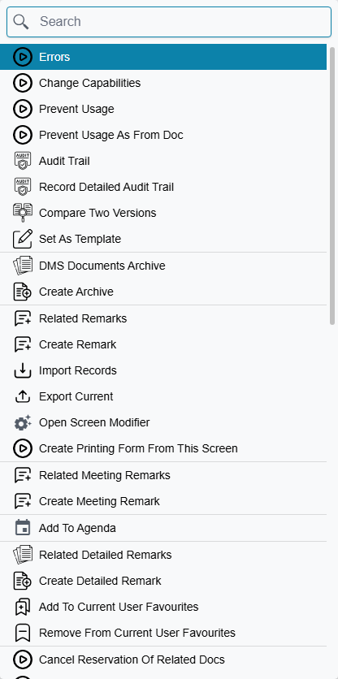
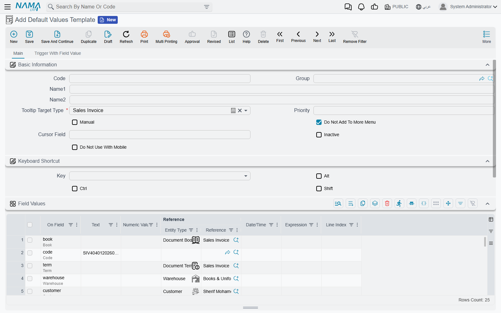
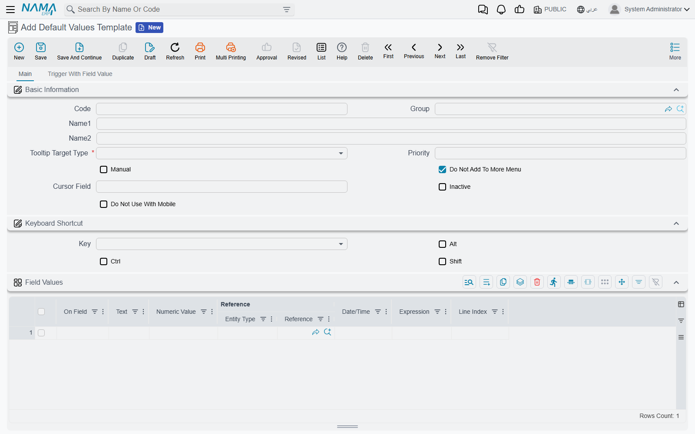
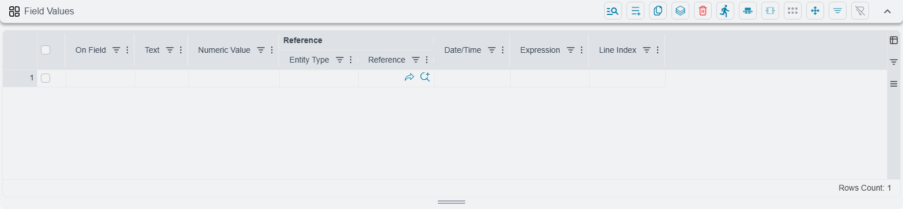
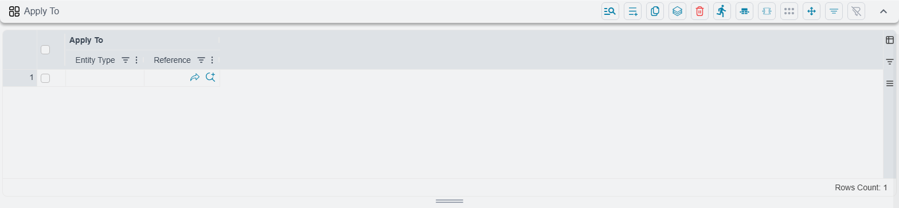
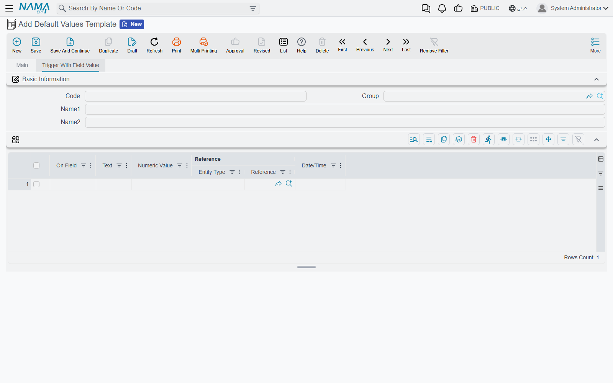

# Default Values Templates

Most data entry is repetition. The same branch, the same warehouse, the same payment method, the
same currency, the same three lines of a standard service invoice — typed again on every new
document, by the same person, all day. A **default values template** is how you stop typing them: it
is a saved list of fields and the values they should start with, and the system fills them in the
moment a new record is opened.

Templates work on **every** entity in the product — documents and master files alike — and one
entity can have as many of them as you like: one per branch, one per customer type, one per user.

## The quickest way to make one

You do not have to build a template field by field. If you already have a record that looks the way
new ones should look, open it and use **More → Set As Template**:

The system reads the record in front of you and hands you a **new, unsaved template** already filled
in:

It contains one line for **every field on the screen that has a value in it**, the entity type set to
whatever you were looking at, and one **Apply To** line naming you. Four fields are always left out —
the value date, the issue date, the fiscal year and the fiscal period — because copying those forward
is never what anyone wants.

::: tip Trim it before you save
Set As Template is deliberately greedy: it copies everything it finds, including the fields that
happened to be filled in on that particular record. A template built from a real invoice will carry
that invoice's customer, its remarks and its reference numbers, and every new invoice would then
start with them.

Delete the lines you do not want, keep the handful that are genuinely standard, then save. It is far
faster than starting from an empty template, but it is a starting point rather than a finished one.
:::

If your site has fields that should *never* be carried into a template — an internal reference, a
signature, a serial — they can be excluded centrally, so Set As Template skips them everywhere.
The list is **Template Excluded Fields** in Global Config, on the **Documents And Books** tab in the
**Documents And Drafts Behavior** group, one field per line.

## What a template is made of

Every template names one entity type — the screen it fills in — and that is the only field you must
fill in besides the code. Everything else on the header controls *when* the template is used, and is
covered [further down](#When-a-template-is-used).

The values themselves live in the **Field Values** grid:

Each row names a field in **On Field** and supplies its value in whichever of the value columns
suits the field's type — **Text**, **Numeric Value**, **Reference**, **Date/Time**. You do not choose
which column applies; the system looks at the field you named and reads the matching one. Tick boxes
are set through the Text column, using `true` or `false`.

**Reference** is really two columns side by side: the kind of record first, then the record itself.
Choose the entity type and the second column then lets you pick from that type's records.

The field list offered in **On Field** is aware of the entity you chose, so you are picking from that
screen's real fields rather than typing paths from memory. Nested fields are reached with a dot, and
any intermediate parts are created for you as needed.

::: warning A renamed or removed field does not break silently
If a field named in a template no longer exists — because a screen was reworked, or the entity
changed — the template still applies, but that one line is reported as a failure naming the field
and the line number, and asking you to update the template. The other lines still apply. If users
report a template that "half works", this is the first thing to check.
:::

### Filling in detail lines, not just the header

Leaving **Line Index** empty sets a field on the record's header. Filling it in sets the field on
detail rows instead, and it accepts three forms:

| Line Index | What it fills |
|---|---|
| `3` | The third row |
| `2,4,6` | Rows two, four and six |
| `1:5` | Rows one to five |

Counting starts at **1**, not 0. If the record does not have that many rows yet, they are created —
so a template can build a standard three-line invoice out of nothing, with each row's item, quantity
and warehouse set by three lines per row.

### Values that are worked out rather than typed

The **Expression** column takes a calculation instead of a fixed value, evaluated against the record
being created. It is how you set a value that depends on something else on the same record rather
than on a constant — and because it runs after the fixed values in the grid have been applied, it can
build on them.

The **Fields Map** box below the grids does the same job in bulk, taking `target=source` lines. Both
use the same expression language as entity flows, so anything you can write in one you can write in
the other.

## Who gets the template

**Apply To** decides who a template belongs to. Each row names a **User**, a **Security Profile** or
a **Master Group**, and the template is offered to anyone matching any row.

**Leaving the grid empty means everybody** — that is the default and it is worth knowing, because an
empty Apply To grid on an automatic template affects the whole site.

A second, independent restriction comes from the template's own **Dimensions** — legal entity,
branch, sector, department, analysis set. A template stamped with a legal entity is only offered to
users logged in to that legal entity, which is the usual way to give each company in a group its own
defaults. Switching legal entity at login switches which templates you get.

## When a template is used

More than one template can be a candidate for the same new record, so the order matters. The system
takes the **first** of these that applies:

1. **A template you picked explicitly** — from the More menu, a keyboard shortcut, or a menu entry
   that has a template pinned to it.
2. **The template named on the document's book or term**, or on a master file's group. Document
   books, document terms and master groups each carry their own **Template** field, and it beats the
   user's own automatic template.
3. **Your automatic template** for that entity type.

### What makes a template automatic

A template is automatic when **Manual** is left unticked. On every new record of that type, the
system takes the automatic templates you are entitled to, sorts them by **Priority**, and applies the
first one.

::: warning Only one automatic template is ever applied, and the lowest number wins
Priority sorts **ascending** — priority 1 is chosen before priority 10. Once a template has been
picked, no other automatic template is applied on top of it; the rest are ignored without any
message. Two automatic templates for the same entity type with the same priority is not an error,
it just means one of them quietly never runs.

If a template "stopped working", look for another one with a lower priority number before looking at
the template itself.
:::

Tick **Manual** and the template is never applied on its own — it is only used when somebody asks for
it by name.

### Reaching a template on demand

A template you want to choose deliberately is reached in three ways:

**From the More menu** on the entity's own screen. Every template for that entity type is listed
below Set As Template, under its own name, and picking one starts a new record from it.

::: warning New templates are hidden from the More menu until you untick a box
**Do Not Add To More Menu** starts **ticked** on every new template. That is the shipped default, and
it means a template you just created will *not* appear in the More menu list until you go back and
untick it. This is the single most common reason a new template seems to have vanished.
:::

**By keyboard shortcut.** The **Keyboard Shortcut** group sets a key that creates a new record from
this template from anywhere on that screen. If the key is a letter, it must be combined with **Ctrl**
or **Alt** — the record will not save otherwise, and it tells you so.

**From a menu entry.** A menu item can have a template pinned to it, so that opening that entry
always starts from that template. That is how sites offer "New service invoice" and "New goods
invoice" as two separate menu entries onto the same screen — see
[how the menu is put together](/platform/menus/menu-structure).

## Applying a template part-way through typing

Templates are not only an opening move. Two things can apply one to a record you have already started.

**Choosing a book, a term or a group.** If the book, term or group you pick carries a template, it is
applied there and then — which is how the document reshapes itself when you choose a different book.

**A field taking a particular value.** The second tab, **Trigger With Field Value**, is a list of
field-and-value pairs. When the named field on the named entity is set to that value, this template is
applied:

Each row needs a field and at least one value to compare against — a text, a number, a date or a
reference. This is what drives "picking this customer type fills in these six fields".

In both cases **what you have already typed is kept**. The record is rebuilt with the template
applied and your values carried across, so triggering a template half-way down a document does not
cost you the work above it.

::: info Templates only ever apply to a record that has not been saved
A template is part of *creating* a record. Opening a saved record and picking a template does not
re-fill it, and changing a template never reaches back into records that were created from it
earlier. Records brought in through record import skip templates entirely — an import fills exactly
the fields in the file and nothing else.
:::

## The rest of the header

| Field | What it does |
|---|---|
| Priority | Which automatic template wins — lowest number first |
| Manual | Never applied automatically; only on demand |
| Do Not Add To More Menu | Keeps the template out of the screen's More menu — **starts ticked** |
| Cursor Field | Which field the cursor lands in after the record is created |
| Inactive | Takes the template out of automatic use and out of the More menu |
| Do Not Use With Mobile | Skips this template when the record is being created from the mobile app |

**Cursor Field** is a small thing that saves a great deal of time. If a template fills in the first
six fields of a screen, the cursor still starts in the first one, and the user has to tab past all of
them. Naming the seventh field here puts the cursor exactly where typing actually begins.

## Where to find them

Default values templates live under **Basic → Administration → Display Customization → Default Values
Templates**, alongside the screen modifier, [the menu](/platform/menus/) and the other tools that
change how screens look and behave.

Because every template names the entity it targets, that one list holds the templates for the whole
system. Sorting it by target type is the quickest way to see what a given screen already has.

See also [Buttons on Every Screen](/platform/screen-buttons) for the More menu itself, and
[Document Books](/platform/document-books) for the book and term settings that can carry a template
of their own.
