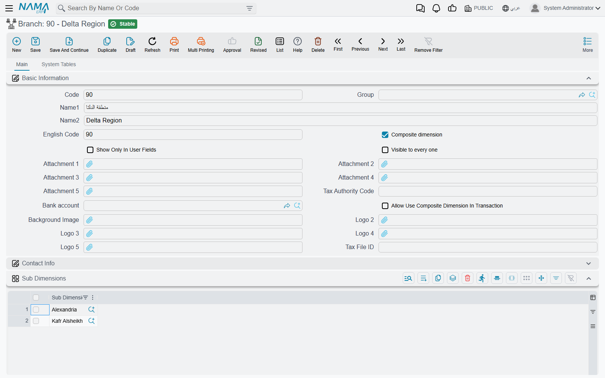
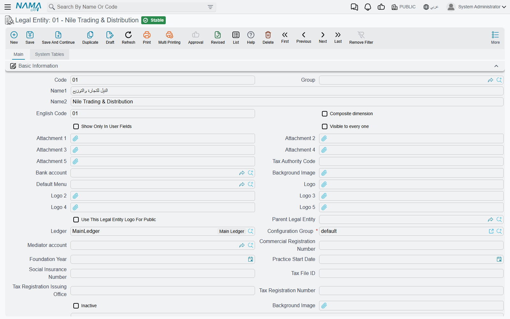
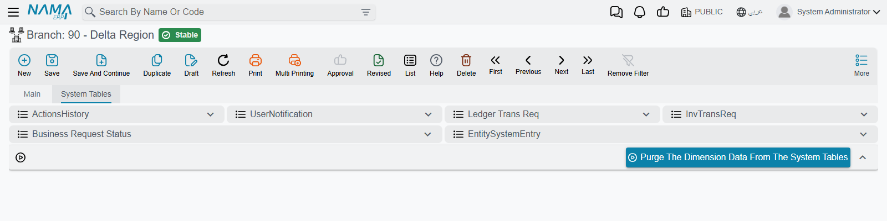

# Dimensions and Composite Dimensions

Ask any question about a figure in Nama and the second half of the question is always the same: sales — *of which company?* Salaries — *for which branch?* Consumption — *charged to which cost centre?* **Dimensions** are the five fields that carry that answer on almost every record in the system: **Legal Entity**, **Sector**, **Branch**, **Department** and **Analysis Set**.

They are not an accounting feature. The same five fields sit on an item, an employee, a warehouse, a sales invoice, a maintenance job order and a user, which is why they are worth understanding once rather than five times. Three things run on them:

- **Who sees a record.** A user working inside Alexandria sees Alexandria's records and not Cairo's.
- **How figures group.** Every report that totals "by branch" or "by cost centre" is reading these fields.
- **How account codes are read.** A chart of accounts that encodes the branch into the account number is decoded through them.

This page covers the five master files themselves — where they live, what you fill in, and the composite dimensions that let one record stand for several. For the switches that decide which dimensions your installation uses and how strictly it checks them, see [Dimensions in global configuration](/platform/global-config/global-config-dimensions). For what dimensions do inside the ledger — accounts that restrict them, and distribution rules that spread one value across many — see [Dimensions, Cost Centers & Distribution](/modules/accounting/support/accounting-dimensions-and-distribution). For who ends up seeing what, see [Record-Level Security](/platform/security/record-level-security).

## The five, and what each is for

They ship as five separate master files under `Basic → Dimensions`, each with its own menu item:

| Dimension | Menu | What it usually holds |
|---|---|---|
| **Legal Entity** | `Basic → Dimensions → Legal Entity` | The company. In a multi-company database this is the one that separates one set of books from another — each legal entity has its own ledger. It is the only dimension that cannot be switched off. |
| **Sector** | `Basic → Dimensions → Sector` | The broadest internal division — a line of business, a region, a group of branches. |
| **Branch** | `Basic → Dimensions → Branch` | The physical location: a shop, a site, a warehouse's town. |
| **Department** | `Basic → Dimensions → Department` | The administrative unit: finance, sales, maintenance. |
| **Analysis Set** | `Basic → Dimensions → Analysis Set` | The free-form one. It is the usual home of the **cost centre** or the project code, because nothing in the system dictates what it means. |

Nothing enforces that reading. Sector, branch and department are ordinary lists you fill in yourself, and the containment the system assumes between them (a sector holds branches, a branch holds departments) is only the default **Order** in global configuration, which you can change.

## PUBLIC: the dimension that means "all of them"

Every dimension type owns one record the system creates for itself, with the code **PUBLIC** and the Arabic name «عام». You will see it as the value of any dimension you leave blank — it is a real record, not an empty column, which is why it shows up in lookups and on screens.

PUBLIC means *not restricted on this axis*. A record saved with `Branch = PUBLIC` belongs to no branch in particular, and a user whose session runs with `Branch = PUBLIC` is not restricted to one. The item catalogue shared by the whole group is the classic case: leave its dimensions PUBLIC and everybody can use it.

::: warning A public record is not automatically a visible one
Legal Entity is the exception worth knowing. A record with no legal entity is public, but it is still hidden from users working inside a specific legal entity until **Show Public Documents to All** is switched on in [global configuration](/platform/global-config/global-config-dimensions). "Why can't he see this item?" is very often this setting.
:::

## The dimension screen

All five share one screen. Open `Basic → Dimensions → Branch` and press **New**:

The identity block is the usual master-file one — **Code**, **Group** (the [master group](/platform/master-groups) that files it in the tree), **Name1**, **Name2** and an **English Code**. Then come the fields that belong to dimensions specifically:

- **Composite dimension** — this record stands for several others. The [next section](#Composite-dimensions-one-record-that-stands-for-several) is about what that means.
- **Show Only In User Fields** — the dimension disappears from every lookup in the system *except* the ones on the user screen. It is how you create a value that exists only to describe a user's scope and can never be typed onto a document by mistake.
- **Visible to every one** — the record behaves like PUBLIC for *viewing*: whoever the dimension belongs to, everybody can see records carrying it. Use it for the head office or the shared warehouse that every branch is allowed to look at.
- **Attachment 1–5**, **Tax Authority Code**, **Bank account**, a background image and up to five logos — descriptive extras. The logos matter in printed forms, where a form can print the logo of the branch or company the document belongs to.
- **Contact Info** — a full address, phones, e-mail and website. A branch's address is real data: printed forms and e-invoicing read it.
- **Dimensions** — the dimension's own five dimensions, minus itself. A branch belongs to a legal entity and a sector; a department belongs to a branch. This is what makes the dimensions a hierarchy rather than five unrelated lists.

::: info A dimension cannot be filed under its own type
The **Dimensions** group on a Branch offers Legal Entity, Analysis Set, Sector and Department — but not Branch. Trying to give a branch a branch is refused with *Can not set {0} of another {0}*, where `{0}` is the dimension type.
:::

### Extras on individual types

**Legal Entity** carries far more than the other four, because it is the company:

- **Parent Legal Entity** builds a group structure out of companies.
- **Ledger** is the set of books this company posts into, and **Configuration Group** is the settings list it follows — two companies in one database can therefore keep different books and different configuration.
- **Mediator account** is the account used when a transaction crosses from one legal entity to another.
- **Commercial Registration Number**, **Foundation Year**, **Practice Start Date**, **Social Insurance Number**, **Tax File ID**, **Tax Registration Issuing Office** and **Tax Registration Number** are the statutory identifiers printed on documents and sent to the tax authority.
- **Default Menu** gives the company its own menu, and **Use This Legal Entity Logo For Public** decides whose logo greets a user logged in on PUBLIC.
- **Unused Entities** and **Unused Features** hide screens and features that this company does not use.
- **Number Of User** and **Inactive** round it off. On installations hosted in Nama's cloud a **Licenses** tab appears as well.

The rest are short: **Branch** adds its own **Tax File ID** and logos, **Sector** adds logos, **Analysis Set** adds an **Alternative Cost AnalysisSet** with a **Start Date** — the analysis set that costing should use instead of this one from that date on — and **Department** adds nothing at all.

## Composite dimensions: one record that stands for several

A regional manager covers Alexandria and Kafr Alsheikh. Neither branch is the right answer for "which branch does she work in", and inventing a branch called *Delta Region* alongside the real ones would corrupt every branch report. A **composite dimension** is the answer: a record of the same type, marked **Composite dimension**, whose **Sub Dimensions** grid lists the real branches it covers.

Each dimension type therefore has **two** menu items — `Branch` and `Composite Branches` — and they are the same screen over the same table, split by that tick. Ordinary list views show only the normal records; the *Composite* menu item shows only the composite ones. Lookups on other screens show both, which is why **Show Only In User Fields** is worth ticking on a composite you never want typed onto a document.

Three rules govern the grid:

- A composite **must** list at least one sub dimension, and a non-composite must list none.
- Sub dimensions must be **normal** records. A composite inside a composite is refused — the structure is exactly one level deep.
- The **Parents** grid on a normal dimension is the mirror image, and it fills itself. Add Alexandria to *Delta Region* and *Delta Region* appears among Alexandria's parents when you save; there is nothing to maintain by hand there.

What you gain is three things:

**Scope for a user.** Give a user record or a login context the composite branch and their scope opens to every branch inside it. This is the main use, and it is why composites exist. See [Record-Level Security](/platform/security/record-level-security) for how a session's dimensions become the records it can see.

**Reporting across the group.** A report prompt answered with a composite dimension covers the dimension itself *and* everything beneath it. The report definition's **Override Selected Legal Entity** setting and its four siblings decide whether the user's answer survives at all — *When Not Public* is the setting that lets the manager of a composite report across its members and no further; see [Reports](/platform/reports/reports-guide). [Printed form selection](/platform/reports/printed-form-selection) is more forgiving still: a form set to a composite dimension matches any record whose dimension sits inside it.

**Occasionally, a value on a document.** By default a composite dimension cannot be used on a transaction at all — a document or a warehouse carrying one is refused on save. Ticking **Allow Use Composite Dimension In Transaction** on the composite lifts that, and the tick is then frozen: once documents reference the composite you can no longer flip it back to a normal dimension.

::: warning A composite Legal Entity can never carry transactions
The **Allow Use Composite Dimension In Transaction** tick exists on Sector, Branch, Department and Analysis Set only — the Legal Entity screen has no such field, and the system forces the answer to *no* every time the record is saved. A composite legal entity is a reporting and security grouping, never a company you post into.
:::

## The System Tables tab

Every dimension screen carries a second tab, **System Tables**, holding six lists filtered to that dimension: its action history, its user notifications, its ledger and inventory transaction requests, its business-request statuses and its system entries. (Their headings are untranslated in both languages — they read `ActionsHistory`, `UserNotification`, `Ledger Trans Req` and so on whichever language you are working in.)

At the bottom sits **Purge The Dimension Data From The System Tables**. It asks which of the five tables to empty and makes you tick a confirmation before it runs, and it deletes — this is a clean-up tool for a legal entity that was created by mistake or a test branch full of failed requests, not part of anybody's daily work.

## When a dimension refuses to change

Two refusals catch people out, and both exist for the same reason: a dimension is referenced by thousands of records, so changing one quietly re-files all of them.

The first is **the dimensions of a dimension**. Once master files point at a branch, the branch's own legal entity, sector and department are frozen. **Allow Changing Dimensions of Dimensions** in [global configuration](/platform/global-config/global-config-dimensions) unlocks it, and is meant for a deliberate restructuring — expect to review what moved afterwards.

The second is **the composite tick itself**. Once documents reference the dimension, it can no longer be turned from normal into composite or back, unless **Allow Use Composite Dimension In Transaction** is on.

Neither refusal has an Arabic translation, so both appear in English on an Arabic screen. That is the product's behaviour, not a fault in your installation.

## Messages you may see

| Message | Why | What to do |
|---|---|---|
| *Can not set {0} of another {0}* — «لا يمكن تحديد {0} لـ{0} آخر» | A dimension was given a value of its own type — a branch filed under another branch; `{0}` is the type. | Leave that field empty; a dimension is filed under the *other* four types only. |
| *Sub dimension must be normal not composite* — «لا يمكن السماح بمحددات مركبة داخل محدد مركب» | A row in **Sub Dimensions** points at another composite. | Replace it with the real dimensions. Composites do not nest. |
| *Entity of type {0} can not use composite dimension of type {1}* — «لا يمكن استعمال المحدد المركب من النوع {1} للسجل {0}» | A document or a warehouse was saved carrying a composite dimension. | Use one of the real dimensions, or tick **Allow Use Composite Dimension In Transaction** on the composite if it is genuinely meant to be posted to. |
| *Cannot change dimension if other Documents are referenced From this dimension.* | The **Composite dimension** tick was changed on a dimension that documents already use. | Leave the tick alone, or create a new dimension for the new purpose. |
| *Cannot change dimensions of dimension if other Master Files are referenced From this dimension.* | The dimension's own legal entity, sector, branch or department was changed after master files started pointing at it. | Switch on **Allow Changing Dimensions of Dimensions** only if the restructuring is deliberate, and review the affected records afterwards. |
| *Please select at least one table to purge* — «برجاء اختيار جدول واحد على الأقل لتفريغه» | The purge action was confirmed without ticking any of the five tables. | Tick the tables to empty, then confirm again. |
