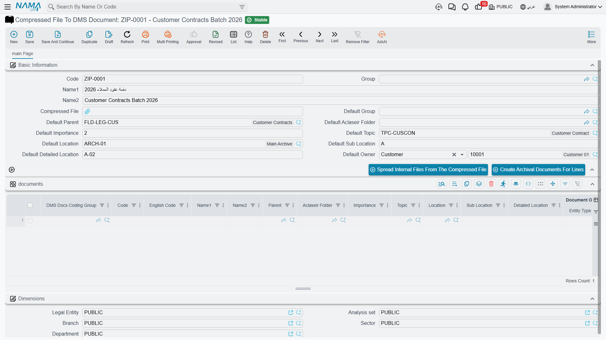

# Loading an Archive from a ZIP File

Registering documents one at a time is fine for the trickle of new paperwork. It is hopeless for
the thousand scanned files a customer hands you at the start of an implementation.

**Compressed File To DMS Document / ملف مضغوط إلى مستندات أرشيفية** exists for that first load.
You upload one ZIP archive, the system unpacks it into a staging grid — one row per file inside —
you complete the coding, and a second button turns every row into a real archived document with
the file already attached.

## The Two-Step Workflow

The screen has exactly two buttons and they run in order.

### Step 1 — Spread Internal Files From The Compressed File

**فرد الملفات الداخليه من الملف المضغوط**

Attach your ZIP in **Compressed File / الملف المضغوط**, save, then press this button. The system
walks the archive and creates one row in the grid per file, skipping folder entries. Each row
arrives with the file already attached in its Current Version.

::: warning It clears the grid first
Pressing this button again wipes every row and starts over, discarding any coding you had typed.
Do the unpacking once, then do the typing.
:::

Two quirks in what you get back:

- **Name1 is set to the full path inside the archive**, not the file name. A file stored as
  `contracts/2026/acme.pdf` produces a row named exactly that. Plan to overwrite it.
- **Code is left empty**, so every created document relies on auto-coding unless you type codes
  yourself.

### Step 2 — Create Archival Documents For Lines

**إنشاء المستندات الأرشيفية للسطور**

Once the grid is filled in, save and press this button. For each row the system creates a DMS
Document, attaches the file to it, and writes the new document back into the row's **Created
Document** column so you can see what came out.

The step is safe to repeat: a row that already produced a document **edits that same document**
rather than creating a duplicate.

::: warning A failed row stops the run
If one row fails, the process stops there. Rows before it are already created; rows after it are
untouched, and the message does not identify which row was at fault. Fix the problem and press the
button again — the rows that already worked will not be duplicated.
:::

## What Actually Transfers — and What Does Not

This is the part to read twice, because the screen offers far more than it delivers.

**Only these columns reach the created document:**

| Column | Arabic label |
|---|---|
| Code | الكود |
| Name1 / Name2 | الاسم العربي / الاسم الإنجليزي |
| Importance | الأهميه |
| Sub Location | الموقع الفرعي |
| Detailed Location | الموقع التفصيلي |
| Renewal Date | تاريخ التجديد |
| Expiration Date | تاريخ الانتهاء |
| Current Version *(the file)* | النسخة الحالية |

::: danger Folder, topic, owner and archive are silently discarded
The grid also offers **DMS Docs Coding Group**, **English Code**, **Parent** (the folder),
**Aclaseir Folder**, **Topic**, **Location** (the archive) and **Document Owner** as editable
columns — and none of them is copied to the created document. Nothing warns you. You get documents
filed in no folder, classified under no topic and owned by nobody.

Worse, the whole **block of default values** in the header — Default Group, Default Parent,
Default Aclaseir Folder, Default Importance, Default Topic, Default Location, Default Sub Location,
Default Detailed Location and Default Owner — is read by nothing at all. Filling it in changes
nothing anywhere.

Do not spend time coding those columns. Plan to set the filing after import instead.
:::

## A Workflow That Works Today

Given the above, the reliable way to load an archive in bulk is to let the ZIP importer do what it
genuinely does — create documents with their files attached — and to do the filing in a second
pass:

1. **Group your files by destination before you zip them.** One ZIP per folder-and-topic
   combination: all the employment contracts in one, all the licences in another. This is what
   makes the second pass a bulk operation instead of a per-document one.
2. **Unpack and create** with the two buttons, filling in only the columns that transfer — names,
   importance, positions and dates.
3. **Set the filing in bulk afterwards.** Export the newly created documents to a spreadsheet,
   fill in Folder, Topic, Location and Owner down the column, and import it back. See
   [Importing Records](/platform/import-export/importing-records.md).

::: tip Or skip this screen entirely
If your scans are already named after something the system knows — an employee code, a contract
number — a straight [record import](/platform/import-export/importing-records.md) of DMS Documents
gives you complete control over every field in one pass, with no second step and no discarded
columns. The ZIP screen is most useful when the files are all you have and their names mean
nothing.
:::

## Practical Limits

- **Keep the archives modest.** Each file is held in memory while it is unpacked, so a very large
  ZIP can exhaust the server. Split a big load into batches of a few hundred megabytes rather than
  uploading one enormous archive.
- **There is no extension filter and no duplicate check.** Whatever is in the ZIP becomes a
  document, including stray thumbnail and system files. Clean the archive before you upload it.
- **Individual file size** is bounded by the usual upload limit of 20 MB per file.
- **Deleting the import record does not delete the files it holds.** The ZIP and every extracted
  copy stay in storage. Where attachments are stored outside the database, they remain on disk —
  worth knowing before you use this screen repeatedly for trial runs.
