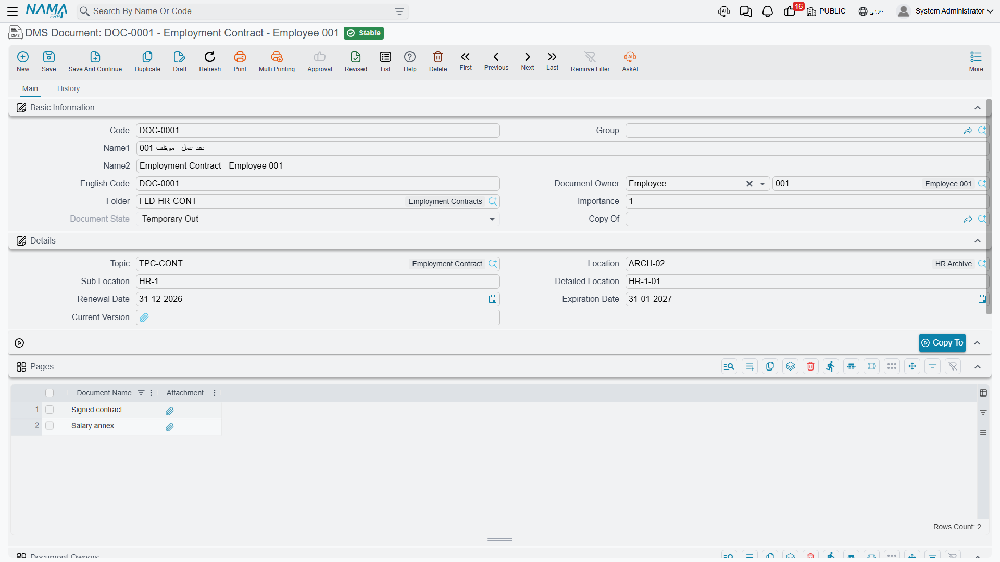
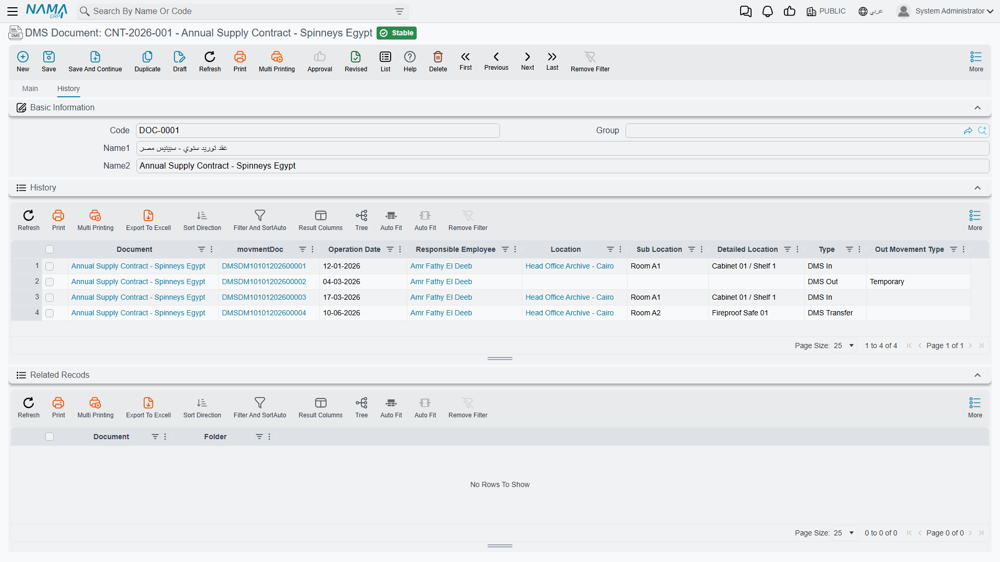
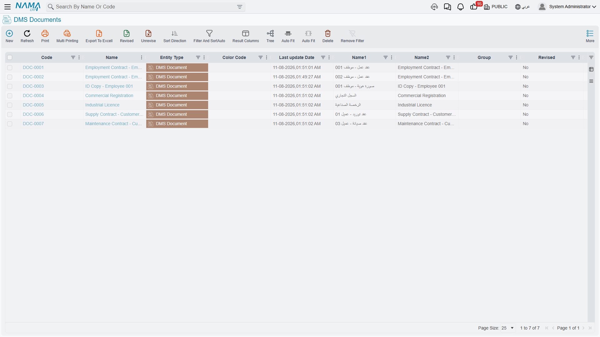

# Archived Documents

The DMS Document is the record everything else in this section exists to support. One record
describes one archived document: what it is, who it belongs to, which folder it is filed under,
which shelf the paper sits on, and which scans are attached to it.

## Registering a Document

The fastest route is to pick the folder first and let it do the work for you.

1. **Open a new DMS Document** and give it a code and names. If your implementation uses
   auto-coding, the code fills itself.
2. **Choose the Folder / المجلد.** Only folders that accept elements are offered. As soon as you
   pick one, its defaults land on the record — topic, archive, sub location and detailed location
   all fill in together.
3. **Adjust the physical position** if this particular document sits somewhere other than the
   folder's usual shelf. Sub Location and Detailed Location offer suggestions drawn from the
   archive's slot catalogue.
4. **Set the Document Owner** if the paper belongs to somebody — an employee, a customer, a
   supplier, a third party or a fixed asset.
5. **Attach the scan** in Current Version, and add further pages in the grid below if the document
   runs to more than one file.
6. **Save.** The document enters the **Initial** state.

### The fields

| Field | Arabic label | Notes |
|---|---|---|
| **Code** / **English Code** | الكود / الكود الإنجليزي | Standard master-file identity. |
| **Name1** / **Name2** | الاسم العربي / الاسم الإنجليزي | Arabic name and English name respectively. |
| **Document Owner** | مالك المستند | Who the paper belongs to. Limited to **Customer, Employee, Supplier, Third Party** and **Fixed Asset**. New records start with the type set to Customer — change it if that is not what you want. |
| **Folder** | المجلد | Where it is filed. Drives the defaults described above. |
| **Importance** | الأهميه | A number you can filter and sort on. Nothing acts on it automatically. |
| **Document State** | حالة المستند | Filled in by the system; always read-only. See below. |
| **Copy Of** | نسخة من | Points at the original when this record was produced by **Copy To**. |
| **Topic** | موضوع | The subject classification. |
| **Location** | أرشيف | Which archive holds the paper. |
| **Sub Location** / **Detailed Location** | الموقع الفرعي / الموقع التفصيلي | The shelf and slot, as free text with suggestions. |
| **Renewal Date** | تاريخ التجديد | When the document should be renewed. |
| **Expiration Date** | تاريخ الانتهاء | When it lapses. |
| **Current Version** | النسخة الحالية | The main attached file — the scan of the document itself. |

::: warning Nothing watches the dates
Renewal Date and Expiration Date are recorded and nothing else. There is no reminder, no
notification and no scheduled check anywhere in DMS. To be warned about lapsing licences, build a
[scheduled task](/platform/scheduled-tasks.md) over a filtered document list, or keep a saved
[quick filter](/platform/list-views/quick-filters.md) that people actually look at.
:::

## Pages and Owners

Two grids sit below the header, and both are optional.

**Pages / الصفحات** holds the additional files that make up the document — the annexes, the extra
scanned sheets, the signed amendment. Each row is a name plus an attachment. The main scan itself
belongs in Current Version, not here.

**Document Owners / ملاك المستند** is for paperwork that belongs to more than one party at once —
a joint contract, a shared certificate. Each row names an owner and lets you note what their
relationship to the document is. The allowed owner types are the same five as the header.

::: tip Both owner fields count when searching
When you look up a customer's archive from their own screen, Nama matches the header **Document
Owner** *or* any row in **Document Owners**. Filling either one is enough to make the document
findable from the owning record.
:::

## Document States

The state is written by the system, never by hand. A new document starts at **Initial**; after
that, only a committed [movement voucher](/platform/dms/dms-movements.md) changes it.

| State | Arabic | What it means |
|---|---|---|
| **Initial** | مبدئي | Registered but never moved. |
| **Inside** | بالداخل | Present in the archive, according to the last movement. |
| **Temporary Out** | بالخارج مؤقتا | Checked out and expected back. |
| **Final Out** | بالخارج بشكل نهائي | Issued out permanently. |
| **Disposed** | تم التخلص منه | Destroyed or shredded. |

::: warning The state does not restrict anything
It is a label, not a lock. A **Disposed** document can still be edited, checked out again and
deleted; a document that is already **Temporary Out** can be checked out a second time without
complaint. If you need the state to be trustworthy, that discipline has to come from your
procedures rather than from the system.
:::

## Copying a Document

The **Copy To / نسخ إلى** button duplicates the record — same names, same topic, same physical
details — clears the folder so you must file the copy deliberately, and links the new record back
to the original through Copy Of.

Use it for the second certified copy of a deed, or when the same agreement has to be filed under
two headings. The record must be saved before the button will run, and a copy cannot itself be
copied — attempt it and the system refuses with *"Can not make copy of this document"*.

Every copy made this way is listed on the original's **Related Records** panel.

## The History Tab

The document's second tab shows where it has been.

Two panels live here, and **both open collapsed** — click the header of either to expand it:

- **History / تاريخ الحركات** — one row per movement this document has been through, showing the
  date, the movement type, the responsible employee and the archive position recorded at the time.
- **Related Recods** — the copies made from this document with **Copy To**. (The missing "r" is a
  typo in the interface, not in your data.)

::: warning History records where a document came from, not where it went
Each history row stores the position the document was at **before** the movement, together with
the movement's own type and date. For a Transfer, that means the row shows the origin shelf; the
destination is only visible by opening the movement voucher itself.
:::

## Finding Documents

There are four practical routes, and which one you reach for depends on what you know:

**From the document list** — the ordinary list screen, with the usual filtering and column
choices. The **Tree** button on the toolbar brings up the folder tree beside the list, so you can
click a folder and see everything filed beneath it, sub-folders included.

**From a folder** — the Documents tab of any folder lists its contents with filters for topic and
position.

**From a topic** — the Topic screen lists every document classified under it.

**From the owning record** — open a customer, supplier or employee and use **DMS Documents
Archive / أرشيف المستندات** in the More menu, or add a permanent DMS Documents page to those
screens. Both are covered in [Settings and Integration](/platform/dms/dms-configuration.md).

::: tip There is no search inside the files
Every route above searches the *register* — codes, names, folders, topics, owners. None of them
looks inside the attached scans. Whatever you will want to search by later has to be typed into a
field now, which is the main argument for filling in topics and names properly at registration
time.
:::

## Extra Fields for Your Own Metadata

Archived documents carry an unusually large block of spare fields — ten extra dates, fifteen extra
numbers, twenty-five extra text fields, ten extra references, five times and ten checkboxes.

They exist precisely because every business archives something with attributes nobody could
anticipate: a deed's plot number, a contract's governing law, a certificate's issuing body. Give
them proper labels through
[Fields and Entities Settings](/platform/fields-and-entities-settings/fields-settings-field-appearance.md)
and put them on the screen with the
[screen modifier](/platform/screen-modifier/screen-modifier-edit-screen.md); no customisation is
needed.
