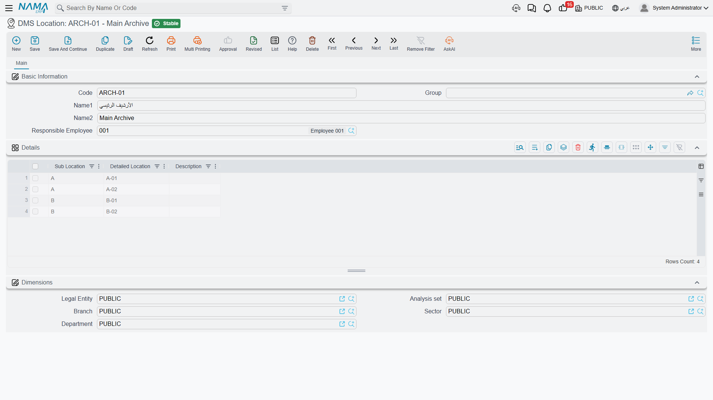
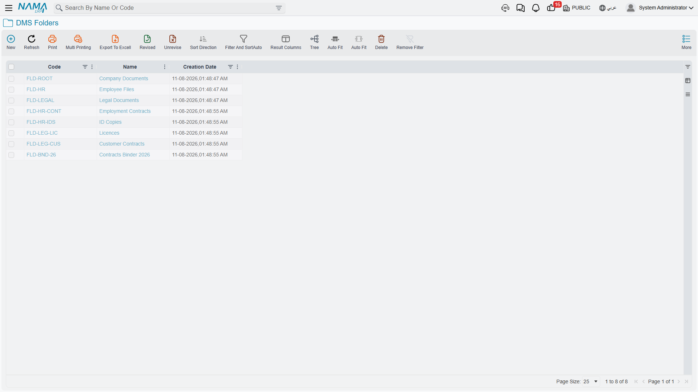
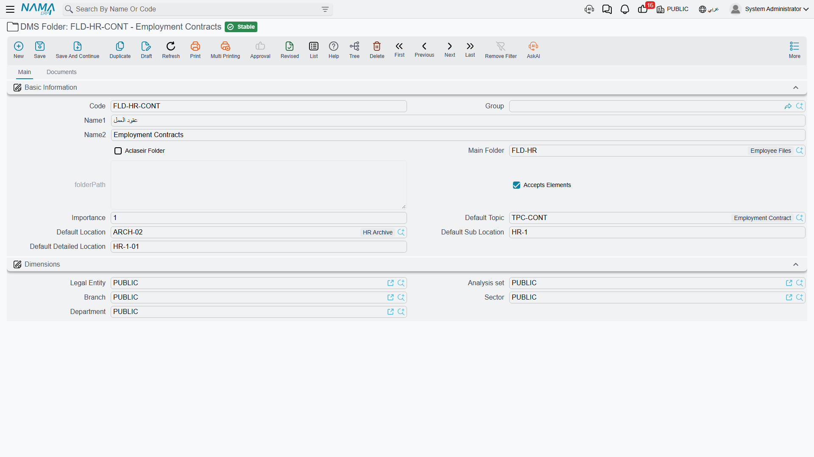
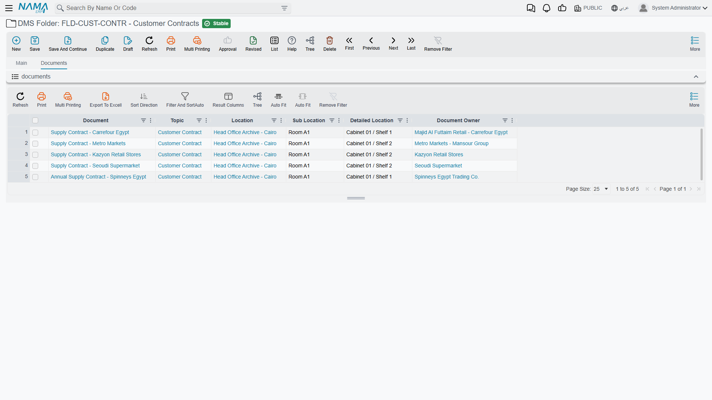
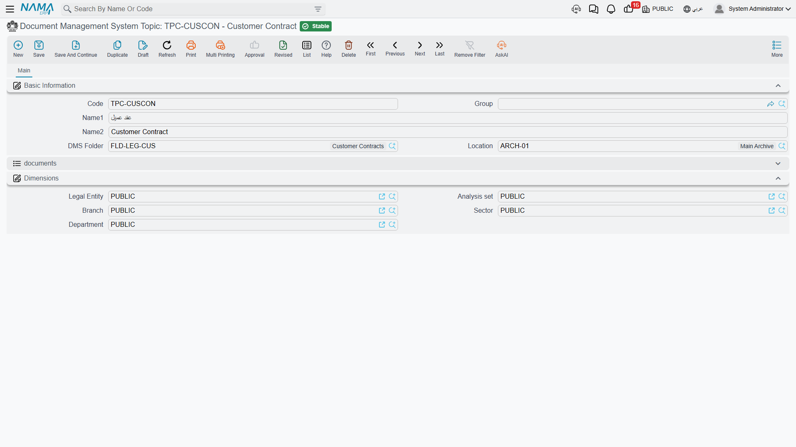

# Archives, Folders and Topics

Three master files describe where paperwork lives and what it is about. You build them once
during implementation, and if you get them right the document screen fills itself in for the
people using it every day.

They answer three different questions, and it is worth being clear which is which:

- **Archive (DMS Location)** — *where is the paper physically?* A room, a strong room, a bank of
  cabinets.
- **Folder** — *how is it filed logically?* A tree, like folders on a computer.
- **Topic** — *what kind of document is it?* A subject classification.

A document points at all three at once, and they are independent. Two contracts in the same
folder can sit in different archives; two documents in the same archive can belong to entirely
different folders.

## Archives — DMS Location / أرشيف

Start here, because folders and topics both point at archives.

An archive is a physical storage place with a responsible employee. Inside it, the **Details**
grid is a catalogue of the slots it contains — the shelves, drawers and boxes a document can
actually sit in.

| Field | Arabic label | What it is for |
|---|---|---|
| **Code**, **Name1**, **Name2** | الكود، الاسم العربي، الاسم الإنجليزي | The usual master-file identity. |
| **Responsible Employee** | الموظف المسئول | Who is accountable for this archive. Recorded for reference; it does not grant or restrict any access. |
| **Sub Location** *(grid)* | الموقع الفرعي | The coarse slot — a room, an aisle, a cabinet. |
| **Detailed Location** *(grid)* | الموقع التفصيلي | The fine slot — a shelf, a drawer, a box. |
| **Description** *(grid)* | الوصف | A free note about that slot. |

The grid earns its keep on the document screen. Sub Location and Detailed Location on a document
are **free text**, not dropdowns — but as soon as you pick an archive, the values you listed here
are offered as type-ahead suggestions. Cataloguing your shelves once is what stops five people
inventing five spellings for the same cabinet.

::: tip Keep slot names language-neutral
These are plain text and are *not* translated, so the same value appears in the Arabic and the
English interface. Short codes like `A`, `B-01` or `HR-2` travel better than words.
:::

## Folders — DMS Folder / مجلد

Folders are a tree, exactly like folders on a computer: each one may have a parent, and the
hierarchy can go as deep as you need.

| Field | Arabic label | What it does |
|---|---|---|
| **Parent** | المجموعة الأعلي | The folder above this one. The picker offers only folders that do **not** accept elements. |
| **Accepts Elements** | يقبل عناصر | The switch that decides what this folder is for. See below — it matters more than it looks. |
| **Aclaseir Folder** | حافظة | Marks the folder as a binder rather than a normal folder. A document can be filed in a binder *in addition to* its normal folder. |
| **Importance** | الأهميه | A numeric priority. Recorded only; nothing acts on it. |
| **Default Topic** | الموضوع الأفتراضي | Pushed onto any document filed here. |
| **Default Location** | الموقع الأفتراضي | Pushed onto any document filed here. |
| **Default Sub Location** | الموقع الفرعي الأفتراضي | Pushed onto any document filed here. |
| **Default Detailed Location** | الموقع التفصيلي الأفتراضي | Pushed onto any document filed here. |

### Accepts Elements — the switch that trips everyone up

A folder is either a **container** for other folders, or a **filing place** for documents. It
cannot be both, and *Accepts Elements* is how you say which:

- **Ticked** — documents can be filed here. The folder appears in the Folder picker on the
  document screen. It will **not** appear in the Parent picker of another folder.
- **Cleared** — the folder is a branch. It can be a parent, but no document can be filed directly
  in it.

::: warning New folders arrive ticked, and nothing changes that automatically
Every folder is created with *Accepts Elements* already ticked, and adding a child folder does
**not** clear it. So when you build a tree top-down, you must untick the box on each branch
folder yourself before it will show up as a possible parent.

If you have just created a folder and it refuses to appear in another folder's Parent picker,
this is why.
:::

### Defaults cascade twice

The four `Default …` fields are a convenience that saves a lot of typing, and they flow in two
directions:

1. **Parent folder → child folder.** Choose a parent, and its four defaults are copied down into
   the folder you are creating. Change them afterwards if the child differs.
2. **Folder → document.** File a document into a folder, and the folder's default topic, archive,
   sub location and detailed location are written onto the document.

::: tip The second cascade needs a Default Topic
Folder-to-document copying only happens when the folder has a **Default Topic** filled in. A
folder with a default archive but no default topic pushes *nothing* — not even the archive. If
your defaults appear not to work, check the topic first.
:::

### Finding documents through the tree

The Folder screen's second tab, **Documents / المستندات**, lists everything filed in that folder —
including anything filed there as a binder. You can narrow the list by topic, archive, sub
location and detailed location without leaving the screen.

## Topics — Document Management System Topic / موضوع المستند

A topic is the subject of a document: "Employment Contract", "Licence", "Identity Document". It
is the answer to *what kind of thing is this*, as opposed to where it is filed.

| Field | Arabic label | What it does |
|---|---|---|
| **DMS Folder** | مجلد | Scopes the topic to a folder. |
| **Location** | الموقع المخزني | Scopes the topic to an archive. |

Both are optional, and both are used as **filters**: when somebody picks a Topic on a document,
the list is narrowed to topics whose folder matches the document's folder and whose archive
matches the document's archive.

::: warning Scope topics consistently with folder defaults
Because a folder's defaults set the document's topic **and** its archive at the same time, it is
possible to configure a folder whose default topic would be rejected by the topic picker's own
filter — for instance a topic scoped to the Main Archive being pushed onto a document whose
default archive is the HR Archive. The value still gets written, but anyone who reopens the
picker will not find it in the list.

The simplest way to stay out of trouble is to scope each topic to the same archive its folder
points at.
:::

The Topic screen also carries an embedded list of every document classified under it, which is
often the quickest way to answer "how many employment contracts do we hold?".
