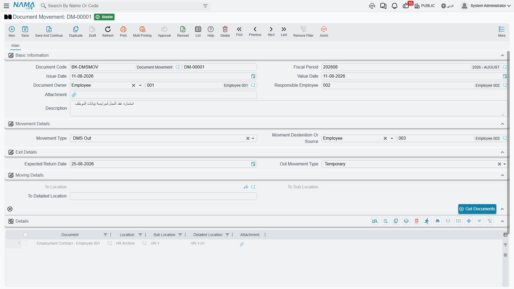
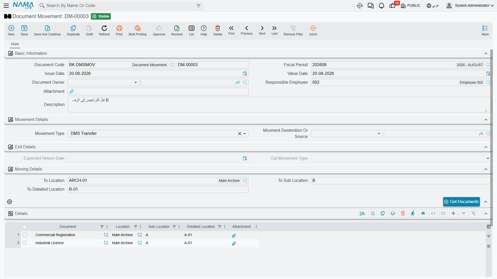
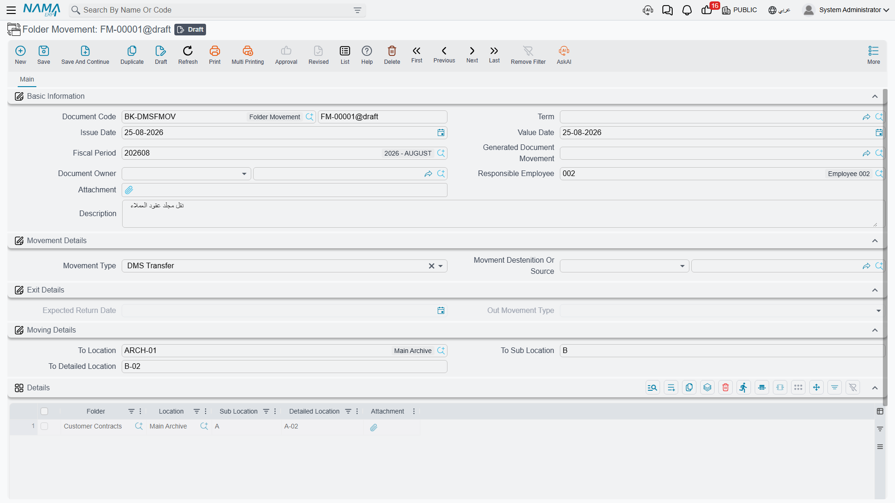

# Checking Documents In and Out

Paper leaves the archive. Somebody borrows the original contract for a court hearing, the auditor
takes the licence file for a week, a deed is handed over permanently when a property is sold. The
movement vouchers are how you keep a record of that.

A movement is a **document**, not a master file, so it behaves like an invoice: it needs a
document book, it has an issue date and a value date, it can be saved as a draft, and it takes
effect when you commit it.

::: tip Create a book before you start
Document Movement has no book out of the box. Until somebody creates one — a
[document book](/platform/global-config/global-config-documents.md) whose type is Document
Movement — nobody can record a single movement. This is the usual reason the screen appears
unusable on a fresh installation.
:::

## Recording a Document Movement

The header describes the movement as a whole:

| Field | Arabic label | What it is for |
|---|---|---|
| **Document Code** | الكود | The book and the voucher number. |
| **Issue Date** / **Value Date** | تاريخ الإصدار / التاريخ الفعلي | The value date is what lands on the history rows, and it must fall in an open fiscal period. |
| **Movement Type** | نوع الحركة | The kind of movement. Drives the whole screen — see below. |
| **Document Owner** | مالك المستند | Limited to **Customer** or **Employee**. Filling it narrows the document picker to that owner's paperwork. |
| **Movment Destenition Or Source** | إتجاة أو مصدر الحركة | Who the paper is going to, or coming from. **Customer**, **Employee** or **Third Party**. (The English label is misspelled in the interface.) |
| **Responsible Employee** | الموظف المسئول | Who authorised or performed the movement. Copied onto every history row. |
| **Attachment** | مرفق | Room for the signed hand-over slip. |

### The four movement types

| Type | Arabic | Use it when | Resulting state |
|---|---|---|---|
| **DMS In** | دخول | Paper comes back to the archive | Inside |
| **DMS Out** | خروج | Paper leaves the archive | Depends on the exit type below |
| **DMS Transfer** | نقل | Paper moves to another shelf | Inside |
| **Lost** | فقد | The document cannot be found | *See the warning below* |

Choosing **DMS Out** enables the **Exit Details** group and pre-selects an exit type of Temporary
for you:

| Exit type | Arabic | Meaning | Resulting state |
|---|---|---|---|
| **Temporary** | مؤقت | Borrowed, expected back on the Expected Return Date | Temporary Out |
| **Final** | نهائي | Issued out for good | Final Out |
| **Disposal** | تخلص | Destroyed or shredded | Disposed |
| **Lost** | فقد | Gone missing | *See the warning below* |

Choosing **DMS Transfer** instead enables the **Moving Details** group, where you name the
destination archive, sub location and detailed location. The two groups are mutually exclusive:
whichever one does not apply is greyed out.

::: warning Do not use "Lost" — it files the document as present
Both the Lost movement type and the Lost exit type are broken. A Lost movement puts the document
into the **Inside** state, which says the paper is sitting safely in the archive. A DMS Out with
an exit type of Lost leaves the state untouched at whatever it was.

Until this is corrected, record a missing document as **DMS Out → Final** and explain what
happened in the Description. That at least leaves a state that does not claim the paper is on the
shelf.
:::

### Listing the documents

Add one row per document in the **Details** grid. The document picker is aware of what you are
doing: for a check-in it offers only documents that are not already inside, for a transfer only
documents that are Initial or Inside, and if you filled in the header owner it shows only that
party's paperwork.

For anything more than a handful of rows, use **Get Documents / تجميع المستندات**. It asks for a
folder and pulls in every document filed there — including anything filed there as a binder —
pre-filling each row's current position.

::: warning Always answer the folder question
The folder is optional, and leaving it empty loads **every document in the system** into the grid.
On a real archive that is thousands of rows. It also ignores document state, so documents that are
already checked out are pulled in alongside the rest.
:::

## What Committing Actually Does

When you commit a Document Movement, two things happen for each row:

1. A **history row** is written against the document, recording the movement type, the value date,
   the responsible employee and the document's archive position.
2. The document's **state** is updated according to the table above.

That is the whole of it — and the omission matters:

::: warning A Transfer does not relocate the document
The destination you typed into Moving Details is stored on the voucher and nowhere else. The
document's own Location, Sub Location and Detailed Location are **not** updated, and the history
row records the position the document moved *from*.

So after transferring a licence from shelf A-01 to B-01, the document still reads A-01, and so
does its history. Anyone searching by shelf will look in the wrong place.

**Until this is fixed, open each transferred document and update its position fields by hand.**
For a large transfer, an [import](/platform/import-export/importing-records.md) of the new
positions is faster than editing them one at a time.
:::

::: warning Movements cannot be corrected or undone
Editing a committed movement does not rewrite its history rows or re-derive the document state,
and cancelling one leaves the history rows behind and leaves the document stuck in the state the
movement gave it.

Get movements right the first time. If you do post a wrong one, the only remedy is a compensating
movement in the opposite direction — the erroneous history row stays on the record permanently.
:::

## Folder Movement

Folder Movement exists to save you listing documents one by one: you name a folder, and on commit
the system is meant to expand it into every document underneath and generate an ordinary Document
Movement that does the real work.

::: danger Folder Movement cannot currently be committed
The voucher requires a book for the movement it generates, and **that field is not present on the
screen**. There is no way to fill it in through the interface, and none through import either. You
can complete the form and save it as a draft, but committing always fails with
*"Field genDocMoveBook is required, can not be empty"*.

Use **Document Movement** with the **Get Documents** button instead — it does the same job, takes
one extra click, and works. Get Documents even covers binder filing, which Folder Movement does
not.

If you must have Folder Movement, a
[screen modifier](/platform/screen-modifier/screen-modifier-edit-screen.md) that adds the
generated-movement book field to the layout will unblock the screen. Two further faults wait
behind it, so test carefully before relying on it: listing more than one folder on the same
voucher does not reliably pick up the second folder's documents, and documents filed only under a
binder are skipped.
:::

For completeness, the intended setup is a
[document term](/platform/global-config/global-config-documents.md) for Folder Movement whose
settings tab names the system book that receives the generated Document Movement. That term
setting is read correctly; it is the header field that blocks the commit.
