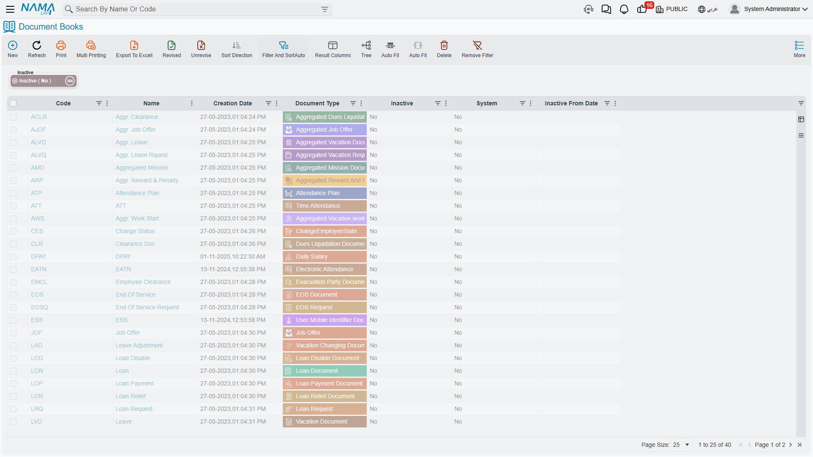
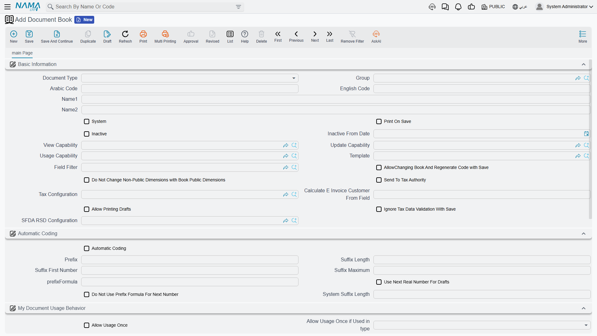

# Document Books

Every document in Nama — every sales invoice, stock issue, receipt voucher, journal entry — has to
belong to a **document book**. The book is not optional: try to save a document without one and the
system stops you with "Book is required".

The reason is simple. A book is the **numbering series** a document draws its number from. When the
accountant in Riyadh saves a sales invoice and it comes out as `SI-RYD-002417`, that number was
handed out by a book called something like "Riyadh Sales Invoices", which knows the prefix, the
current serial and how many digits to pad it to. Open a second book for the Jeddah branch and its
invoices run on their own independent series, starting at 1 again.

That is the core job. Over the years the book has picked up a second job as well: it is a
convenient place to hang a handful of behaviours that should apply to *this stream of documents and
no other* — print automatically on save, allow the document to be used only once as a source, keep
the ledger entry short, pre-fill fields from a template. Those extras are covered further down.

::: info Where to find it
**Basic → Settings → Document Book**. The list shows every book in the system; the **Document Type**
column tells you what each one numbers.
:::

## One book, one document type

The very first field on a book is **Document Type**, and it is the field that decides everything
else. A book for Sales Invoices numbers sales invoices and nothing else. Put that book on a stock
issue and the save fails: *"The document book … is for SalesInvoice and you are using it in
StockIssue."*

Two consequences are worth knowing before you start creating books.

**You cannot change the document type after the first save.** The system refuses with "Can not
change book document type after first save". Pick the type deliberately; if you got it wrong, make a
new book and retire the old one.

**Books only exist for documents.** Master files — customers, items, employees — are rejected with
"Entity type … is master file". Their numbering is done by a **Group** (**Basic → Settings →
Group**), which is the master-file twin of a book: it names the type it codes in **For Type**, it
carries the same **Automatic Coding** block with the same six fields, and it locks the same way —
the type freezes after the first save, and the coding freezes once a committed record uses the
group. Nearly everything this page says about building a number applies there unchanged.

Groups add one thing books do not have: they form a **tree**. A group with no coding of its own
inherits its parent's, so you can define the series once at the top and let sub-groups sit under it.
They also carry a grid of per-criteria coding formulas that can build the code, the alternative code
and both names.

A third mechanism exists for master files as well — the **Files Auto Coding** grid described in
[automatic coding of master files](/platform/fields-and-entities-settings/fields-settings-auto-coding),
which codes by formula without a group.

A book also belongs to a **legal entity**, and unlike most records it may not be left as *Any*. The
only exception is the handful of document types that are genuinely global (they exist above any one
company); for everything else, choosing a real legal entity is enforced at save.

## How a number is built

The **Automatic Coding** group is where the series is described. Six fields do the work.

| Field | What it means |
|---|---|
| Automatic Coding | When on, the system assigns the number. When off, the user types it. |
| Prefix | The fixed text every number starts with, e.g. `SI-RYD-`. |
| Suffix Length | How many digits the serial is padded to. `4` turns 17 into `0017`. |
| Suffix First Number | The number the series starts at. |
| Suffix Maximum | The last number the series is allowed to reach. |
| prefixFormula | Optional extra prefix text calculated per document — see below. |

That last one is worth a word of warning: on the English screen it is labelled with its raw field
name, **prefixFormula**, rather than a readable title. In Arabic it reads **صيغة التكويد**. It is the
same field.

So a book with prefix `SI-RYD-`, suffix length `6` and first number `1` produces `SI-RYD-000001`,
`SI-RYD-000002`, and so on.

The system checks the arithmetic when you save the book. The first number must be smaller than the
maximum; the suffix length must be long enough to hold the maximum (a maximum of `999999` will not
fit in a suffix length of `4`); and the suffix length itself cannot exceed 20.

::: tip A prefix is effectively required
With automatic coding on, the prefix is mandatory. With automatic coding off it is still required by
default — the idea being that a hand-typed number should at least be recognisable as belonging to
this book. If you have a book whose numbers really should stand alone, the global option
**Allow Empty Prefix for Manual Book** on the
[Documents tab](/platform/global-config/global-config-documents) relaxes that.
:::

### Making the series restart each year

**prefixFormula** is the field that turns a flat series into a per-year, per-branch or per-month
one. It is a small template, evaluated against the document being saved, and whatever it produces is
appended to the fixed prefix.

Write a formula that yields the value date's year, and a book with prefix `SI-` starts producing
`SI-2026-000001`. Come January the formula produces `2027`, and here is the important part: **the
serial restarts at 1 for the new prefix**. The system keeps a separate running number for each
distinct value the formula has ever produced. That is how a yearly reset is achieved — not through a
"reset period" setting, but by making the year part of the prefix.

If you want the formula to appear in the number but *not* to split the series — one continuous
sequence with the year merely printed in it — switch on **Do Not Use Prefix Formula For Next
Number**. The number then keeps climbing across the year boundary.

::: warning A formula that returns nothing falls back to one shared series
If the formula produces an empty result for a particular document, that document is numbered from
the book's single default series rather than from a per-prefix one. A formula that only works when,
say, the branch is filled in will quietly mix those documents into the main sequence.
:::

## Drafts and their numbers

A document saved as a draft is not yet a real document, and by default it does not consume a real
number. Nama gives it a provisional code from a separate draft series and marks it — a draft's code
ends in `@draft`. When the draft is finally committed it is renumbered from the real series, and the
provisional number is released.

That keeps the committed series free of gaps caused by drafts that were abandoned. The cost is that
a draft's number is not the number it will end up with, which confuses users who write the draft
number down on a piece of paper.

Two switches change this. **Use Next Real Number For Drafts** on the book makes drafts draw from the
real series straight away, so the number a user sees on the draft is the number the document keeps.
Abandoned drafts then burn real numbers and leave gaps. The same option exists globally on the
[Documents tab](/platform/global-config/global-config-documents); the book-level switch is the
narrower override.

**Allow Printing Drafts** decides whether a document that is still a draft may be printed at all.
Leave it off and users must commit before they can hand anything to a customer.

## When the numbers run out

**Suffix Maximum** is a real limit, and the system handles the end of the series in two steps.

When a document takes the number that *equals* the maximum, the book is automatically switched to
**Prevent Usage** — it stops appearing in the book selector, so nobody can start another document on
it. The document that took the last number saves normally.

If somehow a document would go *past* the maximum, the save fails outright: *"The max suffix of
record … is …, and the record … will exceed that max."*

The fix in both cases is the same: create the next book in the series. You cannot simply raise the
maximum on a book that has already issued numbers, because the auto-coding settings are frozen once
the book is in use — see below.

## What locks once a book is used

Nama protects a book's history fairly aggressively, because changing how numbers are built after the
fact would make the existing numbers meaningless.

- **Document Type** — frozen after the first save of the book itself.
- **Automatic Coding, Prefix, Suffix First Number, Suffix Length** — frozen as soon as *any*
  committed document uses the book. The message is "Can not change auto coding as the record was
  used in documents". Drafts do not lock it; a single committed document does.

**Suffix Maximum** and **prefixFormula** are not part of that frozen set, so they can still be
adjusted on a book that is already in use.

There is one deliberate escape hatch for the number of a single document. **Allow Changing Book And
Regenerate Code with Save** lets a user move an already-saved document to a *different* book and have
it renumbered from the new book's series on save. Without it, changing the book on a saved document
leaves the old number in place. Turn it on only where you actually expect documents to be reassigned
between books, because it means a document's number can change after people have seen it.

## Retiring a book

You rarely delete a book — its documents still reference it. You retire it.

**Inactive** stops the book being used on new documents. Documents already committed on it are
untouched, and a document that was committed before the flag was set can still be edited. Committing
a *new* document on an inactive book fails with "The book … can not be used as it is inactive".

**Inactive From Date** makes the retirement date-aware, and it works against the document's **value
date**, not today's date. Set it to 1 January and back-dated documents with a December value date
still go through, while anything dated January onwards is refused. If you tick Inactive and leave the
date empty, the system stamps today's date for you.

## Who may use a book, and what it pre-fills

Because a book sits on the document from the moment it is created, it is a natural place to control
access and defaults.

**View / Update / Usage Capability** are the standard three capability fields. They decide which
security profiles can see the book, change the book record itself, and select it on a document.
Restricting **Usage Capability** is the normal way to stop the Jeddah team from issuing invoices out
of the Riyadh series. See [security profiles](/platform/security/security-profiles) for how
capabilities are granted.

**Template** points at a Default Values Template. When the book is selected on a new document, the
template's values are applied — so a book can carry a whole set of sensible defaults with it.

**Field Filter** attaches field-level visibility and validation rules that apply to every document
using this book. It is the same mechanism described in
[field filters with criteria](/platform/field-filter-with-criteria). One restriction: the filter you
choose must not be an *automatic* filter — those apply themselves globally and are rejected here.

**Dimensions.** A book carries its own dimensions, and selecting the book copies them onto the
document wherever the document's dimension is still empty or set to the public value. If you would
rather the book never overwrote a dimension the user has already narrowed, tick **Do Not Change
Non-Public Dimensions with Book Public Dimensions**.

## Behaviour the book decides for its documents

These are the extras — small switches that shape how the documents in this stream behave.

**Print On Save** sends the document straight to the printer when it is saved. Common on cash
counters and delivery desks, where a document without a printout is useless.

**Shorten Ledger** merges ledger lines that hit the same account instead of writing one line per
document line, which keeps journal entries readable for documents with hundreds of lines.
**Sort Ledger** orders the resulting entry with debits before credits.

**Revise With Commit** marks the document as revised at the moment it is committed, so it does not
need the separate revision step described in
[revise and unrevise](/platform/revise-and-unrevise).

### Using a document only once

Two groups of settings stop the same document being consumed twice as a source document — the
classic case being a delivery note that must not be invoiced on two different invoices.

**My Document Usage Behavior** looks at documents *created from* this book's documents. Switch on
**Allow Usage Once** and, the moment one of this book's documents is used as the source of another,
it is blocked from being used again. **Allow Usage Once if Used in type** narrows that to a single
target type, and **Allow Usage Once if Used in One Of** to a named list — so a delivery note can be
locked once it is invoiced while still remaining available for a returns document.

**From Document Usage Behavior** is the mirror image, configured on the *consuming* book. Switch on
**Prevent From Doc Of Usage Again** and any document this book's documents are built from is blocked
from further use. **Prevent If from Doc Type is** and **Prevent If from Doc Type is One Of** narrow it
the same way. Leave the type fields empty and the rule applies to every source type.

Both rules can be set on the [document term](/modules/supplychain/document-terms/doc-term-general)
as well, and they are evaluated together — either one is enough to lock the source document.

### Saving as the user types

A book can make a document save itself mid-entry, which is what makes fast counter work possible.

**Auto Save After Input In Fields** takes a comma-separated list of fields; leaving any of them
triggers a save. **Auto Save Behavior** decides what kind of save: *Always Save As Draft*,
*Always Save And Commit*, or *Based On Record Status*. **Focus Field After Auto Save** puts the
cursor where the user needs it next, and **Append Line To Grid After Auto Save** adds a fresh empty
line to a grid so entry can continue without reaching for the mouse.

The three companion fields only work in combination with the trigger field. Fill in a focus field or a
grid field while leaving **Auto Save After Input In Fields** empty and the book refuses to save,
telling you the trigger field is missing.

### Tax authority documents

Where e-invoicing is in play, the book decides whether its documents are reported.

**Send To Tax Authority** switches reporting on for this stream. It can only be set on a document
type that is actually reportable — the system checks and refuses otherwise.
**Tax Configuration** selects the taxpayer configuration to report under,
**Tax Authority Customer Field** names the field the customer is read from when the document does not
have an obvious one, and **Ignore Tax Data Validation With Save** relaxes the tax completeness checks
at save time. **Drug Traceability Configuration (SFDA RSD)** is the equivalent hook for Saudi
drug-track reporting.

## System books

**System** marks a book as belonging to the system rather than to users. System books number
documents that Nama generates internally as children of another document; their codes are built as
the parent's code plus a sequence, and **System Suffix Length** — capped at 3 — controls how many
digits that sequence gets.

A user cannot select a system book on a document they are creating by hand; the save is refused with
"The book … can not be used because it is system book". Leave System off for every book you create
for users.

## Books and document terms

Books and [document terms](/modules/supplychain/document-terms/doc-term-general) are separate records
that both hang off a document, and they are easy to confuse. The split is:

- The **book** decides the *number*, plus the small behaviours above.
- The **term** decides how the document *behaves* — its pricing, accounting effects, generation
  rules, validation.

A term can restrict which books it will work with. Its **Allowed Books** grid lists books explicitly,
and **Allowed Book Criteria** matches them by rule. Fill in either and a mismatched combination is
refused: "The document term … can not be used with the book …". Leave both empty and the term works
with any book of its document type.

## When the book fills itself in

Choosing a book on every document is a click users resent, especially when there is only one book
they could possibly pick.

The global option **If Single Book Is Defined for Entity Use It with New**, on the
[Documents tab](/platform/global-config/global-config-documents), handles that case: when exactly one
book exists for the document type being created, Nama selects it automatically on the new document —
and applies its template and dimensions at the same time. The moment a second book exists for that
type, the automatic selection stops and users are asked again.

By default the search for that single book respects the user's current dimensions, so a user in the
Riyadh branch gets Riyadh's book. The companion option **Do Not Consider Dimensions When Searching For
Single Term Book** turns that off and looks across all dimensions instead.
