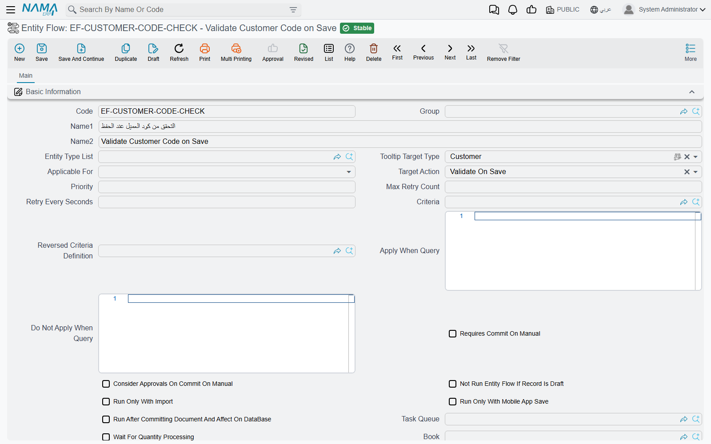

# Why an Entity Flow Did Not Run

"I built the flow, I saved the invoice, and nothing happened." This is the most common Entity Flow call support receives, and in almost every case the flow is fine: one of its own settings told it to stay quiet, or the action the user performed is not the one the flow listens to.

Before a flow runs on a record, the system asks a fixed series of questions about it, in a fixed order. Any "no" and the flow is skipped silently — no message, no log line the user can see. This page walks those questions in the order the system asks them, so you can check them in the same order.

## Step 1 — Is the flow saved, and does it target this record?

**The flow must have been saved (not only saved as a draft).** A flow that has never been saved finally is not loaded at all, whatever its settings say.

**It must point at the record's type.** A flow is offered to a record when the record's type appears in one of three header fields:

- **Target Type** — a single entity type, such as Sales Invoice.
- **Entity Type List** — a saved list of several types (see [Entity Type Lists](/platform/automation-and-rules/entity-type-lists)).
- **Applicable For** — every screen, every master file, or every document.

The system refuses to save a flow with all three empty, so a flow always targets something — but check that it targets the type the user is actually saving. A flow on Sales Invoice does not run on a Sales Return.

::: tip Changes to a flow take effect at once
The system keeps the list of flows in memory, and saving any Entity Flow clears that list. You do not need to restart the server after creating or editing a flow; the next save of the target record uses the new settings.
:::

## Step 2 — Does the line listen to what the user did?

Each line in the flow's details has a **Target Action**: the moment in the record's life when it runs. A line on **Post Commit** runs when the record is saved finally; it does not run on **Save Draft**, on **Revise**, or when the record is opened. The header's **Target Action** is only a default: a line left empty takes the header's value when the flow is saved. The full list of moments is in [Understanding the Record Lifecycle](/platform/entity-flows/introduction-to-entity-flows).

Three timing traps account for most "it did not run" reports:

1. **Saving a record that has not changed sends nothing to the server.** Open an existing invoice, press Save without touching anything, and the screen answers *Can not save as there are no changes*. No save happened, so no flow ran. Change a field, then save, and the **Post Commit** lines run normally.
2. **A draft save is not a final save.** Lines on **Post Commit**, **Validate On Save** and the other save stages run only on a final save. A draft save runs the **Save Draft** lines and nothing more.
3. **A record that goes to approval is not saved finally yet.** When an approval definition catches the save, the **Post Commit** lines wait until the final approval saves the record — then they run.

Two target actions have their own switch:

- **Record View** lines run only when *Enable Record View Entity Flows* is turned on in the global configuration; the system will not even save such a line while the option is off.
- **Manual** lines run only when someone presses the flow's button, and the button exists only once the flow has been added to the screen (Edit Screen → the "Actions and Notifications" table).

## Step 3 — Does the header let it run in this situation?

These header fields stop a flow before any of its lines are looked at. Check them top to bottom:

| Field | Arabic label | What it does to the flow |
|---|---|---|
| **Inactive** | غير نشط | Switches the whole flow off. Saving the flow with this ticked also ticks **Inactive** on every line. |
| **Run In Sites** | تشغيل في | Replication only. When the grid has rows, the flow runs only on the sites listed; on every other site it is not loaded at all. |
| **Do Not Run While Replicating** | عدم التشغيل اثناء الريبليكشن | Replication only. The flow does not run when the record arrives from another site — only when it is saved locally. |
| **Run Only With Import** | يعمل فقط مع الاستيراد | The flow runs only when the record is saved by an import. A user saving from the screen never triggers it. |
| **Run Only With Mobile App Save** | يعمل فقط مع الحفظ من تطبيق الموبايل | The flow runs only when the record is saved from the mobile app. You cannot tick both this and **Run Only With Import**. |
| **Criteria** | المعايير | The record must match these criteria, or the flow is skipped. See [Criteria Definitions](/platform/automation-and-rules/criteria-definitions). |
| **Reversed Criteria Definition** | معيار عدم التفيذ | The opposite: when the record matches these criteria, the flow is skipped. |
| **Legal Entity**, **Sector**, **Branch**, **Department**, **Analysis set** | الشركة، القطاع، الفرع، الإدارة، المجموعة التحليلية | When filled, the record's value must be the same. An empty value on either side — the flow's or the record's — counts as a match. |
| **Book** / **Term** | الدفتر / توجيه المستند | Documents only. When filled, the document must use this book or this توجيه. |
| **Apply When Query** | تطبيق عند التوافق مع الاستعلام | A SQL query run against the record. The flow is skipped when the first column of the first row is **0** or false. |
| **Do Not Apply When Query** | منع التطبيق عند التوافق مع الاستعلام | The opposite: the flow is skipped unless the first value is **0** or false. |
| **Not Run Entity Flow If Record Is Draft** | منع تنفيذ المسارات اليدوية لو كان السجل مسودة | Manual lines only. Pressing the flow's button on a record that has never been saved finally is refused with a message (see below). |

::: warning How the two query fields read a result
Only a first value of **0** (or false) counts as "no". A query that returns **no rows at all**, or returns NULL, counts as "yes". So an **Apply When Query** whose `WHERE` filters everything out does not stop the flow, and a **Do Not Apply When Query** that finds nothing *does* stop it. Write both queries so they always return exactly one row, with 1 for yes and 0 for no:

```sql
select case when exists (select 1 from ... where ...) then 1 else 0 end
```
:::



## Step 4 — Is the line itself switched on?

After the header passes, the flow's lines are checked one by one, in their **Order** column. A line is skipped when:

- its own **Inactive** box is ticked, or
- its own **Criteria**, **Reversed Criteria Definition**, **Apply When Query** or **Do Not Apply When Query** rule it out — the same rules as the header, applied to that line only.

And a line can stop the ones after it: when a line with **Stop With Failure** ticked fails, the remaining lines of that flow do not run.

## Step 5 — Did it run later, in the background?

A flow with **Run After Committing Document And Affect On DataBase** ticked does not run during the save at all. Each of its lines is queued and run afterwards, on the flow's **Task Queue**; with **Wait For Quantity Processing** ticked it also waits for the document's inventory work to finish first. If the queue is busy, or a run failed and is waiting for its next retry, the effect has simply not happened *yet*.

Look on the **Queued Entity Flows** grid of the [Task Queue](/platform/background-processing/task-queues): the queued run is a row there, with its status, how many times it was tried, and the last error. See [Running a Flow in the Background](/platform/entity-flows/introduction-to-entity-flows#Running-a-Flow-in-the-Background).

## In which order do flows run?

When several flows apply to the same moment, flows aimed at the record's own type (through **Target Type** or **Entity Type List**) run first, then flows aimed at all screens, then flows aimed at all documents or all master files. Within each group, flows run in ascending **Priority**; within a flow, lines run in ascending **Order**. If one flow depends on a field another flow fills in, give the filling flow the lower **Priority**.

## When the flow ran and the save failed

Sometimes the flow did run — and failed, which refuses the whole save (a flow running in the background is the exception: its failure does not touch the save). The message names the flow, so the user can tell you which one:

> Error while running entity flow {0} for entity {1} - {2}:-

followed by the line's own error. Fix the cause the line reports, or tick the line's **Inactive** box until you can.

## Messages you may see

| Message | Why | What to do |
|---|---|---|
| *Can not save as there are no changes* — «لا يمكن الحفظ حيث أنه لا توجد أي تغيرات في السجل» | Save was pressed on an existing record with nothing changed. Nothing was saved and no flow ran. | Change a field and save again, or test the flow on a new record. |
| *You can not execute entity flow {0} on the draft record {1}* — «لا تستطيع تنفيذ مسار الكيان {0} علي السجل {1}» | The flow has **Not Run Entity Flow If Record Is Draft** ticked and the record has never been saved finally. | Save the record finally, then press the button again. |
| *Error while running entity flow {0} for entity {1} - {2}:-* — «خطأ أثناء تشغيل مسار الكيان {0} للسجل {1} - {2}:-» | A line of flow {0} failed while saving {1} at moment {2}; the save was refused. | Read the error that follows it; fix the data or the line's parameters. |
| *Error while executing entity flow {0} - line number {1}* | A line raised an error of its own. This message has no Arabic text and appears in English on Arabic screens. | Open line {1} of flow {0} and check its parameters. |
| *Entity flow {0} made the dimension {1} null* — «مسار الكيان {0} جعل المحدد {1} فارغا» | The flow emptied a dimension (such as the branch) that the record had before. | Correct the flow so it keeps or sets the dimension. |
