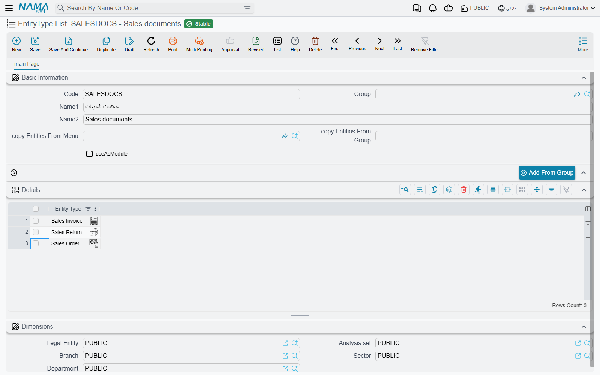

# Entity Type Lists

Settings in Nama ERP are usually written against one screen. A required field belongs to the Sales
Invoice; a security line grants rights on the Employee file; a validator watches Stock Issue. Sooner
or later you want the same setting on *all the sales documents*, or on *the twelve screens the
warehouse team uses*, and repeating it twelve times is both tedious and the thing that drifts.

An **Entity Type List** is the answer: a named list of screens, saved once, that a setting can point
at instead of naming a single screen. You will meet it under a handful of labels — **Entity Type
List**, **Apply Also To**, **For Type List**, **Entity List** — and they all take the same record.
Rename the record's contents and every setting that borrowed it follows.

You will find it under **Administration → Display Customization → EntityType List**.

## The screen

A code, a name, and a grid with one column: **Entity Type**, one row per screen. That is the whole
record — the rest of the screen is there to spare you typing.

| Field | What it does |
|---|---|
| **copy Entities From Menu** and **copy Entities From Group** | A menu and one of its groups. They are not saved as part of the rule; they are the input to the button below. |
| **Add From Group** | Reads that menu group — and the groups under it — and adds every screen it opens to the grid, skipping any already there. |
| **useAsModule** | Turns the list into a filter group named *Module* on the screens described below. |

::: tip Building a list from a menu group, not by hand
**Add From Group** is how a list of "everything in Sales → Documents" gets built in one click: pick
the menu in **copy Entities From Menu**, the group in **copy Entities From Group**, then press the
button. With either box empty it answers *"Please select group and menu"*. You can press it more than
once, with a different group each time, and keep adding to the same list.
:::

The same screen may not be listed twice: save with a repeated row and the grid answers *"Repeated
EntityType"* on the offending line.

::: warning The Use As Module tick shows its field id in English
The checkbox described here as **useAsModule** has no English label of its own, so the English screen
renders the field id itself — `useAsModule`. In Arabic it reads «تستعمل كموديول». It is the last field
in the top group, beside the two copy-from-menu boxes.
:::

## What Use As Module does

Some system screens list records of every kind at once — pending tasks, version history, the
notification inbox, the employee approvals screen. A list of entity types with **useAsModule** ticked
becomes a filter group called **Module** on exactly those screens, with one button per list, so a user
can narrow a mixed list down to "the documents my team cares about" in a click. The list's own name is
the button's name.

The buttons are rebuilt when the list is saved or deleted, so a change reaches the screens at once.
Leave the tick off — the normal case — and the list is only ever a target for other settings.

## Where a list gets used

The label differs from screen to screen, but the intent is always "apply this to more than one
screen". The most common places support meets it:

| Screen | The field |
|---|---|
| [Security profiles](/platform/security/security-profiles) | **Entity Type List** on the permission lines — one line granting the same rights over a family of screens |
| [Approvals](/platform/approvals/approvals-system) | **Apply Also To** — one approval definition covering several document types |
| [Notifications](/platform/notifications/notifications-system) | **Apply Also To**, likewise |
| [Criteria-Based Validation](/platform/criteria-based-validation) | **Apply Also To** — one validator over a whole family, alongside or instead of Target Type |
| [Required Fields](/platform/required-fields) | The target-entities column, making one rule cover several screens |
| [Screen Modifier](/platform/screen-modifier/) | **For Type List** — one layout change across a set of screens |
| [Fields and Entities Settings](/platform/fields-and-entities-settings/) | The entity-list column on most of its grids — field appearance, disabled fields, automatic coding and the rest |
| [Custom list views](/platform/list-views/) | **For Type List**, so one saved view serves several screens |
| [Entity Flows](/platform/entity-flows/) | The entity-type list a flow runs on |

## See also

- [Criteria Definitions](/platform/criteria-definitions) — the other shared building block: a saved filter, rather than a saved set of screens
- [The Menu](/platform/menus/) — where the menu and the groups that **Add From Group** reads come from
