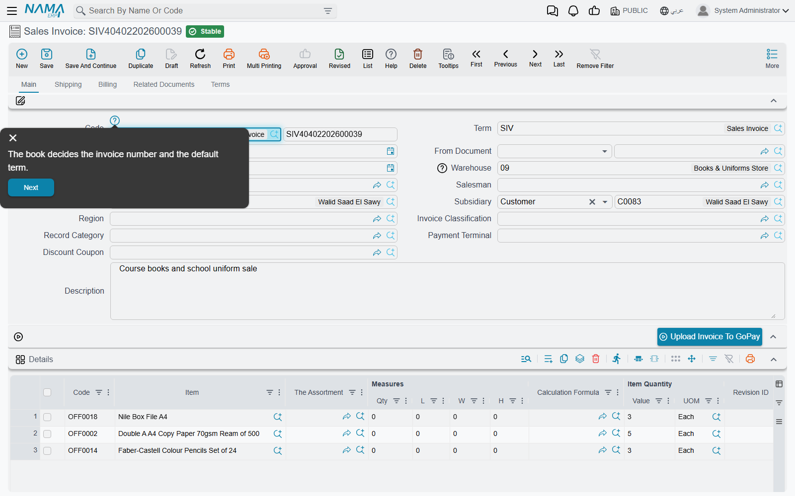
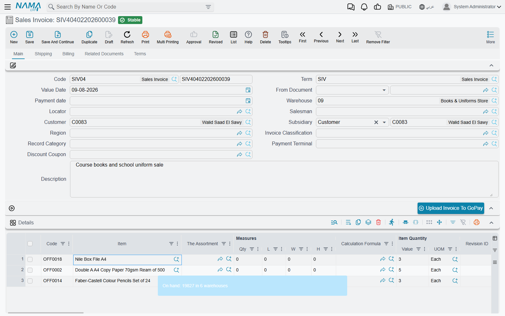
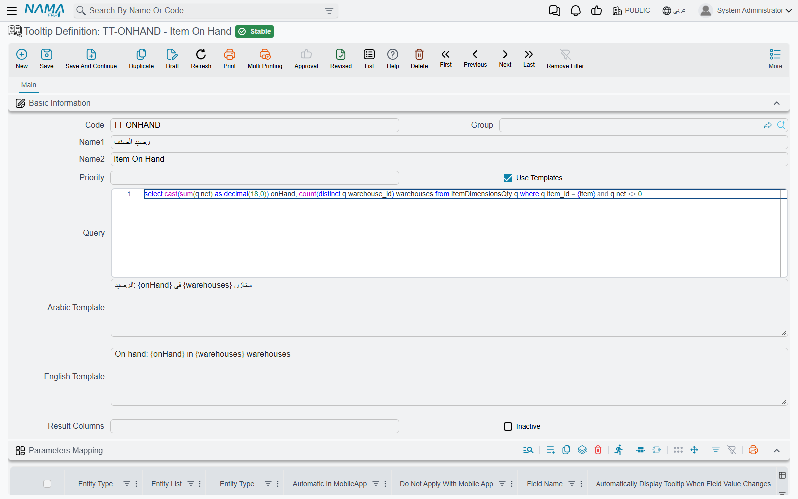

# Field Help and Tooltips

A new storekeeper stares at a box called **Check Overdraft By Date** and has no idea whether to tick it. A
salesman about to add an item to an invoice would like to know how many are in stock before he
promises them to the customer. Both need information at the moment their cursor is in the field, and
Nama has a screen for each:

- **Entity Help** holds *fixed text*: an explanation your implementation writes once for a field, or
  for a message, and every user can read.
- **Tooltip Definition** holds *a live answer*: a query that runs against the database when the user
  asks, using the values on the screen, and shows the result.

## Entity Help — explanations written once

**Administration → Other → Entity Help**

An Entity Help record has two grids of explanations and one grid that says who sees them.

### Fields Help

Each line attaches a piece of help to one field:

| Column | What to put in it |
|---|---|
| **For Type** | The screen the field is on. |
| **For Type List** | A saved list of screens, when the same explanation fits the same field on several of them. A line needs one of the two — a line with neither is shown on no screen. |
| **On Field** | The field. Once the type is chosen, the column suggests the fields that screen has. |
| **Arabic Help** / **English Help** | The explanation in each language. If only one is written, users of both languages see that one. |
| **Content Type** | How the text is displayed: **Text**, **HTML** or **Markdown**. Markdown is the easiest way to get headings, bold text and bullet lists. |

The help stays out of the way until a user asks for it. On any edit screen, the **Help** button on the
toolbar — or **Ctrl + Alt + H** — puts a small help icon beside every field that has an explanation,
including column headers in grids. Clicking an icon opens the text, with **Previous** and **Next**
buttons that walk through the other helped fields on the screen in order. That makes a set of field
helps double as a guided tour of a screen for a new employee. Press **Help** again to hide the icons.

### Error Messages Help

The second grid attaches an explanation to a *message* instead of a field, so the user who meets a
refusal can press **Show Help Messages** on the message panel and read what your team wrote about it.
It is matched on the message's exact English text with its placeholders — see
[Writing your own explanation for a message](/platform/documents-and-records/messages-and-refusals#Writing-your-own-explanation-for-a-message),
which covers this grid in full.

### Who sees it — Applicable For

Leave **Applicable For** empty and the help is for everyone. Add lines — a **User**, a **Security
Profile** or a user **Group** — and only the people they name see it. This is how one installation
keeps a detailed explanation for trainees without cluttering the screen for the experienced staff:
write two Entity Help records for the same field and give each its own audience.

### Help that ships with Nama

Namasoft maintains a library of help of its own. An administrator downloads it with **Read System
Entity Helps** (on the Entity Help screen, and in the More menu of its list); the server needs
internet access, and only `admin` or a user treated as admin can run it. The downloaded records arrive with **System** ticked, which has two consequences:

- They cannot be edited, and a record cannot be switched to or from System by hand. Write your own
  record alongside instead.
- They apply to everyone, so they cannot carry Applicable For lines. A user who should not see them is
  opted out with **Do Not Display System Help Messages**, on the user or on the security profile —
  which leaves your own help untouched.

## Tooltip Definition — answers computed on demand

**Administration → Display Customization → Tooltip Definition**

A tooltip is a small query that runs when a user presses **F9** on a field and shows its answer in a
pop-up note. The classic one sits on the item field of a sales document: the salesman picks the item,
presses F9, and reads the quantity on hand per warehouse without leaving the invoice. Another sits on
the customer field and shows the open balance and the last payment date.

Where the note appears, and whether it fades or stays pinned, is set for the whole company in
[Global Configuration → Appearance](/platform/global-config/global-config-appearance#Tooltips).

### Building one

A tooltip has three parts: the question, where it is asked from, and how the answer is worded.

**1. The query.** The **Query** field holds the SQL. Wherever the query needs a value from the screen,
write a parameter name in braces — `{item}`, `{customer}`. The parameter's name is yours to choose; the
next step says which field fills it.

**2. Where it is asked from — Parameters Mapping.** Each line of this grid attaches the tooltip to one
field:

| Column | What it does |
|---|---|
| **Entity Type** / **Entity List** | The screen, or list of screens, the tooltip is offered on. Leave both empty to offer it on every screen that has the field. |
| **Field Name** | The field the user presses F9 on. |
| The numbered **Parameter** / **Field** pairs (1 to 9) | Each pair fills one query parameter from a field on the screen: **Parameter** is the name you wrote in braces, **Field** is where its value comes from. The field does not have to be the one the user is on — the item tooltip can also pass the warehouse. |
| **Automatically Display Tooltip When Field Value Changes** | Shows the note by itself as soon as the field's value changes, without waiting for F9. Use it sparingly; a note that pops up on every keystroke is quickly ignored. |
| **Do Not Run In Edit View** | Keeps the tooltip off the edit screen. Normally combined with one of the next two. |
| **Run In List View** / **Run In Searcher** | Also offers it in the list of records and in the search picker, where F9 runs it for the focused row. Off by default. |
| **Automatic In MobileApp** / **Do Not Apply With Mobile App** | The same choice for the mobile app: show it automatically there, or not at all. |

One tooltip can carry several lines, so the same stock query can be attached to the item field on the
sales invoice, the sales order and the quotation at once.

**3. How the answer is worded — the templates.** Keep **Use Templates** ticked and write the answer in
**Arabic Template** and **English Template**; each user sees the one in their own language. The
templates are [Tempo](/admin/tempo) templates in query-result mode: `{onHand}` is the `onHand` column
of the first row, the loop syntax walks through every row, and a parameter name in braces prints the
value that was passed in. **Result Columns** is optional: a comma-separated list that renames the
query's columns by position, for when the SQL's own column names are awkward to use.

Then save. Users pick up a new or changed tooltip the next time they load Nama in their browser, so ask
them to refresh the page. **Inactive** switches a tooltip off without deleting it.

### When several tooltips share a field

A field can have more than one tooltip, but F9 shows one answer. The system tries them in order and
shows the first one the user is allowed to see:

1. Tooltips attached to this particular screen come before tooltips attached to no screen.
2. Within each group, a higher **Priority** comes first.

The **Apply To** grid decides who is allowed. Each line names a **Security Profile**, **User**,
**Employee** or user **Group**, and marks it **Allow** or **Prevent**. With the grid empty, everyone
sees the tooltip. Otherwise:

- A line naming the user, or the user's employee, outweighs any number of group and profile lines. So
  "Prevent the Sales profile, Allow Ahmed" lets Ahmed see it and nobody else.
- If the matching **Prevent** lines outweigh the matching **Allow** lines, the user is skipped.
- If the grid has **Allow** lines and none of them matches the user, the user is skipped as well — an
  Allow line turns the tooltip into an invitation-only one.

A skipped user is not shown nothing: the system moves on to the next tooltip on the field. That makes
it possible to give managers a detailed tooltip and everyone else a simple one on the same field —
the managers' version with the higher priority and an Allow line, the general one with no Apply To.

### Finding the tooltips on a screen

Users rarely remember which fields have tooltips. The **Tooltips** button on the toolbar lists them for
the screen in front of you; clicking one moves to that field and runs it. The button only appears where
at least one tooltip is defined.

## Messages you may see

| Message | Why | What to do |
|---|---|---|
| *System helps are applicable for all, Please empty applicable for lines* — «المساعدات النظاميه يجب ان تكون مطبقه للجميع, برجاء حذف سطور يطبق علي» | An Entity Help record marked **System** was given Applicable For lines. | Remove the lines. To limit who sees shipped help, use **Do Not Display System Help Messages** on the user or profile. |
| *cannot edit in system entity help* | Someone tried to edit an Entity Help record downloaded from Namasoft, or to tick or untick **System**. There is no Arabic text, so it appears in English on Arabic screens too. | Leave the shipped record as it is and write your own Entity Help record. |
