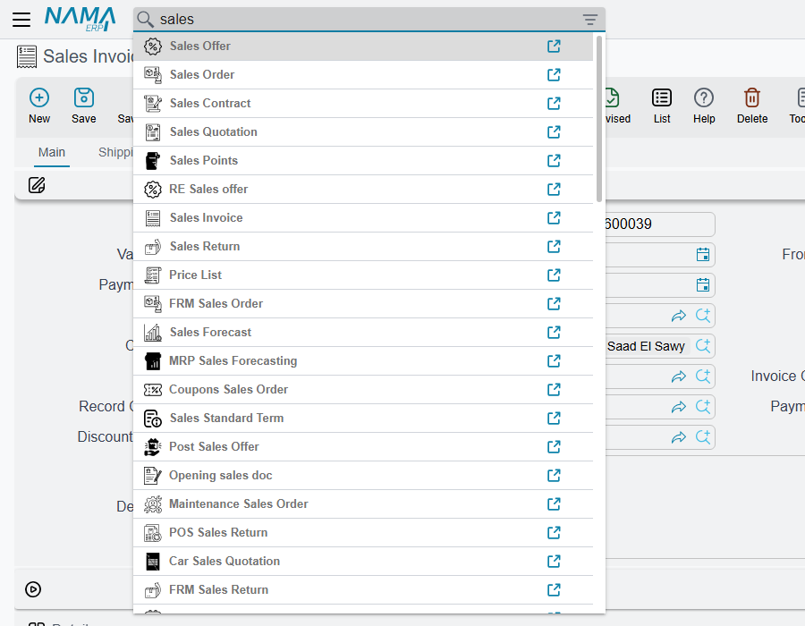
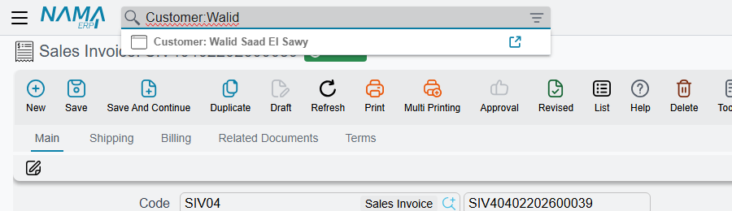
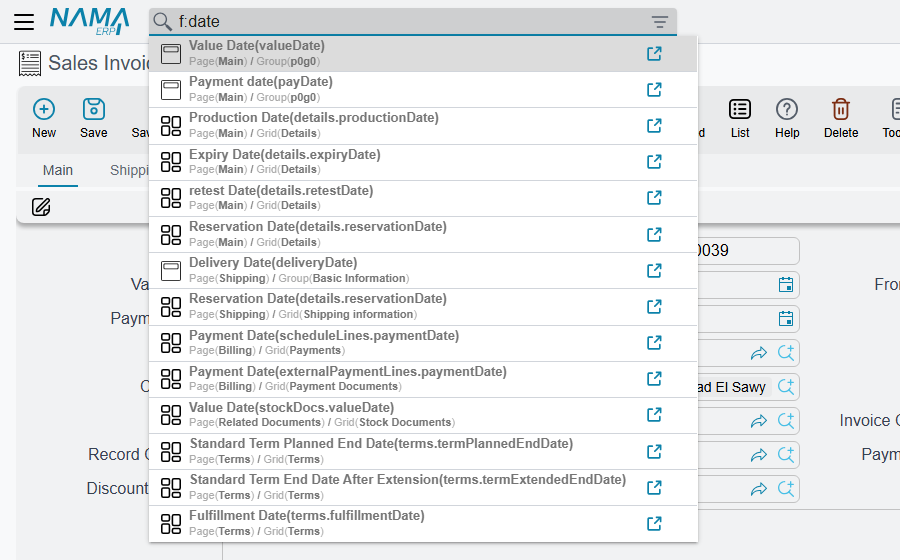

# Searching From the Top Bar

Nama has two search boxes that are always within reach. The one in the **side menu** finds menu
entries; the one in the **top bar** finds almost everything else — a screen, a record, or a field on
the screen you have open. Most "I can't find it" tickets come down to how the top-bar box decides
which of those three you meant, so that is what this page explains.

| Box | Key | Finds |
|---|---|---|
| Top bar — *Search By Name Or Code* | **Ctrl + K** | Screens, records, and fields on the open screen |
| Side menu | **Ctrl + U** | Menu entries — see [Finding an entry without hunting for it](/platform/menus/menu-structure#Finding-an-entry-without-hunting-for-it) |

Both keys are the out-of-the-box defaults and can be changed — see
[Keyboard Shortcuts](/platform/everyday-tools/shortcuts#Global-Shortcuts).

## Screens first, records second

Type into the top bar and the box first compares what you typed with the **names of screens** — the
Arabic name, the English name, their plurals and the screen's internal name all at once. If any screen
matches, the list shows **only screens**, and picking one opens that screen's list of records.

Only when **no screen name matches** does the box go to the server and look for **records**. That is
the behaviour to remember, because it explains the classic complaint: a user types part of a customer's
name, and the box offers *Sales Invoice*, *Sales Order* and *Sales Return* instead of the customer —
because the name happened to contain "sales". The fix is to tell the box which kind of record you want
(next section).

The screen matching forgives the usual typing slips: أ, إ, آ and ا are treated alike, as are ة and ه, and
ى and ي; and text typed with the keyboard in the wrong language is tried both ways, so `ب` typed for
`f` still finds the screen.

When records are searched, the box:

- matches the text anywhere in the record's **code**, **alternative code**, **Arabic name** or
  **English name**;
- treats a space as "anything in between", so `ahmed ali` finds *Ahmed Mohamed Ali* — but the words
  must still appear in the order typed;
- shows up to 50 records, each labelled with its screen name — *Customer: C-0192 Ahmed Ali*;
- if nothing matches at all, tries once more against the extra codes records are known by;
- accepts a record's internal ID pasted in whole, and goes straight to that record.

## Naming the kind of record — Search In

To skip the screen matching and search records of one kind only, click the filter icon at the right
end of the box and choose a type under **Search In**. The box's label changes to *Search In
Customers* (or whichever type you picked) and every search now goes straight to records of that type.
A small red star on the icon reminds you that a filter is set; clear the choice to go back to normal.

The same thing can be typed, which is quicker once you know it: put the type before a colon —
`Customer:Ahmed`, or in Arabic `عميل:أحمد`. The part before the colon is matched against the
screen's English, Arabic and internal names. An exact match picks that one type; a partial one
searches every type whose name contains it. Either way, only types the user is allowed to open as a
list are searched.

## Jumping to a field — the `f:` prefix

On a long edit screen with a dozen tabs, finding the one field you need is its own kind of search.
Start the text with `f:` (or `p:`) and the box searches the **open screen** instead: its fields, grid
columns and action buttons, by label. Each result shows where it lives — the tab and the group or
grid — and picking it moves the cursor there, switching tab if it has to. On an Arabic keyboard the
same keys produce `ح:` and `ب:`, and those work too.

`f:due` on a sales invoice lists every field with "due" in its label, wherever it sits on the screen.

## Opening what you found

**Enter**, or a click, opens the highlighted result in the current tab. The link icon at the end of
each result opens it in a new browser tab, and so does **Ctrl + click** or **Alt + click**. The arrow
keys move through the results, and **Escape** closes the list.

## Utility pages for administrators

For `admin`, and for users treated as admin, the screen list also contains five pages that are not
entities: **Utilities**, **View Users**, **Monitor Tasks**, **SQL Runner** and **View Web Socket
Sessions**. Typing `utils` lists them all. Other users never see them in the box.

## What configures it

On a large database, a search that is not limited to one type has to look through every record in the
system. Two options on the **Performance** tab of Global Configuration control that — see
[Search behaviour](/platform/global-config/global-config-performance#Search-behaviour):

- **Must Select Entity in Search In Before Search on Server** stops the box from searching records at
  all until a type is chosen under **Search In** — typing the type with a colon is not enough while it
  is on. Screens and the `f:` field search keep working, because they never reach the server.
- It only takes effect together with **Show Search In for Top Panel**; the Search In filter icon itself
  is always on the box.

Which records a user can then open is decided as everywhere else, by their security profile.
