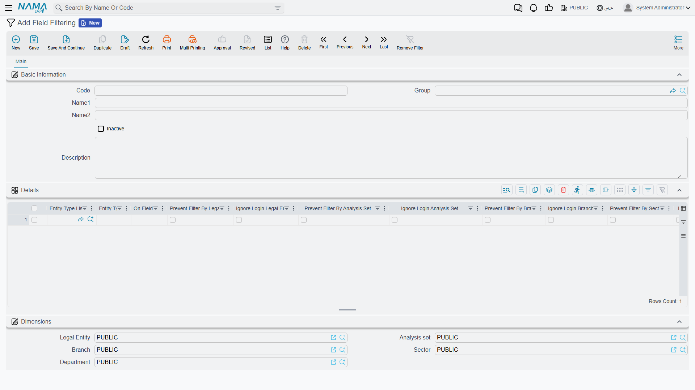

# Field Filtering by Dimension

A storekeeper logged into the Riyadh branch opens a stock transfer, clicks the warehouse lookup, and finds only Riyadh's warehouses. The Jeddah warehouse they need to send goods to is not there, and they call support saying the warehouse "disappeared".

Nothing disappeared. Every lookup in Nama is narrowed by dimensions — legal entity, branch, sector, department and analysis set — and on most fields that is exactly what you want. The **Field Filtering** screen is where you loosen that narrowing for one field on one screen, without touching the user's security or anyone else's lookups.

## What a lookup offers out of the box

When a user searches in a reference field on a document, the records offered are narrowed on each of the five [dimensions](/platform/shared-master-files/dimensions-and-composite-dimensions):

1. **By the document's own dimensions.** If the document you are editing carries the Jeddah branch, the lookup searches as if you were in Jeddah — even though your session is logged into Riyadh.
2. **By what the user is allowed to reach.** The search can never go beyond the dimensions the user may log into.

A record whose dimension is **PUBLIC** passes on that dimension everywhere, and a few master files are treated as global and are never narrowed at all. A dimension that the [Global Configuration](/platform/global-config/global-config-dimensions) does not use for access control is not narrowed either — there is nothing for this screen to loosen on it.

## The screen

Open **Administration → Display Customization → Field Filtering**. A record is a code, a name, an **Inactive** switch and a **Details** grid; each grid line picks one field on one screen and says how that field's lookup should treat each dimension.

| Column | What it does |
|---|---|
| **Entity Type** | The screen the field belongs to — Stock Transfer, Sales Invoice. |
| **Entity Type List** | A saved [list of screens](/platform/automation-and-rules/entity-type-lists), for when the same field should behave the same way on several documents. Fill this, the Entity Type, or both. |
| **On Field** | The reference field whose lookup you are changing, such as `warehouse` for a document's header warehouse or `details.specificDimensions.warehouse` for the warehouse on its lines. Name the lookup field itself, not the code or name that is filled from it. |
| **Prevent Filter By LegalEntity** / **Branch** / **Sector** / **Department** / **Analysis Set** | Stop taking this dimension from the document. |
| **Ignore Login Legal Entity** / **Branch** / **Sector** / **Department** / **Analysis Set** | Stop narrowing by this dimension at all. |

The grid is wide: scroll right to reach the sector and department columns.

## The two switches, and which one you want

Each dimension has two switches, and they answer two different complaints.

**Prevent Filter By …** takes away step 1 above for that dimension. The lookup stops copying the dimension from the document and falls back to the one the user is logged into. Use it when the document's dimension is narrower than it should be for this field — a document raised for a sub-branch whose lookup should still offer everything the user's own branch offers. It never widens the search beyond the user's session.

**Ignore Login …** removes the dimension from the search altogether. The lookup searches as if the dimension were PUBLIC and skips the check against what the user may reach, so it offers records of **every** branch (or sector, or legal entity). This is the switch for the Riyadh storekeeper: tick **Ignore Login Branch** on the transfer's destination warehouse, and Jeddah appears.

When both are ticked for the same dimension, Ignore Login wins.

::: warning Ignore Login reaches past the user's own restrictions
A user limited to one branch will, in this one field, see records from branches they cannot otherwise open. That is usually the point — a transfer has to name the warehouse it is going to — but it is a deliberate hole in the branch restriction, so keep it to the fields that need it.
:::

## Worked example: transfers to any branch's warehouse

The Riyadh branch sends stock to Jeddah with a stock transfer. The source warehouse must stay limited to Riyadh; the destination must offer every branch.

1. Open **Field Filtering** and add a record, say `TRANSFER-ANY-BRANCH`.
2. Add a line: **Entity Type** = Stock Transfer, **On Field** = `toWarehouse` (the header **to Warehouse** field), tick **Ignore Login Branch**.
3. Save. The next time a Riyadh user opens the destination warehouse lookup, Jeddah's warehouses are offered; the source warehouse lookup still shows Riyadh only, because it has no line.

Saving takes effect straight away — no restart, and users do not need to log in again.

::: tip Picking the record is not the same as saving it
This screen changes only what the lookup *offers*. When the document is saved, the separate dimension consistency check still compares the picked record with the document, and depending on the [consistency levels in the Global Configuration](/platform/global-config/global-config-dimensions) it may refuse or warn. If the save is refused after the user successfully picked the record, switch that check off on the same field with **Ignore Dimensions Consistency for Fields** in [Fields and Entities Settings](/platform/fields-and-entities-settings/fields-settings-relaxing-restrictions).
:::

## Things worth knowing

- **One line per screen and field.** Keep a single line for each screen-and-field pair across all Field Filtering records. If two active lines cover the same pair, only one of them is used, and you cannot choose which.
- **A line names the screen or a list of screens.** Saving a line with neither is refused with:
  *You must enter either entityType or entityTypeList* — «يجب عليك إدخال إما النوع أو قائمة الأنواع»
- **Inactive switches off the whole record.** Ticking **Inactive** in the header stops every line in it, which is the quickest way to test whether a record is the cause of an odd lookup.
- **It changes lookups, nothing else.** List views, reports and which records a user may open are unaffected. To narrow a lookup by a *condition* instead — only non-service items, only this supplier's items — use [Field Filter with Criteria](/platform/field-filtering/field-filter-with-criteria).
- **Report prompts have their own switch.** A record picker on a report's parameters form is not a document field; the report design relaxes it with the `ignoreLogin…` parameter properties described in the [reports guide](/platform/reports/reports-guide).
