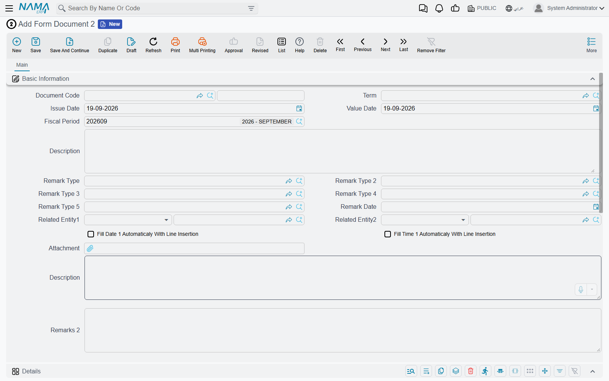
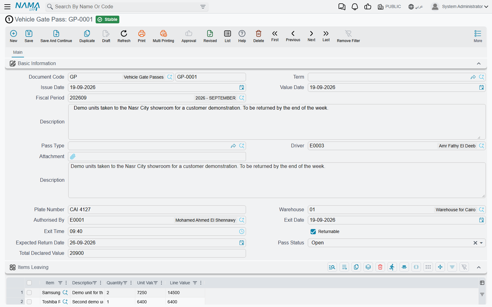
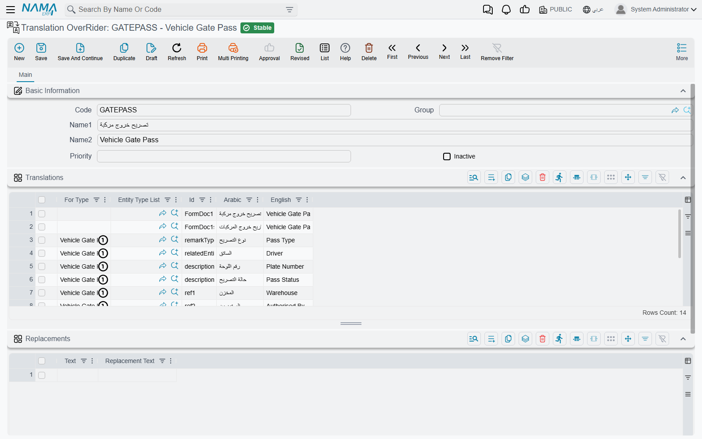
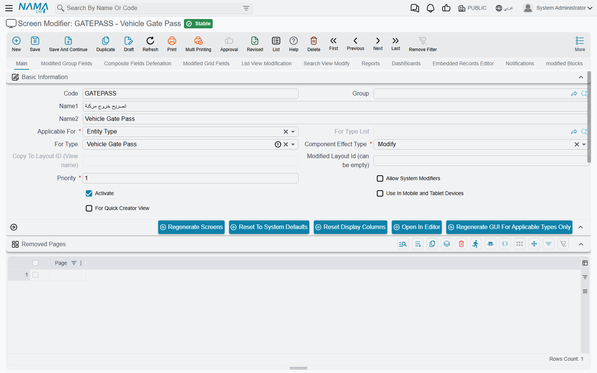
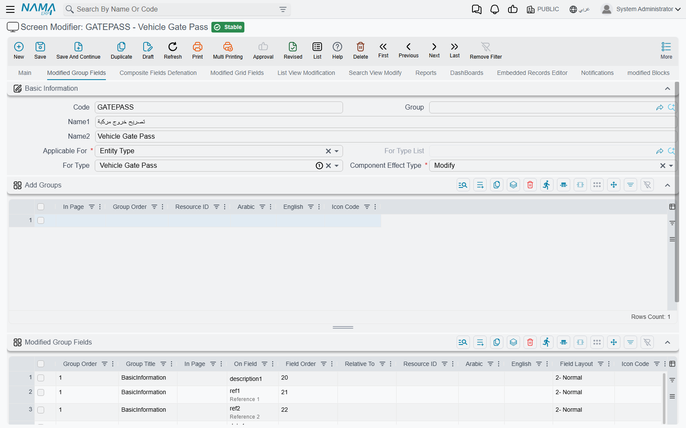
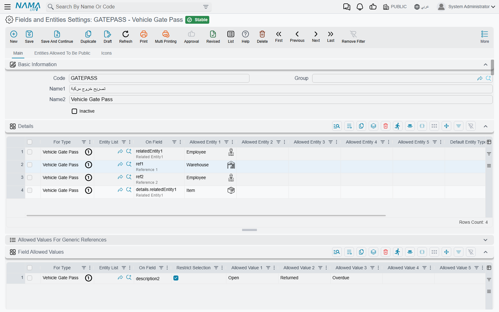
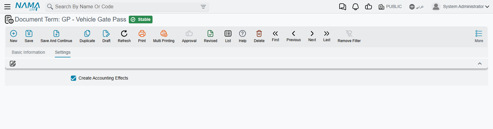

# Form Documents — the Escape Hatch

Every so often a customer asks for a document that exists nowhere else in the world. A quarry
wants a *weighbridge exit permit* with the driver's name, the plate number and a photo of the
load. A clinic wants a *consent form* that a nurse fills in and a doctor signs off. A contractor
wants a *site visit report* with five observations, each with a date and a photograph.

None of these is a sales invoice or a stock issue in disguise. Each one needs four or five fields,
one small calculation and a printout — and each one is, as far as anyone can tell, unique to that
customer. Building a purpose-designed screen for it would add a document type to the product that
nobody else will ever open.

**Form documents** are the answer. Nama ships sixteen of them — Form Document 1 through Form
Document 16 — and they are deliberately, almost aggressively, empty. Each one is a real document
in every structural sense (it has a book, a code, dates, dimensions, approvals, a print form,
drafts, cancellation) but it carries no business meaning at all. Behind the screen sits a large
set of unnamed, unused fields: fifty numbers, thirty texts, twenty dates, twenty switches, twenty
reference fields, twenty grids. Support staff give those fields names, put the ones they need on
the screen, wire up a calculation or two, and the customer opens a document called *Vehicle Gate
Pass* that behaves exactly as they asked.

::: warning Talk to the development team first — every time
A form document is the right answer to a genuinely one-off requirement. It is the **wrong** answer
to a feature Nama has not built yet.

The two look identical from a support desk. "The customer wants to record equipment handovers to
technicians" might be an obscure local practice — or it might be a gap that three other customers
have also hit, in which case it belongs in the product and everyone benefits. Once you have built
it as a form document, that signal is lost: the requirement never reaches the roadmap, and the
customer is left with a configuration that only you understand.

So the rule is: **raise the request with development first.** Development decides whether it is
"specific to this customer" — and when it is, they will help you shape the form document. When it
is not, you get a real feature instead, which is a much better outcome for everybody.
:::

## The sixteen forms, and what they cost

The forms are licensed in pairs, so a customer buys them two at a time:

| Forms | Licence code |
| --- | --- |
| Form Document 1, 2 | `basic-forms-1-2` |
| Form Document 3, 4 | `basic-forms-3-4` |
| Form Document 5, 6 | `basic-forms-5-6` |
| Form Document 7, 8 | `basic-forms-7-8` |
| Form Document 9, 10 | `basic-forms-9-10` |
| Form Document 11, 12 | `basic-forms-11-12` |
| Form Document 13, 14 | `basic-forms-13-14` |
| Form Document 15, 16 | `basic-forms-15-16` |

You cannot buy Form Document 3 on its own — the pair comes together. In practice most sites use
one or two; the forms with the lowest numbers are by far the most used, simply because that is
where people start.

They all live in the same place on the menu:

> **Basic → Remarks → Form Document 1**

::: tip Use them in order, and write down what each one is for
Nothing stops you from making Form Document 7 the gate pass and Form Document 2 the consent form.
But six months later, the only way anyone will know which is which is the name you gave it. Start
at 1, work upwards, and keep a note — the customer's own documentation, a remark on the record, a
line in the handover file — of which form carries which purpose.
:::

## What is on the screen, and what is behind it

Open a fresh form document and you will find surprisingly little:



That is the whole screen. The document header (book, code, term, issue and value date, fiscal
period), five levels of classification, a remark date, two general-purpose links, two switches
that stamp today's date and the current time onto a new line, one attachment, two description
boxes, one grid with a dozen generic columns, and the usual dimensions block at the bottom.

The emptiness is the point. Behind that screen the document already holds far more than it shows:

| What you get | How much |
| --- | --- |
| Numbers | 50 — `n1` … `n50` |
| Single-line texts | 30 — `description1` … `description30` |
| Long text boxes | 5 — the Description box plus `remarks2` … `remarks5` |
| Dates | 20 — `date1` … `date5`, then `d6` … `d20` |
| Times | 7 — `time1` … `time5`, plus a From Time and a To Time |
| Yes/no switches | 20 — `b1` … `b20` |
| Reference fields | 20 — `ref1` … `ref20`, plus Related Entity 1 and 2 |
| Attachments | 11 — one main attachment plus `attachment1` … `attachment10` |
| Classification levels | 5 — Remark Type through Remark Type 5 |
| Grids | 20 — `details`, `details2` … `details20` |

and every one of those twenty grids has the same generous set of columns on each line: five
references, ten more reference fields, thirty texts, five long texts, fifty numbers, five dates,
five times, five switches and five attachments.

Only the first grid, and only twelve of its columns, are on the screen by default. **Everything
else has to be put there deliberately**, which is what the rest of this page is about.

## Building one — a worked example

The example we will build is a **Vehicle Gate Pass**: a permit that records who drove what out of
which warehouse, when it is expected back, and what it was worth. It is exactly the kind of
request that is real, small, and specific to one customer.

Here is the finished article, so you know where we are going:



Nothing about that screen was programmed. It is Form Document 1, with six configuration records
behind it.

### 1. Decide the shape before you touch anything

Write down the fields first, on paper, and map each to a spare field. Spend the five minutes — a
field you assign badly is very painful to move once the customer has a thousand records in it.

| What the customer calls it | Field we will use |
| --- | --- |
| Driver | Related Entity 1 |
| Plate Number | `description1` |
| Warehouse | `ref1` |
| Authorised By | `ref2` |
| Exit Date / Exit Time | `date1` / `time1` |
| Expected Return Date | `d6` |
| Returnable | `b1` |
| Pass Status | `description2` |
| Total Declared Value | `n1` |
| Item / Description / Quantity / Unit Value / Line Value | grid 1: `relatedEntity1`, `text1`, `number1`, `number2`, `number3` |

Two habits worth adopting. Use the **lowest free number in each family** rather than scattering
fields across the range — it keeps reports and exports readable. And leave a gap where the
customer is obviously going to ask for more: if there are three amounts today there will be five
next year.

### 2. Rename the document and its fields

A **Translation Overrider** (Basic → Settings → Translation OverRider) turns
`Form Document 1` into `Vehicle Gate Pass` everywhere it appears — the menu, the screen title, the
list, reports, notifications.



Two kinds of line do the work:

- **Renaming the document itself.** Leave *For Type* empty and put the form's own id in the **Id**
  column — `FormDoc1` for the singular, `FormDoc1s` for the plural that list screens and menus
  use. Do both; a screen titled *Vehicle Gate Pass* whose list is still headed *Form Document 1s*
  looks unfinished.
- **Renaming a field.** Set *For Type* to the form (`Vehicle Gate Pass` once the first line has
  taken effect) and put the field's id in the **Id** column — `n1`, `description1`, `ref1`. For a
  grid column, use the grid and the column together: `details.text1`, `details.number1`.

Fill in **both** the Arabic and the English column, even if the customer only ever works in one
language. Reports, exports and the other language's screens all read the column you left blank.

::: tip The change needs a reload
Translations are cached. Press **Reload Translations** on the overrider record after saving, then
refresh the browser. If a label is still the old one, that is almost always why.
:::

### 3. Put the fields you need on the screen

The fields exist but are invisible. A **Screen Modifier** (Administration → Display Customization
→ Screen Modifier) is what surfaces them. Point it at the form, leave it on *Modify*, and tick
**Activate**:



Then, on the **Modified Group Fields** tab, one line per field you want to see:



Each line names the group to add the field to (the form's only header group is `BasicInformation`),
the field id, and the order it should appear in. The **Modified Grid Fields** tab does the same
for grid columns, and is also where you set each column's width.

While you are there, use **Removed Fields** to hide everything the customer will not use — the
four unused classification levels, the second related entity, the auto-stamp switches, the grid
columns you left empty. A form document that shows fifteen relevant fields reads like a designed
screen. One that shows fifteen relevant fields and twenty blank ones reads like a workaround.

::: warning Three things that catch people out here
**Group Order is mandatory.** A Modified Group Fields line without it refuses to save, and the
message names the row rather than the field — the form's single header group is order `1`.

**Renaming a grid *column*** can be done either here (the Arabic/English columns on the Modified
Grid Fields line) or in the Translation Overrider with `details.text1`. Both work; pick one and be
consistent, because two records renaming the same thing is a puzzle for whoever comes next.

**Renaming the grid *itself*** — the "Details" heading above the table — is neither of those. It
lives on the **modified Blocks** tab: one line naming the page (`main`), the block (`details`), an
effect type of *Modify*, and the Arabic and English titles you want.
:::

Changes do not appear until the screen is rebuilt. The **Regenerate GUI For Applicable Types Only**
button on the modifier does exactly that, and is much faster than regenerating everything.

### 4. Teach the fields what they are allowed to hold

The reference fields are deliberately open — `ref1` will accept a customer, a warehouse, an item
or anything else, which is useless on a real screen. **Fields and Entities Settings**
(Basic → Settings → Fields and Entities Settings) closes them down:



The **Details** grid restricts a generic reference: one line per field, naming the form, the field
id, and up to five entity types it may point at. With a single allowed type the field stops being
a two-part "pick a type, then pick a record" control and starts behaving like an ordinary lookup —
which is what makes *Warehouse* on the gate pass feel native.

The **Field Allowed Values** grid is the quieter trick, and the one most worth knowing: give it a
text field and a list of values, tick *Restrict Selection*, and a plain text box becomes a
drop-down. That is how *Pass Status* offers Open / Returned / Overdue and nothing else — no
master file, no development, no way for anyone to type "opne".

::: tip Allowed values are looked up in the dictionary
The values are stored exactly as you type them, but the screen runs them through Nama's normal
translation lookup on the way out. A value that happens to match a word Nama already knows will
appear translated on the other language's screen — we typed `Open` and the Arabic screen shows
`مفتوحة`. Check both languages before you hand the screen over.
:::

There is a third grid on that screen, **Disabled Fields**, for a field the user should see but not
type into — useful for anything a calculation fills in.

### 5. Calculate

Form documents do no arithmetic of their own. An **Entity Flow** targeting the form, with a
*Fields Values Calculator* action, is what fills in a derived field. Two lines cover the gate pass
— the first multiplies out each line, the second totals them onto the header:

```
details.number3=sql(select isnull(try_cast({details.number1} as decimal(20,6)),0)
                         * isnull(try_cast({details.number2} as decimal(20,6)),0))
```

```
n1=totalize(details,details.number3)
```

Run both on **Pre Update Calculated Fields**, in that order, so the totals see the line values that
were just written.

::: warning Guard every number you multiply
Writing `{details.number1}*{details.number2}` reads perfectly and works right up until somebody
adds a line and leaves a cell blank — at which point the whole save fails with a technical error
that says nothing about the flow. An empty numeric cell arrives as an untyped blank, and the
database refuses to multiply it.

Wrapping each value in `isnull(try_cast(… as decimal(20,6)),0)`, as above, costs nothing and makes
the calculation immune to it. Do it from the start, not after the first support call.
:::

Keep the logic small. A form document that needs five flows and a Groovy action is no longer a
one-off form — it is a feature, and it is time to go back to the development team.

### 6. Validate

**Criteria-Based Validation** supplies the rules the document has none of. A single line, with a
query that returns `1` when the record is acceptable and `0` when it is not, plus the message the
user should see:

```sql
select case when {d6} is not null and {d6} < {date1} then 0 else 1 end
```

> The expected return date cannot be earlier than the exit date

Tick *With Insert*, *With Update* and *With Draft* so the rule applies whenever the record is
written. The [Criteria-Based Validation](/platform/criteria-based-validation.md) page covers the
query language, the `{field}` placeholders and how to put a clickable link to the offending record
into the message.

### 7. Give it a document book

This is the step people forget, because the form document does not look like it needs one.

It does. A form document is a real document, so it needs a **Document Book** to give it a number,
and it must belong to an actual company — the shared `PUBLIC` legal entity is not accepted on
transactions. Create the book under Basic → Settings → Document Book, point it at the form, and set up
automatic coding (`GP-0001`, `GP-0002`, …) the same way you would for an invoice.

A **Document Term** is optional, and mostly only needed for the accounting switch described next.

## Accounting effects

Out of the box a form document posts **nothing**. It creates no journal entry, and its document
term has no accounts to configure — the entire Settings tab of a form document's term is a single
checkbox:



That checkbox, **Create Accounting Effects**, does not itself decide any accounts. What it does is
make the document raise an accounting request at all — an empty one. The lines are then supplied
by an entity flow using the *Add Accounting Effect* action, which reads an amount out of a field
and posts it to two account sides you name:

```
details.number1=10,09
n1=07,10
```

Each line says "take this amount, debit the first side, credit the second". The sides themselves
are [Accounting Side Configurations](/platform/accounting-side-config.md) — that is where the
account, the subsidiary and the narration are decided.

::: warning No switch, no entry
The two halves are independent and each is silent on its own. With the flow in place but the
checkbox off, there is no request for the flow to add lines to and nothing is posted. With the
checkbox on but no flow, the document raises an empty request that books nothing.

If a form document is not reaching the ledger, check the checkbox first — it is on the term, and a
document saved without a term never had it.
:::

This is also the reason a form document is a poor choice for anything with real financial
consequence. It will post, but nothing about it is checked: there is no validation that the entry
balances against a source, no debt ages, no cost effect, no standard report that knows what the
document means. For money that matters, use the document built for it.

## What you still get for free

It is easy to think of a form document as "a screen with some fields", and then be surprised by
how much of the platform it can already use. All of the following work without any extra setup:

- **Document books** — numbering series, prefixes, yearly resets.
- **Approvals** — route a gate pass to the warehouse manager exactly as you would an invoice.
- **Drafts**, **revise/unrevise**, and **Document Cancel Document**.
- **Based On** — create a new form from an existing one, copying the header and the grids.
- **Attachments**, on the header and on every grid line.
- **Remarks, the agenda and work tasks**, from the More menu like any other record.
- **Import and export**, so a customer can load a year of history from a spreadsheet.
- **Reports and printed forms** — the Report Wizard and Printing Form Wizard treat it as an
  ordinary document, which is usually how the customer gets their signed paper copy.
- **Dashboards**, **notifications**, **scheduled tasks** and **default values templates**.
- **The mobile app** — Form Documents 1 to 10 can be filled from Nama Mobile, though only a subset
  of the fields is exposed there (the five classification levels, `ref6`–`ref15`,
  `description6`–`description15`, `n6`–`n15` and the first three grids). If the form is going to
  be used on a phone, assign your fields from **those** ranges rather than starting at 1.

## Limits worth knowing before you promise anything

**The classification filter only covers the first five forms.** A Remark Type can be marked as
not-for-use with Remark, Detailed Remark, Meeting Remark and Form Documents 1 to 5 — and that is
the whole list. On Form Documents 6 to 16 the Remark Type lookup offers every type in the system,
including non-leaf parent nodes. If tidy classification matters, keep the form in the 1–5 range.

**Based On does not copy everything.** Creating a form from an existing one copies most of the
header and the first ten grids. It does not copy `n1`–`n5`, `n21`–`n50`, `date1`–`date5`,
`description1`–`description5`, the extra long-text boxes, the attachments, or grids 11 to 20. If
the customer relies on Based On, keep the fields they expect to be copied inside the ranges that
are.

**There is no built-in validation of any kind.** A form document will save with every field empty.
Everything that makes it trustworthy — required fields, sensible ranges, no duplicates — is
configuration you add. [Required Fields](/platform/required-fields.md) and
[Criteria-Based Validation](/platform/criteria-based-validation.md) are where that lives.

**Field ids are forever.** Once records exist, moving *Plate Number* from `description1` to
`description2` means migrating data, rewriting every report, flow, validator and export that
mentions it, and re-labelling the screen. This is the single strongest argument for step 1.

**A form document is invisible to the rest of the product.** No standard report knows it exists,
no module reconciles against it, and no upgrade will ever improve it. Everything it does, it does
because somebody configured it — which is exactly the trade you are making.

## Where to go next

If the one-off thing the customer needs is not a *document* but a *file* — a register of something,
a list of parties, a classification nobody else has — the same escape-hatch idea exists for master
files. See [Spare Master Files](/platform/spare-master-files.md).
