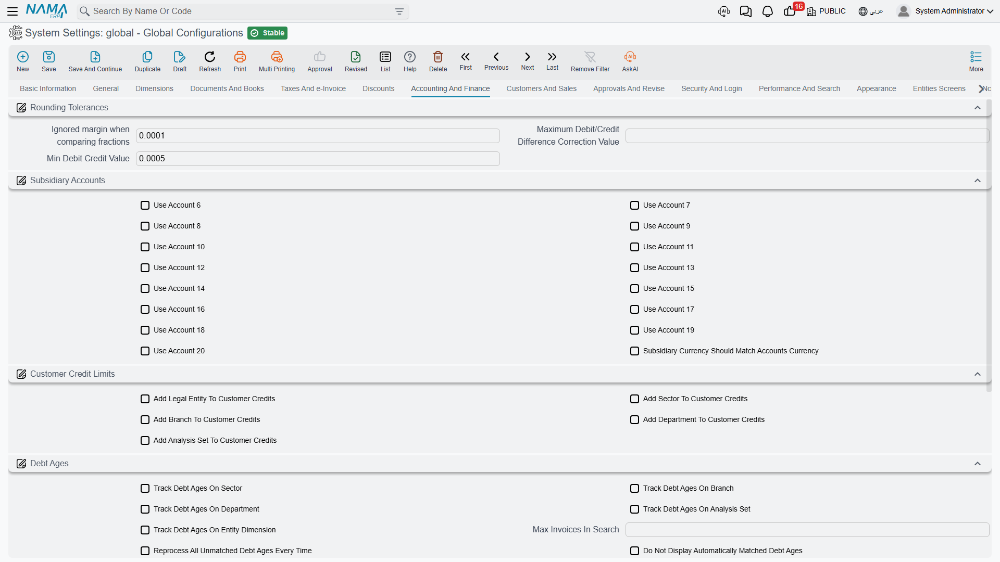

# Accounting and Finance

This tab collects the settings that decide when a difference is small enough to ignore, how many account slots a customer or supplier carries, how credit limits and debt ages are tracked, and how payments, budgets and cost behave.

## Rounding tolerances

Any system that multiplies quantities by prices and applies percentages eventually produces a debit total and a credit total that differ by a fraction of a piastre. These three numbers tell Nama when to shrug and when to refuse.

**Low Margin** `value.info.lowMargin` *(default 0.0001)* — The system's general "negligible amount". It is consulted in a lot of places: journal entries, inter-company transfers, ledger transactions, contracting extracts, price validation. A difference smaller than this is treated as zero.

::: warning Keep the low margin low
The name is a promise. The system refuses to save a value greater than 10 with an explicit complaint that the number "is not low at all", because a large low margin silently swallows genuine imbalances. The default of 0.0001 is right for almost everyone.
:::

**Maximum Debit/Credit Difference Correction** `value.info.maximumDrCrDiffCorrection` — The largest imbalance the system will silently correct rather than reject when writing a ledger transaction. Sits above the low margin: below the low margin nothing happened, between the two the system fixes it, above it the entry is refused.

**Minimum Debit/Credit Value** `value.info.minDebitCreditValue` *(default 0.0005)* — Amounts below this count as zero when deciding whether an entry is a debit or a credit, which stops a residual fraction from creating a meaningless one-sided line.

## Subsidiary accounts

A customer, supplier or employee carries a set of account slots — receivables, payables, advances, and so on. Five are always present; slots 6 to 20 are optional.

**Use Account 6** through **Use Account 20** `value.info.useAccount6` … `value.info.useAccount20` — Each switch adds one more account slot to the relevant master file screens. Turn on only what you use: every slot you enable is another field on every customer, supplier and employee screen.

**Subsidiary Currency Should Match Accounts Currency** `value.info.subsidiaryCurrencyShouldMatchAccountsCurrency` — Validates that every account attached to a subsidiary carries the same currency as the subsidiary itself, and filters the account selector accordingly. Worth turning on wherever you deal in more than one currency, since a mismatched account is only discovered when the balances refuse to reconcile.

## Customer credit limits

**Add Legal Entity / Sector / Branch / Department / Analysis Set to Customer Credits** `value.info.addLegalEntityToCustCredits`, `...addSectorToCustCredits`, `...addBranchToCustCredits`, `...addDeptToCustCredits`, `...addAnalysisSetToCustCredits` — Each adds that dimension as a column of the customer credit-limit table, so a single customer can be given a different limit per branch or per company. Enable only the dimensions your credit policy actually distinguishes — each one multiplies the number of rows credit control has to maintain.

## Debt ages

Debt ages are how Nama matches receipts against the invoices they pay, and therefore how it answers "how old is this balance?".

**Track Debt Ages on Sector / Branch / Department / Analysis Set / Entity Dimension** `value.info.trackDebtAgesOn.trackDebtAgesOnSector` and friends — Which dimensions form the key that debts are tracked and matched on. Add a dimension here and a receipt in one branch will no longer match an invoice in another. That is correct when branches are genuinely separate ledgers, and a nuisance when they aren't.

**Maximum Invoices in Suggestion List** `value.info.trackDebtAgesOn.maxInvoicesInSuggestionList` *(default 256)* — Caps how many open invoices are offered when matching a receipt. Raise it for customers with very long open lists; every extra row costs time on screen.

**Reprocess All Unmatched Debt Ages Every Time** `value.info.trackDebtAgesOn.reprocessAllUnmatchedDebtAgesEveryTime` — Re-examines every unmatched debt on each run instead of only the new ones. Thorough but progressively slower as the unmatched backlog grows.

**Do Not Display Automatically Matched Debt Ages** `value.info.trackDebtAgesOn.doNotDisplayAutomaticMatchedDebitAges` — Hides rows the system matched by itself, leaving the screen showing only what needs a human decision.

**Do Not Show Unpaid Debts Before** `value.info.trackDebtAgesOn.doNotShowUnpaidDebtsBefore` — A cut-off date. Old unpaid debts before this date stop cluttering the matching screen — useful after a migration that brought in years of historical open items.

**Shorten Debt Ages in Same Document** `value.info.trackDebtAgesOn.shortenDebtAgesInSameDocument` — Nets debits and credits belonging to the same document against each other before matching, so an invoice and its own credit note cancel out instead of appearing as two open items.

**Never Automatically Match Debt Ages (Manual Matching Only)** `value.info.trackDebtAgesOn.neverAutoMatchDebtAges` — Disables automatic matching entirely. Choose this where the accounting team insists on deciding every allocation itself.

## Payments and receipts

**Use Payment and Receipt Documents System Entries** `value.info.usePayReceiptDocsSysEntries` *(default on)* — Payment and receipt documents create system entries against the invoices they settle, which is what makes an invoice aware of what has been paid against it.

**Deduct Payment and Receipt in Remaining** `value.info.deductPaymentAndReceiptInRemaining` — Those payments also reduce the invoice's *remaining* amount. This one depends on the option above; the system refuses to save it on its own and tells you so.

**Enable Days Before Allowing Return in Payment Methods** `value.info.enableDaysBeforeAllowingReturnInPaymentMethod` — Activates the per-payment-method rule that a sale cannot be returned until a certain number of days have passed. Card settlements are the usual reason.

## Budgets

**Allow Values Change of Year 1 / 2 / 3 / 4** `value.info.allowValuesChangeOfYear1` … `...Year4` — A budget scenario compares up to four years. Each switch decides whether that year's figures may be edited. Typically the past years are locked and only the year being planned is open.

**Use To Period in Financial Budget** `value.info.useToPeriodInFinancialBudget` — Adds a "to period" column to financial budget and budget scenario tables, so one line can cover a range of periods instead of a single one. Turn it on where budgets are set quarterly or annually rather than month by month.

## Cost

**Disable Warehouses Adjustment** `value.info.disableWarehousesAdjustment` *(default on)* — When on, the system does not produce per-warehouse cost adjustment lines and skips the check that those adjustments balance. It is on by default because most installations do not track cost separately per warehouse. Turn it off only if you genuinely need warehouse-level cost adjustment, and expect additional ledger lines and a slower cost run.

**Enable Pre-send Requests for Cost Ledger** `value.info.enablePresendRequestsForCostLedger` — Allows a business request to be raised before its owning document is saved. This is what makes it possible to attach accounting effects to a stock issue, receipt or transfer through an entity flow; the flow refuses to run without it and says so.
