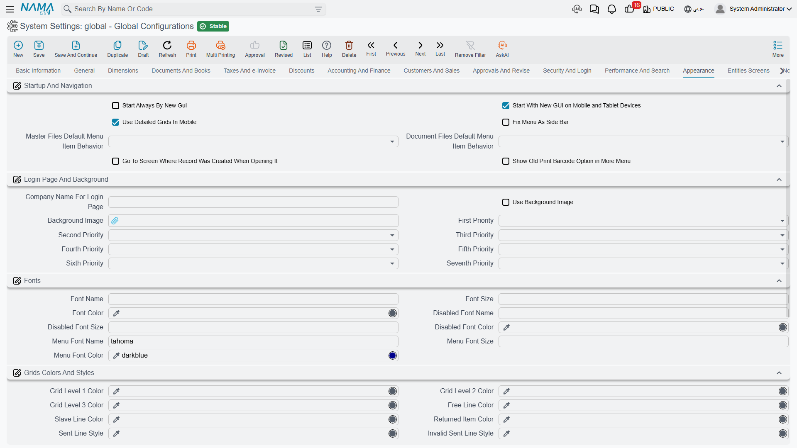

# Appearance

How the system looks and how users move around it: what opens at startup, what the login page shows, which fonts and colours are used, and how popups and tooltips behave.

## Startup and navigation

**Start Always by New GUI** `value.info.startAlwaysByNewGui` *(default on)* — Web sessions open the modern interface rather than the legacy one.

**Start in Mobile by New GUI** `value.info.startInMobileByNewGui` *(default on)* — The same decision for mobile browsers.

**Use Detailed Grids in Mobile** `value.info.useDetailedGridsInMobile` *(default on)* — Mobile shows full grids instead of the compact card layout. Detailed grids carry more information; cards are easier to tap. Choose by what your mobile users actually do — reviewing figures wants grids, capturing a few fields wants cards.

**Fix Menu as Side Bar** `value.info.fixMenuAsSideBar` — Pins the main menu open as a sidebar instead of letting it collapse. Good on wide screens where users navigate constantly.

**Master Files Default Menu Item Behavior** `value.info.mfDefaultMenuItemBehavior` — What happens when a user picks a master file from the menu: **List View** opens the list of existing records, **New Record** opens a blank one. List View suits reference data people look things up in; New Record suits files that are mostly created.

**Documents Default Menu Item Behavior** `value.info.docDefaultMenuItemBehavior` — The same for document menu items. Data-entry heavy installations often set documents to New Record and master files to List View.

**Should Redirect Edit View** `value.info.shouldRedirectEditView` — When a record has a custom edit view defined, opening it redirects there instead of showing the standard screen.

**Show Old Barcode Menu** `value.info.showOldBarcodeMenu` — Keeps the legacy barcode menu visible. Only needed where an older barcode workflow is still in use.

## Login page and background

**Company Name for Login Page** `value.info.companyNameForLoginPage` — The name shown on the login screen.

**Use Background Image** `value.info.useBackgroundImage` and **Background Image** `backgroundImage` — Whether to show a background picture, and the picture itself.

**First Priority** through **Seventh Priority** `value.info.firstPriority` … `value.info.seventhPriority` — A background image can be defined at seven levels: global configuration, legal entity, sector, branch, department, analysis set, and the individual user. These seven slots put those levels in order, and the system uses the first one that actually has an image. Put **User** first if you want people to personalise their own background but fall back to the company image when they haven't; put **Legal Entity** first in a group of companies where each subsidiary must show its own branding.

## Fonts

**Font Name** / **Font Size** / **Font Color** `value.info.fontInfo.fontName`, `...fontSize`, `...fontColor` — The main interface font.

**Disabled Font Name** / **Size** / **Color** `value.info.fontInfo.disabledFontName`, `...disabledFontSize`, `...disabledFontColor` — How disabled fields are rendered. Worth setting deliberately: users need to tell at a glance that a field is read-only, and a grey that is too light reads as "broken" rather than "locked".

**Menu Font Name** / **Size** / **Color** `value.info.fontInfo.menuFontName`, `...menuFontSize`, `...menuFontColor` — The menu font.

## Grid colours and styles

Nama uses colour to carry meaning inside grids. These settings decide what each meaning looks like.

**Grid Level 1 / 2 / 3 Color** `value.info.gridLevel1Color`, `...gridLevel2Color`, `...gridLevel3Color` — Row colours for the three nesting levels of a detail grid, so a reader can see at a glance which lines belong to which parent.

**Free Line Color** `value.info.freeLineColor` — Lines carrying free items.

**Slave Line Color** `value.info.slaveLineColor` — Lines generated as children of another line.

**Returned Item Color** `value.info.returnedItemColor` — Lines that have been returned.

**Sent Line Style** / **Invalid Sent Line Style** `value.info.sentLineStyle`, `value.info.inValidSentLineStyle` — Lines already sent to an external system, and those whose send failed validation. Choose two clearly different colours: telling "sent" from "sent but rejected" at a glance is the whole point.

**Allow Text Wrap in Grids** / **in List Views** `value.info.allowTextWrapInGrids`, `value.info.allowTextWrapInListViews` — Lets cell text wrap onto more than one line instead of being cut off. More readable, but fewer rows fit on screen.

**Lines Count in Grids** `value.info.linesCountInGrids` — The default number of rows per grid page.

**Legacy UI Extra Styles** `value.info.legacyUIExtraStyles` — Additional styling applied in the legacy interface, for installations that need a specific look there.

::: tip Colour and icons for one record type or one field
Everything above paints the whole system the same way. When the meaning you want to signal is narrower — an icon on the Sales Invoice menu entry, a colour on the *Customer* field, or a different icon for each value of a status — set it in [Fields and Entities Settings](/platform/fields-and-entities-settings/fields-settings-field-icons), which also lets you give each icon a light-mode and a dark-mode colour so it stays legible in both themes.
:::

## Popups and editors

**Hide Select Column in Selector Popup** `value.info.hideSelectColumnInSelectorPopup` — Removes the selection column from the record-picker popup.

**Hide Count Column in Selector Popup** `value.info.hideCountColumnInSelectorPopup` — Removes the count column from the same popup. Both trim a picker that users find crowded.

**Always Use Text Area in Serial Popup** `value.info.alwaysUseTextAreaInSerialPopup` — Serial entry always uses a multi-line box, which suits pasting a long list of scanned serials.

**Do Not Use Descriptors in Fields** `value.info.doNotUseDescriptorsInFields` — Reference fields show only code and name rather than the longer descriptor text. Turn it on where descriptors are so long they push the useful part of the field off screen.

**Use Kendo Rich Editor** `value.info.useKendoRichEditor` — Rich-text fields use the Kendo editor.

**Create DMS Doc In Pop Up Window** `value.info.createDMSDocInPopUpWindow` *(default on)* — The **Create Archive** action opens the new [archived document](/platform/dms/dms-documents.md) in a popup instead of navigating away, so the user does not lose the record they were working on.

## Tooltips

**Tooltip Position** `value.info.tooltipPosition` — Whether quick help appears above or below the field.

**Pin Tool Tip** `value.info.pinToolTip` — Keeps the tooltip open instead of fading, which helps while users are still learning a screen.
