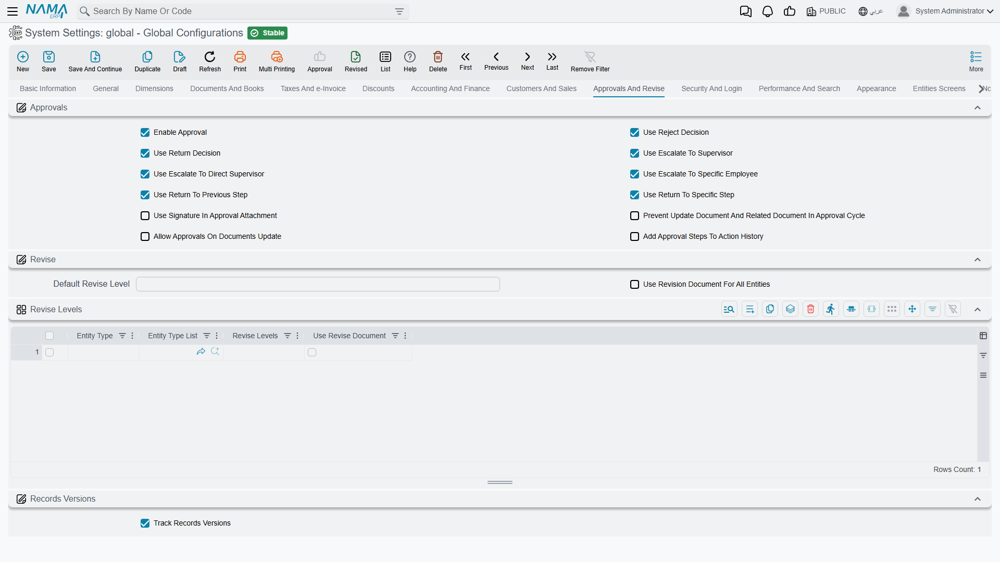

# Approvals and Revise

Nama has two separate ways of putting a human check between "someone entered this" and "the system acted on it". **Approvals** route a document to the people who must agree to it. **Revise** requires a number of people to mark a record as reviewed. This tab configures both, plus record version history.

## Approvals

**Approval Enabled** `value.approvalEnabled` *(default on)* — The master switch for the whole approval engine. With it off, approval rules are ignored everywhere.

The options that follow decide which buttons an approver actually sees. Every one you leave on is another choice the approver has to weigh, so a deliberately short list often produces faster, more consistent decisions.

**Use Reject Decision** `value.info.useRejectDecision` *(default on)* — Shows **Reject**, which ends the approval and refuses the document.

**Use Return Decision** `value.info.useReturnDecision` *(default on)* — Shows **Return**, which sends the document back to its author to be fixed and resubmitted, rather than killing it.

**Use Escalate to Supervisor** `value.info.useEscalateToSupervisor` *(default on)* — Shows **Escalate to Supervisor**, passing the decision up the org chart.

**Use Escalate to Direct Supervisor** `value.info.useEscalateToDirectSupervisor` *(default on)* — Shows **Escalate to Direct Supervisor**, which passes the decision to the approver's *direct* supervisor instead. The two escalation decisions read two different fields on the employee record, so where a person's direct supervisor is not the manager approvals escalate to, you can offer both and let the approver pick. If the employee has neither person recorded the decision is refused with a message saying so, which is the usual reason the button looks like it does nothing.

**Use Escalate to Specific Employee** `value.info.useEscalateToSpecificEmployee` *(default on)* — Shows **Escalate to Employee**, letting the approver choose who should decide instead.

**Use Return to Previous Step** `value.info.useReturnToPreviousStep` *(default on)* — Shows **Return to Previous Step**, sending the document back one stage in the approval chain rather than all the way to its author.

**Use Return to Specific Step** `value.info.useReturnToSpecificStep` *(default on)* — Shows **Return to a Specific Step**, which lets the approver choose *which* earlier stage the document goes back to rather than always sending it back exactly one. On a long chain — requester, department head, finance, general manager — that is the difference between bouncing a document back through three people and returning it straight to whoever has to fix it. The decision only appears when the approval actually has earlier steps that can be returned to, so on a one-step approval you never see it however this is set.

**Use Signature in Approval Attachment** `value.info.useSignatureInApprovalAttachment` — Stamps the approver's stored signature image onto the attachment produced by the approval, so the printed record carries a visible signature.

**Prevent Update of Document and Related Documents in Approval** `value.info.preventUpdateDocAndRelatedDocInApproval` — Locks the document *and the documents linked to it* while it waits for a decision. Without this, an author can quietly change what the approver is looking at.

**Allow Approvals on Documents Update** `value.info.allowApprovalsOnDocumentsUpdate` — Re-runs the approval rules when an already-approved document is edited, so a material change goes back through the chain instead of inheriting the old approval.

**Add Approval Steps to Action History** `value.info.addApprovalStepsToActionHistory` — Writes each approval step into the record's action history, giving a permanent audit trail of who decided what and when. Worth the small storage cost anywhere approvals carry weight.

## Revise

Revise is lighter than approval: no routing, no decisions, just a required number of sign-offs before a record is considered checked.

**Default Revise Level** `value.info.defaultReviseLevel` — How many revise levels apply to entities with no rule of their own. Negative values are rejected.

**Use Revise Document for All Entities** `value.info.useReviseDocumentForAllEntities` — Every entity is revised through the separate Revise Document flow rather than in place on the record itself.

**Revise Levels** `value.info.entitiesReviseLevels` *(table)* — Per-entity rules. Each row names an entity type (or a list of them), the number of revise levels it needs, and whether it uses the Revise Document. This is how you require two sign-offs on journal entries and none on a stock transfer.

## Record versions

**Track Records Versions** `value.trackVersionsEnabled` *(default on)* — Keeps a full version history of records, so you can see what a document looked like before an edit and who changed it. Individual entities can override this through their own entity configuration.

::: tip History costs storage, not speed
Version tracking writes a copy of the record on change. On high-volume documents that adds up over years, which is why the per-entity override exists — keep full history on the records an auditor will ask about, and turn it off on high-churn operational records where nobody ever looks back.
:::
