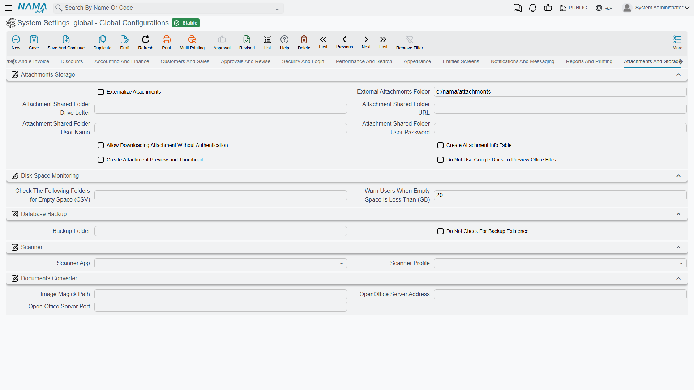

# Attachments and Storage

Where attached files live, how their disk space is watched, and the two external tools the system uses to scan paper and convert documents.

## Attachment storage

By default an attachment's bytes are stored inside the database. That is simple and keeps backups self-contained, but a few years of scanned invoices will make the database far larger than the business data it holds.

**Externalize Attachments** `value.info.externalizeAttachments` — Stores attachment content on disk instead of in the database. The database keeps only the metadata and a pointer.

::: warning Externalized attachments change your backup story
Once files live on disk, a database backup no longer contains them. The folder must be backed up too, and restored alongside the database — a database restored without its attachment folder will show every attachment as missing.
:::

**External Attachments Folder** `value.info.externalAttachmentsFolder` *(default `c:/nama/attachments` on Windows, `/var/nama/attachments` elsewhere)* — The root folder for those files.

**Attachment Share Drive Letter** / **Attachment Share URL** / **Attachment Share User** / **Attachment Share Password** `value.info.attachmentShareDriveLetter`, `value.info.attachmentShareURL`, `value.info.attachmentShareUser`, `value.info.attachmentSharePassword` — When the folder is a network share rather than a local disk, these mount it. Fill in any one of them and the drive letter and URL become required; the system tells you which is missing when you save.

**Allow Download Attachment Without Authentication** `value.info.allowDownloadAttachmentWithoutAuthentication` — Attachment links work without a session. Needed by some external viewers and portals, but it means anyone holding a link can fetch the file — turn it on only when you know that is acceptable.

**Create Attachment Info Table** `value.info.createAttachmentInfoTable` — Maintains a separate table describing attachments, and exposes it in menus and screens, so you can report on what is attached where and how much space it occupies.

**Create Attachment Preview and Thumbnail** `value.info.createAttachmentPreviewAndThumbnail` — Generates a preview and a thumbnail for each uploaded file. Thumbnails make an attachments list far easier to scan, at the cost of some processing on upload and a little extra storage.

## Disk space monitoring

**Folders to Check Space** `value.info.foldersToCheckSpace` — The folders whose free space the system watches. List the attachment folder here, and anywhere else that filling up would stop work.

**Notify When Empty Space Reaches (GB)** `value.info.notifyWhenEmptySpaceReachesGB` *(default 20)* — Below this many free gigabytes, the system raises a critical message. Set it high enough that someone has time to react — a disk that fills completely stops attachments, exports and often the database itself.

## Database backup

A backup nobody checks is a backup that isn't there. A maintenance plan that quietly stopped writing files three weeks ago looks exactly like one that is working — until the day you need to restore. So Nama watches the backup folder on your behalf and raises a critical message when a fresh backup is missing.

**Backup Folder** `value.info.backupFolder` — The folder your database backup job writes into, as seen **from the application server**. Nama scans it, and up to two levels of sub-folders beneath it, so a plan that writes a folder per day or per database still works. It looks for files ending in `.bak` or `.dbak`, and counts one as fresh when the file name carries today's or yesterday's date in `YYYYMMDD` form, or when the file was last modified any time since the start of yesterday.

**Do Not Check For Backup Existence** `value.info.doNotCheckForBackupExistence` — Switches the whole check off. Use it when backups are handled somewhere Nama cannot see — a storage-level snapshot, a cloud database service, or an agent that ships files straight off the machine — so the server stops reporting a missing backup it has no way to find.

::: warning Nama checks the backup, it does not take it
Filling in the folder does not schedule anything. Your database backup still has to be created by SQL Server's own maintenance plan or whatever tool you use; this setting only tells Nama where to look at the result.
:::

The check runs when the server starts and repeats every hour, and it can raise one of three messages on the critical errors list: the folder was never filled in, the folder is filled in but the server cannot reach it, or the folder is reachable but holds nothing from today or yesterday. Each message links straight to the **Backup Folder** field, so clicking it opens this screen with the field already in focus. [What to do about each one](/admin/troubleshooting/general-faq#Error-Backup-folder-is-not-configured-does-not-exist-or-holds-no-recent-backup) is covered in the troubleshooting FAQ.

::: tip Point it at a path the server's service account can reach
The folder is resolved by the application server process, not by your browser. A local path such as `D:/backup` is straightforward; a network share works too, but the Windows account Tomcat runs as must have access to it — a share that opens fine in your own Explorer window is still unreachable if the service runs as a local account.
:::

## Scanner

**Scanner App** `value.info.scannerApp` — Which scanning integration the attach-from-scanner action uses: **cScanTwain** or **DynamicWebTWAIN**.

**Scanner Profile** `value.info.scannerProfile` — The default scan settings: **Black and White Document**, **Color Document**, **Grayscale**, or **Show Scanner UI** to let the user choose each time. Black and white keeps document scans small; use colour only where the colour carries information, such as a stamped or signed original.

::: tip Giving one field a scan button — or a place to sign
These settings decide *how* scanning works; they do not put a scanner button anywhere. To add one, mark the attachment field as a scanner field in [Fields and Entities Settings](/platform/fields-and-entities-settings/fields-settings-field-appearance) — the field then gets its own button that scans straight into it, rather than going through the general attachments list. The same screen turns an attachment field into a **signature pad**, so a customer signs the delivery note on screen with a finger or a stylus and the drawing is saved as the attachment.
:::

## Documents converter

Nama converts Office files and images to PDF for previewing and printing, using two external tools.

**ImageMagick Path** `value.info.docConverterSettings.imageMagicPath` — The path to the ImageMagick executable on the server, used for image conversion.

**OpenOffice Server Address** / **OpenOffice Server Port** `value.info.docConverterSettings.openOfficeServerAddress`, `...openOfficeServerPort` — The address and port of the LibreOffice or OpenOffice conversion service that turns Word, Excel and similar files into PDF.

::: tip These are server paths, not user paths
Both settings point at software installed on the application server, not on the user's machine. If document previews stop working after a server move, these are the first two values to check.
:::
