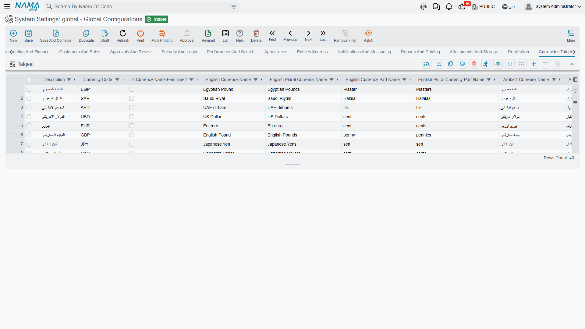

# Currencies Tafqeet

*Tafqeet* is writing an amount in words — the line on a cheque or an invoice that reads "One thousand two hundred Egyptian Pounds and fifty Piasters only". This tab holds the vocabulary the system needs to produce that sentence correctly.

## Why one currency needs so many columns

In English a currency needs two words: *pound* and *pounds*. Arabic is harder, because a noun changes form according to how many of it there are. The system therefore stores four forms of each currency name and four of its fraction name:

| Count | Form stored | Example |
|---|---|---|
| 1 | `arabic1CurrencyName` | جنيه مصري |
| 2 | `arabic2CurrencyName` | جنيهان مصريان |
| 3 – 10 | `arabic310CurrencyName` | جنيهات مصرية |
| 11 – 99 | `arabic1199CurrencyName` | جنيهاً مصرياً |

The same four forms exist for the fractional unit — piaster, halala, fils — under `arabic1CurrencyPartName`, `arabic2CurrencyPartName`, `arabic310CurrencyPartName` and `arabic1199CurrencyPartName`.

Grammatical gender matters too, because the number word must agree with it. **Currency Name Feminine** (`currencyNameFeminine`) and **Currency Part Name Feminine** (`currencyPartNameFeminine`) record it — the Syrian lira (ليرة) is feminine, the Egyptian pound (جنيه) is not.

## The table

**Currencies Tafqeet** `value.info.tafqeetInfo` *(table)* — One row per currency. Nama ships with about forty currencies already filled in, covering the Arab world and the major international currencies, so most installations never touch this screen.

Each row holds:

- **Description** and **Currency Code** — the currency's name and its three-letter code (`EGP`, `SAR`, `USD`), which is how a row is matched to an amount.
- **English Currency Name** and **English Plural Currency Name** — singular and plural, which is all English needs.
- **English Currency Part Name** and **English Plural Currency Part Name** — the same for the fractional unit.
- The eight Arabic forms and the two gender flags described above.
- **Part Precision** — how many decimal places the fractional unit has. Most currencies use 2 (100 piasters to the pound); the Kuwaiti, Bahraini, Jordanian, Omani, Tunisian, Libyan and Iraqi units use 3 (1000 fils to the dinar). Get this wrong and 1.500 dinars is spelled out as fifty fils instead of five hundred.

::: tip Add a row only for a currency you actually spell out
The table drives written amounts, not exchange rates or accounting. A currency you trade in but never write in words on a document does not need a row here. When you do add one, fill all four Arabic forms — a missing form produces a grammatically wrong sentence on a cheque, which is exactly the kind of document where that gets noticed.
:::

The values are loaded into memory when the configuration is saved, so a correction takes effect on the next document you print.
