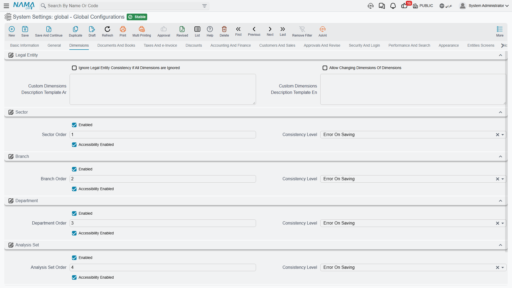

# Dimensions

Dimensions are how Nama answers "which part of the business does this record belong to?". There are five of them — legal entity, sector, branch, department and analysis set — and almost every record in the system carries all five. They drive security (who may see a record), reporting (how figures are grouped), and account structure.

This tab decides which of them your installation actually uses, how strictly the system enforces that a document's dimensions agree with each other, and how the dimensions map onto account codes.

## Legal entity

The legal entity is the only dimension that cannot be switched off — it is the company, and every record belongs to one (or to none, which means *public*).

**Show Public Documents to All** `value.info.showPublicDocumentsToAll` — A record saved with an empty legal entity is public. Normally a public record is still hidden from users working inside a specific legal entity. Turn this on and public records become visible from every legal entity, which is what you want for shared master data such as a common item catalogue.

**Ignore Legal Entity Matching If No Matching Is Specified for Any Other Dimension** `value.info.ignoreDimensionsConsistency` — Skips the storage-dimension consistency check entirely. It only has an effect when all four consistency levels below are set to None; it is an escape hatch for installations that deliberately don't use dimension consistency at all, not a way to silence individual errors.

::: tip Relaxing the rule for one field instead of the whole system
Both settings above are all-or-nothing. When only a handful of fields are the problem — a document that must legitimately point at a record from another branch — the dimension consistency check can be switched off on that single reference field, and an individual record type can be declared public across dimensions, in [Fields and Entities Settings](/platform/fields-and-entities-settings/fields-settings-relaxing-restrictions). That keeps the strict checking everywhere else.
:::

**Allow Changing Dimensions of Dimensions** `value.info.allowChangingDimsOfDims` — A dimension record has dimensions of its own — a branch belongs to a sector, for example. Normally, once master files reference a dimension, its own dimensions are frozen, because changing them would silently re-file every record beneath it. Turn this on only for a deliberate restructuring, and expect to review the affected records afterwards.

**Custom Dimensions Description Template (Arabic)** / **(English)** `value.info.customDimensionsDescriptionTemplateAr`, `...En` — The system shows a one-line human description of a record's dimensions in various places. These templates let you control what that line says and in which order, in each language.

## The four optional dimensions

Sector, branch, department and analysis set each get an identical group of four options. Their meaning is the same in every case, so they are described once here.

**Enabled** `value.sectorEnabled`, `value.branchEnabled`, `value.departmentEnabled`, `value.analysisSetEnabled` *(all default on)* — Turns the dimension on. Switch off any dimension the business genuinely doesn't use: its fields disappear from every screen, which removes a column of noise from data entry across the whole system. This is an implementation-time decision — turning a dimension off after records already carry values leaves that data stranded.

**Order** `value.sectorOrder` *(1)*, `value.branchOrder` *(2)*, `value.departmentOrder` *(3)*, `value.analysisSetOrder` *(4)* — The relative weight of the dimension when the system resolves a dimension hierarchy. The defaults describe the usual containment: a sector holds branches, a branch holds departments. Change these only if your organisation nests them differently.

**On Inconsistency** `value.sectorConsistencyLevel`, `value.branchConsistencyLevel`, `value.departmentConsistencyLevel`, `value.analysisSetConsistencyLevel` *(all default Error on Saving)* — What happens when a document line's dimension contradicts its header or its warehouse. **Error on Saving** refuses the save, **Warn on Saving** lets it through with a warning, **None** says nothing at all. Leaving these at Error is the safe choice: an inconsistent dimension quietly corrupts every report that groups by it.

**Prevent Access on Inconsistency** `value.sectorAcessibilityEnabled`, `value.branchAcessibilityEnabled`, `value.departmentAcessibilityEnabled`, `value.analysisSetAcessibilityEnabled` *(all default on)* — Whether the dimension participates in record-level accessibility. With it on, a user restricted to one branch sees only that branch's records. Switching it off makes the dimension purely descriptive — still recorded and still reportable, but no longer a security boundary.

::: tip Enabled, ordered, checked, enforced
It helps to read the four options as a sequence: *Enabled* asks whether the dimension exists at all, *Order* where it sits in the hierarchy, *On Inconsistency* how loudly the system complains when it doesn't add up, and *Prevent Access* whether it also restricts who can see the record.
:::

## Account code segments

Many charts of accounts encode dimensions directly into the account code — `1010-05-03-11` might mean account 1010, sector 05, branch 03, analysis set 11. These settings tell the system how to read such a code back into dimensions.

**Sector Segment Order** *(1)*, **Branch Segment Order** *(2)*, **Department Segment Order** *(3)*, **Analysis Set Segment Order** *(4)* `value.accountDimensionConfigurations.sectorSegmentOrder` and friends — The position each dimension occupies in the code, counting from the left after the account number itself. A zero means that dimension is not part of the code.

**Segment Separator** `value.accountDimensionConfigurations.segmentSeperator` *(default `-`)* — The character the code is split on.

::: warning These describe your codes; they don't create them
Changing a segment order doesn't renumber anything — it changes how existing codes are *interpreted*. Get them wrong and the system will read the branch segment as the sector. Set them to match the coding scheme you actually use, once, before accounts are created.
:::
