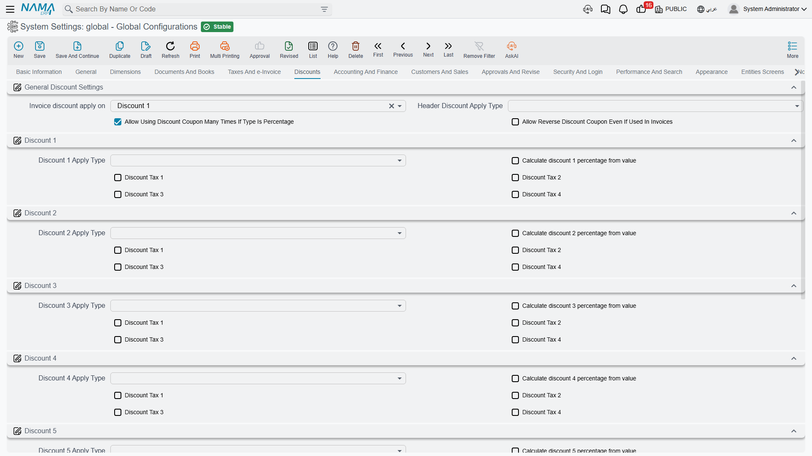

# Discounts

A document line in Nama can carry up to eight separate discounts plus one discount at the document header. Eight sounds excessive until you meet a distributor whose price is list price, minus the trade discount, minus the volume discount, minus the seasonal promotion, minus the settlement discount — each negotiated separately, each needing to appear on the invoice in its own right.

This tab decides what each discount is calculated on and how it interacts with the four taxes.

::: tip You may see fewer than eight
The eight line discounts are separately licensed. If your installation is licensed for three, only Discount 1 to Discount 3 appear on this tab and on document lines.
:::

## General discount settings

**Discount Location** `value.discountLocation` *(default Discount 1)* — Documents that have a single, generic "discount" field need to know which of the eight slots it corresponds to. Unless you have a reason to do otherwise, leave this on Discount 1 so the simple case lands in the first slot.

**Header Discount Apply Type** `value.info.headerDiscountApplyType` — The base the header discount percentage is applied to, using the same list of options as the line discounts below. The header discount is applied to the document as a whole, after the lines have been calculated.

**Allow Using Discount Coupon Many Times If Percentage Type** `value.info.allowUsingDiscountCouponManyTimesIfPercentageType` — A discount coupon is normally consumed by the first document that redeems it. A percentage coupon has no balance to run down, so this option lets it be redeemed repeatedly — the right behaviour for a "10% off, all season" campaign code.

**Allow Reverse Discount Coupon Even If Used in Invoices** `value.info.allowReverseDiscountCouponEvenIfUsedInInvoices` — Permits reversing a coupon redemption that invoices have already consumed. Needed to unwind a mistake, but it means the invoices keep a discount whose coupon no longer records it.

## Discount 1 through Discount 8

Each of the eight discounts has the same three kinds of setting. Using discount *N* to stand for any of them:

**Discount N Apply Type** `value.info.discountNApplyType` — What the percentage is applied to. The choices are the same chain used by the taxes: the total price, the price after any earlier discount, after the header discount, the value of a particular discount or tax, or a custom base. This is what puts the discounts in order — a discount 2 set to *After Discount 1 Price* is compounded on top of discount 1, whereas one set to *Total Price* is calculated on the original price and the two simply add up.

::: info Compounded or parallel — decide deliberately
Two 10% discounts applied to the total price take 20% off. The same two applied one after the other take 19%. On a large contract that difference is real money, and it is decided entirely by the apply type. Confirm with the commercial team which behaviour the price agreements assume.
:::

**Calculate Discount N Percentage from Value** `value.info.calcDiscNPercentFromValue` — Normally the user types a percentage and the system computes the amount. With this on the relationship is reversed: the user types the amount and the system works out the percentage it represents. Turn it on for discounts that are negotiated as round sums ("take 500 off") rather than as rates.

**Consider Tax 1 / 2 / 3 / 4** `value.info.discountN.considerTax1` through `...considerTax4` — Whether each of the four taxes is included in the base this discount is calculated on. The common case is a discount taken on the net amount before VAT, which means leaving the VAT tax unchecked. Check it only where the commercial agreement genuinely discounts the tax-inclusive figure.

::: warning Discount 3 was previously unreachable
On earlier versions, the Discount 3 tax-effect options on this screen were wired to Discount 2, so Discount 2's settings appeared twice and Discount 3's could not be set at all. That is corrected. If your installation used discount 3, check its four *Consider Tax* boxes now — they may never have been set to what you intended.
:::
