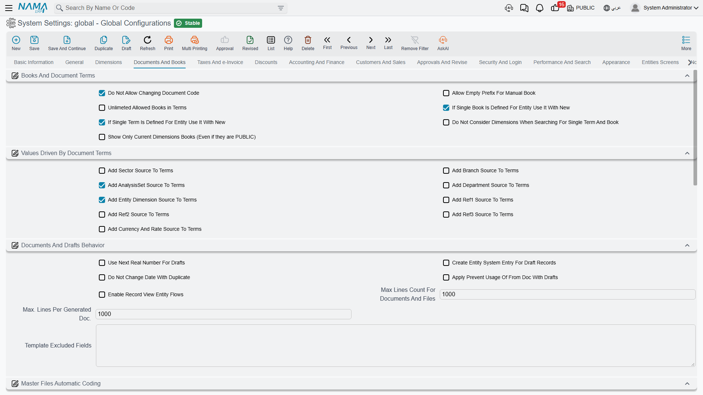

# Documents and Books

Every document in Nama gets its number from a **book** and its behaviour from a **document term**. This tab governs that machinery: how books and terms are picked, what a term is allowed to control, how drafts are numbered, how master files are coded automatically, how installments are generated, and who may post into a closed fiscal period.

## Books and document terms

**Do Not Allow Specifying Document Code** `value.info.doNotAllowSpecifyingDocCode` *(default on)* — Users cannot type a document code by hand; the number always comes from the book's auto-coder. This is on by default for a good reason — hand-typed codes create gaps and duplicates that are painful to reconcile later.

**Allow Empty Prefix for Manual Book** `value.info.allowEmptyPrefixForManualBook` — A manually coded book normally needs a code prefix so its documents can be told apart. Turn this on if you have a book whose numbers should stand alone.

**Unlimited Allowed Books in Terms** `value.info.unlimtedAllowedBooksInTerms` — A document term lists the books it allows. That list is stored in a field capped at 700 characters, and a term that allows many books overflows it. Turning this on moves the list to a long field with no practical limit.

::: warning Re-save your terms after enabling this
The allowed-books list is written when a term is saved. Switching this option on does not rewrite existing terms — you must re-save every document term afterwards, or they will keep using the old short list.
:::

**If Single Book Is Defined for Entity Use It with New** `value.info.ifSingleBookIsDefinedForEntityUseItWithNew` — When only one book fits the document being created, select it automatically instead of asking. A small thing that removes a click from every single document.

**If Single Term Is Defined for Entity Use It with New** `value.info.ifSingleTermIsDefinedForEntityUseItWithNew` — The same for document terms.

**Do Not Consider Dimensions When Searching for Single Term or Book** `value.info.doNotConsiderDimensionsWhenSearchingForSingleTermBook` — By default the "is there only one?" check above is made within the current dimensions. With this on, the search ignores dimensions, so a term or book that fits regardless of branch is still auto-selected.

**Show Only Current Dimension Books** `value.info.showOnlyCurrentDimensionBooks` — Filters the Book selector down to books matching the record's dimensions. Useful once each branch has its own numbering series and you want to stop staff picking another branch's book.

## Values driven by document terms

A document term can *supply* values to the document it governs — a term for Cairo branch sales can force the branch, the reference fields, even the currency. Each option here adds one such source column to the Document Term screen. They are off by default because every column you add is another decision the person maintaining terms has to make.

- **Add Sector Source to Terms** `value.info.addSectorSourceToTerms`
- **Add Branch Source to Terms** `value.info.addBranchSourceToTerms`
- **Add Analysis Set Source to Terms** `value.info.addAnalysisSourceToTerms` *(default on)*
- **Add Department Source to Terms** `value.info.addDeptSourceToTerms`
- **Add Entity Dimension Source to Terms** `value.info.addEntityDimSourceToTerms`
- **Add Reference 1 / 2 / 3 Source to Terms** `value.info.addRef1SourceToTerms`, `...addRef2SourceToTerms`, `...addRef3SourceToTerms`
- **Add Currency and Rate Source to Terms** `value.info.addCurrencyAndRateSourceToTerms`

## Documents and drafts behaviour

**Use Next Real Number for Drafts** `value.info.useNextRealNumberForDrafts` — Drafts normally draw from a separate draft sequence, so a draft that is never committed doesn't consume a real number. Turn this on and a draft takes the next real number instead, which keeps the committed series gap-free at the cost of burning numbers on abandoned drafts. Individual auto-coders can override this.

**Create Entity System Entry for Draft Record** `value.info.createEntitySystemEntryForDraftRecord` — Writes a system entry for drafts as well as committed records. Needed when an integration or a report has to see documents before they are committed.

**Do Not Change Date with Duplicate** `value.info.doNotChangeDateWithDuplicate` — The Duplicate action normally resets the new document's date to today. With this on it keeps the source document's date — the right behaviour when you duplicate to correct a historical entry.

**Apply Prevent Usage of From Document with Drafts** `value.info.applyPreventUsageOfFromDocWithDrafts` — A source document can be marked so it may only be consumed once. Normally that rule is checked at commit. This applies it at draft-save time too, so two people can't both start drafts from the same source.

**Enable Record View Entity Flows** `value.info.enableRecordViewEntityFlows` — Allows entity flows whose trigger is *Record View*, running them whenever a record is opened. Off by default, and worth leaving off unless you need it: it adds work to every single record open. The system refuses to save an entity flow using that trigger while this is off.

**Maximum Lines Count** `value.info.maxLinesCount` *(default 750)* — The default cap on how many detail lines one record may hold. It protects the server from a single enormous document. Individual entity/grid combinations can be given their own limit that overrides this.

**Maximum Lines per Generated Document** `value.info.maxLinesPerGeneratedDoc` *(default 1000)* — When the year-end closing produces its entries, it splits them across several documents rather than building one giant entry. This is the number of lines per generated document.

**Default Values Excluded Fields** `value.info.defaultValuesExcludedFields` — When a user saves a record as a "default values" template, everything on it is copied. List field ids here — one per line — to keep them out of such templates. Dates, codes and reference numbers are the usual candidates.

## Master files automatic coding

Items, accounts and other master files can be coded by formula rather than by hand. This group defines those formulas; the system checks them when you save the configuration.

::: info Documents, items, and everything else
Keep the three apart. A **document's** number comes from its book's auto-coder, not from here. The formulas below cover **items** and their revisions and variants. Any *other* master file — customers, suppliers, cost centres — gets its own coding formula in [Fields and Entities Settings](/platform/fields-and-entities-settings/fields-settings-auto-coding), where you name the record type and give it a formula of the same kind.
:::

**Prevent Manual Coding** `value.info.preventManualCoding` — Refuses to save a record whose code was typed by hand when its auto-coder is set to code automatically. The strict counterpart to the document-code option above.

**Code Calculation Formula** `value.info.itemCodingFormula.codeCalculationFormula` — Builds the code itself, typically from the item's group, category and a running number.

**Code Validity Query** `value.info.itemCodingFormula.codeValidityQuery` — A check the generated code must pass. If the query matches an existing record, the code is rejected and the next number is tried. This is how you enforce "no two items may share this code shape".

**Code Sequence Prefix** `value.info.itemCodingFormula.codeSequencePrefix` — A formula producing the prefix whose counter the numeric suffix belongs to, so each product family gets its own independent series.

**Code Suffix Length** / **Code Suffix First Number** `value.info.itemCodingFormula.codeSuffixLength`, `...codeSuffixFirstNumber` — The width of the numeric part (zero-padded) and the number it starts from.

**Name 1 / Name 2 Calculation Formula** `value.info.itemCodingFormula.name1CalculationFormula`, `...name2CalculationFormula` — Formulas that build the Arabic and English names, so a generated item is fully described without typing.

**Alternative Code Formula** `value.info.itemCodingFormula.altCodeFormula` — Builds the alternative code.

**Revision Code Formula**, **Revision Name 1 / Name 2 Formula** `value.info.itemCodingFormula.revCodeCalculationFormula`, `...rvName1Formula`, `...rvName2Formula` — The same three formulas applied to generated item revisions.

**Size and Color Code Formula**, **Size and Color Name 1 / Name 2 Formula** `value.info.itemCodingFormula.sizeAndColorCodeCalculationFormula`, `...szName1Formula`, `...szName2Formula` — And again for generated size and colour variants, which is where auto-coding really pays: a shirt in five sizes and four colours becomes twenty correctly named records with no typing.

**Do Not Reset Code with Update** `value.info.itemCodingFormula.doNotResetCodeWithUpdate` — Keeps the existing code when the record is edited, even if the formula's inputs changed.

**Update Revision If Empty** / **Update Color and Size If Empty** `value.info.itemCodingFormula.updateRevisionIfEmpty`, `...updateColorAndSizeIfEmpty` — Fill those codes only when they are currently blank, leaving anything already coded untouched.

## Installments

**Installment Coding Method** `value.info.installmentCodingMethod` — How generated installments are numbered: **Document Code and Line Number**, **Installment Date and Line Number**, or **Formula**.

**Installment Coding Formula** `value.info.installmentCodingFormula` — The formula used when the method is Formula.

**Ignored Value When Comparing Paid to Installments** `value.info.ignoredValueWhenPayingInstallments` — The tolerance when checking a payment against an installment amount. Set it just above your smallest currency unit so a one-piastre rounding difference doesn't block a settlement.

**Do Not Compare Remaining with Payment Total in Invoices** `value.info.doNotCompareRemainingWithPaymentTotalInInvoices` — Skips the validation that an invoice's remaining amount equals the total of its payment schedule. Use it only where the two genuinely diverge by design.

## Fiscal periods and closing

**Do Not Prevent Modifying Documents Before Last Closing Entry** `value.info.doNotPreventModifyingDocsBeforeLastCloseEntry` — Normally a document dated before the last closing entry is locked, because editing it would change a period that has already been closed and reported. This lifts that lock.

**Allow Reprocessing of Ledger Transaction Requests Before Closing Entry** `value.info.allowReprocessingOfLedgerTransRequestsBeforeClosingEntry` — Allows the accounting effects of documents dated before a closing entry to be reprocessed.

**Allow Reprocessing of Inventory Transaction Requests Before Closing Entry** `value.info.allowReprocessingOfInvTransRequestsBeforeClosingEntry` — The same for inventory effects.

::: danger These two are flagged as dangerous
Both reprocessing options ask for explicit confirmation before they can be enabled, and the system records that they were turned on. Reprocessing across a closing entry rewrites figures that a closed period was built from, so balances that were reported to management or to an auditor can silently change. Enable them for a supervised correction, then switch them off again.
:::

**Enable Fiscal Year Status Update** `value.info.enableFiscalYearStatusUpdateFile` — Activates the Fiscal Year Status Update file, which lets you open or close periods for a specific combination of entity, dimensions and user rather than globally.

**Ignore Closed Periods In** `value.info.ignoreClosedPeriodsIn` *(table)* — A more surgical alternative to the options above. Each row grants one user (or one "allow for" group) the right to post into a named fiscal period and year, for one entity type, optionally narrowed to specific dimensions. This is how you let the accountant finish last month's adjustments without unlocking the period for everybody.
