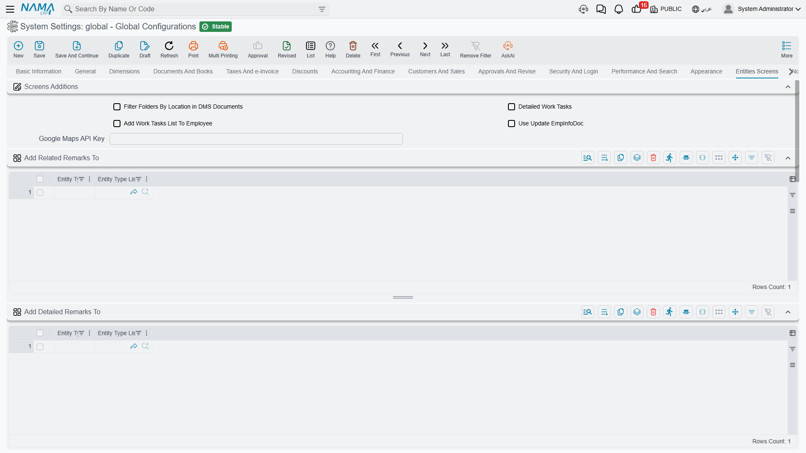

# Entities Screens

This tab is unusual: nothing on it changes how the system *behaves*. Everything on it changes what other entities' **screens look like** — which extra pages appear on a customer, whether an item's picture shows in search results, which records get colour coding.

That makes it a good place to start when someone asks "why does our supplier screen have a Contacts page and the demo one doesn't?".

::: info The per-field counterpart
What you set here is a default for a whole record type. The screen that does the same job one **field** at a time is [Fields and Entities Settings](/platform/fields-and-entities-settings/), reached from **Basic → Settings** — display masks and styles, icons and colours, input rules, how a reference lookup searches, calculated fields, and more. Reach for that screen when the answer is "only on this one field".
:::

## Screen additions

**Filter Folders By Location in DMS Documents** `value.info.dmsDocFilterFoldersByLocation` — Filters the folder selector on an archived document down to folders whose default archive matches the one chosen on the document, so a user in one office doesn't have to scroll past every other office's filing structure. See [Settings and Integration](/platform/dms/dms-configuration.md).

**Detailed Work Tasks** `value.info.detailedWorkTasks` — Switches the work-task screens to their detailed layout, which carries more fields per task.

**Add Work Tasks List to Employee** `value.info.addWorkTasksListToEmployee` — Adds a list of the employee's work tasks to the Employee screen, so a manager can see someone's workload from their record rather than running a separate query.

**Use Update Employee Info Document** `value.useUpdateEmpInfoDoc` — Employee data is changed through a dedicated *Update Employee Info* document instead of being edited directly on the Employee screen. This is how you get an approval trail and a dated history for HR changes: the change becomes a document that can be reviewed, approved and reported on, rather than a silent edit.

**Google Maps Api Key** `value.info.googleMapsApiKey` — The key used by the map picker on location fields and by the delivery application. Without it, map-based fields fall back to manual entry.

## Extra pages on other entities

Each of these tables names the entity types that should receive one extra page. Add a row per entity type, or use the entity-type list column to cover several at once.

**Add Remarks Page To** `value.info.addRemarksPageTo` — Adds a Remarks page. Comes preset for Employee, Supplier, Customer, Fixed Asset and Third Party.

**Add Detailed Remarks Page To** `value.info.addDetailedRemarksPageTo` — Adds the detailed remarks page, which records remarks as structured, dated entries rather than free text.

**Add Meeting Remarks Page To** `value.info.addMeetingRemarksPageTo` — Adds a page for meeting notes.

**Add Contacts Page To** `value.info.addContactsPageTo` — Adds a Contacts page, for the named people at that customer or supplier.

**Add Related Archive Docs To** `value.info.addDMSDocsTo` — Adds a **DMS Documents** page to each listed entity type, so archived paperwork is visible on the record it belongs to. Preset with the five types that can own an archived document. See [Document Management](/platform/dms/).

**Add Subsidiary Balance To** `value.info.addSubsidiaryBalanceTo` — Adds an account balances block, so you can open a customer and see what they owe without leaving the screen.

::: tip Add pages where they will be used, not everywhere
Every page added here appears for every user who opens that entity. A Contacts page on Customer earns its place; the same page on twelve other entities that nobody fills in is just twelve more empty tabs to scroll past.
:::

## Record colours

**Use Color For** `value.info.useColorFor` — The scope of record colour coding: **All Documents**, **All Master Files**, **All Entities**, or **Specific Entities**.

**Use Colors In** `value.info.useColorsIn` *(table)* — When the scope is Specific Entities, this is the list. Colour coding is most useful when it is rare — apply it to the handful of screens where a status needs to jump out, not across the board.

## Entity images

**Entity Images** `value.info.entityImages` *(table)* — Nama can show a record's picture in a lot of places, and this table controls each one independently, per entity type.

For every entity you add, you choose whether its image appears — and at what width and height — in:

- **Suggestions** (`useInSuggestion`, `widthInSuggestion`, `heightInSuggestion`) — the dropdown that appears as a user types into a reference field.
- **Grid columns** (`useInGridColumns`, `widthInGridColumns`, `heightInGridColumns`) — inside detail grids.
- **A separate column** (`showInSeparateColumn`, `widthOfSeparateColumns`, `heightOfSeparateColumns`) — as its own column rather than beside the text.
- **The searcher popup** (`useInSearch`, `widthInSearcher`, `heightInSearcher`).
- **List views** (`useInList`, `widthInList`, `heightInList`).
- **Header fields** (`useInHeaderFields`, `widthInHeaderFields`, `heightInHeaderFields`) — beside a reference field on the document header.
- **The popup with code** (`showInPopupWithCode`).

**Main File Width Percent** (`mainFileWidthPercent`) sets how much of the record's own screen the main image occupies.

The obvious case is a product catalogue, where a picture in the suggestion list makes picking the right item far faster than reading codes. It costs bandwidth on every list that shows it, so enable the places where the picture genuinely helps and leave the rest off.
