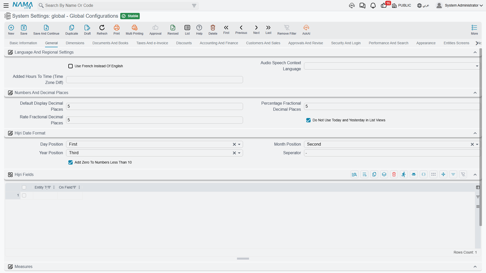

# General

The General tab holds the settings that don't belong to any one business area but shape how numbers, dates and text look everywhere: what the second interface language is, how many decimal places a rate carries, how a Hijri date is written, and what the three item measure fields mean.

## Language and regional settings

**Use French Instead of English** `value.info.useFrenchInsteadOfEnglish` — Nama ships with an Arabic and an English interface. Turning this on replaces the English side with French everywhere: menus, field labels, action names and report text. It is a swap, not an addition — you get Arabic and French, not all three.

**Audio Speech Context Language** `value.info.audioSpeechContextLanguage` — When a user dictates into a field instead of typing, the speech service needs to know which language and accent to expect. The choices are Egyptian Arabic, Saudi Arabic, Kuwaiti Arabic, US English and French. Picking the variant your users actually speak makes a noticeable difference to recognition accuracy.

**Added Hours to Time (Time Zone Diff)** `value.info.addedHoursToTime` — A fixed number of hours added whenever the system stamps the current time. This exists for the common case where the database server sits in one time zone and the business operates in another: rather than move the server, you shift the clock the application sees. Enter `3` if the business runs three hours ahead of the server, or `-2` if it runs two hours behind. Because it affects every "now" the system records, set it once at implementation and leave it alone.

## Numbers and decimal places

Nama stores amounts at full precision; these three settings control how many fractional digits are *kept and shown* for the three kinds of numbers that usually need more than two.

**Default Decimal Places** `value.info.defaultDisplayDecimalPlaces` *(default 5)* — Used for a decimal field that doesn't declare its own precision.

**Percentage Decimal Places** `value.info.percentageFractionalDecimalPlaces` *(default 5)* — Applies to every percentage field: discount and tax percentages, contracting assay percentages, point-of-sale percentages. Five places sounds generous, but percentages are usually intermediate values that get multiplied by large amounts, so the extra digits stop rounding errors from accumulating.

**Currency Rate Decimal Places** `value.info.rateFractionalDecimalPlaces` *(default 5)* — Applies to exchange-rate fields. Currencies with a large ratio to the base currency need the precision.

**Do Not Use Today and Yesterday for Dates in List Views** `value.info.doNotUseTodayAndYesterdayForDates` — By default a date within the last day or two is displayed as the words "Today" or "Yesterday", which reads well but hides the actual date. Turn this on when users need to see the real date everywhere — typically in operations where documents are compared by date all day long.

## Hijri date format

Nama can show a Hijri twin for any date field. These options decide how that Hijri date is written.

**Day Position** / **Month Position** / **Year Position** `value.info.hijriFormat.dayPosition`, `...monthPosition`, `...yearPosition` — Each part is placed First, Second or Third. The defaults give day-month-year; set day to Third and year to First for the year-first style.

**Separator** `value.info.hijriFormat.seperator` *(default `-`)* — The character between the parts.

**Add Zero to Numbers Less Than 10** `value.info.hijriFormat.addZeroToNumbersLessThan10` *(default on)* — Writes `05` instead of `5`, so dates line up in columns.

**Hijri Fields** `value.info.hijriFields` *(table)* — This is where you decide *which* dates get a Hijri twin. Each row names an entity and one of its date fields; the system then shows a matching Hijri field beside it on screen. Add only the dates that genuinely need it — a contract signature date, an employee hire date — rather than every date on every screen.

## Measures

Many businesses describe an item by three physical measures rather than a single quantity: a sheet of glass is 2 metres by 1.5, a length of cable is 200 metres. Nama carries three measure fields on document lines, and this group decides what they are called and how they combine.

**Length** / **Width** / **Height** `value.measuresConfiguration.length`, `...width`, `...height` — The label shown for each measure. Leaving one empty hides that measure from the screens that use them, which is what you want when only two of the three are meaningful.

**Separator** `value.measuresConfiguration.seperator` *(default `*`)* — The character used when the three measures are written as one descriptive string, giving `2*1.5`. The system restores the default if you save this empty.

**Calculate Count Based on Quantity** `value.info.calculateCountBasedOnQty` *(default on)* — With this on, the *count* on a line is derived from the quantity multiplied by the measures rather than typed by hand, so entering 10 sheets of 2 × 1.5 gives a count of 30 square metres automatically. The unit of measure decides which measures participate: a unit flagged to ignore length or width leaves that factor out of the multiplication.

## Notes and reloading

**Notes** `info` — A free text field on the configuration record itself. Useful for recording *why* an unusual option was switched on, and when.

The **Reload Configuration** action in the toolbar forces every server node to drop its cached copy and re-read the record. You rarely need it — saving already refreshes the cache — but it is the first thing to try if one node appears to be behaving differently from another.
