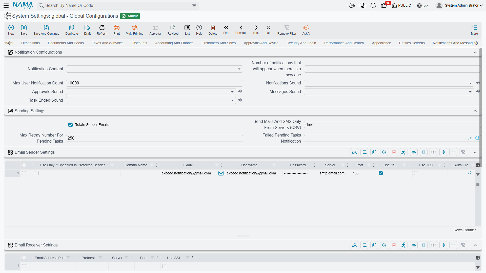

# Notifications and Messaging

Everything the system needs in order to tell someone something: in-app notifications and their sounds, and the email and SMS accounts it sends through.

For how notifications are defined and triggered, see the [Notifications system](../notifications/notifications-system.md) and [SMS and WhatsApp](../notifications/sms-and-whatsapp.md).

## Notifications

**Notification Content** `value.info.notificationContent` — Whether the notification text itself is shown (**View Content**) or only a neutral "you have a notification" hint (**Do Not View Content**). Choose Do Not View Content where notifications may carry salary figures, customer details or anything else that shouldn't sit on an unattended screen.

**Notifications Count** `value.info.notificationsCount` — How many notifications are listed in the panel.

**Maximum User Notification Count** `value.info.maxUserNotificationCount` *(default 10000)* — A retention cap per user. Once exceeded, the system raises a critical message. Without a cap, notification history on a busy installation grows without limit.

**Do Not Send Notifications To Delegated Employee** `value.info.doNotSendNotificationsToDelegates` — Normally, when an employee has an active delegation, notifications aimed at them are raised for their stand-in as well, marked with **Delegated From**. Tick this to switch that off everywhere. Prefer the **Do Not Apply Delegation** field on the individual notification definition when only a few sensitive notifications should stay with their original recipient — see [Notifications system](../notifications/notifications-system.md).

**Notifications Sound** / **Approvals Sound** / **Messages Sound** / **Task Ended Sound** `value.info.notificationsSound`, `value.info.approvalsSound`, `value.info.messagesSound`, `value.info.taskEndedSound` — Each can be **None** or one of five sounds. Giving approvals a distinct sound from general notifications is genuinely useful for people who approve all day; giving all four the same sound is just noise.

## Sending settings

**Rotate Sender Emails** `value.info.rotateSenderEmails` *(default on)* — Cycles through the configured sender accounts instead of always using the first. This spreads volume across accounts, which matters because most mail providers throttle a single account.

**Send Mails and SMS Only from Servers** `value.info.sendMailsAndSMSOnlyFromServers` — A list of server identifiers permitted to actually send. It defaults to this server's own identifier, and that default is a safety feature worth understanding.

::: warning This is what stops a test copy emailing your customers
When you restore a production database onto a test server, every scheduled notification comes with it. Because this field holds the *production* server's identifier and the test server's identifier is different, the test copy quietly declines to send anything. Leave it filled in, and when you deliberately move production to a new server, remember to update it — otherwise the new production server will stop sending too.
:::

**Maximum Retry Number for Pending Tasks** `value.info.maxRetrayNumForPendingTasks` *(default 250)* — How many times a pending task is retried before it is abandoned.

**Failed Pending Tasks Notification** `value.info.failedPendingTasksNotification` — The notification raised when a task finally gives up, so a human learns that messages are not going out.

## Email sender accounts

**Email Settings** `value.info.emailSettings` *(table)* — One row per sending account. Each row carries the **domain name**, **email**, **username**, **password**, **server**, **port**, and the **use SSL** / **use TLS** flags, plus an optional **OAuth file** for providers that require it rather than a password.

**Use Only If Preferred** marks an account that should be used only when something explicitly asks for it, rather than entering the general rotation.

The five dimension columns — legal entity, sector, branch, department, analysis set — let an account be scoped, so each company in a group sends from its own address.

::: info OAuth accounts are validated on save
If a row references an OAuth file, saving checks three things: the file must be authorised (open it and use Start OAuth if it isn't), it must be marked for sending emails from Gmail, and its user email must be identical to the row's username. Each failure names the file and says exactly what is wrong.
:::

## Email receiving

**Email Receiver Settings** `value.info.emailReceiverSettings` *(table)* — Incoming mail accounts, for workflows that create records from received email. Each row has an **email pattern**, a **protocol**, a **server**, a **port** and a **use SSL** flag.

## SMS providers

**SMS Settings** `value.info.smsSettings` *(table)* — One row per SMS or messaging provider, with the same five dimension columns for scoping.

Alongside **provider**, **sender**, **username**, **password** and **use only if preferred**, the row carries what a generic HTTP provider needs: **use POST method**, **HTTP headers**, **request body template**, **success indicator** (the text in the response that means it worked) and **other settings**.

**Phone Number Corrector** is a query that rewrites numbers into the format the provider expects — turning a locally stored `01012345678` into `201012345678`, for example.

::: warning Two providers have extra requirements
**WaboxApp** only accepts numbers in international format, so a phone number corrector is required — the system refuses to save the row without one. A **generic URL** provider requires the target URL in *other settings*, and likewise won't save without it. In both cases the error names the row.
:::

## Legacy mail server

**Server** / **Port** / **Connection Type** / **Authenticated** / **User Name** / **Password** `value.info.mailServerSettings.server` and friends — A single SMTP account, from before the sender table above existed. It is still used as a fallback when no row in the email settings table matches. New installations should configure the table and leave this empty.
