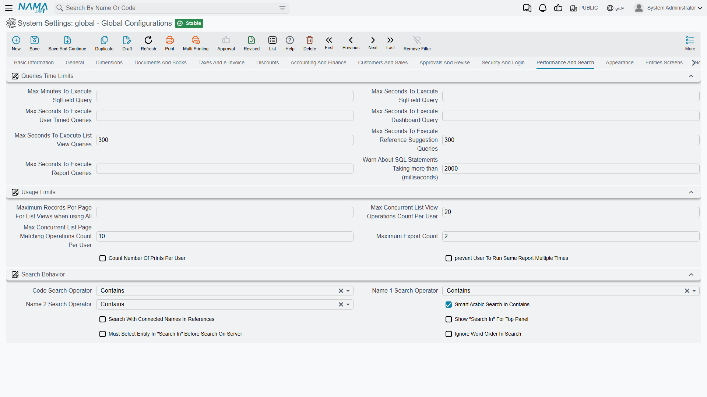

# Performance and Search

Two related concerns live on this tab. The first is protecting the server from work that will never finish: query time limits and per-user caps. The second is how searching behaves, which is both a usability question and — because of how databases use indexes — a performance one.

## Query time limits

Each of these caps how long one kind of query may run before it is abandoned. They exist because a single badly written filter can otherwise occupy a database connection indefinitely and slow the system for everyone.

**Maximum Minutes to Execute SQL Field Query** `value.info.maxMinutesToExecuteSqlFieldQuery` — Ceiling in minutes for an SQL field query.

**Maximum Seconds to Execute SQL Field Query** `value.info.maxSecondsToExecuteSqlFieldQuery` — The same limit expressed in seconds, for finer control.

**Maximum Seconds to Execute User Timed Queries** `value.info.maxSecondsToExecuteUserTimedQueries` — For queries users schedule themselves.

**Maximum Seconds to Execute Dashboard Query** `value.info.maxSecondsToExecuteDashboardQuery` — For dashboard widgets. Worth setting fairly low: a dashboard is meant to load at a glance, and a widget that takes half a minute is broken whether or not it eventually returns.

**Maximum Seconds to Execute List View Queries** `value.info.maxSecondsToExecuteListViewQueries` *(default 300)* — For list views.

**Maximum Seconds to Execute List Page Queries** `value.info.maxSecondsToExecuteListPageQueries` *(default 300)* — For list pages embedded in a record.

**Maximum Seconds to Execute Reports Queries** `value.info.maxSecondsToExecuteReportsQueries` — For report queries. This is usually the most generous of the set, since a heavy month-end report legitimately takes minutes.

**Log SQL Statements Taking (ms)** `value.info.logSqlStatementsTakingMS` *(default 2000)* — Any statement slower than this is written to the log. This is the setting to reach for when the system "feels slow" and nobody can say where: lower it for a day, read the log, then put it back. An entity flow can also override it for a single run.

## Usage limits

**Maximum Records per Page for List Views** `value.info.maxRecordsPerPageForListViews` — Caps the page size a user can request. Without it, someone will eventually ask for fifty thousand rows in one page.

**Maximum List Views per User** `value.info.maxListViewCountPerUser` *(default 20)* — How many saved list views one user may keep.

**Maximum List Page Matching References per User** `value.info.maxListPageMatchingRefCountPerUser` *(default 10)* — How many matching-reference list pages one user may keep.

**Maximum Export Count** `value.info.maxExportCount` *(default 2)* — How many exports a user may run. A per-user setting overrides this where someone genuinely needs more.

**Count Prints per User** `value.info.countPrintsPerUser` — Records each print against the user in the action history and enforces per-report print limits. Turn it on where printing is controlled — price lists, certificates, anything with a cost per copy.

**Prevent User from Running Same Report Multiple Times** `value.info.prevUserToRunSameRepMultipleTimes` — Stops a user launching a report again while their previous run is still going. This one solves a real and common problem: a slow report appears to hang, the user clicks again, and now two copies compete for the same database.

## Search behaviour

**Code Search Operator** `value.info.codeSearchOperator` *(default Contains)* — How a search on the code field is matched: **Contains**, **Starts With** or **Ends With**.

**Name 1 Search Operator** / **Name 2 Search Operator** `value.info.name1SearchOperator`, `value.info.name2SearchOperator` *(both default Contains)* — The same for the Arabic and English name fields.

::: tip Starts With is dramatically faster
*Contains* cannot use a database index — the server has to read every row and inspect the text. *Starts With* can, and on a table with millions of records the difference is between an instant answer and a visible wait. If searching has become slow as your data grew, switching code to *Starts With* is usually the single most effective change available on this screen.
:::

::: info The same choice, one lookup at a time
The three operators above apply to every search in the system. When only one master file is heavy enough to matter, the search operator can be set on that reference field alone in [Fields and Entities Settings](/platform/fields-and-entities-settings/fields-settings-reference-lookups) — which is also where you add extra columns and extra codes for a lookup to search in, so users can find a customer by phone number or tax number rather than by name.
:::

**Smart Arabic Search in Contains** `value.info.smartArabicSearchInContains` *(default on)* — Arabic is written inconsistently: أ, إ, آ and ا are typed interchangeably, as are ة and ه, and ى and ي. With this on the system expands those letters to their variants, so a user searching for محمد finds محمد however the name was originally typed. Almost always worth keeping on for Arabic data.

**Search with Connected Names in References** `value.info.searchWithConnectedNamesInRefs` — Reference suggestions also match against related record names, so typing a customer's name can find the contract that belongs to them.

**Show Search In for Top Panel** `value.info.showSearchInForTopPanel` — Adds the "search in" entity selector to the top search bar, letting the user narrow a global search to one kind of record.

**Must Select Entity in Search In Before Search on Server** `value.info.mustSelectEntityInSearchInBeforeSearchOnServer` — Requires the user to pick an entity there before any server search runs. On a large database this prevents an unfocused search from scanning everything. It depends on the option above — the system refuses to save it without the selector being shown, and says so.

**Ignore Word Order in Search** `value.info.ignoreWordOrderInSearch` — Normally the text a user types has to appear in the record exactly as typed and in that order, so a search for محمد أحمد finds nothing when the customer was entered as أحمد علي محمد. Turn this on and the typed text is split into words: a record matches when it contains all of them, in any order. It applies to reference lookups and to searching the code and name fields in lists. This is worth having wherever names are long and inconsistently ordered — Arabic personal names above all, where the same person is filed differently by different people.

::: warning It does not make searching faster
Matching words in any order still cannot use a database index; the server reads every row exactly as it does for *Contains*. If searching is slow this is not the fix, *Starts With* above is. And a search operator set on one reference field in [Fields and Entities Settings](/platform/fields-and-entities-settings/fields-settings-reference-lookups) still overrides this.
:::
