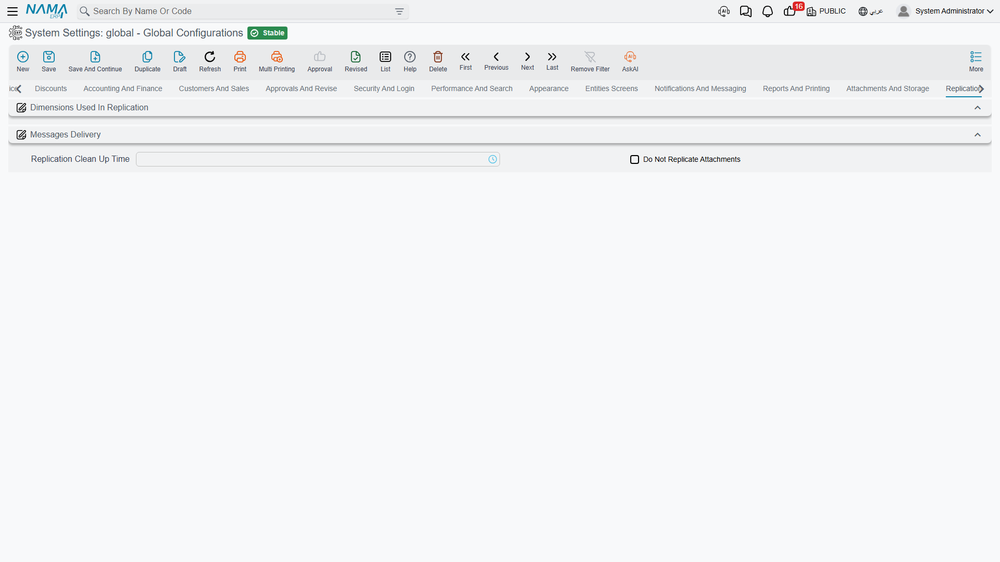

# Replication

Replication keeps several Nama sites in step — a head office and its branches, or servers in different countries. Records created at one site are packaged as messages and delivered to the others. This tab decides which records travel where, and what happens when delivery fails.

::: tip You may not see this tab's options
Replication is licensed separately, and its options are hidden entirely rather than greyed out when the licence is absent. The screenshot above is from an installation without it — only the two group headers and the handful of options that aren't licence-gated appear. On a licensed installation the same tab carries all the fields described below plus two tables.
:::

## Dimensions used in replication

The first question replication has to answer is *which site does this record belong to?* — and the answer comes from the record's dimensions. These five switches decide which dimensions take part.

**Use Legal Entity in Replication** `value.info.useLegalEntityInReplication` — The legal entity participates in routing.

**Use Sector in Replication** `value.info.useSectorInReplication`, **Use Branch in Replication** `value.info.useBranchInReplication` *(default on)*, **Use Department in Replication** `value.info.useDepartmentInReplication`, **Use Analysis Set in Replication** `value.info.useAnalysisSetInReplication` — The same for the other four.

Branch is on by default because the usual topology is one server per branch. Enable a second dimension only where routing genuinely depends on it — every dimension you add makes the routing rules harder to reason about when a record doesn't arrive where it was expected.

## Message delivery

**Maximum Trials for Messages** `value.info.maxTrialsForMessages` *(default 0, meaning unlimited)* — How many times delivery of a replication message is attempted before it is given up on.

**Request Re-commit After Failures** `value.info.requestReCommitAfterFailures` — After repeated failures, asks the originating site to commit the record again rather than continuing to retry the same message.

**Replication Clean-up Time** `value.info.replicationCleanUpTime` — The time of day when delivered messages are purged. Set it to a quiet hour: the clean-up touches a lot of rows.

**Do Not Replicate Attachments** `value.info.donotReplicateAttachments` — Leaves attachments out of replication payloads. Frequently the right choice on a slow or metered link, where a few scanned pages can hold up every other message behind them.

**Prevent Using Branches When Head Office Is Online** `value.info.preventUsingBranchesWhenHeadOfficeIsOnline` — Branch servers refuse to work locally while the head office is reachable, so everyone writes to one place and there is nothing to reconcile. The branch server becomes a fallback for when the link is down rather than a peer.

**Prevent Using Branches When Head Office Is Online Timeout** `value.info.preventUsingBranchesWhenHeadOfficeIsOnlineTimeout` *(default 60)* — How many seconds without an answer before the head office counts as unreachable and the branch takes over. Too short and a slow link flips the branch into local mode repeatedly; too long and staff wait a minute before they can work during a genuine outage.

**Replication Book Arabic Error** / **English Error** `value.info.replicationBookArabicError`, `value.info.replicationBookEnglishError` — The message shown when someone tries to create a record on the wrong site for its auto-coder's replication site. Both accept two placeholders: `{0}` is the server the record should have been created on, and `{1}` is the replication site the coder belongs to. The defaults already name both, which is what makes this error self-explanatory to a branch user.

## What not to replicate

**Do Not Replicate** `value.info.doNotReplicate` *(table)* — Entity types that never replicate. Each row names an entity type, or a list of them. Use it for anything genuinely local — a site's own hardware configuration, for instance.

**No Replication in Sites** `value.info.noReplicationInSites` *(table)* — More selective: each row names an entity type *and* a replication site, so a record type can be shared with most sites but withheld from one. This is how you keep, say, payroll data out of a site that has no business seeing it.
