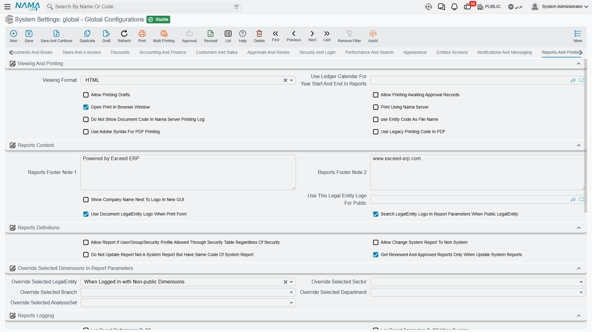

# Reports and Printing

Everything about producing output: the format a report opens in, what appears on the printed page, how dimension parameters are filled, what is logged, how values are formatted, and how Excel exports are built.

For writing and running reports, see the [Reports guide](../reports/reports-guide.md).

## Viewing and printing

**Viewing Format** `value.info.viewingFormat` *(default HTML)* — Whether a report opens as **HTML**, **PDF** or **XLSX**. HTML renders faster and reflows on screen; PDF is what people want when the report is going to be printed or emailed as-is; XLSX hands the reader a spreadsheet to work in. A report definition and a user's own settings can each override this.

**Use Ledger Calendar for Year Start and End in Reports** `value.info.useLedgerCalendarForYearStartAndEndInReports` — Points at a ledger whose fiscal calendar defines what "start of year" and "end of year" mean in report parameters. Essential where the financial year doesn't run January to December.

**Allow Printing Drafts** `value.info.allowPrintingDrafts` *(default off)* — Whether a draft may be printed. Off by default because a printed draft looks exactly like a printed document to whoever receives it.

**Allow Printing Awaiting Approval Records** `value.info.allowPrintingAwaitingApprovalRecords` *(default off)* — The same question for records still waiting on an approval.

**Open Print in Browser Window** `value.info.openPrintInBrowserWindow` — Output opens in a browser window instead of the built-in viewer, letting users use the browser's own print dialog.

**Print Using Nama Server** `value.info.printUsingNamaServer` — Routes printing through the Nama direct-printing agent, which sends output straight to a named printer instead of through the browser. This is how you print a receipt to a counter printer without a dialog appearing.

**Do Not Show Document Code in Nama Server Printing Log** `value.info.doNotShowDocumentCodeInNamaServerPrintingLog` — Keeps document codes out of that agent's log.

**Use Entity Code for File Name** `value.info.useEntityCodeForFileName` — Names the exported or printed file after the record's code, so a saved invoice PDF is recognisable in a downloads folder.

**Use Adobe Syntax for PDF Printing** `value.info.useAdobeSyntaxForPDFPrinting` — Produces PDF using Adobe-compatible syntax. Try it if a particular viewer or printer mishandles your output.

**Use Legacy Printing Code in PDF** `value.info.useLegacyPrintingCodeInPDF` — Falls back to the older PDF rendering path, for layouts that depended on its behaviour.

## Report content

**Reports Footer Note 1** / **Note 2** `value.info.reportsFooterNote1`, `value.info.reportsFooterNote2` *(default "Powered by Nama ERP" and "www.namasoft.com")* — The two footer lines on every report. Most installations replace these with the company name and contact details.

**Show Company Name Next to Logo** `value.info.showCompanyNameNextToLogo` — Prints the company name beside the logo rather than relying on the logo alone.

**Use Logo for Public** `value.info.useLogoForPublic` — Which legal entity's logo to use when the record being printed is public and so has no legal entity of its own.

**Use Entity Legal Entity Logo When Printing Form** `value.info.useEntityLegalEntityLogoWhenPrintForm` *(default on)* — A printed form carries the logo of the record's own legal entity. In a group of companies this is what makes each subsidiary's invoice look like its own.

**When Public Legal Entity Search Legal Entity Logo in Report Parameters** `value.info.whenPublicLegalEntitySearchLegalEntityLogoInReportParameters` *(default on)* — For a public legal entity, look the logo up from the report's parameters instead.

## Report definitions

**Allow Report if User Allowed Through Security Table Regardless of Security** `value.info.allowReportIfUserAllowedThroughSecurityTableRegardlessOfSecurity` — A grant in the security table is enough to run a report even where normal security would refuse.

**Allow Change System Report to Non System** `value.info.allowChangeSystemReportToNonSystem` — Permits converting a system report into an ordinary one, so it can be edited locally.

**Do Not Update Report That Is Not a System Report but Has the Same Code** `value.info.dontUpdateReportNotASystemReportButHaveSameCodeOfSystemReport` — During a system-report refresh, leaves alone any user report that happens to share a system report's code.

::: warning The two above are linked
The system refuses to save *Allow Change System Report to Non System* unless the second option is also on, and says so. The reason is straightforward: converting a system report leaves a user report carrying a system code, and without the second option the next system-report update would overwrite your edits.
:::

**Fetch Reviewed and Approved Reports Only When Updating System Reports** `value.info.fetchReviewedAndApprovedReportsOnlyWhenUpdateSystemReports` — Restricts a system-report refresh to definitions that have been reviewed and approved.

## Dimension parameters in reports

**Override Selected Legal Entity / Sector / Branch / Department / Analysis Set** `value.info.overrideSelectedLegalEntity`, `...overrideSelectedSector`, `...overrideSelectedBranch`, `...overrideSelectedDepartment`, `...overrideSelectedAnalysisSet` — Each takes **Never**, **Always** or **When Not Public**, and decides whether the dimension the user currently has selected is forced into the report's matching parameter.

**Always** guarantees a user only ever reports on their own branch, at the cost of not being able to run a cross-branch report. **When Not Public** is the usual middle ground: force the dimension when the user is working inside one, leave the parameter free when they aren't. **Never** leaves the choice entirely to whoever runs the report.

## Report logging

**Log Report Performance to Database** `value.info.logReportPerformanceToDB` — Records how long each report took. This is the master switch for the three below.

**Log Parameters to Database** `value.info.logParametersToDB` — Also stores the parameter values each run was given, which is what lets you tell a slow report from a slow *set of parameters*.

**Log Exports to Database** `value.info.logExportsToDB` — Logs exports as well as report runs.

**Log Forms to Report Log** `value.info.logFormsToReportLog` — Includes printed forms in the same log.

::: info The three depend on the first
Turning on any of the three above while report performance logging is off is refused at save time with an explicit message naming the option. They record detail *about* a logged run, so there has to be a logged run to attach it to.
:::

**Add Report Runs to Action History** / **Add Export to Action History** `value.info.addReportRunsToActionHistory`, `value.info.addExportToActionHistory` — Write report runs and exports into the record's own action history. This is the audit-trail answer to "who exported this customer list?".

## Value patterns in reports

These control how numbers and dates are formatted in report output.

**Currency Pattern** `value.info.currencyPatternInReports` *(default `#,##0.00;(#,##0.00)`)* — Note the two halves separated by a semicolon: the second is used for negative values, so a negative amount prints in parentheses in the accounting style rather than with a minus sign.

**Quantity Pattern** `value.info.quantityPatternInReports` *(default `#,##0.##`)* — Trailing zeros are dropped, so a quantity of 5 prints as `5` and not `5.00`.

**Rate Pattern** / **Percent Pattern** `value.info.ratePatternInReports`, `value.info.percentPatternInReports` — For exchange rates and percentages.

**Date Pattern** `value.info.datePatternInReports` *(default `yyyy-MM-dd`)*, **Date Time Pattern** `value.info.dateTimePatternInReports` *(default `yyyy-MM-dd HH:mm:ss`)*, **Time Pattern** `value.info.timePatternInReports` *(default `hh:mm a`)* — Set these to whatever your readers expect; `dd/MM/yyyy` is the common alternative.

## Excel export

When a report is exported to Excel, the layout that looked right on a printed page usually looks wrong in a spreadsheet — page headers repeat, merged cells block sorting, and background graphics get in the way. These options clean that up.

**Detect Cell Type** `value.info.excelExportConfig.detectCellType` *(default on)* — Writes numbers as numbers and dates as dates rather than as text. This is the one that decides whether the exported sheet can be summed and sorted, so leave it on.

**White Background** *(on)*, **Prevent Row Span** *(on)*, **Ignore Cell Border** *(on)*, **Ignore Cell Background** , **Ignore Graphics** — Strip the visual styling that a spreadsheet doesn't need. Preventing row span in particular is what stops merged cells from breaking filters and sorting.

**Remove Empty Space Between Rows** / **Between Columns** `value.info.excelExportConfig.removeEmptySpaceBetweenRows`, `...removeEmptySpaceBetweenColumns` — Remove the spacer rows and columns that a print layout uses for margins.

**Remove Page Header** *(on)* and **Do Not Remove First Page Header** *(on)* — Together these keep the header once at the top and drop its repetition on every subsequent page, which is exactly what a spreadsheet wants.

**Remove Page Footer** *(on)*, **Remove Column Header** *(on)*, **Remove Column Footer** *(on)*, **Remove Report Title** *(on)* — Drop the remaining print furniture.

**Export Draft Version** `value.info.exportDraftVersion` *(default on)* — Exporting a record exports its draft version where one exists.
