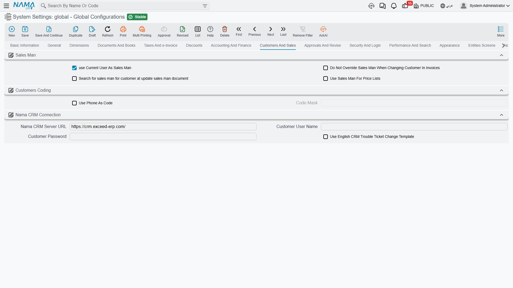

# Customers and Sales

A short tab with three unrelated jobs: deciding who counts as the salesman on a document, how customer codes are formed, and how this installation talks to Nama CRM.

## Salesman

The salesman on a sales document drives commission, targets and often pricing, so it matters that the right name lands there without anyone having to think about it. These four options describe how the system chooses.

**Use Current User as Salesman** `value.info.useCurrentUserAsSalesMan` *(default on)* — The logged-in user's employee record becomes the document's salesman, provided that employee is flagged as a salesman. This is the natural setting where the person entering the order is the person who sold it — a showroom, a counter, a field sales tablet.

**Do Not Override Salesman with Customer** `value.info.doNotOverrideSalesManWithCustomer` — Customers can have a default salesman, and selecting the customer normally applies it, overwriting whatever was there. With this on, a salesman already chosen on the document is left alone. Turn it on where the person selling is not always the customer's assigned representative.

**Search for Customer's Salesman in Sales Man Update Document** `value.info.salesManSearch` — The salesman lookup on a sales document goes through a customer-aware service instead of a plain search, so the list offered is the salesmen actually linked to that customer.

**Use Sales Man Instead of User for Prices** `value.info.useSalesManAsEmployeeForPriceLists` — Price lists can be resolved per employee. With this on, the *document's salesman* is the employee used for pricing; with it off, the *logged-in user's* employee is used. The difference matters in a back office where one clerk enters orders on behalf of many salespeople — there, the salesman is almost always the right answer.

## Customer coding

**Use User Phone as Code** `value.info.useUserPhoneAsCode` — The customer's phone number becomes the customer code. Retail and delivery businesses like this because the phone number is what the customer knows and what the call centre searches by.

**Code Mask** `value.info.userCodeMask` — A pattern the generated code must match, which is how you enforce a phone-number shape rather than accepting any digits. This is **required** when the option above is on; the system refuses to save otherwise.

## Nama CRM connection

Support tickets can be exchanged with a Nama CRM instance. These three settings are the connection to it.

**Nama CRM Server URL** `value.info.namaServerUrl` *(default `https://crm.namasoft.com/`)* — The address of the CRM instance.

**Customer User Name** / **Customer Password** `value.info.customerUserName`, `value.info.customerPassword` — The credentials this installation uses to authenticate against it.

**Use English Trouble Ticket Change Template** `value.info.useEnglishCRMTroubleTicketChangeTemplate` — Sends the English version of the ticket-change notification instead of the Arabic one.
