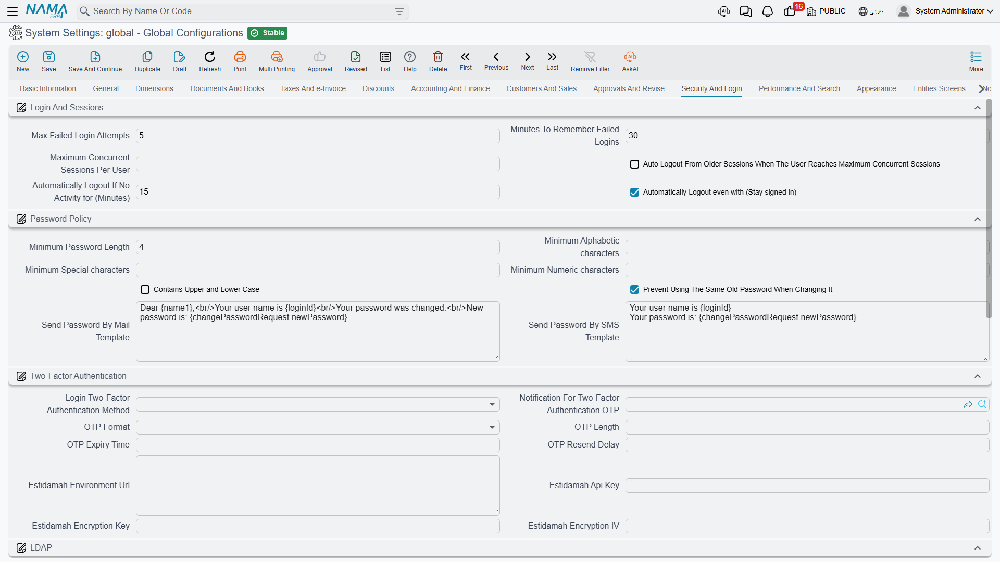

# Security and Login

Everything about getting into the system and what you can see once you are in: login attempts and sessions, password rules, two-factor authentication, LDAP, record-level visibility, and the public user-registration page.

For the wider picture of profiles and capabilities, see the [Security overview](../security/security-overview.md).

## Login and sessions

**Maximum Failed Login Attempts** `value.info.maxFailedLoginAttempts` *(default 5)* — Consecutive failures before the account is blocked.

**Minutes to Remember Failed Logins** `value.info.minutesToRememberFailedLogins` *(default 30)* — The window those failures are counted over. Five attempts in thirty minutes locks the account; the same five spread across a day do not. Together the two numbers separate a forgetful user from someone guessing passwords.

**Maximum Login Sessions** `value.info.maxLoginSessions` — How many sessions one user may hold at once. Leave it empty for no limit.

**Auto Logout with Maximum Sessions** `value.info.autoLogoutWithMaxSessions` — What happens at that limit: with this on, the oldest session is logged out to make room; with it off, the new login is refused. The first is kinder to users who left a session open on another machine.

**Auto Logout Time** `value.info.autoLogoutTime` *(default 15)* — Idle minutes before a session is closed automatically.

**Auto Logout Remember Me** `value.info.autoLogoutRememberMe` *(default on)* — Whether "remember me" sessions are also subject to that idle timeout.

## Password policy

These are checked whenever a password is set or changed.

**Minimum Password Length** `value.info.minPasswordLength` *(default 6)*, **Minimum Alphabetic Characters** `value.info.minAlphaChars`, **Minimum Special Characters** `value.info.minSpecialChars`, **Minimum Numeric Characters** `value.info.minNumbersChars`, **Upper and Lower Case** `value.info.upperAndLowerCase` — The usual complexity requirements.

**Prevent Same Password When Changing** `value.info.preventSamePasswordWhenChanging` *(default on)* — Refuses a "change" that sets the password back to what it already was.

**Send Password by Mail Template** / **Send Password by SMS Template** `value.info.sendPasswordByMailTemplate`, `value.info.sendPasswordBySMSTemplate` — The messages sent when a new password is delivered. Both accept placeholders — `{name1}` for the user's name, `{loginId}` for the login, and `{changePasswordRequest.newPassword}` for the new password itself.

## Two-factor authentication

**Login Two-Factor Authentication Method** `value.info.login2FAMethod` — The second factor required at login: **None**, **Authenticator App** (a rotating code from an app on the user's phone), **Message OTP** (a one-time code sent to the user), or **Estidamah API**.

**Notification for Two-Factor Authentication OTP** `value.info.notificationFor2FAOtp` — The notification that carries the code. **Required** when the method is Message OTP — the system refuses to save otherwise, since a code nobody receives locks everyone out.

**OTP Format** `value.info.otpFormat` — **Numeric**, **Alphanumeric** or **Alphabetic**. Numeric is easiest to read off a phone and type; alphanumeric is stronger for the same length.

**OTP Length** / **OTP Expiry Time** / **OTP Resend Delay** `value.info.otpLength`, `value.info.otpExpiryTime`, `value.info.otpResendDelay` — How long the code is, how long it stays valid, and how long a user must wait before asking for another. The resend delay is what stops a stuck user from triggering a flood of messages.

**Estidamah Environment URL**, **Estidamah Api Key**, **Estidamah Encryption Key**, **Estidamah Encryption IV** `value.info.estidamahEnvironmentUrl`, `value.info.estidamahApiKey`, `value.info.estidamahEncryptionKey`, `value.info.estidamahEncryptionIV` — Endpoint and cryptographic material for the Estidamah service. All four are required when that method is selected.

::: warning Estidamah needs a server setting too
Selecting the Estidamah method also requires the custom password validator to be enabled in the server's `nama.properties` file (`use-custom-password-validator=true`). The configuration refuses to save until that is in place, and tells you exactly which setting is missing.
:::

## LDAP

**Use LDAP for Users Login** `value.info.useLDAPForUsersLogin` — Authenticates users against your directory server instead of against passwords held in Nama.

**LDAP Server URL** / **Default LDAP Domain** `value.info.ldapServerURL`, `value.info.defaultLDAPDomain` — The directory server address and the domain assumed when a user types a bare user name.

::: warning LDAP also needs a server setting
Like Estidamah, this requires `use-ldap-for-authentication=true` in `nama.properties` before the configuration will save.
:::

## Record security

**Allow Disabling Code Field with Security** `value.info.allowDisablingCodeFieldWithSecurity` *(default on)* — Permits a security profile to disable the Code field.

**Allow Filling Disabled Fields with Creators** `value.info.allowFillingDisabledFieldsWithCreators` *(default on)* — Lets the system's own field creators write into fields the user is not allowed to edit. Usually what you want: a user who may not type the branch by hand should still get it filled in automatically.

**Merge Alternate Security Profiles into Main User** `value.info.mergeAlternateSecurityProfilesIntoMainUser` — A user can hold alternate profiles. Normally they are switched between; with this on, they are merged into one effective set of permissions, so the user always has the union of what all their profiles allow.

**Display Prevented Records** `value.info.displayPreventedRecords` — Records the user has no view capability for are still listed (blocked, not opened) instead of vanishing. Some organisations prefer the visible "you may not see this" to a silently shorter list.

**Do Not Display Prevented Records in List View** `value.info.doNotdispPrevRecInListView` — The same decision taken separately for list views. Both can also be set per security profile, which overrides what is set here.

**Display Records with Update Capability to Users** `value.info.displayRecordsWithUpdateCapabilityToUsers` — A record becomes visible if the user has *either* the view or the update capability, rather than requiring view specifically. Fixes the surprising case of a user who may edit a record but not see it.

**Ignore Record Capabilities in All List Views** `value.info.ignoreRecordCapabilitiesInAllListViews` — Switches record-capability filtering off across every list view.

**Ignore Record Capabilities In** `value.info.ignoreRecordCapabilitiesIn` *(table)* — The same, restricted to the entity types you list. Prefer this over the blanket option above.

**Prevent Delete User Related to Entity System Entries** `value.info.preventDeleteUserRelatedToEntitySystemEntries` *(default on)* — Refuses to delete a user that system entries still reference. Leave it on — deleting such a user breaks the audit trail those entries represent.

## User add requests

Nama can expose a public page where new users request an account. These settings control it.

**User Add Request Term** / **User Add Request Book** `value.info.userAddRequestTerm`, `value.info.userAddRequestBook` — The document term and book used for the requests that page creates.

**Do Not Display Employee / Contractor / Customer / Supplier Type** `value.info.dontDisplayEmployeeType`, `...dontDisplayContractorType`, `...dontDisplayCustomerType`, `...dontDisplaySupplierType` — Removes each account type from the choices the public page offers. A business that only registers customers should switch off the other three.

**User Add Request Welcome Message (Arabic)** / **(English)** `value.info.userAddRequestWelcomeMessageAr`, `value.info.userAddRequestWelcomeMessageEn` — The text shown to someone arriving on that page, in each language.
