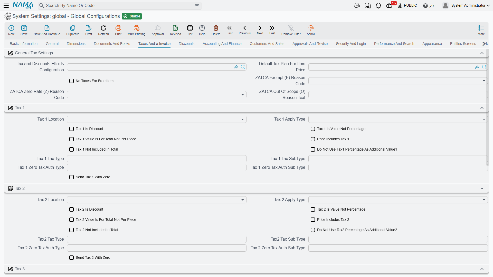

# Taxes and e-Invoice

Nama carries four independent taxes on every document line. They are deliberately generic: tax 1 is usually VAT, but tax 2 might be a withholding deduction, tax 3 a municipality fee and tax 4 a stamp duty. What each one *is* comes entirely from how you configure it here.

Because the same settings are used by the server, by the web client while the user types, and by the point-of-sale terminal, all three arrive at the same figure — which is why it matters that they are set once, centrally, and understood.

## How a tax is described

Each of the four taxes gets an identical group of options. Rather than repeat them four times, here is what each one means, using tax *N* to stand for any of them.

**Tax N Location** `value.info.taxNLocation` — Which money slot on the line the calculated tax is written into: the main price, one of the eight discounts, or the header discount. This is what lets a "tax" behave as a deduction — point it at a discount slot and it reduces the line rather than adding to it.

**Tax N Apply Type** `value.info.taxNApplyType` — The base the percentage is applied to, and the single most consequential choice in this group. The options walk down the line calculation: **Total Price**, **After Discount 1 Price** through **After Discount 8 Price**, **After Header Discount**, the value of any single discount, the invoice discount value, the value of another tax, or **Custom**. A VAT that should be charged on the net after all trade discounts is *After Discount N Price* for whichever discount is last in your chain; a tax charged on the gross is *Total Price*.

**Tax N Is Discount** `value.info.taxNIsDiscount` — Marks the tax as a deduction rather than an addition. Withholding tax is the usual case: it is computed like a tax but subtracted from what the customer pays.

**Tax N Is Value** `value.info.taxNIsValue` — The tax is entered as an absolute amount instead of a percentage. Use it for fixed per-unit levies.

**Tax N Value Is for Total** `value.info.taxNValueIsForTotal` — Read together with the option above: when the tax is a value, is that value per unit or for the whole line? On means the whole line.

**Price Includes Tax N** `value.info.priceIncludesTax` (tax 1), `value.info.priceIncludesTax2`, `...3`, `...4` — The unit price already contains this tax, so the system extracts it rather than adding it on top. This is the retail case: the shelf price is what the customer pays and the VAT has to be worked backwards out of it.

**Tax N Not Included in Total** `value.info.taxNNotIncludedInTotal` — The tax is calculated and displayed, but left out of the document total. Used for informational taxes that are reported but not collected on this document.

**Do Not Use Tax N Percentage as Additional Value N** `value.info.doNotUseTaxNPercentageAsAdditionalValueN` — The tax percentage is normally mirrored into the line's additional-value field, where reports and integrations can pick it up. Turn this on when you want that field for something else.

**Tax N Authority Type / Sub Type** `value.info.taxesCodes.taxNTaxAuthType`, `...taxNTaxAuthSubType` — The codes the tax authority expects for this tax on an electronic invoice.

**Tax N Zero Authority Type / Sub Type** `value.info.taxesCodes.taxNZeroTaxAuthType`, `...taxNZeroTaxAuthSubType` — The codes used instead when the tax evaluates to zero, since most authorities want a zero-rated supply reported under a different code than a taxed one.

**Send Tax N with Zero** `value.info.taxesCodes.sendTaxNWithZero` — Include the tax element in the submission even when its value is zero. Some authorities require the line to be present; others reject it.

::: tip Work out the chain before setting anything
Location, apply type and the discount settings on the [Discounts tab](./global-config-discounts.md) together describe one calculation chain. Write out a real invoice line on paper — list price, each discount, each tax, the total the customer actually pays — and only then set the options so the system reproduces it. Changing an apply type later changes the arithmetic on every document that gets recalculated.
:::

## General tax settings

**Effects Configuration** `value.info.effectsConfig` — Points at a Tax and Discount Effects Configuration file. This is the general-purpose alternative to the fixed chain above: instead of the built-in order of discounts and taxes, that file defines up to thirteen money effects, their order, and exactly what each one is calculated on. Reach for it when your calculation genuinely cannot be expressed with the standard settings.

**Default Tax Plan for Item Price** `value.info.defaultTaxPlanForItemPrice` — The tax plan assumed when pricing an item that has none of its own.

**No Taxes for Free Item** `value.info.noTaxesForFreeItem` — Zeroes all four taxes on lines flagged as free items, so a promotional giveaway doesn't generate tax on a zero price.

**VAT Exempt Reason Code** `value.info.taxesCodes.vatExemptReasonCode` — The default exemption reason sent with exempt supplies.

**VAT Zero Rate Reason Code** `value.info.taxesCodes.vatZeroRateReasonCode` — The default reason sent with zero-rated supplies.

**VAT Out of Scope Reason Text** `value.info.taxesCodes.vatOutOfScopeReasonText` — Free text used as the reason for supplies outside the scope of VAT.

## Approximation discount

Cash businesses often round the invoice total to something payable — a total of 99.87 becomes 100.00, or the other way round — and book the difference somewhere sensible.

**Activate Approximation Discount** `value.info.activateApproximationDiscount` — Enables the rounding.

**Approximation Discount Value** `value.info.approximationDiscountValue` — The rounding step. Set it to the smallest coin you actually handle: `0.05` if you have no smaller coin than five piastres.

**Consider Vouchers Payment with Approximation Discount** `value.info.considerVouchersPaymentWithApproxDisc` — Includes voucher payments in the amount being rounded, rather than rounding only the cash part.

These three decide *whether* and *how far* to round. *Where* the rounded-off amount is booked is a per-document decision: each document term carries its own approximation discount account side, and sales terms add a switch for payments flagged *Do Not Affect Remaining* — see [Accounting Effects Configuration](/modules/supplychain/document-terms/doc-term-accounting-effects#Approximation-Discount).

## Electronic invoice

**e-Invoice Page Show Type** `value.info.einvoicePageShowType` — Nama supports several national e-invoicing regimes, and each adds its own page of fields to tax-related screens. Choose **Egypt**, **ZATCA** (Saudi Arabia), **JoFotara** (Jordan), **UAE**, or **All Pages**. Pick the one country you operate in and the other regimes' fields disappear — a large reduction in screen clutter. Leaving it empty behaves like Egypt.

**Maximum Number of Lines When Collecting Tax Authority Documents** `value.info.maxNumberOfLinesWhenCollectTaxAuthDocs` — When documents are gathered for submission to the authority, this caps how many go into one batch. Lower it if submissions time out; raise it to submit fewer, larger batches.
