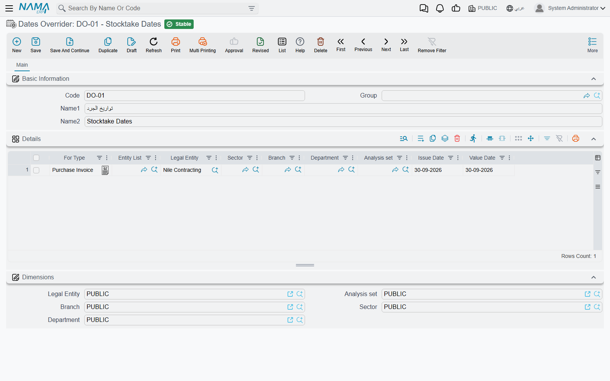

# Freezing the Past and Overriding Document Dates

Two small screens decide *which dates a document may carry*. One draws a line under the past so
that nothing dated before it can be changed or recalculated. The other decides what issue date and
value date a brand-new document opens with. They are unrelated in purpose, but support meets them
the same way: a customer reports that a date "is wrong" or "cannot be used", and the cause is a
record nobody remembers creating.

## Freeze Processing Document

**Accounting → Documents → Freeze Processing Document**

Imagine the auditors have signed off the first half of the year. The figures are final, the tax
returns are filed, and nobody should be able to post, edit or recalculate anything dated before
30 June — but the year is not over, so there is no closing entry to draw that line. The **Freeze
Processing Document** draws it.

The document has nothing to fill in beyond the usual header: a **Value Date** and the dimensions,
of which only the **Legal Entity** matters. Once committed, it freezes everything dated **on or
before** its value date for that legal entity:

- **Saving is refused.** Any document of that legal entity that produces accounting or inventory
  effects — anything processed in the background — cannot be saved with its effects dated on or
  before the line, in any module. It is the same refusal a closing entry produces, with the same
  message. Documents with no such effects are not affected.
- **Moving a document across the line is refused.** A document dated before the line cannot have
  its value date pushed after it.
- **Background processing leaves the past alone.** Ledger and cost processing that would land on or
  before the line is skipped. A late purchase receipt therefore no longer ripples cost changes back
  into frozen issues, and reprocessing a frozen document does not rebuild its journal — unless one
  of the recovery switches described on the year-end page has been turned on.

The line is shared with closing entries. For each legal entity the system takes the latest
**committed** closing entry and the latest **committed** freeze document and uses whichever is later
— so the two never stack, and the later one always wins. Everything said in
[Year-End Closing & Period Control](/modules/accounting/year-end-and-period-control) about working around a
closing entry applies here word for word.

::: warning Only Namasoft support can create or delete one
A freeze document belongs to the protected L3Critical security level. Saving or deleting one from an
ordinary session is refused with
*"You are not authorized to change the field  {0} because it belongs to the security level {1}, please contact technical support team"*
— the same gate that protects the most dangerous global-configuration options. A customer who needs
the past frozen, or un-frozen, asks Namasoft support to do it from a support session.
:::

To lift the freeze, support deletes the document (or replaces it with one dated earlier). There is no
inactive flag: while a committed freeze document exists, its line holds.

::: tip The screen name stays in English
The screen has no Arabic title, so Arabic users see **Freeze Processing Document** in the menu and in
the messages.
:::

### Freeze document or closed period?

Both stop people posting into the past, but they work differently. A closed **fiscal period**
([Fiscal Period Control](/platform/governance/fiscal-period-control-guide)) rejects new transactions in that
period and can be re-opened from the **Fiscal Year** screen. A freeze document is a
single date for the whole legal entity, also stops background recalculation, and only support can
move it. Use periods for the monthly close; reserve the freeze for a past that must not change at all.

## Dates Overrider

**Basic → Settings → Dates Overrider**

Every new document opens with today's date as both its issue date and its value date. That is wrong
for a team that is still entering last month's paperwork, or for a branch that has been told to back
date everything to the end of a stocktake. The **Dates Overrider** changes the starting dates instead
of relying on every user to remember to change them.

The screen is a single grid. Each line says: *for these documents, opened by someone working under
these dimensions, start with these dates.*

| Column | What it does |
|---|---|
| **For Type** | One document type the line applies to. |
| **Entity List** | A saved list of document types, for when one line should cover several. Leave both this and **For Type** empty to cover every document type. |
| **Legal Entity**, **Sector**, **Branch**, **Department**, **Analysis set** | The working dimensions the line is for. |
| **Issue Date** | The issue date a new document should start with. Leave it empty to keep the normal default. |
| **Value Date** | The value date a new document should start with. Leave it empty to keep the normal default. |

It acts only at the moment a **new document** is opened. The user can still change either date before
saving, and documents that already exist are never touched. Master files have no issue or value date,
so they are not affected.

### How a line is chosen

The dimensions are matched against the five dimensions the **user is working under** — the ones chosen
at login or in the dimensions switcher — not against the document. All five must match exactly, and a
blank dimension cell in the grid stands for the PUBLIC value, **not** for "any". So a line that
names only the legal entity applies to a user whose sector, branch, department and analysis set are
all PUBLIC; a user working under a particular branch is not covered by it. If you want the same dates
for three branches, write three lines.

For a matching set of dimensions, a line naming the document type (directly or through its entity
list) wins over a line with no type. If neither exists, the document opens with today's date as usual.

A change to the Dates Overrider takes effect on the next document opened — nobody needs to log out.

::: tip "Every new invoice opens on the 31st"
When a customer reports that new documents keep opening on an old date, open the Dates Overrider
before anything else. A line left behind after a stocktake or a year-end catch-up is the usual cause,
and deleting it, or clearing its date columns, fixes it at once.
:::

## Messages you may see

| Message | Why | What to do |
|---|---|---|
| *You can not edit the document {0} at date {1} because there is a closing entry on {2}* — «لا يمكن تعديل المستند {0} بتاريخ {1} لانه يوجد قيد ختامى بتاريخ {2}» | The document's date is on or before the line drawn by the latest committed closing entry **or** freeze document of its legal entity. | If no closing entry explains the date in `{2}`, look for a Freeze Processing Document dated `{2}`. Enter the document at a later date, or ask support whether the freeze should move. |
| *You can not change the document {0} value date from {1} to {2} because there is a closing entry on {3}* — «لا يمكن تعديل التاريخ الفعلى للمستند {0} من تاريخ {1} الى تاريخ {2} لانه يوجد قيد ختامى بتاريخ {3}» | The document sits before the line and someone tried to move it after it. | Leave the frozen document as it is and record the correction as a new document after the line. |
| *You are not authorized to change the field  {0} because it belongs to the security level {1}, please contact technical support team* — «انت لا تمتلك صلاحية التعديل على الحقل {0} لأنه ينتمى لمستوى الأمان {1} برجاء التواصل مع الدعم الفنى» | Someone tried to save or delete a Freeze Processing Document from an ordinary session. | Only Namasoft support can create, change or delete a freeze document. |
