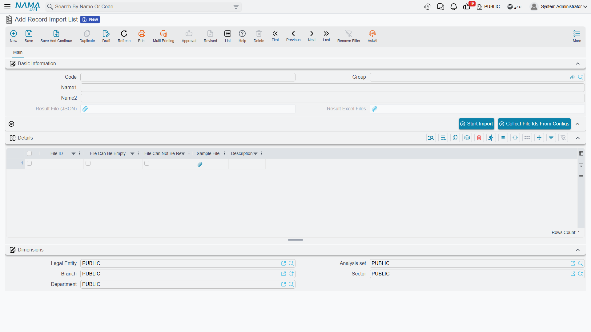
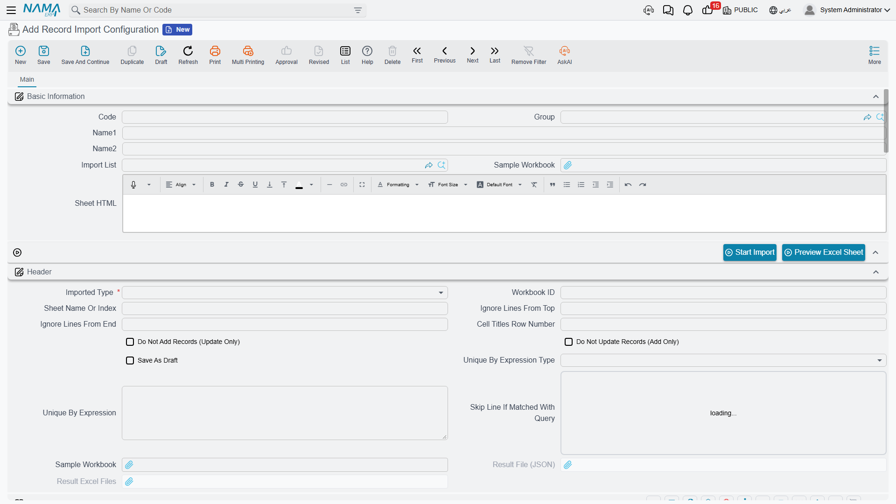
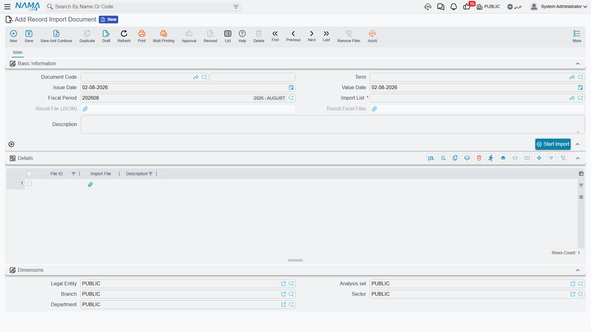

# Advanced Record Import

The ordinary [Import Records](/platform/import-export/importing-records.md) command has one requirement that quietly rules out half of real-world data loading: the file must be in Nama's own layout. That is easy when you exported it yourself. It is impossible when the file comes from somewhere else.

A supplier sends a price list with their own headings and their own column order. A bank sends a statement with three rows of letterhead on top and a totals row at the bottom. A legacy system produces a customer extract in which the branch is a code you have to translate, the date is written `31/12/2024` in one column and `2024-12-31` in another, and half the rows are blanks you must skip.

You could reshape each of these by hand, every month, and hope nobody miscounts a column. Advanced Record Import is the alternative: describe the foreign sheet's layout **once**, then feed it new files forever.

::: info Licensing
The three screens on this page require the **advanced import** licence (`basic-advanced-import`) and live under **Basic → Settings**. The ordinary Import Records command needs no extra licence.
:::

## How the Three Screens Fit Together

The design separates *what a load consists of*, *how each file is read*, and *this month's actual run*. That separation is what makes the setup reusable.

**Record Import List** (قائمة استيراد سجلات) names the load. "Opening balances" might consist of four files: customers, items, opening stock, opening ledger. The list gives each of them an identifier and says whether it is optional.

**Record Import Configuration** (إعدادات استيراد سجلات) describes one file — really one *sheet* of one file. Where the headings are, which rows to skip, which entity type the rows become, and which cell feeds which field. You write one configuration per file in the list.

**Record Import Document** (مستند استيراد سجلات) is the run. It points at a list, you attach this month's actual files, and you press the button.

Set the first two up once; from then on, everyday use is only the third.

## Record Import List

A short screen. The **Details** grid is the whole point of it — one row per file the load expects:

| Column | Arabic label | Purpose |
|---|---|---|
| **File ID** | معرف الملف | A short identifier for this file, like `customers` or `opening-stock`. It is the handle everything else uses: the configuration says which File ID it describes, and the import document says which File ID each uploaded file is. |
| **File Can Be Empty** | يمكن ترك الملف فارغا | Tick it and a run may proceed without this file. Leave it clear and the file is required. |
| **File Can Not Be Repeated** | يمكن تكرار الملف | Prevents the same file being supplied more than once in a run. |
| **Sample File** | ملف (عينة) | Attach a specimen of what this file should look like, so whoever prepares next month's data has something to copy. |
| **Description** | ملاحظات | Free notes. Worth filling in — it is what the person preparing the files reads. |

Two buttons sit above the grid. **Collect File Ids From Configs** (تجميع معرفات الملفات) fills the grid for you from the configurations that already reference this list, which is easier than typing the identifiers twice. **Start Import** runs the whole list.

The greyed **Result File (JSON)** and **Result Excel Files** fields at the top are filled by the system after a run — they hold what came back.

## Record Import Configuration

This is where the work is. One configuration describes one sheet and turns its rows into records of one entity type.

### Getting your bearings

Before mapping anything, attach a **Sample Workbook** and press **Preview Excel Sheet** (مطالعة شيت إكسيل). It asks which file, which sheet (by name or number, defaulting to the first) and how many rows to show (fifty by default), then renders the sheet into the **Sheet HTML** box on screen. Now you can see the real columns and their real letters while you fill in the mapping, instead of switching back and forth to Excel.

**Import List** links this configuration to the list it belongs to.

### The Header block — where the data actually starts

Foreign spreadsheets almost never start with data on row one. The **Header** group is how you tell the system to look past the decoration:

| Field | Arabic label | Purpose |
|---|---|---|
| **Imported Type** | نوع السجل الذي تريد استيراده | Required. Which entity type these rows become. |
| **Workbook ID** | معرف الملف | Which File ID from the import list this configuration describes. |
| **Sheet Name Or Index** | اسم الشيت أو رقمه | Which sheet inside the workbook. |
| **Ignore Lines From Top** | | Skip this many rows of letterhead before the data. |
| **Cell Titles Row Number** | رقم سطر عناوين الخلايا | Which row holds the column headings, so columns can be matched by their title rather than their letter. |
| **Ignore Lines From End** | | Skip this many rows at the bottom — the totals row, the signature line. |
| **Skip Line If Matched With Query** | | Drop rows that match a condition, for the awkward cases the row counts above cannot express. |
| **Unique By Expression Type** / **Unique By Expression** | | Build a key from the row's values so that repeated rows collapse onto one record instead of creating duplicates. |
| **Do Not Add Records (Update Only)** | عدم إضافة السجلات (تحديث فقط) | Refuse to create anything; only update what exists. |
| **Do Not Update Records (Add Only)** | عدم تحديث السجلات الموجودة (إضافة فقط) | Refuse to overwrite anything; only create. |
| **Save As Draft** | الحفظ كمسودة | Leave the imported records as drafts for review. |

::: tip Match columns by title, not by letter
Fill in **Cell Titles Row Number** and then map each field to a **Cell Title** rather than a **Cell Name**. The mapping then survives the supplier inserting a column next month — which they will, without telling you.
:::

### The field mapping grids

**Header Fields** (حقول الهيدر) maps the sheet's columns onto the record's own fields. Every row is one field:

| Column | Arabic label | Purpose |
|---|---|---|
| **Field ID** | | Required. The field being filled. |
| **Cell Name** | الخلية | Take the value from this column of the sheet. |
| **Cell Title** | عنوان الخلية | Or find the column by its heading text instead. |
| **Constant Value** / **Constant Date Value** / **Constant Reference Value** | القيمة الثابتة / تاريخ / مرجع | Do not read the sheet at all — put this fixed value on every record. This is how you stamp every imported row with the same warehouse or the same document book when the file does not mention it. |
| **Expression Type** / **Expression** | | Calculate the value instead of reading one, for the columns that need combining, splitting or translating. |
| **Skip Row If Empty Or Zero** | تجاهل السطر بالكامل إذا كان الحقل فارغا | If this field ends up empty, throw the whole row away. Point it at a key column and the blank filler rows at the bottom of the sheet disappear on their own. |
| **Skip Field If Empty Or Zero** | تجاهل الحقل إذا كان فارغا | Leave the field untouched when the cell is empty, rather than writing a blank over an existing value. Essential for update runs where the sheet only carries some columns. |
| **Field Type** | نوع الحقل | Force how the cell should be read, when the automatic reading gets it wrong. |
| **Use As Uniqueness Key** | يستعمل لمنع التكرار | This field is part of what identifies the record, so two rows carrying the same value are the same record. |
| **Date Formats** | | The date patterns to try, separated by `##`. This is the answer to a file that writes dates in a shape Excel refuses to recognise. |
| **Description** | ملاحظات | Notes on the mapping. Future you will be grateful. |

**Detail 1 Fields** through **Detail 5 Fields** do the same for up to five detail tables, each with its own sample workbook and its own header block. Each detail block adds three fields the header does not need:

- **Detail Field** (معرف السطور) — which detail table on the target record these rows fill.
- **Header Link Field** and **Detail Link Field** — the pair of columns that say which header row each detail row belongs to. This is the equivalent of the `#headerconnector` column in a native export: the value in the detail row's link column must match the value in a header row's link column.

### Running one configuration

**Start Import** (بدء الاستيراد) on this screen runs just this configuration. It asks four or five questions:

| Option | Default here | What it does |
|---|---|---|
| **Parse Data From Files** | On | Read the files and work out what the rows mean. |
| **Import Data** | **Off** | Actually write records. Left off, you get a parse-only dry run — the system tells you what it *would* create without touching anything. |
| **Save Result As Excel Sheets** | On | Return the outcome as annotated spreadsheets rather than raw data. |
| **Continue On Errors** | Off | Keep going past a failing row. |
| **Copy Inserted Property From Old Data** | On | Carry the "already inserted" marks over from the previous run, so a re-run skips what already succeeded. |

::: tip Parse before you import
The default here is deliberate. Run it once with **Import Data** off, read the result, fix the mapping, and only then run it for real. The dry run costs you nothing and catches the mis-mapped column that would otherwise write item codes into the description field of nine hundred records.
:::

## Record Import Document

The everyday screen — the one the person doing the monthly load actually opens.

Pick the **Import List**, then add a row per file in the grid: the **File ID** saying which of the expected files this is, and the **Import File** itself. Press **Start Import**.

Because it is a document rather than a configuration, it keeps a record: each run is a saved document you can go back to, showing which files were loaded, when, and what came back. Its **Start Import** defaults are tuned for real use rather than testing — **Import Data** and **Continue On Errors** both start switched on.

## Choosing Between the Two Mechanisms

| | Import Records | Advanced Record Import |
|---|---|---|
| **File layout** | Must be Nama's own | Any layout you can describe |
| **Setup needed** | None | A configuration per file |
| **Where you start it** | Any list screen's More menu | The Record Import Document screen |
| **Best for** | Editing what you exported; a one-off correction | A recurring feed from a system you do not control |
| **Extra licence** | No | Yes |

The rule of thumb: if you can produce the file yourself, export a template and use **Import Records**. If the file arrives from someone else in a shape you cannot dictate — and it will arrive again next month — the setup cost of a configuration pays for itself immediately.

There is a third option worth knowing about for feeds that should run without anybody pressing a button at all: an [entity flow can import from an Excel sheet or a SQL query](/platform/entity-flows/excel-and-sql-import-by-entity-flow.md) on a schedule or in reaction to an event.
