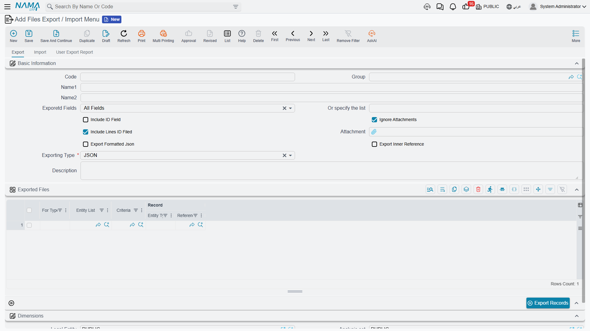
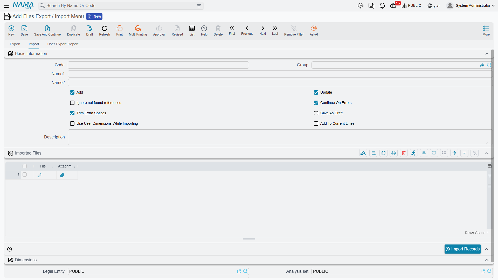
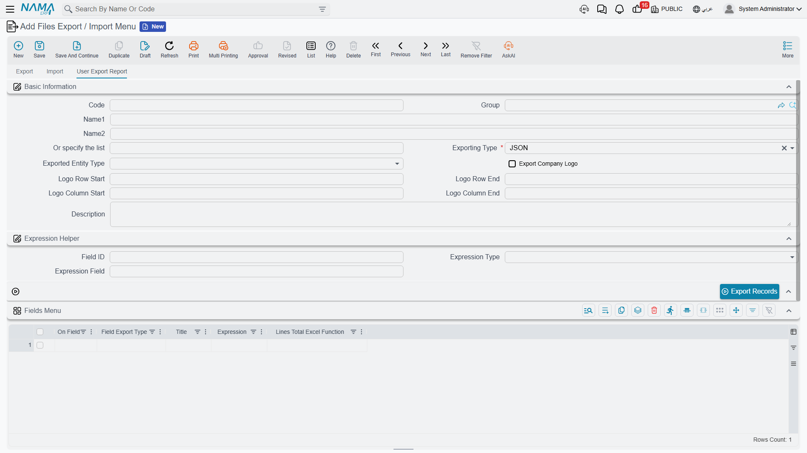

# Files Export / Import Menu

The export dialog is fine for a one-off. But some exports are not one-offs — the same set of records, with the same columns, gets pulled every month for the same accountant. Re-choosing nine options and re-typing a field list every time is exactly the kind of thing that goes wrong.

The **Files Export / Import Menu** screen turns an export into a saved, named definition you run with one button. It does the same for imports. And it has a third trick that has nothing to do with round-tripping data: it can build a **custom Excel sheet** with your own column headings, calculated columns and totals — a lightweight report you design without touching the report designer.

You will find it under **Basic → Settings → Files Export / Import Menu**. The screen has three tabs, and which one you use depends on which of those three jobs you are doing.

## Tab 1 — Export



The top half repeats the options from the export dialog — *Exporetd Fields*, *Or specify the list*, *Include ID Field*, *Ignore Attachments*, *Include Lines ID Filed*, *Exporting Type* — so that a saved menu carries its own answers and nobody has to remember them. (The *Exporetd Fields* and *Include Lines ID Filed* labels are misspelt on screen; they mean "Exported Fields" and "Include Lines ID Field".)

Two options appear here that the dialog does not offer:

| Option | Arabic label | What it does |
|---|---|---|
| **Export Formatted Json** | تنسيق الملف المُصدر | Writes the JSON indented and readable instead of on one long line. Only matters for JSON. |
| **Export Inner Reference** | تصدير الحقول المرجعية التي لم تذكر مع التصدير | Also exports the master records your records point at, even though you did not select them. Export a batch of invoices with this on and the customers and items they reference come along too — which is what you want when you are moving data to another installation and the target does not have them yet. |

The **Exported Files** grid underneath is where you say *what* to export. Each line is one block of records:

| Column | Arabic label | Purpose |
|---|---|---|
| **For Type** | للنوع | The entity type this line exports. |
| **Entity List** | قائمة الأنواع | A list of types, when one line should cover several. |
| **Criteria** | المعايير | A saved criteria definition that narrows the records down. The picker only offers criteria built for the type you chose. |
| **Record** | السجل | A single specific record, when you want to export exactly one. |

Add several lines and one run produces one file containing all of them — the customers, the items and the price lists together. Press **Export Records** and the result arrives as a download, packaged as a zip.

::: tip This is how you move a configuration between installations
A menu with a few lines — document books, terms, criteria definitions, screen layouts — plus *Export Inner Reference* switched on gives you a repeatable "take this configuration to the customer's server" package. Run the same menu after every change and the file is always current.
:::

## Tab 2 — Import



The same idea in reverse. The eight checkboxes are exactly the ones in the [Import Records](/platform/import-export/importing-records.md) dialog — *Add*, *Update*, *Ignore not found references*, *Continue On Errors*, *Trim Extra Spaces*, *Save As Draft*, *Use User Dimensions While Importing*, *Add To Current Lines* — with the same defaults, saved once instead of chosen each time.

The **Imported Files** grid takes the files themselves: each line has the data **File** and, if it needs one, the companion **Attachment** zip. Attach several files to one menu and **Import Records** processes them all in one run.

This is the natural other half of the export menu above: export a configuration from one installation, open it as an attachment here on the other, press the button.

## Tab 3 — User Export Report



This tab does something different from the other two, and it is easy to miss. Set **Exporting Type** to **Report** (تقرير) and the menu stops producing a machine-readable file and starts producing a **spreadsheet you designed**: your columns, in your order, with your headings, including calculated columns and totals at the bottom.

::: warning A report sheet is a dead end, deliberately
It has no marker rows, no field ids and no error column — it is a sheet for a human to read. It cannot be imported back. If you need a file that round-trips, use Excel, XML or JSON on Tab 1 instead.
:::

Set **Exported Entity Type** to the record you are reporting on. That one choice drives everything else on the tab: the field pickers below will only offer fields that exist on that type, and only one type can be reported per menu.

### Designing the columns

The **Fields Menu** grid is the design surface. **One row here is one column in the output**, and the row order is the column order.

| Column | Arabic label | Purpose |
|---|---|---|
| **On Field** | الحقل | Which field to read. It may point inside a detail table — see the note on multiple rows below. |
| **Field Export Type** | نوع تصدير الحقل | How to render it: **Field Value** (the raw value), **Code**, **Name1** or **Name2** (for a reference, show the target's code or its Arabic/English name), **Expression** (calculate it — see below), or **Lines Total**. |
| **Title** | العنوان | The column heading. Leave it blank and the field's own screen label is used, in the current language. |
| **Expression** | Expression | The calculation, used when *Field Export Type* is **Expression**. |
| **Lines Total Excel Function** | معادلة إكسل لإجمالى السطور | Puts a real Excel formula for this column in a bold row under the data: **Sum**, **Avg**, **Max**, **Min**, or **Do Not Apply**. |

The totals row is a genuine Excel formula spanning the data rows, not a frozen number — open the sheet, delete a row, and the total updates.

### Calculated columns

Setting *Field Export Type* to **Expression** lets the column compute its value instead of reading one. Two helpers are available inside an expression:

- `e.field("fieldId")` — the value of that field on the record being written.
- `e.total("fieldId")` — the sum of that field across all the record's detail lines, when the field lives in a detail table.

Everything else is ordinary arithmetic and conditionals, so a column can say "net salary plus a five hundred bonus":

```groovy
e.field("netSalary") + 500
```

or apply a rule:

```groovy
e.field("netSalary") > 5000 ? e.field("netSalary") : e.field("netSalary") * 1.5
```

::: info An empty field counts as zero
`e.field()` returns zero rather than nothing when the field is empty, so arithmetic never breaks halfway. The flip side is that a missing *text* value also comes back as `0` — if a column is showing zeros where you expected names, check the field id.
:::

If you want a formula to feed the totals row, make sure it returns a **number**. A result that comes back as text lands in the cell as text, and Excel will not sum it.

The **Expression Helper** group above the grid exists purely to save typing. Pick a field in **Field ID**, choose **Field Value** or **Field Total** in **Expression Type**, and **Expression Field** fills in with the matching `e.field("…")` or `e.total("…")` snippet, ready to copy into a grid row. Nothing in that group is exported — it is a scratchpad.

### Choosing which records appear

If you run the menu from a list screen with rows ticked, you get those rows. If you run it from the tab's own **Export Records** button, the three filter groups at the bottom decide the scope, each an inclusive from/to range:

- **Dimensions Filter** (فلتر المحددات) — legal entity, branch, sector, department.
- **Document Filter** (فلتر السندات) — value date, document book, document term.
- **Files Filter** (فلتر الملفات) — master group.

### Adding the company logo

Tick **Export Company Logo** and the legal entity's logo is embedded into the sheet. The four **Logo Row/Column Start** and **End** fields say which cells it spans; the data table then begins on the row below it. Leave the End values empty and the logo is given three rows.

### A worked example

Say payroll want a monthly sheet: employee, period, and a net figure with a rule applied — and a total at the bottom.

Create a menu with **Exported Entity Type** = Salary Document, **Exporting Type** = Report, and three rows in the Fields Menu:

| On Field | Field Export Type | Title | Expression | Lines Total Excel Function |
|---|---|---|---|---|
| `employee.name1` | Field Value | الاسم | | |
| `hrPeriod.name1` | Field Value | الفترة | | |
| | Expression | الصافي | `e.field("netSalary") > 5000 ? e.field("netSalary") : e.field("netSalary") * 1.5` | Sum |

Press **Export Records** and you get a three-column sheet — with a `SUM` formula sitting under the third column:

| | الاسم | الفترة | الصافي |
|---|---|---|---|
| | موظف 002 | 2024 - يناير | 705 |
| | موظف 003 | 2024 - يناير | 705 |
| | موظف 004 | 2024 - يناير | 1,530 |
| | | | **=SUM(…)** |

::: warning Records with detail lines produce several rows
If any of your columns points inside a detail table, each record expands to as many rows as it has lines — a document with five lines becomes five rows. Header-level columns are filled on the first of those rows only and left blank beneath, which reads well in Excel but means you cannot sum a header column and expect the record count.
:::

## Running a Saved Menu From a List Screen

You do not have to open this screen to use a menu. In the ordinary export dialog on any list or edit screen there is a **Files Export / Import Menu** field: pick one there and the export runs through it, using its columns and its format rather than the dialog's. The dropdown only offers menus whose *Exported Entity Type* matches the screen you are on, so you will normally see just the one or two that make sense.

This is also the only route to the **Report** format — the dialog's own type list offers Excel, XML and JSON, but not Report.

::: info Where the definitions live
A Files Export / Import Menu is an ordinary master file: it has a code, names, a group and dimensions, and it obeys the usual permissions. Give the accountant read access to the menu and the export permission on the entity, and they can run the monthly extract without being able to design a new one.
:::
