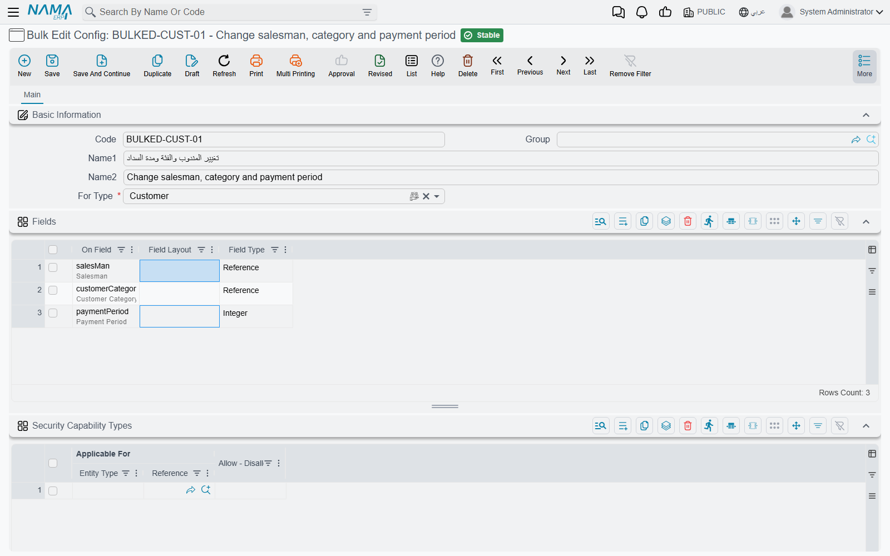
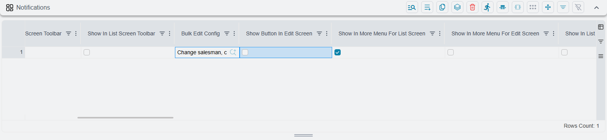
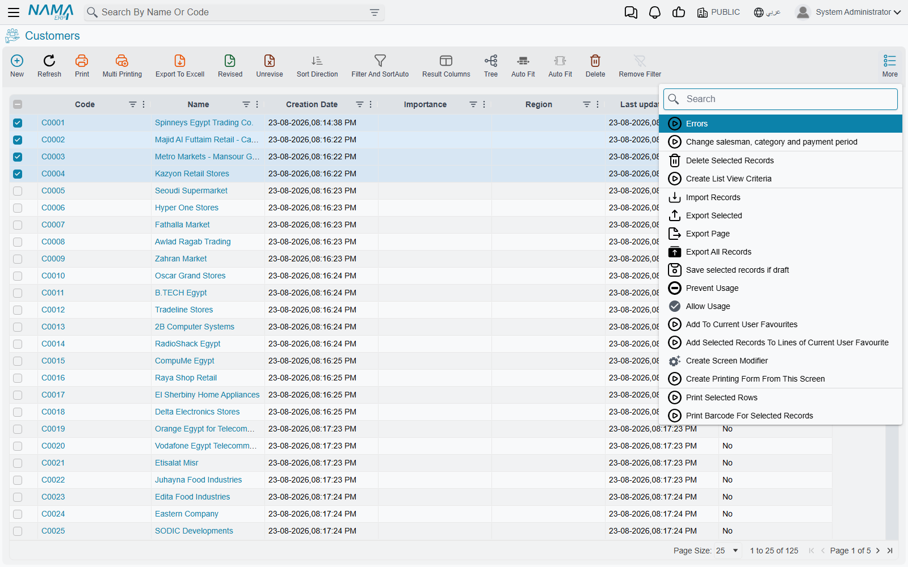
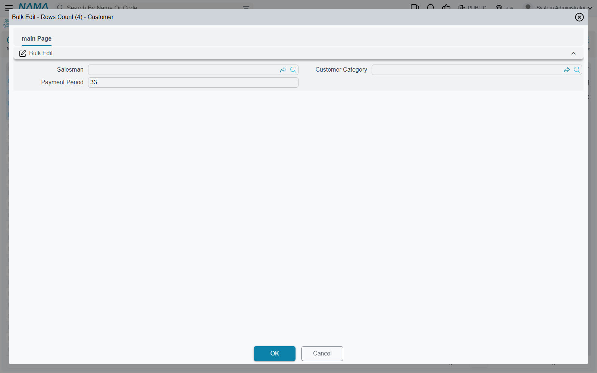

# Bulk Edit

Someone has to move four hundred customers onto a new salesman. Or set the payment method on every
invoice a branch raised last month. Opening four hundred screens is not an answer, and exporting
the lot to a spreadsheet to re-import it is a heavy way to change one column.

**Bulk edit** is the light way. You tick the records on a list screen, a small dialog opens with
just the fields you are allowed to change, you type the new value once, and every ticked record is
updated.

::: warning Bulk edit does not appear anywhere until someone sets it up
There is no bulk edit button waiting to be found. It exists only where an implementer has created
two records for it — a **Bulk Edit Config** that says which fields may be changed, and a **Screen
Modifier** that puts the button on a screen. Until both exist, and the Screen Modifier is
activated, no bulk edit button appears on any screen.

This is deliberate. Bulk edit rewrites committed records without opening them, so which screens
offer it, and which fields it may touch, are decisions someone makes on purpose.
:::

## Saying what may be changed

The first record is a **Bulk Edit Config**, under **Administration → Display Customization → Bulk
Edit Config**.

Besides the code and the names, it has one required field and one grid that matters.

**For Type** names the entity this config is for — the screen whose records will be edited. It has
to be filled in.

The **Fields** grid is the whole point of the record: one line per field that the dialog will
offer. Name the field in **On Field** and the rest looks after itself — **Field Type** is filled in
for you when you save, and **Field Layout** only decides how wide the widget is drawn in the
dialog.

::: tip Keep the list short
The fields you list are the fields the dialog shows, and — for reasons covered
[below](#What-happens-when-you-press-OK) — every one of them is written to every selected record on
every run, whether or not anyone typed in it. A config with two fields is safe and obvious. A
config with twelve is a trap.

If two groups of people need to change different fields on the same screen, give them two configs
rather than one wide one.
:::

Two kinds of field cannot be bulk-edited and are not offered when you pick:

- **Fields on detail lines.** Only header fields are available, so bulk edit cannot reach into a
  document's rows. Changing something on the lines of many documents is a job for
  [import](/platform/import-export/importing-records).
- **Attachments.** These are refused outright, at the point of choosing and again when you save.

The **Security Capability Types** grid at the bottom narrows who the config is offered to. Leave it
empty — the usual case — and it is offered to everyone who can reach the button. Add lines and each
one names a user, a security profile or a group of users, and says whether they are allowed or
prevented. **Applicable For** is two columns side by side: the kind of record first, then the
record itself.

## Putting the button on a screen

The second record is a **Screen Modifier** for the screen you want the button on. On its
**Notifications** page there is a grid of custom actions; add a line and fill in its **Bulk Edit
Config** column with the config you just made.

That line also decides where the button appears, and there are three places to choose from:

| Tick box | Where the button lands |
|---|---|
| Show In More Menu For List Screen | On the list screen's **More** menu |
| Show In List Screen Toolbar | On the list screen's toolbar |
| Show In List View Actions Column | In an **Actions** column inside the grid itself |

Tick none of them and the config exists but no button is ever drawn.

::: warning Two things that stop the button appearing
**The Screen Modifier must be activated.** A Screen Modifier with **Activate** left unticked is
ignored completely — not partly, not silently degraded, simply never loaded. This is far and away
the most common reason a newly built bulk edit "does not show up".

**Bulk edit cannot go on an edit screen.** The three edit-screen placement boxes are rejected when
the line has a Bulk Edit Config on it, and the Screen Modifier refuses to save. Bulk edit is a list
screen tool by design; there is nothing to select on a single record's screen.
:::

Two smaller points worth knowing when you build one:

**The button's name comes from the config if you do not give it one.** Leave the action line's
title fields empty and the button is labelled with the Bulk Edit Config's own Arabic and English
names. Naming the config something a user would recognise — "Change salesman" rather than "BEC001"
— saves a step.

**The Actions column placement is not really bulk.** A button in the Actions column belongs to the
row it sits on, so it opens the dialog for that one record and ignores whatever is ticked. That is
occasionally what you want — a quick way to change two fields without opening the record — but it
is not a mass operation.

## Using it

Tick the rows on the list screen and pick the action from wherever it was placed.

The dialog opens across the screen, titled with the number of records it is about to change:

It holds one widget per field in the config and nothing else — there is no field picker here, no
choosing which of them to apply. The fields you see are the fields the config allows, and they
arrive **already filled in with the values from the first record you ticked**.

::: warning Every field in the dialog is written to every selected record
This is the one thing to understand before running a bulk edit. The dialog does not distinguish
between a field you typed in and a field you left alone — when you press OK, **all** of the
config's fields are written to **all** of the selected records.

Because the dialog opens pre-filled from the first record in your selection, leaving a field
untouched does not mean "leave it as it is on each record". It means "copy the first record's value
onto all of them".

Say a config offers Salesman and Payment Method. You tick fifty customers to change their salesman,
and you do not touch Payment Method. All fifty come out with the payment method of whichever
customer happened to be first in your selection.

This is why a config should list the fewest fields that do the job. If a config has to carry two
fields and you only ever want to change one at a time, check the other one's value before pressing
OK.
:::

Starting the action with nothing ticked stops it with **Please Select Rows**. And as everywhere on
a list screen, the header tick box selects **the page in front of you**, not the whole search — see
[Choosing the records](/platform/list-views/mass-operations) for what that means in practice.

## What happens when you press OK

Each record is fetched, the dialog's values are set on it, and it is saved and committed — the same
save and the same commit as if someone had opened the record, typed the values and pressed the
button. So every validation runs, every entity flow and notification fires, approvals apply, and
the audit trail records the change as an ordinary edit.

Four consequences follow from that, and all four surprise people:

::: warning A run that fails part-way is not undone
Records are processed one at a time, each committing on its own. If the twentieth record of fifty
fails a validation, the first nineteen are already committed and stay that way, the failing record
is reported, and records twenty-one to fifty are never touched.

The message you get names only the failing record's problem. There is no summary of what was done
before it. After fixing the cause, running the action again re-processes the records that already
succeeded — harmless when the values are the same, but worth realising.
:::

::: warning Drafts in the selection get committed
Every record in the selection is committed, whether or not it was a draft before. Selecting a mix
of drafts and committed records and bulk-editing them turns the drafts into committed records as a
side effect. If the drafts were unfinished, that is not what anyone intended.

Filtering the list to committed records before selecting is the way to avoid it.
:::

::: info The list keeps showing the old values
When the run succeeds the dialog closes and a single **Done successfully** appears — no count, no
per-record summary, the same message however many records were changed. The grid behind it is not
reloaded, so it still shows what it showed before. The records really have changed; refresh
the list to see it. Users regularly report this as "it said it worked but nothing happened".
:::

**A long run holds up the browser.** Unlike the built-in
[mass operations](/platform/list-views/mass-operations), which run in the background and hand
the screen straight back, bulk edit works through the selection while you wait. The run does appear
in the tasks panel and can be stopped from there, but the tab it was started from stays busy until
it finishes. A large selection with heavy validations behind it is worth splitting into a few
smaller runs.

Records that have been **revised** are refused, and because a refusal ends the run, one revised
record part-way down a selection stops everything after it.

## Bulk edit, or export and re-import?

Both change many records at once, and they suit different jobs.

| | Bulk edit | [Export, correct, re-import](/platform/import-export/) |
|---|---|---|
| Setting up | Needs a config and a Screen Modifier, once | Nothing to set up |
| Fields | Only what the config lists, header only | Any field, detail lines included |
| Different value per record | No — one value for all | Yes, a column per field |
| Records covered | What you can tick on one page | Everything in the file |
| If something fails | Stops there, earlier records stay changed | Reported per row |

The short version: bulk edit is for **the same new value on a modest number of records**, and it is
quick because there is no file to move. Export and re-import is for **a different value on each
record**, for detail lines, or for very large numbers.

## Where to find them

Bulk Edit Config and Screen Modifier both live under **Administration → Display Customization**,
alongside [the menu](/platform/menus/) and the other tools that change how screens look and behave.

Because each config names the entity it applies to, that one list holds the configs for the whole
system.

## See also

- [Acting on Several Records at Once](/platform/list-views/mass-operations) — the built-in
  selection actions that need no setup
- [Importing and Exporting Records](/platform/import-export/) — the other way to change many
  records
- [Buttons on Every Screen](/platform/screen-buttons) — the menus these buttons are added to
