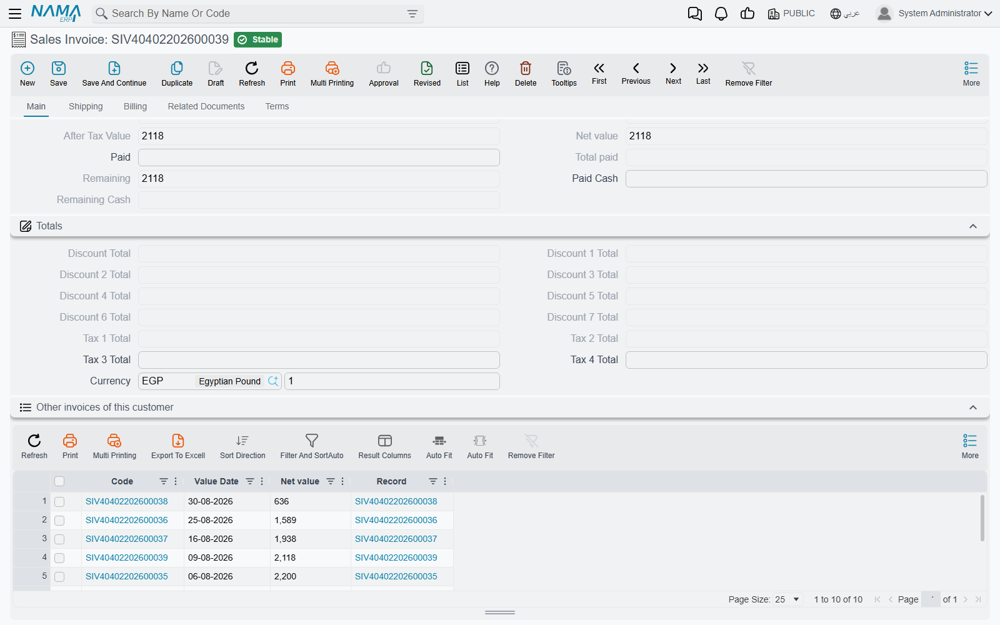
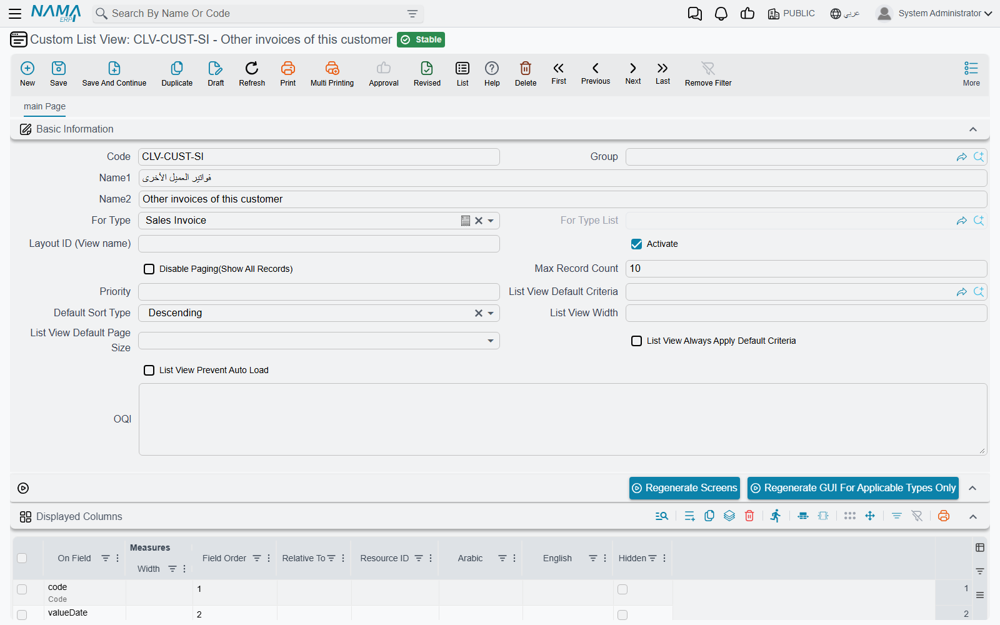
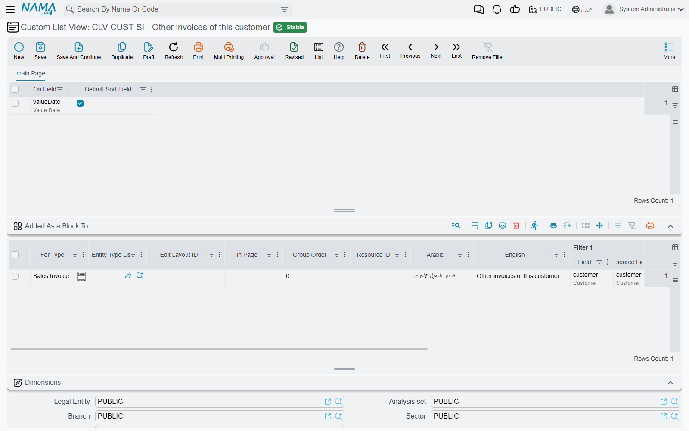

# Custom List Views

A record rarely stands alone. While you are looking at a sales invoice, the useful question is often
"what else has this customer bought from us?" — and answering it normally means leaving the invoice,
opening the invoice list and filtering it by hand.

A **Custom List View** saves you that trip. It defines a small list of related records and places it
as a block **inside another record's screen**, already filtered by a value taken from that record. Open
any sales invoice and a block underneath shows the other invoices of the same customer, with no
searching.

It does not add a new choice to a type's main list screen. To restyle a main list, or to offer a
second, differently arranged copy of it, use a [Screen Modifier](/platform/screen-modifier/screen-modifier-list-and-search)
instead.

## A worked example

Suppose you want every sales invoice to show the customer's other invoices.

1. Open **Administration → Display Customization → Custom List View** and add a record.
2. Set **For Type** to *Sales Invoice*. This is the type of the records the block lists.
3. In **Displayed Columns**, add the columns you want in the block, by field id: for example
   `valueDate` and `money.netValue`.
4. In the **Added As a Block To** grid, add a line with **For Type** = *Sales Invoice* (this time it
   is the screen that receives the block), **Filter 1 | Field** = `customer` and
   **Filter 1 | source Field** = `customer`.
5. Save, then press **Regenerate GUI For Applicable Types Only**.

Every sales invoice now carries a block whose title is the record's name. The block lists the sales
invoices whose *customer* equals the *customer* on the invoice you are looking at.

## The header

| Field | What it does |
| --- | --- |
| **For Type** | The type of records the block lists. Required. |
| **Activate** | Only active records are applied. Clear it to take the block off the screens at the next regeneration without deleting the record. |
| **Priority** | The order in which several active custom list views are applied. |
| **Max Record Count** / **Disable Paging(Show All Records)** | With paging disabled, the block shows all matching rows in one go, up to *Max Record Count* if you fill it. |
| **List View Default Criteria**, **List View Always Apply Default Criteria** | A [criteria definition](/platform/automation-and-rules/criteria-definitions) the block applies on top of the filters, and whether it is applied every time. |
| **Default Sort Type**, **List View Width**, **List View Default Page Size**, **List View Prevent Auto Load** | Work as their namesakes on a [Screen Modifier](/platform/screen-modifier/screen-modifier-list-and-search). |
| **OQl** | For implementers. Leave it empty and the system builds the block's query from the filters itself. |

The **Layout ID (View name)** field has no effect. The system names the block's list on its own (see
[Security](#Security)).

## The grids

**Displayed Columns**, **Template Columns**, **Criteria Fields (Criteria)** and **Sort Fields** add
columns, computed columns, filter fields and sort fields to the block's list. They are filled in the same
way as on a Screen Modifier. The list always starts with one column showing the record itself, and your
columns are added after it.

**Added As a Block To** decides where the block appears. Each line places it on one screen:

| Column | What it does |
| --- | --- |
| **For Type** / **Entity Type List** | The screen that receives the block: one type, or every type in a list. One of the two is required. |
| **Edit Layout ID** | Restricts the block to one layout of that screen, for example a copy made by a Screen Modifier. Empty means every layout. |
| **In Page** | The page (tab) of the screen: its number (1, 2, 3…) or its id. Empty means the first page. |
| **Group Order** | The block's position among the page's blocks. Empty puts it last. |
| **Resource ID**, **Arabic**, **English** | The block's title. Left empty, the record's Arabic and English names are used. |
| **Filter 1 … Filter 5** | Each pair links a field of the listed records (**Field**) to a field of the screen's record (**source Field**). The block shows only the rows where every pair matches. |

A line with no filter at all is refused on save:

*You must fill at least one filter* — «يجب ملئ عدد فلتر 1 على الأقل»

## Making changes appear

Saving the record changes nothing on screen yet. Screens are built ahead of time, so they must be
rebuilt. There are two buttons for this:

- **Regenerate GUI For Applicable Types Only** rebuilds only the types named on this record, in the
  header and in the *Added As a Block To* grid. Use this one.
- **Regenerate Screens** rebuilds every screen in the system.

::: warning Regenerate Screens also rebuilds the menu
It rebuilds the shipped menu from scratch, which wipes any hand edits made to it. See
[Changing the Menu](/platform/menus/menu-update#Why-you-must-not-edit-the-shipped-menu).
:::

## Security

Two things are controlled separately.

**Who can create or change custom list views.** This is ordinary type security on *Custom List View* in
the [security profile](/platform/security/security-profiles). A custom list view changes what every user
sees on the screens it targets, so keep it with the people who maintain screens.

**Who sees the block.** The block is an ordinary list, so the
[List View Security](/platform/security/field-page-listview-security#List-View-Security) page of a
security profile or user can allow or block it. Use these values:

- **Type** — the custom list view's *For Type* (the listed type, not the screen that hosts the block).
- **List View ID** — the custom list view record's internal identifier followed immediately by the
  host screen's type, with no space between them. An [export](/platform/import-export/exporting-records)
  with *Include ID Field* ticked shows the identifier.

A user whose list view is blocked still opens the host record. Only the block refuses to load, with:

*You do not have list view authority on list view id {0}, entity type {1}* — «لا تملك صلاحية مطالعة القائمة بالمعرف {0} والنوع {1}»
