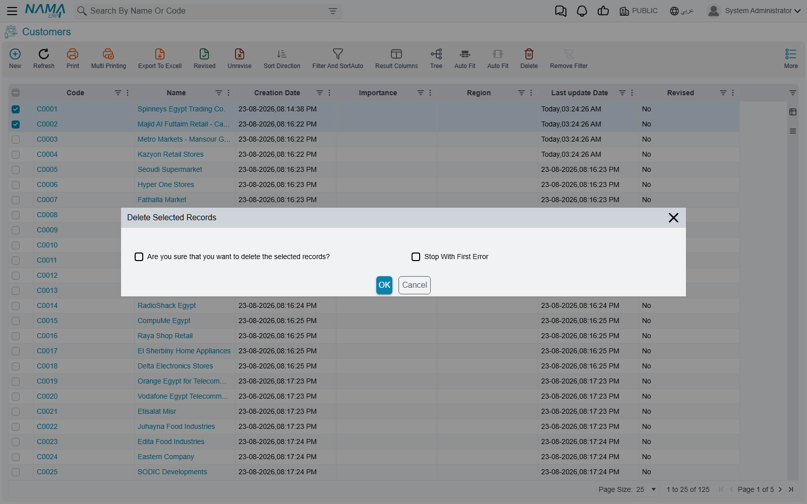

# Acting on Several Records at Once

A list screen does more than show you records. Tick a few rows and the **More** menu offers a set of
actions that run over the whole selection in one go — deleting them, committing the drafts among
them, retiring them from use, or sending them out to a spreadsheet.

These actions are built in. Every list screen has them, on every entity, with no setup at all.

## Choosing the records

Every row carries a tick box at its left edge, and the column header carries one that ticks the
whole page in a single click.

::: warning "Select all" means the page you are looking at, not the whole search
The tick box in the column header selects **the rows currently displayed** — not every record that
matched your filter. With the default page size of 25, a search that found 900 records and one
click on the header tick box gives you 25 selected records, not 900.

If you need to act on more than a page's worth, raise the page size first — the control at the
foot of the list offers 25, 50, 75, 100 and All — and then select. What you can see is what you
get.
:::

Start an action with nothing ticked and it stops straight away with **Please Select Rows**.

## Deleting the selected records

**Delete Selected Records** removes every ticked record, one after another. Before it runs it asks
two questions:

| Question | What it decides |
|---|---|
| Are you sure that you want to delete the selected records? | Whether the deletion happens at all |
| Stop With First Error | What happens to the rest when one record refuses |

Both boxes start **unticked**.

::: warning The confirmation box is the confirmation — it must be ticked
The first box is not a warning to read past; it is the switch that lets the deletion proceed.
Leave it unticked, press OK, and the action ends immediately: nothing is deleted, and nothing is
reported. To a user it looks as though the menu item did not work.
:::

::: tip Leave "Stop With First Error" unticked unless you have a reason not to
Unticked — the default — the run carries on past any record it cannot delete and finishes by
listing the codes of all the records that failed, each with its reason. Tick it and the run stops
at the first refusal, leaving everything after it untouched.

Unticked is usually what you want. One run then tells you about every problem at once, instead of
making you rediscover them one record at a time.
:::

Records refuse to be deleted for the ordinary reasons: something else in the system still refers to
them, they have been revised, or the user does not hold the delete authority for that entity. The
deletion itself is the same one that the delete button performs on a single record — nothing is
skipped or forced because it happens in bulk.

## Committing the drafts in a selection

**Save selected records if draft** commits. Despite the wording it does not save anything as a
draft — it looks at each selected record, commits the ones that are still drafts, and passes over
the ones that were already committed without saying anything about them.

It is the quick way to finish off a batch of documents that were entered and left as drafts,
without opening each one. Each record goes through the ordinary commit, so a draft that fails its
validations fails here exactly as it would have on its own screen.

## Retiring records from use

**Prevent Usage** and **Allow Usage** appear on the same menu and act on the whole selection at
once. Run from a list screen the change is **saved immediately** — unlike the same pair on a
record's own screen, which only marks the form as changed and waits for you to save.

What being retired actually does, which settings control who can still see and use such records,
and how to tell one at a glance, are all covered in
[Preventing a Record From Being Used](/platform/prevent-usage).

Both actions stop at the first record they cannot process, and the records after it are left alone.

## Sending records to a spreadsheet

Three export items sit next to each other on the menu and differ only in what they cover:

| Menu item | What it exports |
|---|---|
| Export Selected | The ticked rows |
| Export Page | Every row on the page in front of you |
| Export All Records | Every record of that type |

Each opens the same options box — which fields to include, whether to add the identifier columns,
whether detail lines go to their own sheet. These options, and the matching import that reads the
file back in, are covered in [Importing and Exporting Records](/platform/import-export/).

**Import Records** on the same menu is the other half of that round trip.

## Adding records to a favourite

**Add To Current User Favourites** puts the screen itself on your Favourites menu.
**Add Selected Records To Lines of Current User Favourite** is the different and more useful one:
it pins the specific records you ticked, so a handful of documents you keep coming back to are one
click away.

## Watching a run, and stopping it

These actions do not hold up the browser. Each one starts and hands you back the screen while it
works through the selection in the background, reporting progress as it goes. A run that is taking
too long, or was started by mistake, can be ended from the same place with **Kill Task** — records
already processed stay processed; the rest are left alone.

When a run finishes with failures, the report names the records that failed by code and gives the
reason for each, so the list can be worked through afterwards.

## What ends up in the history

Every one of these actions goes through the same service the screens themselves use, so each
affected record gets its ordinary history entry: a new version, and an audit trail line showing
what changed. A user browsing a record's history afterwards sees a normal edit.

Nothing marks a change as having come from a mass action, and the actions are not grouped together
in any way. If it matters that a batch of records was changed together on a particular afternoon,
the time stamps are the only thing tying them to each other — worth knowing before running one of
these over a large selection.

## See also

- [Preventing a Record From Being Used](/platform/prevent-usage) — what Prevent Usage does
- [Bulk Edit](/platform/list-views/bulk-edit) — changing the same fields on a whole selection
- [Importing and Exporting Records](/platform/import-export/) — the export options in full
- [Quick Filters in List Views](/platform/list-views/quick-filters) — narrowing the list down
  before you select
