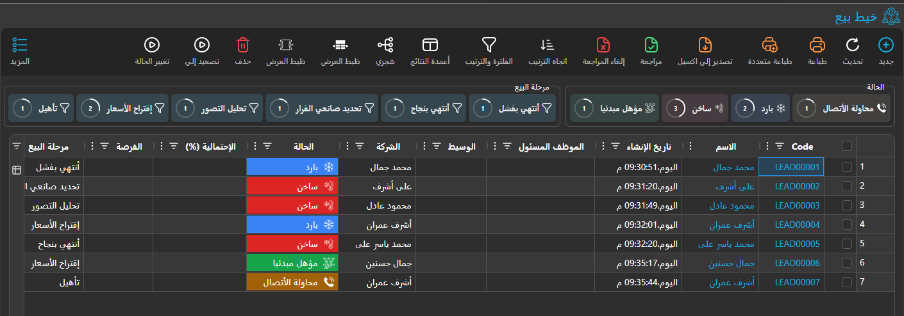
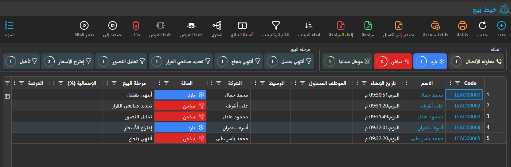
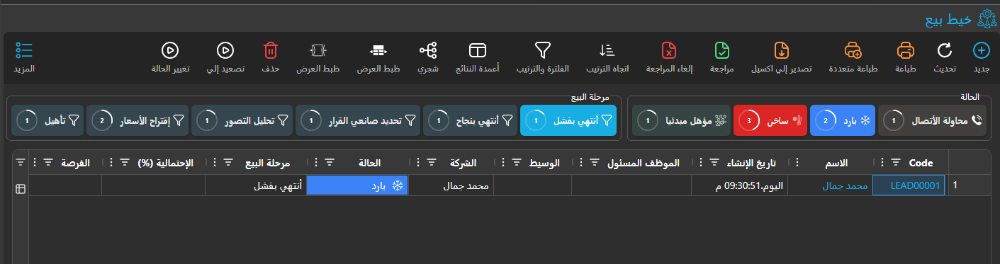

# الفلاتر السريعة في قوائم المستندات (Quick Filters in List Views) {#Quick-Filters-in-List-Views}

::: tip ميزة جديدة
تم تطوير الفلاتر السريعة (Quick Filters) لتحسين تجربة المستخدم في تصفية البيانات بسرعة وبشكل بديهي عبر جميع قوائم المستندات في نظام نما ERP.
:::

## نظرة عامة {#Overview}

الفلاتر السريعة أدوات تفاعلية تظهر في أعلى قوائم المستندات، تتيح للمستخدمين تصفية البيانات بسرعة استنادًا إلى أكثر القيم شيوعًا أو أهمية في الحقول. صُمّمت هذه الميزة لتوفير طريقة بصرية وسريعة للوصول إلى البيانات المطلوبة.

## المزايا الرئيسية {#Key-Features}

### 1. التصفية السريعة المبنية على القيم {#1-Value-Based-Quick-Filtering}
- **أزرار ديناميكية**: تعرض أزرارًا تحتوي على أكثر القيم تكرارًا في الحقول المحددة
- **أيقونات ذكية**: تعرض أيقونات مناسبة لكل نوع بيانات (enums، مراجع، تواريخ، إلخ)
- **إحصاءات فورية**: تعرض عدد السجلات لكل قيمة ونسبتها

### 2. الفلاتر المخصصة المحددة مسبقًا {#2-Pre-defined-Custom-Filters}
- **معايير مخصصة**: إمكانية إنشاء فلاتر معقدة باستخدام SQL أو معايير محددة
- **عناوين قابلة للترجمة**: دعم عناوين الفلاتر بالعربية والإنجليزية
- **إعداد مرن**: ربط الفلاتر بكيانات أو شاشات محددة

### 3. واجهة مستخدم محسّنة {#3-Enhanced-User-Interface}
- **تجميع ذكي**: تجميع الفلاتر المترابطة في مجموعات منطقية
- **مؤشرات بصرية**: عرض النسب المئوية كدوائر تقدم ملوّنة
- **استجابة تفاعلية**: تحديث النتائج فورًا عند تطبيق الفلاتر

## طريقة الاستخدام {#How-to-Use}

### للمستخدمين النهائيين {#For-End-Users}

#### 1. الوصول إلى الفلاتر السريعة {#1-Accessing-Quick-Filters}
1. انتقل إلى أي شاشة قائمة مستندات في النظام
2. ستظهر الفلاتر السريعة في أعلى الجدول (إذا كانت مُعدّة للكيان)
3. الفلاتر مجمّعة في صناديق بعناوين وصفية

#### 2. استخدام فلاتر القيم {#2-Using-Value-Filters}





تظهر الفلاتر السريعة كأزرار تفاعلية في أعلى قوائم المستندات، وتعرض أكثر القيم شيوعًا للحقول المحددة:

- **النقر على الزر**: يطبّق الفلتر فورًا على الجدول
- **الألوان**: تتغير حسب نوع البيانات (أخضر للمدفوع، أحمر لغير المدفوع)
- **العداد**: يعرض عدد السجلات والنسبة المئوية

#### 3. استخدام الفلاتر المخصصة {#3-Using-Custom-Filters}

الفلاتر المخصصة توفر معايير تصفية متخصصة يُعدّها المسؤولون مسبقًا لتلبية الاحتياجات التجارية الشائعة.

#### 4. دمج الفلاتر {#4-Combining-Filters}



- يمكن تطبيق فلاتر متعددة معًا
- الفلاتر من مجموعات مختلفة تعمل معًا (منطق AND)
- الفلاتر من المجموعة نفسها تعمل كبدائل (منطق OR)

### للمسؤولين وفريق الدعم {#For-Administrators-and-Support-Staff}

#### إعداد الفلاتر السريعة باستخدام Screen Modifier {#Configuring-Quick-Filters-Using-Screen-Modifier}

تُعدّ الفلاتر السريعة من خلال نظام Screen Modifier الذي يتيح التخصيص لكل كيان ومستخدم.

##### الوصول إلى إعداد Screen Modifier {#Accessing-Screen-Modifier-Configuration}
1. انتقل إلى **الأساسيات** ← **Screen Modifier**
2. ابحث عن سجل للكيان المستهدف أو أنشئه (مثل "فاتورة")
3. انتقل إلى جدول **Quick Filter**

##### إعداد فلاتر القيم {#Setting-Up-Value-Based-Filters}
* **إعداد المجموعة**:
   - **العنوان بالعربية**: عنوان المجموعة بالعربية
   - **English Title**: Group Title in English
   - **Column Names**: أدخل معرّفات الحقول مفصولة بفواصل (مثل `status,customerType`)
   - **Show Count**: فعّل هذا الخيار لعرض عدد السجلات
   - **Max Button Count**: حدد الحد الأقصى لعدد الأزرار (عادةً 5-10)
   - **Remove**: ضع علامة هنا لإخفاء/إزالة مجموعة فلتر سريع (مفيد للتجاوز عند الإرث من إعدادات أخرى)
   - **Quick Filter Values Criteria**: اختر Criteria Definition لتصفية القيم التي تظهر في أزرار الفلتر السريع
   - **Quick Filter Values Dynamic Criteria**: أدخل نص المعايير مباشرة لتصفية القيم المعروضة (يستخدم نفس صياغة [Text Criteria](../text-criteria-guide.md))

##### تصفية قيم الفلتر السريع {#Filtering-Quick-Filter-Values}
يمكنك التحكم في القيم التي تظهر في أزرار الفلتر السريع باستخدام المعايير. تُصفّي هذه المعايير استعلام قاعدة البيانات الذي يجلب القيم المتمايزة، ويمكن تطبيقها على **أي عمود في الجدول** — وليس فقط العمود المعروض في الفلتر السريع.

على سبيل المثال، إذا كان لديك فلتر سريع على حقل "status"، يمكنك إضافة معايير تاريخ لعرض الحالات التي ظهرت في السجلات الأخيرة فقط:

- **مثال**: عرض حالات الفواتير للشهر الحالي فقط بإضافة المعايير: `invoiceDate,GreaterThanOrEqual,$monthStart()`

**خيارات الإعداد:**
- **استخدام Criteria Definition**: أنشئ معايير قابلة لإعادة الاستخدام وارتبط بها في حقل "Quick Filter Values Criteria"
- **استخدام Dynamic Criteria**: أدخل نص المعايير مباشرة في حقل "Quick Filter Values Dynamic Criteria"

هذا مفيد عندما تريد أن تعكس أزرار الفلتر السريع القيم ذات الصلة بالسياق أو الفترة الزمنية الحالية فقط، بدلًا من عرض جميع القيم الموجودة في قاعدة البيانات.

##### مثال على إعداد فلتر حالة الفاتورة {#Example-Configuration-for-Invoice-Status-Filter}
```
Arabic Title: حالة الفاتورة
English Title: Invoice Status
Column Names: status
Show Count: ✓ (checked)
Max Button Count: 8
Quick Filter Values Dynamic Criteria: (optional - leave empty to show all values)
```

##### إعداد فلاتر المعايير المخصصة {#Setting-Up-Custom-Criteria-Filters}
1. **إنشاء Quick Filter Criteria**:
   - انتقل إلى **الأساسيات** ← **Quick Filter Criteria**
   - أنشئ سجلًا جديدًا لنوع الكيان المستهدف

2. **إضافة سطور المعايير**:
   - **Dynamic Criteria**: أدخل نص المعايير (مثل `dueDate,LessThanOrEqual,$today()'`)
     - لمزيد من التفاصيل راجع: [Text Criteria Guide](../text-criteria-guide.md)
   - **العنوان بالعربية**: العنوان بالعربية
   - **English Title**: Title in English

3. **الربط بـ Screen Modifier**:
   - في جدول Quick Filter داخل Screen Modifier
   - اختر المعايير المنشأة في حقل **Criteria**
