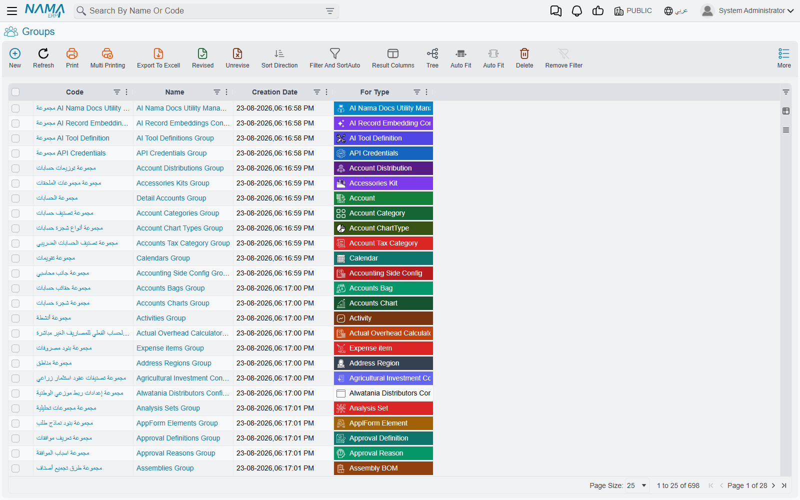
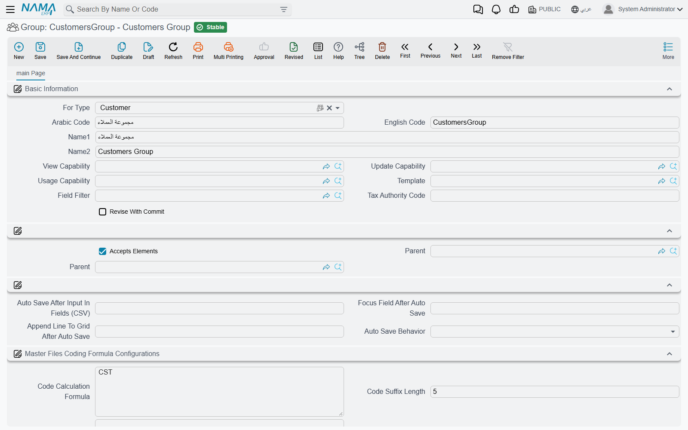
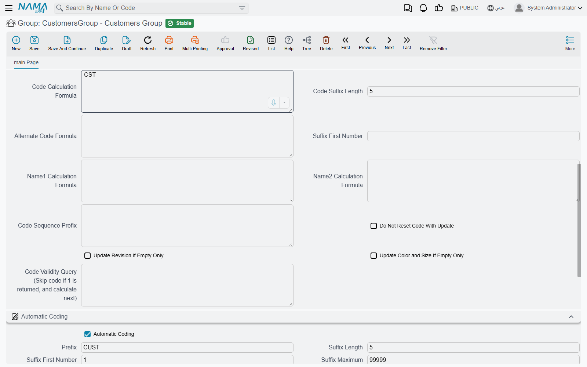

# Master Groups

Document books number documents. **Groups** do the same job for the other half of the system — the
master files. Customers, items, employees, suppliers, cost centres: each of them can belong to a
group, and the group is what hands out the code.

That is the first job, and it works almost exactly as a document book does. The second job is one
books do not have: groups form a **tree**, and that tree appears as a navigation panel beside every
master-file list in the system. Click **Wholesale** in the panel and the customer list narrows to
wholesale customers.

::: info Where to find it
**Basic → Settings → Group**, immediately after Document Book and Document Term. The list shows
every group in the system; the **For Type** column tells you what each one is for.
:::

## One group, one master file type

The first field on a group is **For Type**, and it decides everything else. A group whose For Type
is Customer can be put on customers and on nothing else. Try it on an item and the save fails:
*"Selected group is for type Customer, it should be for type Item."*

For Type accepts any master file — anything that is not a document.

::: warning For Type freezes the moment the group is first saved
Save the group once and the type can never be changed again: *"Can not change group type after
first save."* There is no way round it. A group created for the wrong type is a group to abandon,
not to correct.
:::

One consequence of For Type is worth knowing before you import anything. Internally a group's code
carries its type in front of it, in the form `Customer$#WHOLESALE`. Two useful things follow: the
same code may be reused once per master type — a `WHOLESALE` group for customers and another for
items can coexist — and **an import file that sets a record's group must write the long form**, not
the bare code. That is covered in
[Importing Records](/platform/import-export/importing-records).

## The tree, and the rule that governs it

A group can point at a **Parent**, and that is how the tree is built. But there is one rule that
catches everybody the first time, and it is the tick box called **Accepts Elements**.

::: warning A group is a folder or a usable group, never both
**Accepts Elements** is ticked on every new group, and a group with it ticked is one that records
can be put on. A group with it **unticked** is a folder: it can have children, but no record can
ever be put on it directly.

The two are mutually exclusive, and the system enforces both directions. Choose a group that
accepts elements as somebody's parent and the save fails with *"Group … Can not be used as a
parent"*. Try to put a folder group on a customer and the save fails with *"Selected group cannot
be used in elments directly"* — quoted here with its shipped spelling, because that is what you
will see.

So building a tree means creating the branches first with the box **unticked**, and only then the
leaves that records will actually use.
:::

The group lookup on a master file already knows this: it offers only groups of the right type that
accept elements, so the folders never appear in it.

::: tip The parent is classification and nothing more
A parent group does not pass anything down to its children — not its coding, not its template, not
its capabilities. Each child that records will use has to carry its own settings in full. The tree
decides how records are filed and how the navigation panel is laid out; it decides nothing about
how they are numbered.
:::

### The navigation panel

This is the day-to-day payoff. Every master-file list screen in the system shows the tree of groups
for its own type down one side. Clicking a branch filters the list to the records filed anywhere
beneath it — a branch with three sub-groups under it shows the records of all three.

That is why it is worth keeping groups tidy even in an installation that does not use them for
numbering at all.

## Numbering the records in a group

Here is the one thing about this screen that surprises people, and it is best said before anything
else.

::: warning There are two coding engines on this screen, and the upper one silently wins
The screen carries a group titled **Master Files Coding Formula Configurations** and, below it,
one titled **Automatic Coding**. They are not two views of the same thing, and they are not
alternatives you choose between with a switch. If the formula block has a **Code Calculation
Formula** in it, that is what codes the records — and the Automatic Coding block below is never
consulted.

Nothing on the screen says so, no validation warns you, and both blocks stay editable. The group
in the picture above is in exactly that state: it has a formula of `CST` at the top **and** a
complete `CUST-00001` series below it, and only the first of the two will ever be used. A group
whose numbers "ignore the prefix I set" almost always has a formula filled in above.
:::

The full order the system works through, for a record that has a group:

1. the first line in the group's **details grid** whose Criteria matches the record — its formula;
2. otherwise the group's own **Master Files Coding Formula Configurations** block;
3. otherwise the **Files Auto Coding** grid on
   [Fields and Entities Settings](/platform/fields-and-entities-settings/fields-settings-auto-coding),
   which codes by formula without any group at all;
4. otherwise the **Automatic Coding** block on the group.

### The Automatic Coding block

This is the same series engine a document book uses, with the same six fields and the same
arithmetic. Rather than repeat it, read
[Document Books](/platform/document-books) — the prefix and padded serial, the per-year restart
through **prefixFormula**, **Do Not Use Prefix Formula For Next Number**, **Use Next Real Number
For Drafts**, and what happens when the numbers run out all behave identically here. Master files
get provisional `@draft` codes exactly as documents do.

::: tip The screen fills in the rest of the series for you
Type a **Suffix Length** and, if they are still empty, **Suffix First Number** becomes 1 and **Suffix Maximum** becomes that many nines — a
length of `5` gives you a maximum of `99999` the moment the cursor leaves the field. Type a
**Suffix Maximum** instead and the Suffix Length is raised to fit it.
:::

Two differences are worth spelling out.

**The prefix is required only when Automatic Coding is on.** On a book a prefix is expected even for
manual numbering, and a global option exists to relax that. On a group there is nothing to relax:
switch Automatic Coding off and the prefix simply is not asked for.

**Every record in the group must start with the group's prefix, even one you type by hand.** Put a
customer in a group whose prefix is `WH-` and give it the code `X001`, and the commit fails with
*"code must start with WH-"*. The prefix is a property of the group, not merely of the numbers it
generates.

::: tip Each group runs its own series
As with books, the running number belongs to the group. Two groups of the same type with the same
prefix are refused at save — *"Auto coding prefix …, suffix length …, and suffix first number …
conflict with …"* — so two groups cannot quietly interleave their numbers.
:::

Pick a group on a new master file and the Code field fills in straight away with the number it is
about to get. That is a preview: the number is not committed to the series until the record is
saved.

### The Master Files Coding Formula Configurations block

The other engine builds a code out of the record's own values instead of counting. Its main field
is **Code Calculation Formula** — a template that reads fields from the record being saved. Three
more formulas beside it can fill in the **Alternate Code** and both names, and each is applied only
when it produces something: a formula that renders empty leaves the existing value alone.

The rest of the block controls the counter that is appended to the formula's result:

| Field | What it does |
|---|---|
| Code Sequence Prefix | The key the running number is counted against. Left empty, the calculated code text itself is the key. |
| Code Suffix Length | How many digits the counter is padded to. Maximum 20. |
| Suffix First Number | The number to start at. (The Automatic Coding block below has a field with the same English label — they are different fields, in different groups.) |
| Do Not Reset Code With Update | Leaves the code alone on records that have been committed before, instead of recalculating it. |
| Code Validity Query | A query that vetoes a candidate number; the system tries the next one, and the next, until the query stops matching. |

::: info The formula language here is not quite the one used elsewhere
A formula written with `${…}` around field names is read as plain field substitution. A formula
written with `{…}` goes through the full template language, with its functions and conditions. The
two cannot be mixed in one formula — the presence of `${` switches the whole thing to the simpler
mode.

**Code Validity Query** is one of a small number of fields on this screen that were never
translated: Arabic users see the English label.
:::

If the last record coded from a formula has a suffix that is not a number — someone typed a code by
hand, or an old record was migrated in — the next save fails and names the record it could not read
a number from. That is the usual cause of a formula that worked for months and then stopped.

### A different formula per kind of record

Under the two blocks sits a grid: one line per **Criteria**, each with its own set of coding-formula
columns. This is how one group codes different records differently — items in one product family
taking one code shape, items in another taking a second.

::: warning The first matching line wins, and a line with no criteria matches everything
The lines are read from the top down and the first one whose Criteria matches the record is used.
Lines below it are never looked at, however well they fit.

A line whose Criteria is empty therefore matches every record and shadows everything below it. Keep
the general cases at the bottom and the specific ones at the top, exactly as you would in any
first-match list.
:::

If no line matches, the group's own formula block is used. If that is empty too, the search
carries on down the order listed above.

## What locks once a group is used

A group stops being freely editable at two moments.

**When it is first saved**, For Type freezes.

**When the first committed record of that type points at it**, four fields freeze: **Automatic
Coding**, **Prefix**, **Suffix First Number** and **Suffix Length**. Editing any of them then fails
with *"Can not change auto coding as the record was used in documents"* — the message says
"documents" even on a master-file group, which is simply how it is worded.

::: tip Drafts do not freeze anything
Only committed records count. A group with fifty drafts hanging off it is still fully editable; the
first commit is what locks it.
:::

Everything else stays open, and that includes rather a lot: **Suffix Maximum**, **prefixFormula**,
**Replication Site**, the whole formula block and the whole details grid. The freeze protects
the counting series and nothing more — a per-criteria formula can be rewritten after it has coded
thousands of records.

There is no supported way to unfreeze a group. When the series itself has to change, the answer is
the same as for books: make a new group.

## Retiring a group

A group has **Prevent Usage**, and that is the retirement switch. Set it and no new record can be
committed on the group — *"Can not use record …, usage is prevented"* — while every record already
on it carries on untouched. What Prevent Usage means in general, and who can be allowed past it, is
covered in [Preventing a Record From Being Used](/platform/prevent-usage).

Note that a group has no **Inactive** or **Inactive From Date** field. Those belong to document
books; on a group, Prevent Usage is the whole story.

::: warning A group that has ever been used can never be deleted
Once any record has referenced a group, the delete is refused — *"Can not Delete this  record
because it used in another record"*, quoted with its shipped spacing. And the mark that causes this
is never cleared: deleting every last record that used the group does **not** make the group
deletable again.

Prevent Usage is therefore not a second-best option, it is the only option. Plan on groups being
permanent.
:::

One more way a group retires itself: if the series reaches its **Suffix Maximum**, the group sets
its own Prevent Usage. The record that took the last number saves normally, and the next one finds
the group closed.

## What else a group carries

Numbering aside, a group is a convenient place to hang settings that should apply to one family of
master records and no other.

| Field | What it does |
|---|---|
| Template | A [Default Values Template](/platform/default-values-templates) applied to records in the group. |
| Field Filter | A [field filter](/platform/field-filter-with-criteria) that hides or protects fields on those records. An automatic filter is refused here. |
| View / Update / Usage Capability | Security capabilities copied onto records that join the group. |
| Dimensions | Legal entity, sector, branch, department and analysis set, copied onto records that join the group. |
| Revise With Commit | Makes the records in the group revise as they commit. |
| Tax Authority Code | Feeds e-invoicing: where a tax payer configuration is set to take the item type code from the group, this is the code it reports. |
| The auto-save fields | Save the record automatically once a named field is filled in, and then move the cursor or add a grid line. |

::: warning Choosing a group overwrites the record's capabilities
When you pick a group on a master file, the group's dimensions are copied onto the record only
where the record still holds the default **PUBLIC** value — but the three **capabilities** are
copied over **unconditionally**, replacing whatever was already there. If a record needed a capability of its
own, set it after choosing the group, not before.
:::

## Does every master file need a group?

No. The group field is optional everywhere, and a record without one simply falls through to the
next coding mechanism, and then to you: with nothing configured, the code becomes something the
user types, and an empty code fails at commit.

So in practice groups become mandatory by convention rather than by rule — in an installation where
the group is what codes customers, a customer without a group is a customer without a code.

::: info Your installation may already have one group per type
The setup wizard, if it was run, creates a group for every master type, named after the type and
coded from its short code with a five-digit serial. Those are the groups an installation starts
with; look for them before creating your own.
:::

## See also

- [Document Books](/platform/document-books) — the same numbering engine, for documents
- [Automatic coding of master files](/platform/fields-and-entities-settings/fields-settings-auto-coding)
  — coding by formula without a group
- [Default Values Templates](/platform/default-values-templates) — what the Template field points at
- [Preventing a Record From Being Used](/platform/prevent-usage) — the retirement switch
- [Importing Records](/platform/import-export/importing-records) — the long form a group code takes
  in a file
