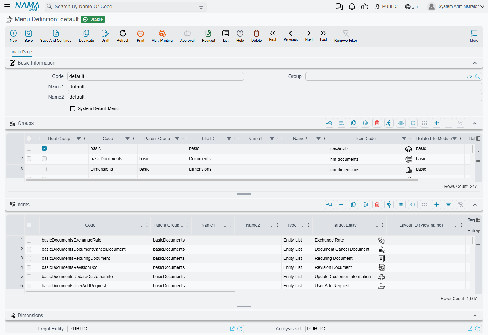
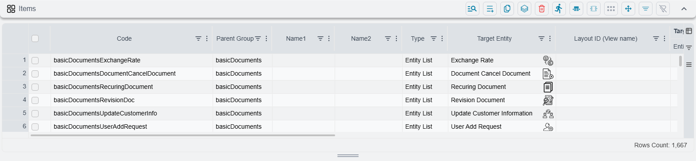
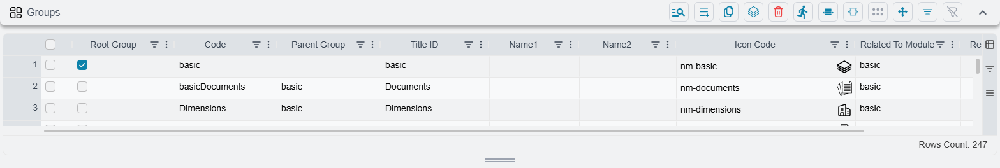

# How the Menu Is Put Together

The menu down the side of the screen looks like a tree, so people expect to edit it like one —
drag a folder here, drop an entry there. It is not stored that way at all.

A menu is a single record holding **two flat tables**: one listing the folders, one listing the
entries. Neither table knows anything about shape. The tree you see is rebuilt every time the menu
is drawn, by matching text codes between the two tables. Once that clicks, the screen stops looking
strange and starts looking obvious.

::: info Where to find it
**Administration → Display Customization → Menu Definition.**
:::

## One record, two grids

Open the menu that ships with the system — its code is `default` — and you get one tab with two
grids under the usual code and name fields.

The **Groups** grid holds the folders. The **Items** grid holds the entries that open something.
On a standard installation those two grids hold roughly 250 and 1,700 rows respectively, which is
the first thing worth knowing: this is a big record, and you will be working inside it with the
grid's own search rather than by scrolling.

## Three levels, and only three

Every group is either a **root group** or a **sub-group**, and the tick box called **Root Group**
is what decides which.

- A **root group** is a top-level folder — Sales, Accounting, Administration. It has no parent.
- A **sub-group** names its parent in **Parent Group**, and that parent must itself be a root group.
- An **item** names the sub-group it belongs to in **Parent Group** as well — both grids call the
  column the same thing — and that group must *not* be a root group.

So the shape is fixed at exactly three levels: **root group → sub-group → entry**. There is no
fourth. Pointing a sub-group at another sub-group does not produce a deeper tree — the branch is
simply never drawn, because the code that builds the tree only ever looks one level down.

::: warning A mistyped code does not raise an error — the row disappears
Before a menu is checked for mistakes, it is quietly tidied up. Part of that tidying deletes any
group whose **Parent Group** matches no group, and any item whose **Parent Group** matches no group.

The result is that a typo in either of those columns does not produce the "group does not exist"
message you might expect. You press Save, the save succeeds, and the row is simply gone. If a row
you just added has vanished after saving, check its **Parent Group** first — it is almost always
that.
:::

## What an entry can open

Every item has a **Type**, and that choice decides which of the neighbouring columns you are
expected to fill in. The others are disabled, so the screen guides you.

| Type | What you fill in | What the user gets |
|---|---|---|
| **Entity List** | Target Entity | The list of those records — the everyday case |
| **New Record** | Target Entity | A blank new record, ready to type into |
| **Record** | Reference | One specific record, opened directly |
| **Report** | Reference | One report, at its parameters screen |
| **Reports Group** | Reference | A report group, shown as a browsable catalogue |
| **All Reports** | *nothing* | Expands into one entry per report group |
| **Dashboard** | Reference | One dashboard |
| **Dashboards Group** | Reference | Every dashboard in that group, as separate entries |
| **Auto Dash Boards** | *nothing* | Expands into the automatic dashboard groups |
| **User Favourites** | *nothing* | The signed-in user's own favourites, injected here |
| **Link** | Link | An external web address, opened in a new tab |
| **Internal Link** | Link | A screen inside Nama that is not a record list |

**Reference** is a two-part control: you pick the entity type first, then the record itself. The
column beside it, **Entity Type**, is the first half of that pair rather than a setting of its own.

The three that take nothing — All Reports, Auto Dash Boards, User Favourites — are worth a second
look. Each is a single row that expands into many entries when the menu is drawn, so the Favourites
folder every user has is one row in this grid, not one row per user.

::: tip Entry or list — there is a system-wide default
Whether a master file's menu entry opens the list or a blank new record is set once for the whole
system in Global Config, under
[appearance settings](/platform/global-config/global-config-appearance), with separate settings for
master files and for documents. Those settings are applied while the menu is being built, so
changing one has no effect until the menu is rebuilt.
:::

## The four columns that make an entry more than a link

Alongside the target, every item carries four optional settings that most people never notice, and
they are where the interesting customisation lives.

**Layout ID** — the column reads *Layout ID (View name)* — opens a named list view rather than the
standard one. This is how a single entity appears several times in the menu with a different set of
columns and a different filter each time, and the system does exactly this itself in a dozen
places.

**Criteria** narrows what the list shows. Point an entry at Sales Invoices with a criteria of
"this branch only", and that entry is a branch-specific invoice list.

**Default Values Template** fills in a new record the moment it opens. Combined with a type of New
Record, this turns one entry into "New Sales Invoice, already set to the Cairo branch" — see
[default values templates](/platform/default-values-templates).

**Extra Field Filter** restricts what the lookup fields on the opened screen will offer.

None of these are used by the menu that ships with the system. They exist for you.

## Naming things

Both grids have **Name1** (Arabic) and **Name2** (English) columns, and both are usually left empty —
including on nearly every row of the menu that ships.

That is deliberate, because the caption falls back in three steps:

1. the Arabic or English name typed on the row, if there is one;
2. otherwise a **Title ID** — the name of a wording the system already translates, so the caption
   follows the reader's language without your typing it twice. The practical way to find one is to
   copy it from a shipped row that already says what you want;
3. otherwise, **for entries only**, a caption worked out from the target: the plural name of the
   entity for a list, the singular for a new record, the code and name for a specific record.

Step 3 is why an entry pointing at Sales Invoices needs no title at all: it is already called
"Sales Invoices" in whichever language the user is working in, and it follows any change to that
translation.

Type a name and you lose that. The row will read the same in both languages forever after, which is
occasionally what you want and usually not.

::: warning Groups have no third step
A folder with no name and no Title ID has no caption at all. Give every group you create either a
name in both languages or a Title ID.
:::

## Order is row order

There is no "sort order" column on either grid, and none is needed. **The order of the rows in the
grid is the order of the menu.** Root groups appear in the order they sit in the Groups grid,
sub-groups in the order they sit in that same grid, and entries in the order they sit in the Items
grid. Nothing is re-sorted when the menu is drawn.

Moving an entry up the menu therefore means moving its row up the grid.

## Icons

Both grids have an **Icon Code** column, and both may be left empty. Folders fall back to a folder
icon and entries to a general one, so a menu with no icons set anywhere still looks deliberate.

## Two conveniences on this screen

**Inserting a row copies the row above.** Add a row to the Items grid and it arrives already
carrying the previous row's parent group, type and target entity. Adding ten entries to one folder
is one row of typing and nine small edits.

**The Parent Group column suggests what fits.** On an item it offers the sub-groups in the record;
on a group it offers the root groups. Both lists are built from what is in the grids right now, so
a group you added a moment ago is already offered.

## Finding an entry without hunting for it

A full menu holds well over a thousand entries, so nobody navigates it by opening folders.
**Ctrl + U** opens the menu with the cursor in its search box, and typing a few letters filters it.

The search is more forgiving than it looks. It matches the Arabic title, the English title and the
name of the underlying screen at once, so an Arabic user can type an English word and still find
the entry — and it copes with typing Arabic on an English keyboard layout, which is how most people
type in a hurry.

::: tip The list stops at 25
Search results are capped at twenty-five entries. On a broad word — "invoice", "report" — you are
seeing the first twenty-five matches, not all of them. Type another word or two to narrow it rather
than assuming the rest do not exist.
:::

Not to be confused with **Ctrl + K**, which searches for *records* rather than menu entries.

The menu itself can also be displayed three ways — as a tree, as a drill-down, or as a focused tree
— and the choice is per person and per browser, remembered between visits. Someone whose menu looks
unfamiliar in a screen-share has usually just picked a different mode.

## What you cannot do here

There is no visibility tick box. Neither a group nor an entry has an "inactive" flag, and neither
does the menu record itself. To take something out of the menu you either delete its row or block
it for a role — see [who sees which menu](/platform/menus/menu-visibility).

There is also no target type that runs an action. A menu entry opens something; it never performs
something.

## Before you change anything

Everything above describes how a menu is built. It does **not** describe how to customise the menu
your users see — editing the shipped menu directly is not the way, and the reason is worth reading
before you start typing.

[Changing the menu](/platform/menus/menu-update) explains it.

## See also

- [Changing the menu](/platform/menus/menu-update) — the safe way to customise, and why
- [Who sees which menu](/platform/menus/menu-visibility) — assignment, hiding and why a change
  has not appeared yet
- [Security profiles](/platform/security/security-profiles) — trimming the menu per role without
  building a menu at all
