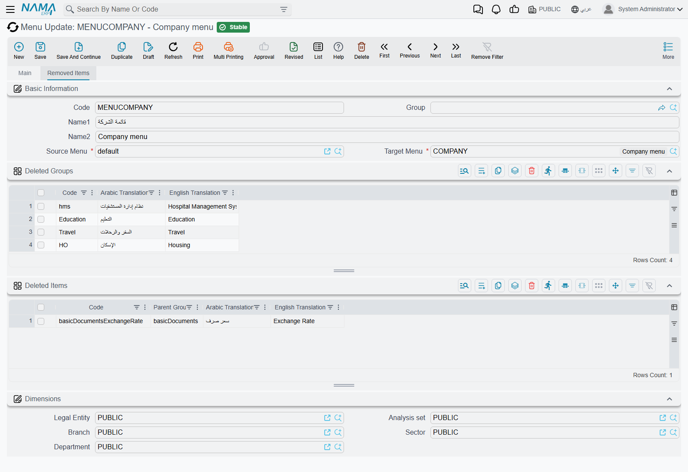

# Changing the Menu

Sooner or later somebody asks for the menu to be rearranged. Drop the modules the company does not
use, rename Sales to something the sales team actually calls it, put the three screens everyone
lives in at the top instead of four folders down.

All of that is supported. But the obvious way to do it — open the menu that ships with the system
and start editing — is the one way that does not survive, and it fails silently and much later.
This page explains why, and what to do instead.

## Why you must not edit the shipped menu

The menu that ships with Nama is a record like any other, with the code `default`. Nothing stops you
opening it and rearranging it, and everything you do will work perfectly.

Until somebody rebuilds it. When that happens, the record is not merged, patched or reconciled —
**it is emptied and built again from scratch**, and every group, entry, rename, reorder and icon you
added is gone. There is no warning, no confirmation mentioning the menu, and nothing anywhere
recording that the menu had been customised.

What makes this genuinely dangerous is *when* the rebuild happens. It is not a rare administrative
act:

- **Utilities → Regenerate UI** rebuilds it, which is at least an obvious thing to have pressed.
- **Regenerate Screens**, on the Screen Modifier or Config Entry screen, rebuilds it too.
- **Reset To System Defaults**, on the Screen Modifier or Custom List View screen, rebuilds it as
  well.

So a colleague tidying up an unrelated screen layout, pressing a button that says nothing about
menus, can wipe out a week of menu work. Months can pass between the customisation and the loss,
which makes the connection almost impossible to spot afterwards.

::: warning The same applies to keyboard shortcuts
The shipped shortcuts record is rebuilt by exactly the same action, with exactly the same
consequence. Customised shortcuts typed into it are lost too.
:::

## The supported way: a Menu Update

Instead of editing the shipped menu, you describe your changes as a **list of differences** and let
the system apply them to a **second menu**. That is what the Menu Update screen is for.

::: info Where to find it
**Administration → Display Customization → Menu Update.**
:::

A Menu Update record holds three things:

- a **Source Menu** — normally the shipped `default` menu;
- a **Target Menu** — a second, otherwise empty menu record that you create;
- the **differences** — what to delete, what to add, what to change.

Saving it copies the source, applies your differences to the copy, and writes the result into the
target menu. You then point your users at the target.

::: tip The Arabic labels describe it better than the English ones
On an Arabic screen the two fields read «نسخ من» and «نسخ إلى» — *copy from* and *copy to* — which
is exactly what happens. The English "Source Menu" and "Target Menu" are the same two fields.
:::

Because the differences are stored rather than the result, a rebuild costs you nothing. Every Menu
Update is re-applied automatically straight after the shipped menu is rebuilt, so your changes are
put back on top of the fresh menu. **Changes expressed as a Menu Update survive; changes typed into
the shipped menu do not.** That single sentence is the whole reason this screen exists.

The system will not let you get it wrong, either: a Menu Update **refuses to target the shipped
menu**, and refuses to have the same menu as both source and target.

## Setting one up

### 1. Create the target menu

Open Menu Definition, press New, give it a code and a name — `COMPANY` and "Company menu" will do —
and save it with both grids empty. It does not need any content: it is about to be filled in for
you.

### 2. Create the Menu Update

Open Menu Update, press New, and set **Source Menu** to `default` and **Target Menu** to the record
you just made.

### 3. Say what to remove

The second tab, **Removed Items**, has two grids — **Deleted Groups** for folders and **Deleted
Items** for entries. Type or pick a code in either and that group or entry will not be copied
across.

Removing a *group* is the efficient move. Take out a root group and everything beneath it goes with
it. Four rows here — the hospital, education, travel and housing branches — took 32 folders and 174
entries out of the finished menu.

::: tip You do not have to know the codes
The code columns look up the source menu as you type, so you can search for what you want rather
than memorising codes. As you pick each one, the Arabic and English captions are filled in beside it
so you can see at a glance what you have chosen — those two columns are there for you to read, and
have no effect on anything.
:::

### 4. Say what to add or change

The first tab has two more grids — **Added / Modified Groups** and **Added / modified Items** — and
one grid does both jobs. Whether a row adds or changes depends only on the code:

- a code that exists in the source menu **changes** that group or entry;
- a code that does not **adds** a new one.

The columns are the same ones the [Menu Definition screen](/platform/menus/menu-structure) uses, so
if you know how to describe an entry there, you know how to describe one here.

Picking an existing code fills the rest of the row in from the source, so changing one thing about
an existing entry does not mean retyping the rest of it.

::: warning A modified row is replaced, not patched
Every column on the row is written to the result, including the ones you left blank. If you pick an
existing entry in order to change its name, and its Icon Code column is empty on your row, the entry
in the finished menu ends up with no icon.

The safe habit is to check the whole row after picking a code, not just the column you came to
change.
:::

### 5. Position what you added

New rows land at the end of their folder unless you say otherwise, and two columns say otherwise:

- **Relative To** — the code of another group or entry to sit next to.
- **Group Order** / **Item Order** — how far after that anchor to sit. On its own, without a
  Relative To, the order counts from the start of the folder you named.

Leave both empty for a new sub-group and it lands directly after its parent group, which is usually
what you wanted anyway.

### 6. Save, then point users at the new menu

Saving is what applies everything — there is no separate button and nothing to run afterwards. Open
the target menu and you will find it fully populated.

Then assign it: on a user, on a security profile, or on the legal entity.
[Who sees which menu](/platform/menus/menu-visibility) covers the order those are consulted in, and
why nobody will see the new menu until they reload the page.

## Things worth knowing before you rely on it

**The target menu is rebuilt from scratch every time.** Just as the shipped menu is not a place to
type changes, neither is the target of a Menu Update — it is emptied and refilled on every save.
Anything you add to it by hand is lost. All changes belong on the Menu Update.

**Saving twice changes nothing.** Every save starts again from a fresh copy of the source, so
re-saving is safe and produces the same result rather than compounding.

**The source menu is never touched.** The shipped menu stays exactly as delivered, which is what
makes it safe to rebuild.

**A new version's menu entries do not arrive on their own.** When an upgrade adds screens to the
shipped menu, your target menu keeps showing what it was built with until the Menu Update is applied
again — either by saving it, or by the Regenerate UI that follows most upgrades. It is worth
re-saving your Menu Updates after an upgrade as a matter of routine.

**Deleting the Menu Update does not undo it**, and neither does ticking **Inactive**. Both stop it
being applied in future; neither restores the target menu to what it was. To back a change out,
change the Menu Update and save it again — the target is rebuilt from the source each time, so
removing a row genuinely removes its effect.

**One active Menu Update per target menu.** If you need several people's changes, they go in the
same record. A second active one aimed at the same target is refused, and the message names the
record already using it.

## When you do not need any of this

If all you want is for one group of people to see less of the menu, you do not need a second menu at
all. A security profile can allow or block individual menu entries and whole folders by code, which
is far less work than maintaining a menu of your own —
[security profiles](/platform/security/security-profiles) covers it.

Build a menu of your own when the shape itself should be different: different folders, different
names, different order, entries that open pre-filtered lists. Trim with security when the shape is
right and some people should just see less of it.

## See also

- [How the menu is put together](/platform/menus/menu-structure) — groups, entries, targets and
  the columns you will be filling in here
- [Who sees which menu](/platform/menus/menu-visibility) — assigning the finished menu
- [Security profiles](/platform/security/security-profiles) — hiding entries per role
