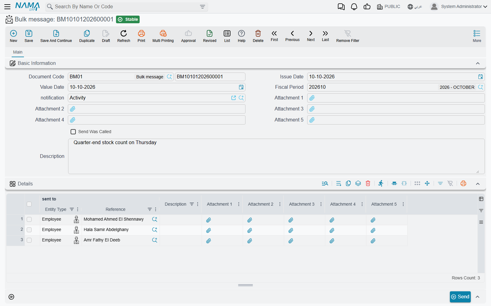
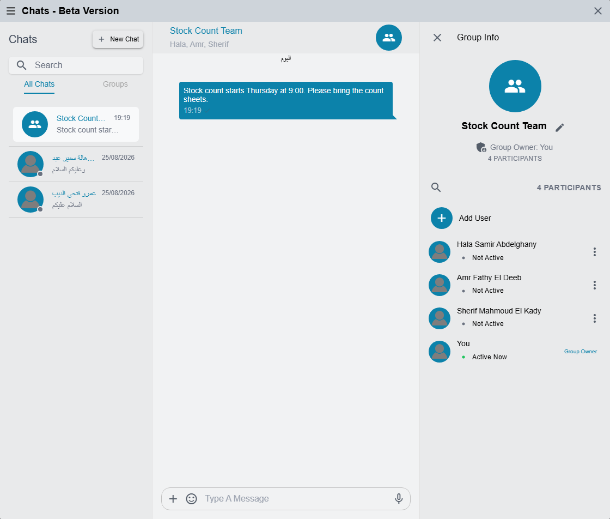

# Bulk Messages, WhatsApp Messages and Internal Chat

Most messages in Nama are sent by a [Notification Definition](/platform/notifications/notifications-system): something happens to a record, and the definition decides who hears about it and through which channel. This page covers the screens that sit around that engine — the ones people open when they want to send something themselves, or when they need to shape what goes out over WhatsApp — and the chat that lets colleagues talk to each other inside the system.

| Screen | Menu | What it is for |
|---|---|---|
| **Bulk Message** | Basic → Remarks → Bulk message | Sending one message to a hand-picked list of customers, suppliers, employees or contacts |
| **WhatsApp Message Configuration** | Administration → Other → WhatsApp Message Configuration | The connection to one WhatsApp provider account |
| **WhatsApp Message** | Administration → Other → WhatsApp Message | What one WhatsApp message says, and how often it may go out |
| **Error Message** | Basic → Remarks → Error Message | A log of failed replication messages — not something you send |
| **Chats** | The chat icon in the top bar | Direct and group conversations between users |

Two related screens have pages of their own: [General Announcements](/platform/notifications/general-announcements) for the company notice board, and [Telegram Notifications](/platform/notifications/telegram) for Telegram.

## Bulk Message: one message, a list of recipients

The marketing team wants to tell forty customers that the showroom is moving. Nobody wants to write forty e-mails, and the customers have nothing in common that a criteria filter could find. A **Bulk Message** is the answer: a document whose lines are the recipients.

Setting it up takes two pieces:

1. **A manual notification definition for Bulk Message.** Create a [Notification Definition](/platform/notifications/notifications-system) whose watched record type — the field labelled **Approval Entity** on that screen — is **Bulk Message**, and tick **Manually**. Write the e-mail, SMS or WhatsApp template as you would for any definition. In its **Targets** grid add a **Field** row pointing at the recipient column of the lines, so the message goes to each person listed. A definition is reusable: the "showroom moving" text and next month's "holiday hours" text are two definitions, picked as needed.
2. **The Bulk Message itself.** Pick that definition in **Notification** — the list only offers definitions set up as in step 1 — and fill the lines. Each line has **sent to** (a customer, employee, supplier, contact, CRM lead or CRM potential), **Remarks**, and five attachment slots; the header has five more attachment slots.

Save the document, then press **Send**. The definition runs once against the Bulk Message and the messages are queued like any other notification; the **Send Was Called** box records that it has been sent. If something does not arrive, the reasons are the usual ones — see [Why a notification was not delivered](/platform/notifications/notifications-system#Why-a-notification-was-not-delivered).

::: tip One message per line
A template that reads the lines must loop over them, or only the first line is used. The [notifications FAQ](/platform/notifications/notification-fq) shows the `{loop(lines)}` pattern.
:::

Pressing **Send** with the **Notification** field empty is refused:

*Notification Field Can Not Be Empty* — «لا يمكن ترك حقل التنبيه فارغاً»

## WhatsApp: the configuration and the message

WhatsApp leaves Nama through two records that work as a pair. The provider-specific steps — accounts, tokens, instance ids, PBX settings — are in [SMS and WhatsApp Configuration](/platform/notifications/sms-and-whatsapp); this section is the part that is the same for every provider.

### WhatsApp Message Configuration

One record per provider account:

| Field | Meaning |
|---|---|
| **Service Provider** | Which service the account belongs to |
| **Public Id / API Endpoint** and **Secret / Access Token** | The account's credentials, as the provider issues them |
| **Public IDs by Sender** | Extra sending numbers on the same account — see [Sending WhatsApp from Employee Phones](/platform/notifications/sms-and-whatsapp#Sending-WhatsApp-from-Employee-Phones-Dynamic-Sender) |
| **Phone Number Corrector Query** | A query that rewrites the recipient's number into the format the provider expects |
| **Send Only One Time** | Never send the same message, for the same record and the same notification, to the same number twice |

**Send Only One Time** is the guard against a customer receiving the same invoice message every time the invoice is edited. A repeat is refused with:

*You can not send notification {0} with message {1} again because it was sent before* — «لا يمكنك إرسال التنبية {0} برسالة {1} مرة أخرى حيث تم إرسالها من قبل»

### WhatsApp Message

A **WhatsApp Message** says *what* is sent. It names its **Configuration**, and a notification definition or an approval definition then names the WhatsApp Message to use. The screen has one page per provider family, because providers ask for different things, but the common fields are:

| Field | Meaning |
|---|---|
| **Message Type** | **Template** (a template approved on the provider side, filled with parameters), **Text** or **Media** |
| **Template Name**, **Language Code** | The approved template and its language, for template messages |
| **Parameters** | One row per template variable; each **Parameter Template** is a template that reads the record, so `{customer.name2}` becomes the customer's name |
| **Text Message** | The text, for text messages — also a template |
| **Media Message** | Two parts: the kind of file (File, Image, Video, Audio) and its **Media URL**, a template that gives the file's address. The address must be reachable from the internet |
| **Allowed Repetition Time In Seconds** | A cool-down: the same record cannot message the same number again until this many seconds have passed |
| **WhatsApp Message State Changed Notification** | A manual notification definition to run when the provider reports that a message changed state (delivered, read, replied…) |

The cool-down is the switch for "do not message the customer twice in five minutes because two people saved the order". A message that comes too soon is refused with:

*The message has already been sent to {0} at {1}, you can send it again at {2}* — «هذه الرسالة قد تم إرسالها إلى {0} فى الوقت {1} يمكنك إعادة إرسالها فى الوقت {2}»

## Error Message: a log, not a message

**Error Message** sits beside Bulk Message in the menu, but nobody writes one. Each record is a failed incoming replication message that the system was told to keep: it carries the **Error Message**, the **Error Desciption**, the record it was about, the **Document Author** it ran as, the **Target Queue ID** and the **Replication Site Code**. If the same message fails again, its existing record is updated rather than duplicated.

Which failures are kept is decided in [Error Message Logging Configurations](/platform/fields-and-entities-settings/fields-settings-integrations#Error-Message-Logging-Configurations). If the list is always empty, that grid is empty.

## Internal chat

Chat is for the quick questions that do not deserve an e-mail: "is the Jeddah order ready?", with the order attached as a link. It lives behind the chat icon in the top bar (tooltip **Chats**), which carries a red badge with the number of unread messages. The window's title reads *Chats - Beta Version*.

### Who can chat

The icon only appears for users allowed to chat. **Prevent Access To Instant Chat** — on the user's **Settings**, or on their **Security Profile** — hides it, and the **Instant Chat** feature must be enabled on the installation. The people you can start a conversation with are the other users who can log in and are allowed to chat; chat is between **users**, not employees.

### Starting a conversation

- **New Chat** opens **Start New Chat**. Click a user and you are in a direct conversation with them — the existing one, if you have talked before.
- **Create New Group** lets you tick several users, press **Create**, and give the group a **Group Name**. You become the **Group Owner**.

The conversation list has two tabs, **All Chats** and **Groups**, and a search box that finds conversations by name and also searches the text of messages; clicking a found message jumps to it.

### Managing a group

Open a conversation's header to see **Group Info**: the owner, the number of **Participants**, who is **Active Now**, and **View Members**.

| Action | Who can do it |
|---|---|
| Rename the group | The owner and admins |
| **Add User** | The owner and admins |
| **Remove User** | The owner and admins — never the owner, never yourself |
| **Make Admin** / **Remove Admin** | The owner |

Everyone in the group sees a line when somebody is added or removed. A removed member can no longer write; in place of the message box they see:

*You can no longer send or receive messages because you are not a member of this group* — «لا يمكنك إرسال أو استقبال رسائل لأنك لم تعد عضواً في هذه المجموعة»

There is no "leave group" option: someone who should leave is removed by an admin.

### Writing messages

- **Text** — up to 10,000 characters, with an emoji picker.
- **Files** — **Attachment** sends one or more files. Images and videos appear as pictures in the conversation (several at once are grouped into an album you can page through) and every file has **Download**. When you send several files with text, the text becomes the caption of the first.
- **Voice Message** — with the box empty, the microphone button records a voice note in the browser. The browser has to be allowed to use the microphone.

Messages cannot be edited, deleted, replied to or forwarded.

**Mentions** start with `@`. In a group the list offers the group's **Members**; it also offers **Entities** — pick a record type, then search for a record, and the message carries a link to that record. Clicking a record link opens it in a new tab; clicking a person's mention opens a direct chat with them. A mention does not notify anyone outside the conversation.

The ticks beside your messages show how far each one got: a clock while it is being sent, a grey tick once the server has it, a blue double tick once it has been read, and a red mark if it failed.

New messages arrive instantly while the system is open, and users who have the Nama mobile app also get a push notification on their phone with the sender's name and the start of the message.

### Messages you may see

These come from the chat itself and have no Arabic translation, so they appear in English on Arabic screens too.

| Message | Why | What to do |
|---|---|---|
| *WebSocket not connected!* | The live connection to the server dropped | Refresh the page; if it keeps happening, the connection between the browser and the server (often a proxy) is closing it |
| *Message too long (max 10,000 characters)* | The text is over the limit | Split it, or send it as a file |
| *Microphone access failed* | The browser refused the microphone | Allow the microphone for the site in the browser's settings |
| *You are not a member of this conversation* | You were removed from the group while it was open | Ask a group admin to add you back |
