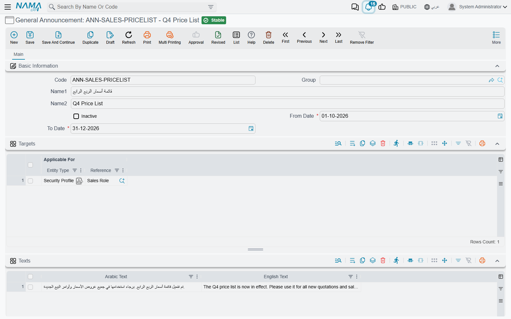
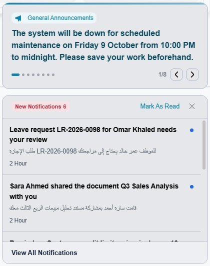
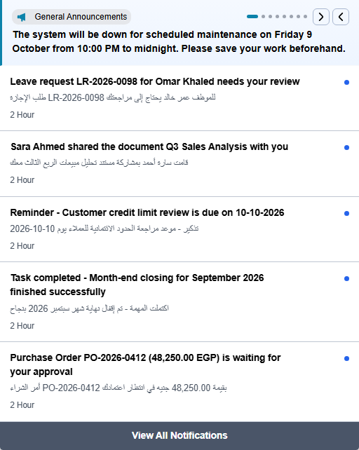

# General Announcements

A notification is personal: it tells one user that *their* invoice was approved or *their* task is late. Some news is not about any record at all — the office closes early on Thursday, the price list changes next month, the system goes down for maintenance on Friday night. A **General Announcement** is the company notice board for that kind of news. You write the text once, say who should see it and between which dates, and it appears for those users next to their notifications — in the web interface and in the mobile apps — with no notification definition, template or event behind it.



## Writing an announcement

Open **Administration → Other → General Announcement** and add a record. Besides the usual code and names, the screen asks three questions: *when*, *for whom* and *what*.

**When.** **From Date** and **To Date** are both required, and together they are the publication period. The announcement is shown from the first day to the last day, both included, and disappears by itself the day after **To Date** — nobody has to remember to take it down. An announcement for a stock count on 31 December can be entered in October with a **From Date** of 1 December; it stays silent until then.

**For whom.** The **Targets** grid lists who should see the announcement. Each line has one **Applicable For** reference, which can point at any of three things:

| Applicable For | Arabic | Who sees the announcement |
|---|---|---|
| User | مستخدم | That one user |
| Group | مجموعة | Every user whose **Group** is that group |
| Security Profile | ملف الصلاحيات | Every user who has that security profile |

Lines add up: an announcement with one line for the sales security profile and one line for the user *Ahmed* reaches the whole sales team plus Ahmed. A user who matches several lines still sees the announcement once.

::: tip Leave Targets empty to reach everyone
An announcement with no target lines is shown to **all** users. That is the normal case for company-wide news, so there is no "all users" option to pick — just leave the grid empty.
:::

**What.** The **Texts** grid holds the message, with an **Arabic Text** and an **English Text** on each line. A user working in Arabic reads the Arabic text and a user working in English reads the English one. If you fill only one of the two, everybody reads that one, whatever their language — so a line needs at least one of them, and the screen refuses to save a line that has neither.

Each line of the grid is a separate slide. One announcement about the new year can carry three lines — the holiday dates, the closing deadline for expense claims, the date of the stock count — and the reader pages through them one at a time. An announcement saved with no text lines at all is never shown.

Tick **Inactive** to withdraw an announcement before its **To Date** without deleting it.

## What the reader sees

Announcements live beside notifications, in the two places a user already looks.

Right after login, the panel that lists new notifications opens with the announcements at its top:



Later, the same announcements are at the top of the list that opens from the bell in the top bar:



When there is more than one slide, the dots show how many there are and which one is on screen, and the two arrows move backwards and forwards. In the bell list the slides also change by themselves every few seconds until you press an arrow or a dot. A long text scrolls inside its own area instead of pushing the notifications down.

Unlike a notification, an announcement cannot be marked as read or dismissed by the reader. It stays for everyone it targets until its period ends or you make it inactive.

::: info When a change reaches users
A new or edited announcement is picked up the next time a user logs in or reloads the page — it does not pop up in the middle of an open session. The same holds for withdrawing one: users who already have it on screen keep seeing it until their next reload.
:::

## Formatting the text

The web interface displays the text as HTML, so an announcement is not limited to a plain sentence. A few tags are enough to make the important part stand out:

```html
<b>Planned maintenance</b> — the system will be unavailable on
<span style="color:#b91c1c">Friday 16 October from 22:00 to 23:00</span>.
Please save your work before then.
```

Headings, lists, links, colours and images all work the same way. Keep it compact: the announcement area is small, and anything taller than it has to be scrolled.

::: warning Give this screen only to people you trust
Because the text is displayed as HTML exactly as it was written, whatever is typed here runs in the browser of every user it targets. Grant permission on the General Announcement screen only to administrators, and do not paste markup from a source you do not know.
:::

## Why an announcement is not showing

Run through the conditions in the order the system checks them:

1. The record is saved and committed, not a draft.
2. **Inactive** is not ticked.
3. Today is inside the period — on or after **From Date** and on or before **To Date**.
4. The **Texts** grid has at least one line.
5. Either **Targets** is empty, or one of its lines names the user, the user's **Group**, or the user's security profile.
6. The user has logged in or reloaded the page since the announcement was saved.

If the announcement is refused at save time instead, it is one of these two messages:

| Message | Why | What to do |
|---|---|---|
| *To date must be greater than or equal from date* — «إلى تاريخ يجب أن يكون أكبر من أو يساوي من تاريخ» | **To Date** is earlier than **From Date**. | Correct the period. |
| *Arabic text or English text must be entered* | A line in the **Texts** grid has neither text. This message has no Arabic version, so it appears in English on Arabic screens too. | Fill one of the two texts on that line, or delete the line. |

When the news is about a specific record or event — an invoice above a limit, an approval that is waiting — use a [notification definition](/platform/notifications/notifications-system) instead; that is what reaches the right person at the right moment, by e-mail and SMS as well.
