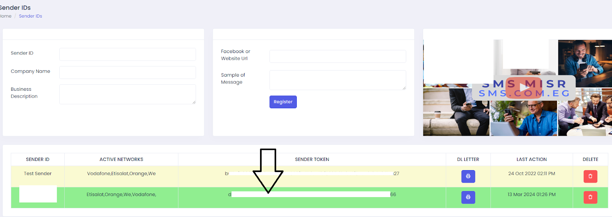
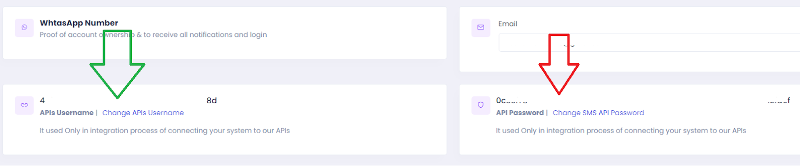
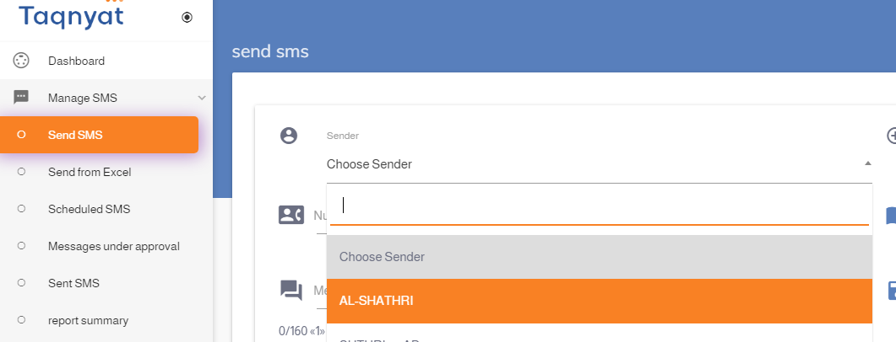
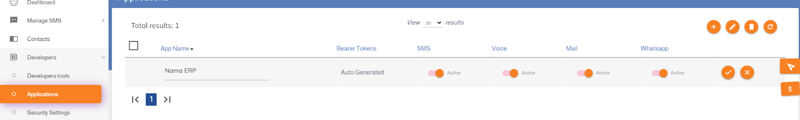
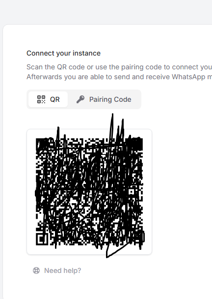
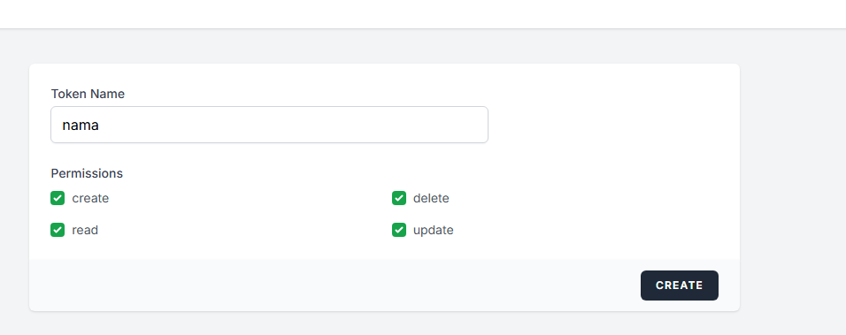
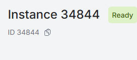
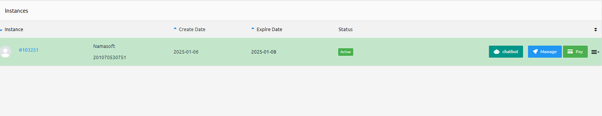
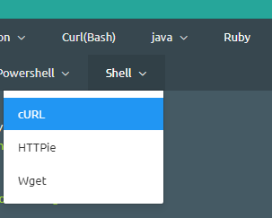

# SMS and WhatsApp Configuration in Nama ERP

Nama ERP supports sending messages via SMS and WhatsApp to users, customers, suppliers, and other entities.
To enable this feature, configure the appropriate settings from the **Global Configuration** screen.

## The two provider lists

Messages leave Nama through one of two grids in Global Configuration: the **SMS settings** grid, whose **Provider** list holds every gateway this build ships, and the **WhatsApp message settings** grid, whose **Provider** list holds the WhatsApp services. Several services sit in both — a WhatsApp gateway chosen from the SMS grid sends the message over WhatsApp rather than as an SMS.

The **SMS settings** Provider list reads:

`mobilyws` · `maktoobicom` · `androidsmsgateway` · `sms.com.eg` · `SMS Misr` · `taqnyat.sa` · `Vodafone Egypt` · `jawalbsms.ws` · `Unifonic` · `URL Generic` · `waboxapp` · `UltraMsg.com WhatsApp Integration` · `Waapi.app WhatsApp Integration` · `WaPilot.net` · `WasenderAPI`

The **WhatsApp message settings** Provider list reads:

`Unifonic` · `Rasayel` · `Wati` · `Morasalaty` · `WaApi` · `UltraMsg` · `WaPilot.net` · `respond.io` · `WasenderAPI` · `Yeastar`

A few entries read as bare lower-case identifiers (`mobilyws`, `maktoobicom`, `androidsmsgateway`, `waboxapp`) — that is how they appear on screen. Pick the entry by its text, not by the provider's marketing name: the same company is called one thing on its own site and another in the list.

## SMS Provider: SMS Misr ([smsmisr.com](https://smsmisr.com/))

* **SMS Provider**: `SMS Misr`
* **Sender Token**: Obtain from [smsmisr.com/Client/senderid](https://smsmisr.com/Client/senderid)
  
* **API Username** and **API Password**: Get them from [smsmisr.com/Client/Settings](https://smsmisr.com/Client/Settings)
  

---

## SMS Provider: Taqnyat ([taqnyat.sa](https://portal.taqnyat.sa))

* **SMS Provider**: `taqnyat.sa`
* **Sender**:
  Visit [portal.taqnyat.sa](https://portal.taqnyat.sa), go to **Send SMS**, and copy the sender name from the dropdown list.
::: tip
💡 Use Chrome's Inspect Tool to accurately copy the value.
:::
  
* **Password (Bearer Token)**:
  Go to **Developers > Application**, click the ➕ icon, provide a name, then click the ✔️ mark. Copy the resulting **Bearer Token**.
  

---

## SMS Provider: Vodafone Egypt

* **SMS Provider**: `Vodafone Egypt`
* **User Name**: Account ID
* **Password**: API Password
* **Sender**: Sender Name
* **Other Settings**: Secret Key
* **Correction Query** (to ensure correct phone format):

  ```sql
  select case when {to} like '2%' then {to} else concat('2',{to}) end
  ```

::: tip
✅ After saving the configuration, Nama ERP will be able to send notifications and messages via the selected provider. Make sure credentials and sender IDs are valid and verified with the provider.
:::

---

# WhatsApp Integration

## WAAPI.app WhatsApp Integration

To enable sending messages via WhatsApp using the [waapi.app](https://waapi.app) platform, follow these steps:

---

### Setup Steps

1. **Create an Account and Link WhatsApp**

  * Create a new Instance on [waapi.app](https://waapi.app)
  * Log in to WhatsApp by scanning the QR code
    
::: tip
    ⚠️ You **must** scan the QR code using the phone that has the active WhatsApp account.
::: 

2. **Get the API Token**

  * Go to the [API Tokens page](https://waapi.app/user/api-tokens)
  * Enter a suitable name, then click "Create"
  * The Token will be displayed in a popup window — copy it and place it in the **Password** field in Nama settings
    

3. **Get the Instance ID**

  * Go to the [Instances page](https://waapi.app/account/instances)
  * Copy the **Instance ID**
  * Place it in the **Username** or **Other Settings** field in the SMS settings in Nama
    

---

### Nama ERP Settings

In the SMS settings screen:

* **Provider**: `Waapi.app WhatsApp Integration`
* **Username** or **Other Settings**: Instance ID
* **Password**: Token

---

## WhatsApp Integration Using ultramsg.com

To send WhatsApp messages from Nama ERP using [ultramsg.com](https://ultramsg.com), follow these steps:

### Step 1: Create and Link the Instance

* Log in to the [UltraMsg Dashboard](https://user.ultramsg.com/).
* Create a new **Instance** and link it to your WhatsApp account by scanning the QR code.

### Step 2: Access the Instance Settings

* After linking, go to the [UltraMsg User Panel](https://user.ultramsg.com/).
* Select your **Instance**, then click **Manage**.



### Step 3: Get the Instance ID and Token

* You will find the **Instance ID** in the browser URL, for example:
  `https://user.ultramsg.com/app/instances/instance.php?id=103251`
  In this example, the Instance ID is `103251`.

* From the API testing section, select **Shell (cURL)** to view a usage example.



* Copy the **Instance ID** and **Token** from the displayed form.


### Step 4: Configure in Nama ERP

* Use the **Instance ID** as the Username or service identifier.
* Use the **Token** as the Password for authentication.


## WaPilot WhatsApp Integration

To enable sending WhatsApp messages from Nama ERP using [wapilot.net](https://wapilot.net), follow these steps:

---

### Setup Steps

1. **Create an Account and Link WhatsApp**

   * Create an account on [app.wapilot.net](https://app.wapilot.net)
   * Create a new **Instance** and link it to your WhatsApp account by scanning the QR code

2. **Get the Instance ID**

   * From the dashboard, go to the Instances list
   * Copy your **Instance ID**

3. **Get the API Token**

   * From the account settings or API page, create or copy the **API Token**

---

### Nama ERP Settings

In the WhatsApp message settings screen:

* **Provider**: `WaPilot.net`
* **Username (Public ID)**: Instance ID
* **Password (Secret)**: API Token

::: tip
WaPilot can also be used as an SMS provider through the SMS settings screen, where messages are sent via WhatsApp instead of traditional SMS.
:::

---

## WhatsApp Integration Using WasenderAPI

To send WhatsApp messages from Nama ERP using [wasenderapi.com](https://wasenderapi.com), follow these steps:

---

### Setup Steps

1. **Create a Session and Link WhatsApp**

   * Create an account on [wasenderapi.com](https://wasenderapi.com) and open the **Sessions** tab of the dashboard
   * Create a new **Session** and link it to your WhatsApp number by scanning the QR code

2. **Copy the Session API Key**

   * Every session has its own **API Key**, shown on the session page once the number is linked
   * The key belongs to that session only; deleting the session invalidates the key

---

### Nama ERP Settings

In the WhatsApp message settings screen:

* **Provider**: `WasenderAPI`
* **Password (Secret)**: the session API Key
* **Username (Public ID)**: leave empty. WasenderAPI has no instance identifier, so the field is disabled for this provider

To send from several numbers, create one session per number and add a row per sender in the **Public IDs by Sender** table with the session's API Key in the **Secret** column. Leave the **Public ID** column empty; it is only required for providers that work with instance identifiers.

::: tip Media messages
Set the **Media Type** of the WhatsApp message to File, Image, Video, or Audio so the attachment reaches the recipient in the matching form: an invoice PDF as a document, a picture as an inline image. As with the other providers, the **Media URL** must be reachable from the internet.
:::

::: warning Sending limits
WasenderAPI paid plans accept roughly one message every 5 seconds per session; trial accounts are limited to one message per minute and 50 per day. Messages sent faster than that are rejected by the provider and appear as failed tasks carrying the provider's "retry after" hint.
:::

::: tip
WasenderAPI can also be used as an SMS provider through the SMS settings screen (Provider `WasenderAPI`, Password = session API Key), where messages are sent via WhatsApp instead of traditional SMS.
:::

---

## WhatsApp Integration Through a Yeastar PBX

Some companies already run their WhatsApp Business number through a Yeastar P-Series PBX, so that agents answer customers from their extensions. Nama can send its template messages through that same number, and each message can be attributed to the extension of the employee responsible for the record: a quotation sent to a customer shows up in the PBX under the sales representative who owns it.

Nama does not talk to the PBX directly. The company publishes a small web endpoint in front of the PBX, protected by a token, and Nama posts every message to that endpoint. The endpoint then hands the message to Yeastar.

::: info Templates only
This provider sends **approved WhatsApp templates** only. There is no free-text message and no media type to choose: the attachment, when there is one, travels as the template's document.
:::

### What the Company Prepares on the Yeastar Side

1. The WhatsApp channel is connected to the PBX and the message templates are approved, each with its named variables (for example `code1` and `code2`).
2. The endpoint is published on a public address and given a token. These two values are everything Nama needs: the **link** and the **token**.

### WhatsApp Message Configuration for Yeastar

In the **WhatsApp Message Configuration** screen:

* **Service Provider**: `Yeastar`
* **Public Id / API Endpoint**: the endpoint link
* **Secret / Access Token**: the token. Nama sends it as a bearer token with every message
* **Phone Number Corrector Query**: the endpoint expects the recipient in international format with a leading `+` (`+201065837043`). If mobile numbers are stored differently, use this query to put them in that form

### The Yeastar Page of the WhatsApp Message

Open the **WhatsApp Message** screen and fill the **Yeastar** page:

| Field | What to enter |
|-------|---------------|
| **Configuration** | The Yeastar configuration created above |
| **Template Name** | The template's name exactly as it is approved, e.g. `salsequotion_ar` |
| **Sender Code Extension** | The extension the message is sent on behalf of. It accepts Tempo syntax, so it can be a fixed extension (`102`) or read from the record (`{n1}`) |
| **Media URL** | Optional. A link to the file to attach, e.g. the printed quotation. It must be reachable from the internet |
| **File Name Template** | Optional. The name the recipient sees for the attached file, e.g. `{code}` |
| **Parameters** | One row per template variable: **Parameter** holds the variable's name (`code1`) and **Parameter Template** holds its value (`{code}`) |

With those values, a quotation `SQ260902208` leaves Nama as:

```json
{
  "to": "+201065837043",
  "template": "salsequotion_ar",
  "sender_ext": "102",
  "file_url": "https://erp.example.com/erp/r/sq/SQ260902208.pdf",
  "file_name": "SQ260902208",
  "params": {
    "code1": "SQ260902208",
    "code2": "SQ260902208"
  }
}
```

::: warning The sender extension is mandatory
The message cannot be saved without a **Sender Code Extension**. And when the field reads its value from the record, a record where that value is empty is not sent at all: the task fails instead of sending a message with no extension.
:::

::: tip Message state
A message counts as sent once the PBX accepts it, and it then appears in the message's related records with the PBX message number. The endpoint does not report back later, so the state does not move on to delivered or read.
:::

### Messages You May See with Yeastar

Three of these messages have no Arabic text and appear in English on Arabic screens as well.

| Message | Why | What to do |
|---------|-----|------------|
| *Public Id / API Endpoint field is required with {0} Provider* — «حقل Public Id / API Endpoint مطلوب مع مزود الخدمة {0}» | The configuration was saved without the endpoint link | Enter the link in **Public Id / API Endpoint** |
| *Sender code extension is required with {0} Provider* | The WhatsApp message uses a Yeastar configuration and its **Sender Code Extension** is empty | Fill the field with an extension or a Tempo expression |
| *Could not send whatsapp message {0} via Yeastar: template name and sender code extension are required* | At sending time the template name is empty, or the extension expression gave an empty value for this record | Fill **Template Name**, and make sure the record carries the value the extension is read from |
| *Could not send whatsapp message via Yeastar, response: {0}* | The endpoint or the PBX refused the message; the text after the colon is the PBX's own reason | Check the template name, the variable names and the recipient's number against what is approved on the PBX |

---

## Sending WhatsApp from Employee Phones (Dynamic Sender)

This feature allows sending WhatsApp messages from employees' phones instead of a single fixed number. For example, when the system sends a message to a customer, the message can appear from the phone number of the sales representative responsible for that customer, allowing the representative to follow up on the conversation directly from their personal phone.

::: tip
This feature is available for all WhatsApp service providers supported in the system.
:::

---

### Setting Up Multiple Numbers in WhatsApp Settings

In the **WhatsApp Message Settings** screen, there is a **Public IDs by Sender** table that allows you to define multiple numbers (Instances) for the same settings:

| Field | Description | Required |
|-------|-------------|----------|
| **Sender ID** | Sender identifier (such as phone number or employee code) | Yes |
| **Public ID** | The Instance identifier for this number | Yes, except for Morasalaty and WasenderAPI, which do not use it |
| **Secret** | The secret key — can be left empty to be read from the main field | No |

::: tip
If the **Secret** field is left empty in any row, the system will use the value in the main (Secret) field in the screen header.
:::

---

### Setting the Preferred Sender in Notifications and Approvals

In the **Notification Definition** or **Approval Definition** screen, there is a **WhatsApp Preferred Sender** field that supports Tempo syntax for dynamic values.

#### Examples of Preferred Sender Syntax:

| Syntax | Description |
|--------|-------------|
| `{salesRep.mobile}` | Phone number of the sales representative linked to the record |
| `{createdByUser.mobile}` | Phone number of the user who created the record |
| `{customer.accountManager.mobile}` | Phone number of the customer's account manager |

::: info How the System Works
1. When sending a WhatsApp message, the system calculates the **Preferred Sender** value using Tempo syntax
2. The system searches for this value in the **Public IDs by Sender** table
3. If a match is found, it uses the Public ID and Secret from that row
4. If no match is found, it uses the default values from the screen header
:::

---

## WaboxApp WhatsApp Integration


To enable sending WhatsApp messages from Nama ERP using WaboxApp, follow these steps:

---

### Setup Steps

1. **Register the Phone Number**
   Register the company's WhatsApp number on a phone that is always connected to the internet.
   💡 It is recommended to use an Android emulator such as [www.memuplay.com](https://www.memuplay.com) for a permanent connection.

2. **Create an Account in WaboxApp**

  * Go to [www.waboxapp.com](https://www.waboxapp.com)
  * Create a new account (requires entering credit card details)

3. **Add the Phone Number to WaboxApp**

  * Go to [https://www.waboxapp.com/manager/accounts](https://www.waboxapp.com/manager/accounts)
  * Select **Add New Phone Number**

4. **Set Up the WaboxApp Chrome Extension**

  * Download the extension from the Chrome store
  * Copy the **API Key** from the WaboxApp website into the extension, then click **Validate**

5. **Link WhatsApp Web**

  * Open [web.whatsapp.com](https://web.whatsapp.com) using the same Chrome browser that has the extension
  * Scan the QR code from the phone

6. **Get Connection Credentials**

  * From the WaboxApp dashboard, copy:

    * **API Token**
    * **Phone number in international format** (example: `201065122360` instead of `01065122360`)

7. **Configure Nama ERP**

  * Open the SMS settings screen
  * Add a new row and select the provider: `waboxapp`
  * Enter:

    * **Phone number in international format** in the *Sender* or *Username* field
    * **API Token** in the *Password* field


::: tip Important Notes

* The phone must be kept **always on** with a continuous internet connection.
* **WhatsApp Web must remain open** in the Chrome browser.
* If either side is closed, **messages will not be sent**.
* WaboxApp charges the credit card if you exceed **100 messages/month** (sent or received).
* It is preferable to use this provider in the `Preferred Message Provider` field in notification and scheduled task settings.
* Use the field `Used only if added in the preferred sender` in the service provider settings (as in request `KKDRQ00577`) to avoid always replacing the message provider with WhatsApp.
* The phone number must be in international format, i.e. starting with the **country code**.

:::

 
