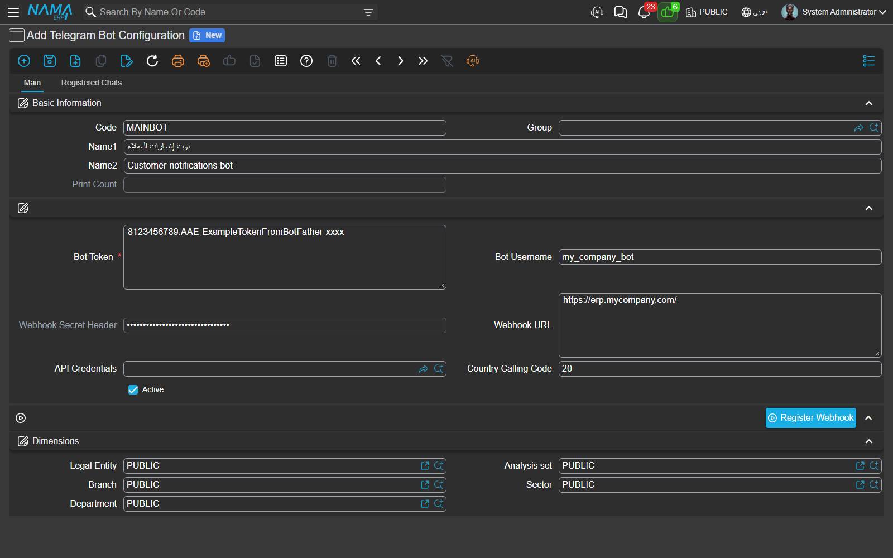
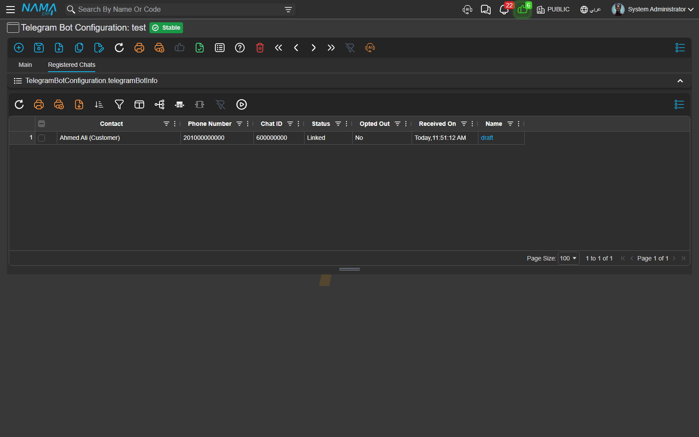
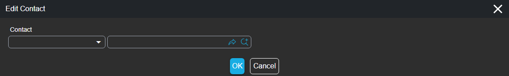
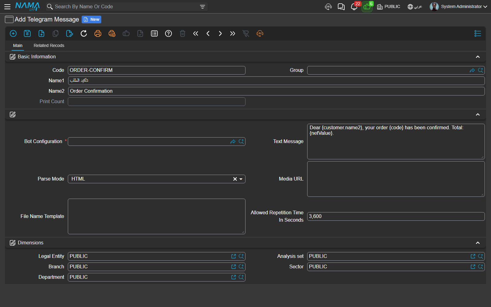

# Telegram Notifications in Nama ERP

Nama can send invoices, approval requests, order confirmations and any other notification straight into a customer's or employee's **Telegram** chat, right beside the SMS and WhatsApp channels you already know. Telegram is free, instant, and lets you send rich text and file attachments — but it works in a fundamentally different way from SMS and WhatsApp, and understanding that difference is the key to setting it up correctly.

With SMS or WhatsApp you can message any phone number at any time. Telegram will not let you do that. A Telegram **bot** can only send a message to someone who has **first started a conversation with it** and agreed to share their phone number. Think of it like a doorbell: the customer has to press it once and introduce themselves before you are allowed to send anything back. Once they have done that, Nama remembers who they are and can message them forever after.

So the whole setup is really about building and maintaining a little address book of people who have opted in — Nama calls each entry a **Registered Chat**, and each one is tied to a real customer, supplier or employee in your database. This page walks through the whole journey: creating the bot, letting people link themselves, fixing the links that need a human eye, and finally wiring a message into your notifications.

## The big picture

```
BotFather → Bot Token → Telegram Bot Configuration → Register Webhook
                                                          │
        Customer opens the bot, taps “Share my phone number”
                                                          │
                                          Nama creates a Registered Chat
                                          and links it to the customer
                                                          │
   Notification / Approval fires → Nama finds the customer’s linked chat → message delivered
```

Everything below follows that flow in order.

## Step 1 — Create a bot on Telegram

Telegram bots are created by talking to Telegram's own **@BotFather**. On any Telegram app, open a chat with `@BotFather`, send `/newbot`, and answer its two questions — a display name and a username that ends in `bot` (for example `my_company_bot`). BotFather replies with a **Bot Token**, a long string that looks like `8123456789:AAE-ExampleTokenFromBotFather-xxxx`.

::: warning Treat the Bot Token like a password
Anyone who holds the token can send messages as your bot and read everything it receives. Keep it secret, and if it ever leaks, use BotFather's `/revoke` to issue a new one.
:::

## Step 2 — Create the Telegram Bot Configuration in Nama

From the main menu search for **Telegram Bot Configuration** and add a new record. This screen is where the bot lives inside Nama.



| Field | What to put there |
|---|---|
| **Code / Name** | Any code and name that helps you recognise the bot later — e.g. `MAINBOT`, "Customer notifications bot". |
| **Bot Token** | The token BotFather gave you. Required. |
| **Bot Username** | The bot's `@username` (without the `@`). Customers use this to find and open the bot. |
| **Webhook Secret Header** | An optional secret. When set, Nama checks it on every incoming update so that only Telegram — and nobody pretending to be Telegram — can reach your bot's endpoint. Leave it to have Nama generate one. |
| **Webhook URL** | The public address Telegram should call back. Leave it empty and Nama uses the public address of the site you are working on; fill it only when your public address differs from the one in the browser. |
| **API Credentials** | An optional user/credentials record used to authenticate Telegram's inbound calls, the same way Nama's other webhooks authenticate. |
| **Country Calling Code** | Your country's international dialing code, digits only — `20` for Egypt, `966` for Saudi Arabia, `965` for Kuwait. Nama strips it from the number a person shares (which always arrives in full international form) so it can match that number against the mobile saved on their customer, supplier or employee record. Leave it empty only if your contacts' mobiles are already stored in full international form. |
| **Active** | Turn the bot on. When it is off, Nama ignores every update the bot receives (nobody can link or re-link) and sends no messages through it — a clean way to pause a bot without deleting it or unregistering its webhook. |

## Step 3 — Register the webhook

A brand-new bot doesn't yet know where to deliver the messages people send it. Telling it is a single click: make sure **Active** is on, save the configuration, then press the **Register Webhook** action at the bottom of the screen. Nama asks Telegram to send every future update to your Nama site, and from that moment the bot is live. (If the bot is not active Nama refuses to register — you'll see *"The Telegram bot … is not active. Activate it before registering its webhook."*)

If the address can't be worked out automatically you'll see *"Cannot determine the webhook URL. Fill the Webhook URL field, or open this screen from the public site address."* — fill the **Webhook URL** field with your public site address and register again. You only ever do this once per bot (or again if you move the site to a new address).

## Step 4 — Let recipients link themselves

Now the people you want to notify introduce themselves to the bot. Each customer or employee opens Telegram, searches for your bot by its username, opens it and taps **Start** (which sends the `/start` command). The bot answers:

> Welcome! Please tap the button below to share your phone number so we can link your account.

…and shows a single button, **Share my phone number**. When the person taps it and confirms, Telegram hands their phone number to Nama, and Nama does two things automatically:

1. It creates a **Registered Chat** entry under your bot configuration, recording their Chat ID, phone number and the time they joined.
2. It looks up that phone number among your customers, suppliers and employees and, if one of them has a matching mobile, links the chat to that contact and marks it **Linked** — the person is ready to receive messages with no further work.

To make that match forgiving of how numbers are written, Nama works out the **national part** of the shared number and matches on that. Telegram always hands over the full international number (e.g. `201065837043`); Nama removes the **Country Calling Code** you configured (`20`), leaving the national number (`1065837043`), and links the first contact whose mobile *ends with* it. So the same person links whether their mobile is on file in full international form (`201065837043`), locally with a leading zero (`01065837043`), or as the bare national number (`1065837043`). If the shared number doesn't begin with your configured code — a genuinely foreign number, say — Nama falls back to matching the whole number. And if nobody matches at all (or it's a brand-new customer), the chat is still saved but left as **Pending**, waiting for a human to finish the link in the next step.

## Step 5 — Review and complete the links

Open your bot configuration and switch to the **Registered Chats** tab. Every person who has started the bot appears here.



Each row tells you who the chat belongs to and whether it is ready:

| Column | Meaning |
|---|---|
| **Contact** | The customer, supplier or employee this chat belongs to. Empty until it is linked. |
| **Phone Number** | The number the person shared. |
| **Chat ID** | Telegram's internal identifier for the conversation. Nama uses this to deliver messages. |
| **Status** | **Linked** — ready to receive. **Pending** — waiting for you to set a contact. (Rejected and Blocked also exist for chats you have deliberately excluded.) |
| **Opted Out** | **Yes** if the person has blocked or stopped the bot. Nama never sends to an opted-out chat. |
| **Received On** | When the chat first joined. |

To finish a **Pending** chat, tick its row, open **Edit Contact**, and pick the customer, supplier or employee it belongs to. The status flips to **Linked** and messages will start flowing.



::: tip One contact, one chat
A single contact can be linked to only **one** chat within the same bot configuration. If you try to attach a contact that is already linked to another chat, Nama refuses with *"The selected contact is already linked to another registered chat in the same bot configuration"* — this stops the same customer accidentally receiving two copies of every message.
:::

## Step 6 — Create a Telegram Message

A **Telegram Message** is the template of what gets sent — the wording, the formatting and any attachment. Search the menu for **Telegram Message** and add a new record.



| Field | What it does |
|---|---|
| **Bot Configuration** | Which bot sends this message. Required. |
| **Text Message** | The body of the message. It supports the same template syntax as the rest of Nama, so you can weave in record values — `Dear {customer.name2}, your order {code} has been confirmed.` |
| **Parse Mode** | Choose **HTML** or **Markdown** to make parts of the text bold, italic or linked; leave it empty for plain text. |
| **Media URL** | An optional link to a file — an invoice PDF, an image — that is sent along with the text. The address must be reachable from the internet. |
| **Allowed Repetition Time In Seconds** | A guard against duplicates. If the same message would go to the same chat again within this many seconds, Nama skips it. Leave it empty to allow every send. |

## Step 7 — Send it from a notification or approval

A Telegram Message on its own doesn't do anything until you attach it to an event. In a **Notification Definition** or an **Approval Definition**, set the **Telegram Message** so that when the underlying event fires — an invoice is posted, an approval is requested — Nama sends it.

Here is the crucial part, and the reason all the linking work above matters: **Nama delivers a Telegram message by contact, not by phone number.** When the notification targets a customer, Nama looks for that customer's **Linked** chat on the bot and sends there. If the customer has never started the bot, or their chat is still Pending, or they have opted out, no Telegram message goes out — the customer simply won't receive it on this channel until their chat is linked. That is by design: Telegram is a contact-only channel, so a bare phone number with nobody behind it is never messaged.

## When a message is not sent

Because delivery depends on the recipient having opted in, a Telegram send can legitimately be skipped. When that happens Nama records an explanatory result rather than failing silently, so you always know why:

| Message | Why it happened | What to do |
|---|---|---|
| *The recipient (contact {0}) is not registered with the Telegram bot {1}…* | The targeted contact has never started the bot, so there is no chat to send to. | Ask the person to open the bot and share their phone number (Step 4). |
| *The recipient {0} is not linked to a contact yet…* | A chat exists but is still **Pending**. | Set its contact from the Registered Chats tab (Step 5). |
| *The recipient {0} has opted out of Telegram messages from bot {1}* | The person blocked or stopped the bot. | Nothing on your side — they must restart the bot themselves. |
| *The message has already been sent to {0} at {1}, you can send it again at {2}* | The **Allowed Repetition Time** guard blocked a duplicate. | Wait until the time shown, or lower the repetition guard on the message. |
| *The Telegram bot {0} is not active* | The bot's **Active** switch is off. | Open the Telegram Bot Configuration and turn **Active** on. |
| *Telegram message {0} has no bot configuration* | The Telegram Message is missing its **Bot Configuration**. | Open the message and set the bot. |

## Message history

Every message that actually leaves Nama is logged, so you can prove what was sent and when. Open a **Telegram Message** and look at its related records to see each delivery — the chat it went to, Telegram's own message identifier, the record that triggered it, and the moment it was submitted. It's the first place to look when a customer says "I never got it".